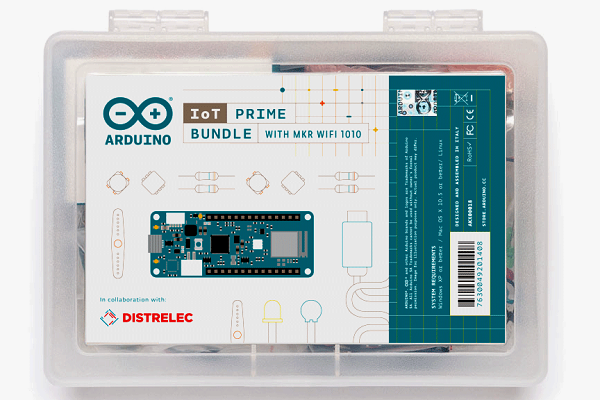

## Arduino IoT Prime Bundle

Arduino is a one-stop-shop for building IoT applications in a simple fashion. The **IoT Prime Bundle** is an easy way to read data and control real electric devices from the Cloud.

This kit was created in collaboration with *Distrelec*. It comes with the *MKR1010*, the *MKR ENV Shield*, and the *MKR Relay Shield*, as well as a bunch of small components. This kit you will learn about harvesting data from the environment (temperature, humidity, barometric pressure, UV radiation, and UV Index), and graphing it directly on the classic Arduino IDE, or by storing the data into files that you can later open in spreadsheet software like *Libreoffice Calc*, *Microsoft Excel*, or *Google Sheets*. Once you reach an understanding of the data, you will learn about direct remote control of the IoT hardware from the Arduino Cloud Dashboard.

### Introduction - What is IoT

The Internet of Things is a way of understanding the digitalization of our world built on two fundamental concepts:

* **everything can be marked digitally** and therefore distinguished from the rest by means of this identifier, and
* **any digital object** that could be connected to a global network (in our case the Internet) **will be connected**.

This vision of a connected world brings a new computing paradigm where computation happens in a distributed manner, but where data is later shared and processed at different centralized pieces of infrastructure.

When a device is connected to the network, the information it collects from the environment through sensors, can and will be shared. The process of billions of data points coming from all of those connected devices is what we have come to call **big data**. The kind of processing needed to make sense from these flows of information is constantly growing but accessible only at remote locations where thousands of computers arranged as server farms are able of anticipating from ecological to social phenomena through complex algorithms.

The latest advancements in computation have allowed us focusing in the use of **Artificial Intelligence**, yet another computation paradigm, to find the patterns in data at increasingly higher speeds. IoT is part of a *transformative vision of our digital world*. One that will help us having a much better way to collect, process, and thus understand our world. At the same time, it opens thousands of new opportunities for building businesses and reinvent our digital economy, optimize our resources, and minimize the impact that humans may have on the environment.

### IoT in Education

While IoT is an always evolving field, it is possible to extract some patterns that will help creating meaningful experiments for students of different ages to understand the complexity of IoT's vision while performing hands on experiments.

There are many fields one could focus on when designing experiments for the class. However, at Arduino we have decided to focus in the creation of wireless weather stations. Students learn about the relevance of different sensors and how they can be used to capture meaningful data from the environment. Step by step they are introduced to how the different data points can be sent to a computer, stored locally on a SD card, and transmitted over wireless communication to an online server.

Graphing the data is an important part of learning how to make data analysis and figuring out what is the relevance of it. We will see how to plot the data in different ways using standard tools and even how to represent the data in real time using the Arduino Cloud.

Other relevant fields where IoT can be applied and that we invite you to explore, given the lessons you will learn throughout this course are:

* **Connected factories**: adding sensors to machines allows for predictive maintenance, what minimizes the downtime of machinery and reduces the possible economic impact emerging from machines breaking down
* **Vehicle monitoring**: the optimization of freely moving vehicles within fleets and help reduce the consumption of fuel, what will not just cut down expenses, but also contribute to the reduction of emissions to CO2 to the atmosphere
* **Control of buildings**: activate and deactivate different resources in buildings depending on the level of use of each one of them. E.g. reduce power consumption by controlling the usage of lights, optimise the charging of batteries to happen when the grid is less busy, etc
* **The future of healthcare**: always connected self-monitoring devices can help understanding diseases, and preventing emergencies. Crossing data between realms becomes a very powerful tool, e.g. comparing environmental data with personal profiles can be useful to inform allergic people about the increase of a certain type of pollen in the air

### Experiment one - Get to know the kit

In this experiment you will connect the different boards and capture temperature data that will be sent back to the computer via the serial port monitor.

### Experiment two - Ways of graphing your data

Making graphs is a very powerful way to reaching a better understanding of what is going on with the data. While developing this project, you will be introduced to two different techniques for graphing real-life data coming from the temperature and humidity sensors on your MKR ENV Shield.

### Experiment three - Store data in memory cards

We will introduce the remaining sensors in the shield: barometric pressure, and different types of light radiation, collect data from all of the sensors and store it in a file inside an SD card for later analysis.

### Experiment four - Connect to the Arduino Cloud

You will hook up your MKR1010 to the Arduino Cloud and map temperature and humidity data on your Arduino Dashboard.

## Components

#### MKR1010

The *Arduino MKR1010* (read “maker ten ten”) is a microcontroller board featuring a chip that will allow you making either a **WiFi** or **Bluetooth** wireless connection to other boards or computers. We will see some of those features in action in this collection of exercises.

##### Start Using your Board

You can see how to connect this board to your computer by checking this [Getting Started Guide](https://www.arduino.cc/en/Guide/MKRWiFi1010). You can use that guide to install the offline Arduino IDE that will run from your computer, and to learn how to troubleshoot any potential issues you might have when writing your first programs. You can also start using the online version of Arduino’s code editor that you will find at: [https://create.arduino.cc](https://create.arduino.cc) Please note that you have to become a registered Arduino user to use the online editor.

#### MKR ENV Shield

A shield is a board that you add to an Arduino microcontroller board to add some extra functionality. The ENV Shield comes with the following sensors:

* Temperature
* Humidity
* Barometric pressure
* Lux
* UV radiation A and B

The different sensors communicate with the MKR1010 using either the SPI or I2C protocols, standard communication mechanisms within electronic circuit boards.

The ENV Shield comes with a microSD card slot. This can be used to store the data gathered by the sensors locally. This could be handy when designing systems that might not be connected or where the data gathering happens at such a pace that it is not possible to send all of the data through the network because of bandwidth issues.

##### ENV Shield Library

These new features come with associated software you will need to install. The software the allows using a certain shield is what we call a library. Follow this [step-by-step guide](https://www.arduino.cc/en/guide/libraries) in how to install any library, choose the needed ENV Shield library by typing its name in the search box, it will give you access to the different sensors in the shield.

#### MKR Relay Proto Shield

The MKR Relay Proto Shield is a board providing your MKR1010 board with two relays, which are electromechanical switches, that can be used to control any kind of electrical devices that could be activated with an on-off switch: lamps, fans, water pumps, electrical motors, heaters, etc. Activating the relays is as simple as activating one of the pins that control them, this will allow for electricity to flow.

The shield has a prototyping area that could be used to solder your own components and, in that way, make a more final installation using it. This is something we will not see throughout this course, but you should be aware of the possibility.

#### Mount the Boards

We recommend that you mount the three boards together from now and keep them this way throughout the course. The building configuration is simple to mount and keeps the components secure.

