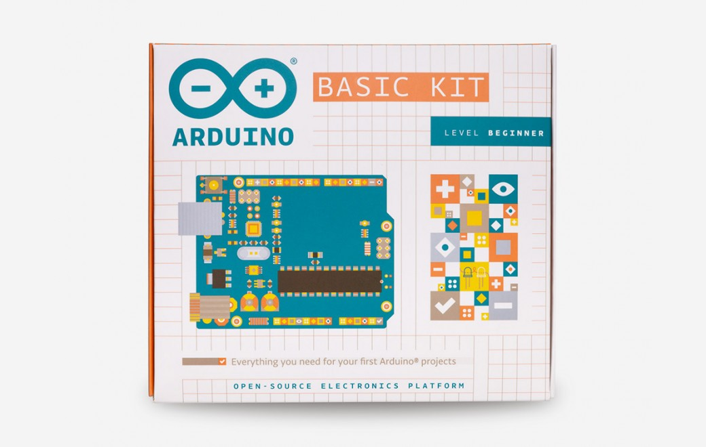

***Note: This page refers to a product that is retired.***

This kit includes all the components you need to build simple projects and learn how to turn an idea into reality using Arduino. Arduino Basic Kit has been developed in collaboration with Autodesk. When you purchase the kit you will receive [online access to 15 step-by-step tutorials](http://projectignite.autodesk.com/arduino) to make simple projects using components that let you control the physical world through different kinds of sensors and actuators.

Once you have mastered this knowledge, you will have a palette of code and circuits to create something beautiful and useful. So build, hack and share!

Projects you can make:

* 01 GET TO KNOW YOUR TOOLS an introduction to the basics
* 02 SPACESHIP INTERFACE design the control panel for your starship
* 03 LOVE-O-METER measure how hot-blooded you are
* 04 COLOR MIXING LAMP produce any color with a lamp that uses light as an input
* 05 MOOD CUE clue people in to how you're doing
* 06 LIGHT THEREMIN create a musical instrument you play by waving your hands
* 07 KEYBOARD INSTRUMENT play music and make some noise with this keyboard
* 08 DIGITAL HOURGLASS a light-up hourglass that can stop you from working too much
* 09 MOTORIZED PINWHEEL a colored wheel that will make your head spin
* 10 ZOETROPE create a mechanical animation you can play forward or reverse
* 11 CRYSTAL BALL a mystical tour to answer all your tough questions
* 12 KNOCK LOCK tap out the secret code to open the door
* 13 TOUCHY-FEEL LAMP a lamp that responds to your touch
* 14 TWEAK THE ARDUINO LOGO control your personal computer from your Arduino
* 15 HACKING BUTTONS create a master control for all your devices!

## Getting Started

When you purchase an Arduino Basic Kit you will receive an email with all the infos you need to access the tutorials online on Autodesk Project Ignite. You will be able to get started with Arduino, learn the basics of coding and electronics, jump right into the step-by-step tutorials and make the 15 simple projects. You can find the Arduino code for all these projects within the [Arduino IDE](https://www.arduino.cc/en/Main/Software), click on File / Examples / 10.StarterKit.

### Need Help?

* On the Software [on the Arduino Forum](https://forum.arduino.cc/index.php?board=86.0)
* On the Product itself through [our Customer Support](https://support.arduino.cc/hc)

