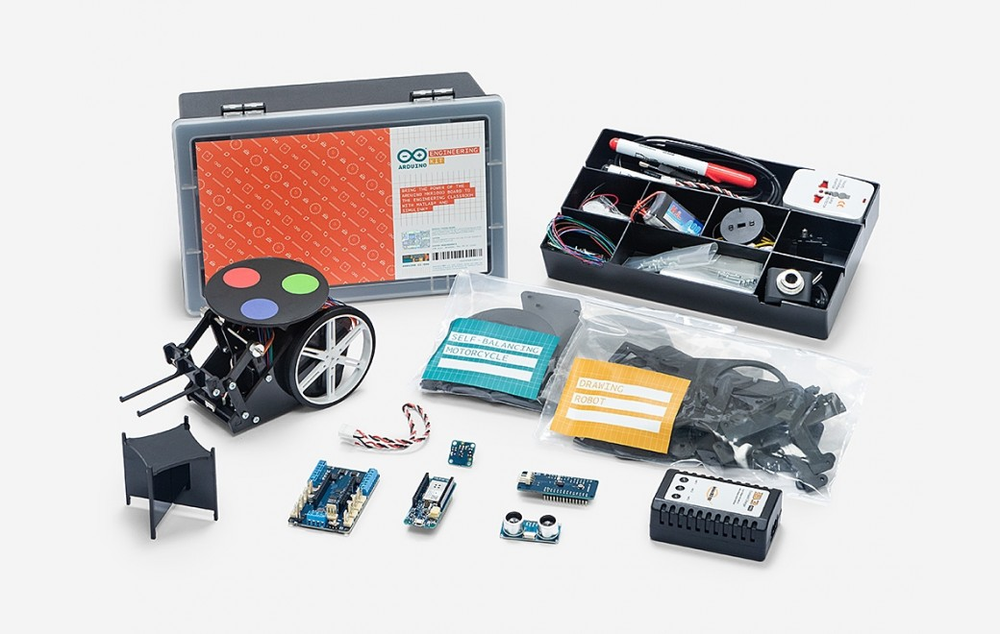
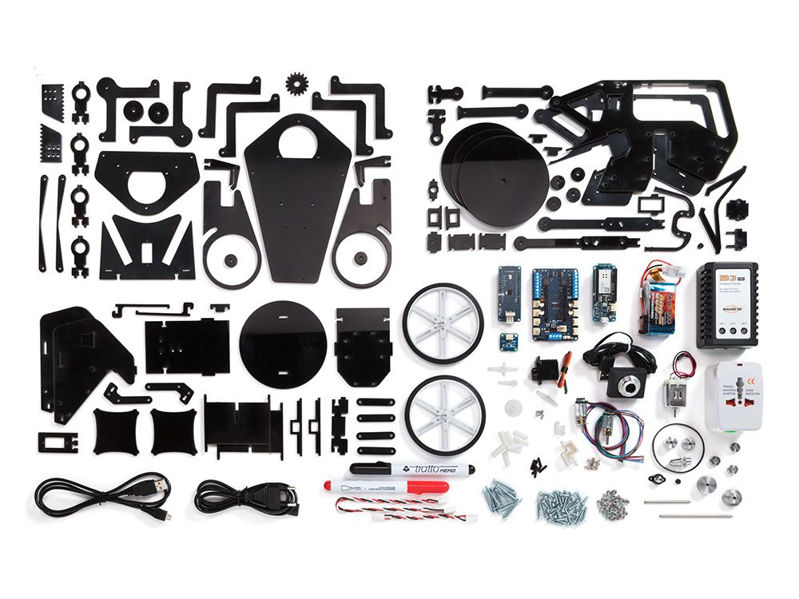

***Note: This page refers to a product that is retired. It has been replaced by the [**Arduino Engineering Kit Rev2**](https://store.arduino.cc/engineering-kit-r2).***

This product is retired and

Challenge engineering students and help them develop engineering skills with the Arduino Engineering Kit. The kit is a practical, hands-on tool that demonstrates key engineering concepts, core aspects of mechatronics, and MATLAB and Simulink programming. Ideal for advanced high school and college students, it includes three projects to teach the basics of modeling, controls, image processing, robotics, signal processing, and more.

These projects create a collaborative learning environment— plus they’re fun to do.

**Self-Balancing Motorcycle**

This motorcycle will maneuver on its own on various terrains and remain upright using a flywheel for balance.

**Mobile Rover**

This vehicle can navigate between given reference points, move objects with a forklift and much more.

**Whiteboard Drawing Robot**

This amazing robot can take a drawing it’s given and duplicate it on a whiteboard.

The kit is sold in a hard plastic, stackable tool box for storage and years of reuse. Inside the box is an easy-to-use Arduino MKR1000 board, several customized parts, and a complete set of electrical and mechanical components needed to assemble all three projects.

In addition, students get access to a dedicated e-learning platform and other learning materials. Additionally, they are granted a one-year individual license of MATLAB and Simulink. This license is for educational use only, not for government, research, commercial, or other organizational use.

### Need Help?

* On the Software [on the Arduino Forum](https://forum.arduino.cc/index.php?board=63.0)
* On Projects [on the Arduino Forum](https://forum.arduino.cc/index.php?board=124.0)
* With the Product itself through [our Customer Support](mailto:engkit@arduino.cc)
* [Login to see the course content](https://create.arduino.cc/edu/courses/course/)

The Arduino Engineering Kit is built on its own Education Learning Management System (LMS) with step-by-step instructions and lessons.

The content of this kit is divided into six chapters, featuring a short introduction, a getting-started guide for the tools that will be used, a concepts section, and finally the projects themselves. Users will receive access to the online platform for one year and can purchase additional licenses to extend platform access.

Learning objectives include, but are not limited to the following:

* MATLAB and Simulink basics;
* Connect MATLAB and Simulink to the Arduino MKR1000 and read/write data from connected sensors (encoders, IMU, hall sensor) and actuators (DC motors, servo motor);
* Analyze and visualize data from Arduino;
* Apply custom algorithms for complex math operations, image processing, and PID control;
* Model and simulate behavior of dynamic systems in Simulink;
* Incorporate logic-based algorithms that define system behavior for different “states” (e.g. move forward, turn, stop)
* Build and run a working Arduino application from a Simulink model;
* Tune and optimize Simulink model parameters as the application is running on Arduino;
* Download the completed Simulink model for standalone execution on the Arduino

The online platform will help students learn fundamental engineering concepts, key aspects of mechatronics, and MATLAB and Simulink programming. The content is currently available in English.

## Kit content

Each Arduino Engineering Kit includes:

### BOARDS

* 1 Arduino MKR1000 Board
* 1 Arduino MKR Motor Shield
* 1 Arduino MKR IMU Shield

### ELECTRICAL COMPONENTS

* 1 DC Motor
* 2 Geared DC Motors with Encoder
* 1 Standard Micro Servo (180 degrees)
* 1 Hall Sensor Module
* 1 Ultrasonic Sensor Module
* 1 Webcam
* 1 LiPo Battery
* 1 LiPo Battery Charger
* 1 Micro USB Cable
* 1 3-pin to 4-pin Tinkerkit Module Cable
* 1 3-pin Tinkerkit Module Cable

### MECHANICAL COMPONENTS

* 3 Sets of Assembly Pieces
* 2 Wheels
* 1 Caster Wheel
* 1 Timing Belt
* 2 Timing Pulley
* 2 DC Motor Mounting Brackets
* 1 Metal Shaft (90mm)
* 2 Metal D Shafts (50mm)
* 2 Sets of Distance Spacers (6mm, 17mm)
* 2 Sets of M2 Bolts (10mm, 25mm)
* 3 Sets of M3 Bolts (10mm, 15mm, 25mm)
* 1 Set of M2 Nuts
* 1 Set of M3 Nuts
* 1 Set of M3 Lock Nuts with Nylon Insert
* 3 Shaft Collars
* 1 Propeller Adapter Screw
* 2 Magnets Ø8 mm
* 1 Thread 5m
* 2 Whiteboard Pens
* 1 Sticker for Vision Recognition

Since some components are used in more than one project, users are limited to one fully assembled project at a time.

## FAQ

**This kit is intended for whom? Do users need an engineering background?**

The kit has primarily been designed for: students learning about engineering at a university or vocational school, instructors teaching engineering and related courses, makers with an interest or background in engineering. Users don’t necessarily need to have engineering background to operate the projects, since all MATLAB and Simulink programs are included. However, for users that wish to extend and evolve the provided programs it will be helpful to understand the underlying engineering concepts.

**Why are MATLAB and Simulink used instead of Arduino IDE?**

MATLAB and Simulink are built for engineers and make the complex math and engineering calculations in the kit’s projects easier and more intuitive. They are pervasive across industries and many engineers will use them in their future jobs.

**Will the kit be sold worldwide?**

Yes, but the content will only be available in English. We may consider adding other languages in the future.

**Are MATLAB and Simulink included or do I have to pay extra?**

MATLAB, Simulink, Stateflow, and ten other add-on products are included in the kit at no extra cost. The Arduino Engineering Kit includes a one-year license of these products for one individual. The license is not restricted to only students.

**What engineering concepts are covered?**

The kit covers system modeling, controls, image processing, robotics, signal processing, among many others. Concepts are not covered at an advanced level.

**What if the included license is not sufficient? Suppose several individuals who will be sharing a kit need access for longer than one year. What should we do to get more licenses?**

MathWorks has various options for supplementing the included license. They will assist you in determining what is appropriate for your situation. Please visit [https://www.mathworks.com/company/aboutus/contact_us/arduino_engineering_kit.html](https://www.mathworks.com/company/aboutus/contact_us/arduino_engineering_kit.html) to learn more.

**If I have an existing MATLAB license, can I use just that?**

Yes, but you must use the latest release (R2018a) and have access to the following products: MATLAB, Simulink, Stateflow®, Control System Toolbox™️, Curve Fitting Toolbox™️, DSP System Toolbox™️, Image Processing Toolbox™️, Instrument Control Toolbox™️, Optimization Toolbox™️, Signal Processing Toolbox™️, Symbolic Math Toolbox™️, Simscape™️, and Simscape Multibody™️. If your school has a campus license (university or primary/secondary), you should have these required products.

**I have registered my kit and I want to see the content, where do I go?**

You can login [here](https://create.arduino.cc/edu/courses/course/) with your details and take part of all the content

**My Mathwork and simulink license has expired, how do I renew it?**

The Arduino engineering kit includes a one year license for Matlab and Simulink for free. If you wish to continue using Matlab/Simulink after the trial period, you can purchase a new license by following the link below:
[https://se.mathworks.com/store](https://se.mathworks.com/store)