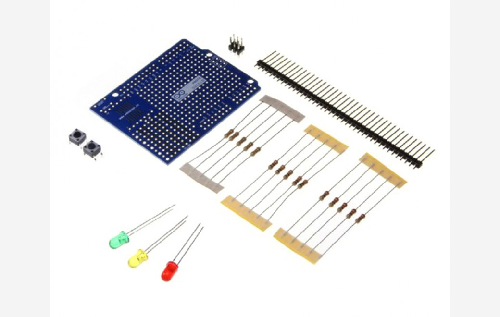

***Note: This page refers to a product that is retired.***

### Features & Benefits of the Proto Shield

* Connections for all Arduino I/O pins
* Space for through-hole and surface mount ICs
* Components can be soldered to the shield (a solderless breadboard is needed for non-soldered prototyping)

### Proto Shield Kit Contents

* 1 x straight single line pinhead connector (40 x 1)
* 1 x straight single line pinhead connector (3 x 2)
* 2 x PCB pushbuttons
* 3 x LEDs (1 Red, 1 Yellow, 1 Green)
* 5 x 10 kiloohm resistors (1 to 4 W)
* 5 x 220 ohm resistors (1 to 4 W)
* 5 x 1 kiloohm resistor (1 to 4 W)