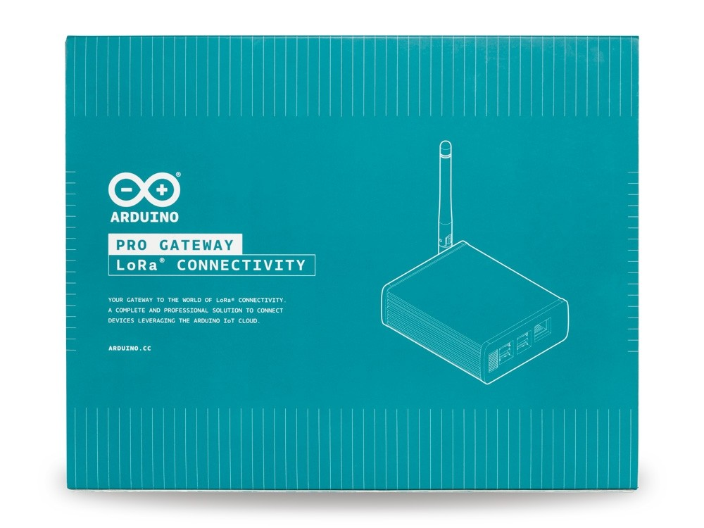

## Description

The gateway supports up to 8 LoRa® Channels in the 868MHz frequency band, allowing it to receive multiple LoRa® packets simultaneously. It is designed around the SX1301 by Semtech, which enables robust connections with a large number of wireless endpoints over extended distances.

The device features *Listen Before Talk (LBT)* capability, meaning it can monitor channels continuously and transmit only when the channel is free.

It's the perfect companion for the Arduino MKR WAN 1300.
Installation, provisioning and remote management of the Gateway are made incredibly simple through the Arduino Cloud platform.

This gateway enables LoRa®-based communication in various use cases, such as:

- Automated Meter Reading
- Environmental Monitor
- Smart Cities
- Home and Building Automation
- Wireless Alarm and Security System
- Industrial Monitoring and Control
- Long-Range Irrigation System
- Agricultural Monitoring

The gateway radio hardware is powered by Embit and Arduino hardware design team.
The network server and the packet forwarder running on the Arduino Cloud platform are powered by A2A.

## Getting Started

Follow the [Arduino Pro Gateway Assembly](https://docs.arduino.cc/tutorials/generic/lora-gateway-assembly) tutorial to assemble your Arduino Pro Gateway.

If your Pro Gateway is already set up, you can proceed to the [setup page](https://create.arduino.cc/getting-started/loragw/welcome) for further configuration.

### Datasheet
You can follow the next link to [download the datasheet](https://content.arduino.cc/assets/AKX00016-datasheet.pdf).

### Need Help?

* On the Software [on the Arduino Forum](https://forum.arduino.cc/index.php?board=86.0)
* On the Product itself through [our Customer Support](https://support.arduino.cc/hc)

## Trademark Acknowledgments

- **LoRa®** is a registered trademark of Semtech Corporation.