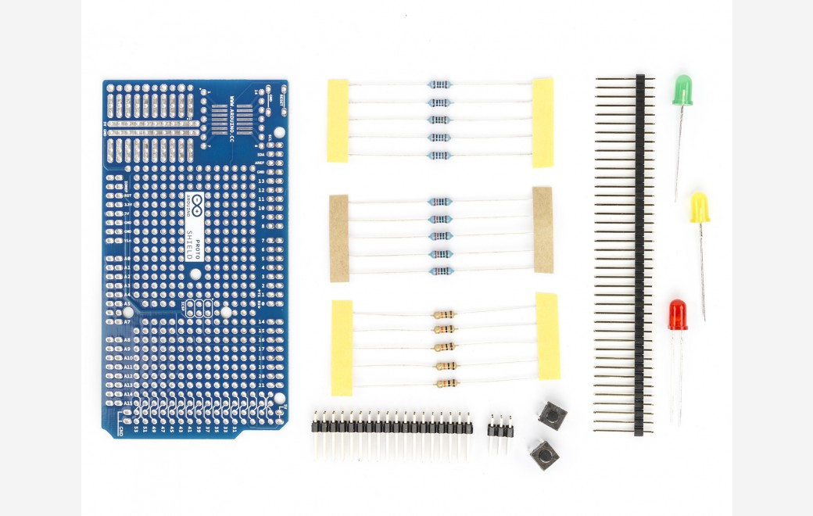

***Note: This page refers to a product that is retired.***

Base kit to extend your Arduino MEGA with your own wired circuit. The kit is composed from: 

- 1x MEGA Proto shield Rev3 bare PCB 
- 1x 40 way male 0.1" strip with long terminals 
- 1x 18x2 way male 0.1" strip 
- 2x pushbuttons 
- 5x 220 Ohm resistors 
- 5x 1K Ohm resistors 
- 5x 10K Ohm resistors 
- 3x LEDs
- Arduino MEGA Board (not included)