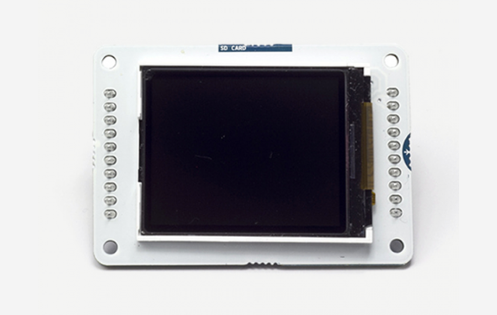

***Note: This page refers to a product that is retired.***

The Arduino LSD screen is a backlit LCD screen with headers. You can draw text, images, and shapes to the screen with the [TFT library](https://www.arduino.cc/en/Reference/TFTLibrary). There is an onboard micro-SD card slot on the back of the screen that can, among other things, store bitmap images for the screen to display.

The screen's headers are designed to fit into the socket on the front of the Arduino Esplora, but it is compatible with any AVR-based Arduino (Uno, Leonardo, etc) or with the Arduino Due. To connect the screen to other Arduino boards, read the tutorial on this [link](http://arduino.cc/en/Guide/TFTtoBoards).

You can find [here](https://www.arduino.cc/en/Main/warranty) your board warranty information.

## Getting Started

You can find in the [Getting Started section](https://www.arduino.cc/en/Guide/HomePage) all the information you need to configure your board, use the Arduino Software (IDE), and start tinker with coding and electronics.

### Need Help?

* On the Software [on the Arduino Forum](https://forum.arduino.cc/index.php?board=63.0)
* On Projects [on the Arduino Forum](https://forum.arduino.cc/index.php?board=3.0)
* On the Product itself through [our Customer Support](https://support.arduino.cc/hc)

## Documentation

### OSH: Schematics

Arduino LCD Screen is open-source hardware! You can build your own board using the following files:

[EAGLE FILES IN .ZIP](https://www.arduino.cc/en/uploads/Main/LCD_Rev-4.zip) 

[SCHEMATICS IN .PDF](https://www.arduino.cc/en/uploads/Main/GLCD_sch.pdf)

### Hardware

The screen is 1.77" diagonal, with 160 x 128 pixel resolution. The TFT library interfaces with the screen's controller through SPI when using the [TFT library](https://www.arduino.cc/en/Reference/TFTLibrary). Refer to the [screen's data sheet](https://www.arduino.cc/en/uploads/Main/HTF0177SN-01-SPEC.pdf) for complete details.

* The screen runs on +5 VDC
* The micro-SD slot is accessible through the [SD card library](https://www.arduino.cc/en/Reference/SD).
* The LED backlight is dimmable by PWM.
* The screen's headers are laid out so it easily sockets into the Arduino Esplora and Arduino Robot.

### Library

The Arduino TFT library extends the [Adafruit GFX](https://github.com/adafruit/Adafruit-GFX-Library), and [Adafruit ST7735 libraries](https://github.com/adafruit/Adafruit-ST7735-Library) that it is based on. The GFX library is responsible for the drawing routines, while the ST7735 library is specific to the screen on the Arduino screen. The Arduino specific additions were designed to work as similarly to the Processing API as possible.

The library is backwards compatible, which means you can still use the Adafruit functions[described here](http://learn.adafruit.com/adafruit-gfx-graphics-library/overview).

The TFT library relies on the [SPI library](https://www.arduino.cc/en/Reference/SPI), which must be included in any sketch that uses the scree. If you wish to use the SD card, you need to include the [SD library](https://www.arduino.cc/en/Reference/SD) as well.
