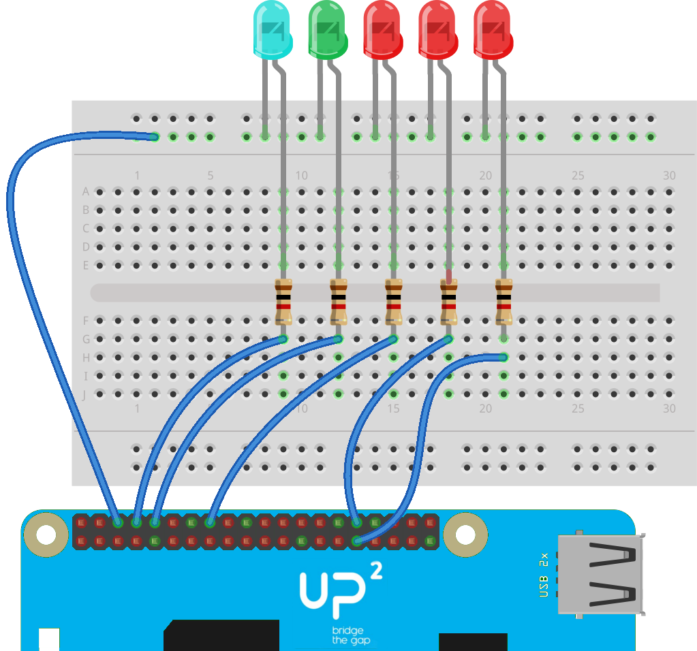

## Components and Supplies

- [UP2 Board](http://www.up-board.org/upsquared/)
- [LED (generic)](https://www.newark.com/14N9416?COM=ref_hackster)
- [Jumper wires (generic)](https://www.newark.com/88W2571?COM=ref_hackster)
- [Breadboard (generic)](https://www.newark.com/99W1759?COM=ref_hackster)
- [Resistor 1k ohm](https://www.newark.com/multicomp/mccfr0w4j0102a50/carbon-film-resistor-1kohm-250mw/dp/58K5001?COM=ref_hackster)

## Apps and Online Services

- [Arduino Cloud Editor](https://create.arduino.cc/editor)

## About This Project

This experiment shows how to interact with a Linux Single Board Computer (UP^2 in this case) using Arduino language and Create Cloud Editor. To begin, we need a suitable OS running on the board. As of writing, we need to install UbiLinux 4.0 beta 2 to be able to access all the IO functionalities of the board.

### Steps

Get an USB stick and follow the Getting Started section of Arduino Create. Select UbiLinux as target OS and follow the instructions. After about 30 minutes your UP^2 will be ready to host any Arduino sketch. To make sure not to break anything, power down the board before connecting the LEDs.

We are going to use a couple of GPIOs and the three PWM channels exposed by the Apollo Lake platform. As GPIOs, we'll use pins 8 and 10, while exported PWMs are on pins 16, 32 and 33. Pin numbering starts from upper right corner (looking at the board with the expansion connector on the bottom) and follows the typical zig-zag scheme. The pin mapping resembles the Raspberry Pi 40 pin GP-bus, so any illustrator the the RPi will just apply fine.

Once the LEDs have been connected (remember the series resistor to avoid absorbing too much current) power up the board, wait for the boot to finish and open the attached sketch using Create. From the dropdown menu you should see an additional board, which name matches the one you chose at the end of the GettingStarted procedure.

Press upload to load the sketch and launch it on the board. All this procedure can be performed remotely; you don't need to be in the same local network of the board. You can also start and stop the execution as you wish from the "My Devices" section of Create landing page. Once the sketch is loaded, it will poll some well known Linux command line utilities to get the Ethernet adapters status (if a cable is connected) and the system load.

## Code

<iframe src='https://create.arduino.cc/editor/Arduino_Genuino/c41ef010-c234-4f91-b016-28fe42d90ca9/preview?embed&snippet' style='height:510px;width:100%;margin:10px 0' frameborder='0'></iframe>

### Schematics

## Finished

The load average (for the last 1, 5 and 15 minutes) is mapped as a value between 0 and 255 and these values are associated to the LEDs brightness. At a glance you can see if the board is being overloaded by some other task and maybe take some actions (like spinning an alternative cooling system).