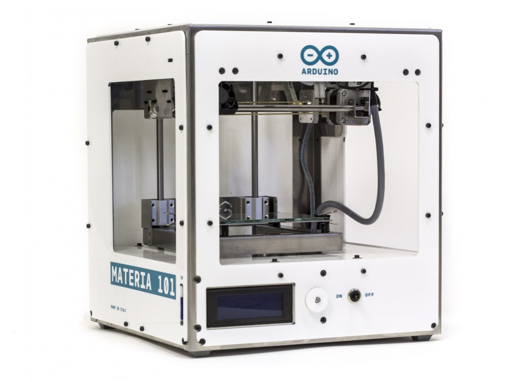

***Note: This page refers to a product that is retired.***

**Arduino Materia 101** is the first official Arduino 3D printer. It uses an Arduino Mega2560 with a shield specifically made for controlling 3D printers. It's a small machine, with a sheet metal design housing the moving parts. The design is straightforward and easy to understand, which makes it a good machine for beginners, or up-and-coming hardware hackers who want to improve and experiment.  
Arduino Materia 101 is an open-source machine, from the design of the mechanics to the electronics and firmware, as all Arduino products. It is fully compatible with other open-source design tools such as: Slic3r, OpenSCAD, blender with many many more.  
  
This product comes fully assembled.

As part of the Arduino family, also Materia 101 shares an OpenSource heart. Check the following links in order to access to the great database of information we have available for you. 

## Documentation

### Use Manual

How does a 3D Printing machine works? With this simple manual you will be able to print your first project from scratch. Available in two languages, [Italiano](https://www.arduino.cc/en/uploads/Main/UseMateria101_IT.pdf) and [English](https://www.arduino.cc/en/uploads/Main/Materia101_User_Manual_EN_rev4.pdf). 

### Assembly Manual

Have you ever assembled a 3D printing machine? It may be quite frustrating at the very beginning of your career as Maker. Here a simple guide to start with, both available in [Italiano](https://www.arduino.cc/en/uploads/Main/Materia_101_Manuale_Assemblaggio_rev2B_smaller.pdf) and [English](https://www.arduino.cc/en/uploads/Main/Materia101_Assembly_Manual_EN_rev4.pdf). 

### Firmware

[Download here](https://www.arduino.cc/en/uploads/Main/Materia101Firmware.zip) your Materia 101 firmware or check the latest version on [GitHub](https://github.com/radandre/MATERIA101). 

### Software

We suggest you to start using [Slic3r](http://slic3r.org/) but there are so many online. Find the one that perfectly fits for you. 

### z calibration gCode

Download it at the [following link](https://www.arduino.cc/en/uploads/Main/zCalibration.zip). 

### Test Print gCode

Before start printing the Taj Mahal natural size, run a test!  

Download your test print gCode at the [following link](https://www.arduino.cc/en/uploads/Main/test_print.zip). 

## Tech Specs

|                                                     |                      |
| --------------------------------------------------- | -------------------- |
| Color                                               | White |
| Body                                                | Stainless steel covered by white plexiglass |
| Carter                                              | Plexiglass |
| Screen                                              | LCD monitor (20x4) |
| Minimum layer thickness                             | 0.1mm |
| Size                                                | 310x350x330 mm |
| Print Area                                          | 140x100x100 mm |
| Printing technology                                 | Fused Filament Fabrication |
| Suggested filament                                  | 1.75mm PLA |
| Experimental filaments                            | Crystal Flex, PLA termosense, TPU, PET, PLA Sand, PLA Flex (1.75mm) |
| X & Y resolution                                    | 0.06 mm |
| Z resolution                                        | 0.1 mm |
| Extruder (diameter)                                 | 0.35 mm |
| PLA suggested temperature                           | 195-220 °C |
| Absorption                                          | 65 W |
| Weight                                              | 10 kg |
| Extruder block with pressure adjustment on filament | |
| Bearings recirculating ball on all axes             | |
| Z axis movement with trapezoidal screws             | |
| Adjustable printing plate                           | |
| Micro USB to update the firmware                    | |
| Possibility to print directly from SD card          | |
