***Note: This page refers to products that are retired.***

## Arduino USB

### ARDUINO UNO

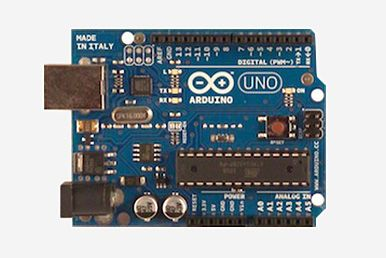 

This is the latest revision of the basic Arduino USB board. It connects to the computer with a standard USB cable and contains everything else you need to program and use the board. It can be extended with a variety of shields: custom daughter-boards with specific features. It is similar to the Duemilanove, but has a different USB-to-serial chip the ATMega8U2, and newly designed labeling to make inputs and outputs easier to identify. 

### ARDUINO DUEMILANOVE

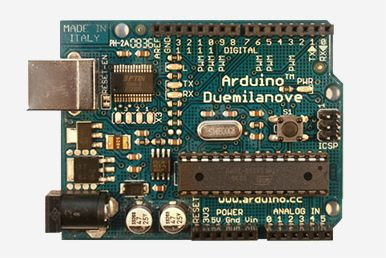 

The Duemilanove automatically selects the appropriate power supply (USB or external power), eliminating the need for the power selection jumper found on previous boards. It also adds an easiest to cut trace for disabling the auto-reset, along with a solder jumper for re-enabling it. Note: around March 1st, 2009, the Duemilanove started to ship with the ATmega328P instead of the ATmega168\. 

### ARDUINO DIECIMILA

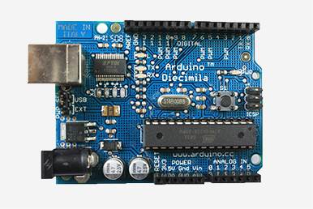 

The main change in the Arduino Diecimila is that it can be reset from the computer, without the need to physically press the reset button on the board. The Diecimila uses a low dropout voltage regulator which lowers the board's power consumption when powered by an external supply (AC/DC adapter or battery). A resettable polyfuse protects your computer's USB ports from shorts and surges. It also provides pin headers for the reset line and for 3.3V. There is a built-in LED on pin 13\. Some blue Diecimila boards say "Prototype - Limited Edition" but are in fact fully-tested production boards (the actual prototypes are red).

### ARDUINO NG REV. C

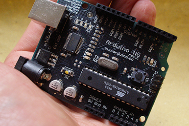 

Revision C of the Arduino NG does not have a built-in LED on pin 13 - instead you'll see two small unused solder pads near the labels "GND" and "13". There is, however, about 1000 ohms of resistance on pin 13, so you can connect an LED without external resistor.

[Schematic](http://www.arduino.cc/en/uploads/Main/arduino%5FNG%5Fschematic.png) 

### ARDUINO NG 240

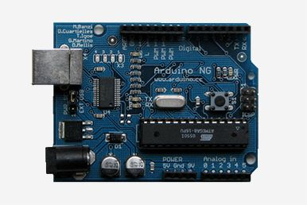 

The Arduino NG uses the FTDI FT232RL USB-to-Serial converter, which requires fewer external components that the FT232BM. It also has a built-in LED on pin 13 (which may interfere with SPI communication). Later NG's shipped with an ATmega168 instead of an ATmega8, though either chip can be used with any board.

[Schematic](http://www.arduino.cc/en/uploads/Main/arduino%5FNG%5Fschematic.png) 

### ARDUINO EXTREME v2

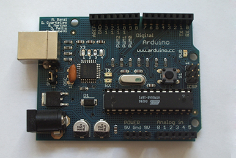 

Version 2 of the Arduino Extreme uses a gridded ground plane and includes the new "[www.arduino.cc](www.arduino.cc)" URL.

### ARDUINO EXTREME

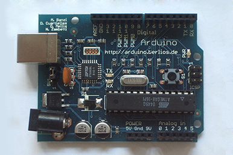 

The Arduino Extreme uses many more surface mount components than previous USB Arduino boards and comes with female pin headers. It also has RX and TX LEDs that indicate when data is being sent to or from the board.

### ARDUINO USB v2.0

 

The second version of the Arduino USB corrected the USB connector pinout and updated the URL to "arduino.berlios.de"; it was labelled "Arduino USB v2.0". (Eagle files, schematic, assembly instructions, photo of an assembled board). 

### ARDUINO USB

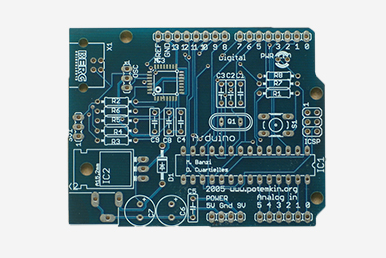 

The Arduino USB was the first board labelled "Arduino". These were mainly sold unassembled as kits. The first version had an incorrect pinout for the USB connector and had the URL "[www.potemkin.org](www.potemkin.org)".

## Arduino Bluetooth

### ARDUINO BT

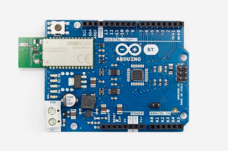 

The Arduino BT is a microcontroller board originally was based on the ATmega168, but now is supplied with the 328, and the Bluegiga WT11 Bluetooth® module. It supports wireless serial communication over Bluetooth® (but is not compatible with Bluetooth® headsets or other audio devices).

### Arduino Serial

### ARDUINO SERIAL v2.0

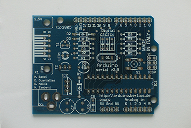 

A revised version of the serial board with the URL "arduino.berlios.de".

### ARDUINO SERIAL

 

The original version of the Arduino serial board. Includes the url "[www.potemkin.org](www.potemkin.org)".

## Arduino Single-Sided Serial

### SEVERINO (S3V3)

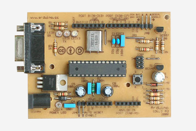 

This is the third version of the single-sided board. It has fewer bridges (three) than the original and includes TX, RX, and pin 13 LEDs. The ICSP and power headers are compatible with the Diecimila.

### ORIGINAL

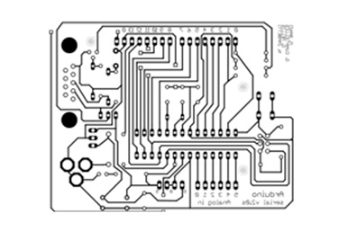 

The initial design of the single-sided board (labeled version 2 because it was derived from v. 2 of the serial board). Requires six bridges. Has a 1K resistor (but no LED) on pin 13\. The ICSP header location is not compatible with other boards.

## Arduino Mega

### ARDUINO MEGA

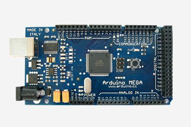 

The original Arduino Mega has an ATmega1280 and an FTDI USB-to-serial chip.

## Arduino Lilypad

### ARDUINO LILYPAD 03/04

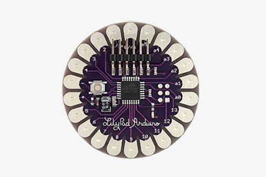 

**LilyPad Arduino 04**

This revision uses the ATmega328P instead of the ATmega168V. All other details are identical to version 03.  

**LilyPad Arduino 03** 

This revision has a 6-pin programming header that's compatible with FTDI USB cables and the Sparkfun FTDI Basic Breakout. It adds support for automatic reset, allowing sketches to be uploaded without pressing the reset button on the board. The header is surface mounted, meaning that the board has no pokey bits sticking out the back.

### ARDUINO LILLYPAD 02

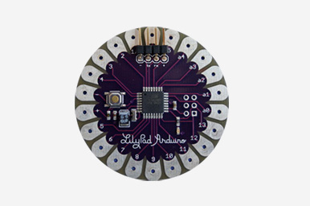 

The second revision includes an external 8mhz oscillator. The bootloader has also been updated to Limor Fried's "no wait" bootloader. When the LilyPad is supplied with power, the sketch starts immediately. The bootloader is triggered only when the reset switch is pressed.

[Schematic](http://www.arduino.cc/en/uploads/Main/LilyPad%5Fschematic.pdf) 

### ARDUINO LILYPAD 01

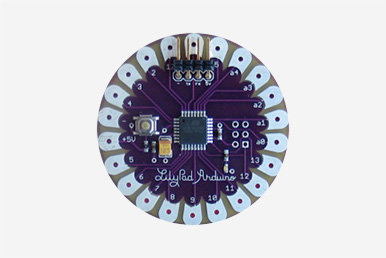 

In the first revision of the LilyPad Arduino the 10-pin ICSP header was changed to a 6-pin ICSP header and a four pin header w/ RX, TX, +5V, and GND was added.

### ARDUINO LILLYPAD 00

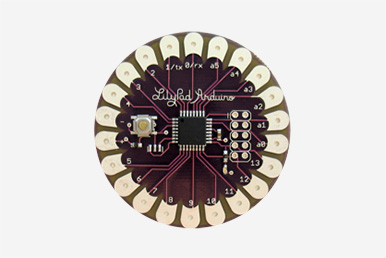 

The initial design of the Arduino LilyPad had a 10-pin ICSP header and used the internal clock on the ATmega168 rather than an external oscillator. The bootloader on the initial design is the traditional NG bootloader.

## Arduino NANO

### ARDUINO NANO 3.0

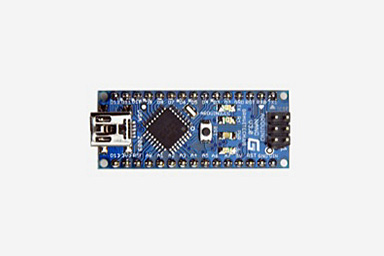 

The Arduino Nano 3.0 has an ATmega328 and a two-layer PCB. The power LED moved to the top of the board.

### ARDUINO NANO 2.X

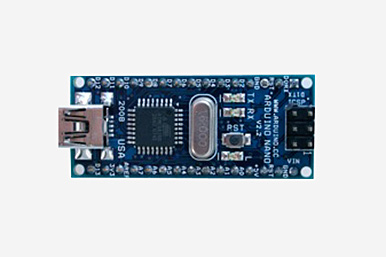 

The Arduino Nano 2.x boards have an ATmega168 and a four-layer PCB.

## Arduino Mini

### ARDUINO MINI 04

 

On this version of the Arduino Mini, two of the pins changed. The third pin became reset (instead of ground) and fourth pin became ground (instead of being unconnected). These boards are labelled "Mini 04".

### ARDUINO MINI 03

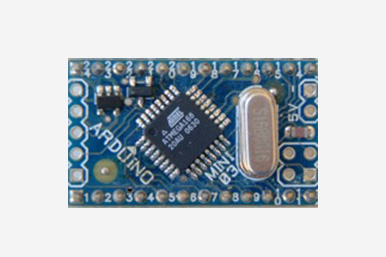 

On this board, a solder point for digital pin 7 was added to the edge of the board (next to the solder points for TX, RX, +5V, and Ground). Each of the pins is numbered and the board is labelled "Mini 03".

### ARDUINO STAMP 02

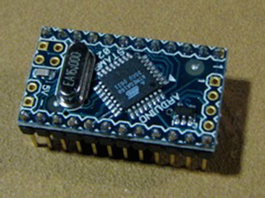 

The initial production version of the Arduino Mini was labelled "Stamp 02".

## Mini Usb Adapter

### MINI USB ADAPTER 03

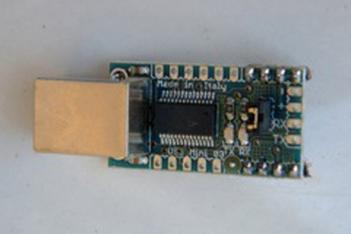 

This version of the Mini USB Adapter breaks out many more pins of the FTDI USB-to-serial chip. It is labeled "USB Mini 03".

### MINI USB ADAPTER

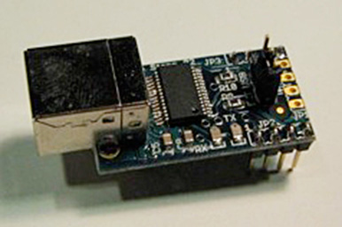 

The original Mini USB Adapter was labelled "Arduino Stamp 02".