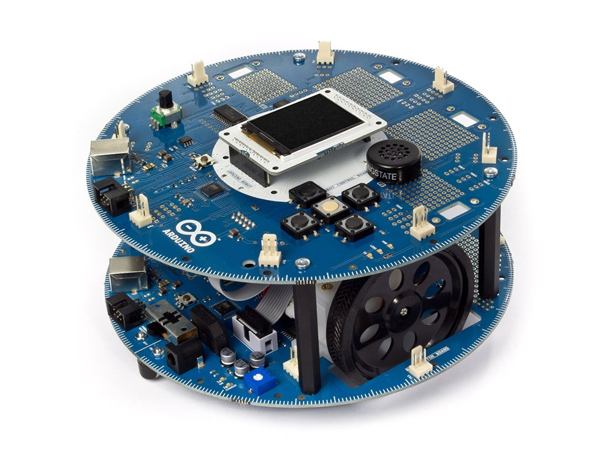
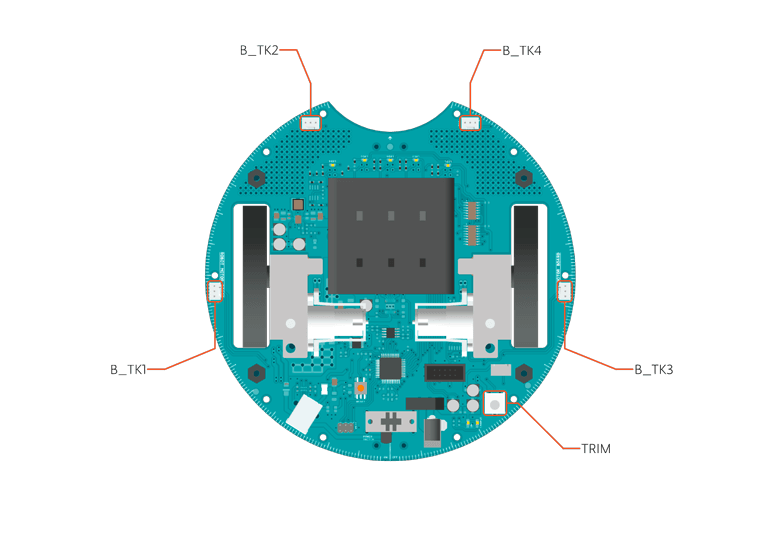
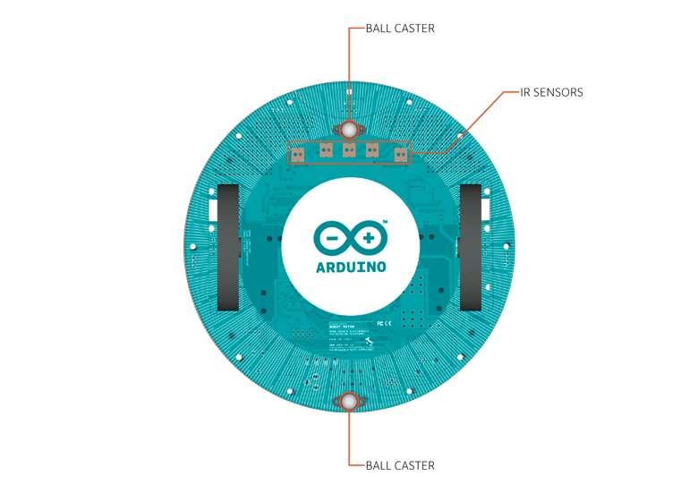

***Note: This page refers to a product that is retired.***

The **Arduino Robot** is the first official Arduino on wheels. The robot has two processors, one on each of its two boards. The *Motor Board* controls the motors, and the *Control Board* reads sensors and decides how to operate. Each of the boards is a full Arduino board programmable using the Arduino IDE.

Both Motor and Control boards are microcontroller boards based on the ATmega32u4([datasheet](http://www.atmel.com/dyn/resources/prod_documents/7766S.pdf)). The Robot has many of its pins mapped to on-board sensors and actuators. Programming the robot is similar to the process with the Arduino Leonardo. Both processors have built-in USB communication, eliminating the need for a secondary processor. This allows the Robot to appear to a connected computer as a virtual (CDC) serial / COM port. As always with Arduino, every element of the platform – hardware, software and documentation – is freely available and open-source. This means you can learn exactly how it's made and use its design as the starting point for your own robots. The Arduino Robot is the result of the collective effort from an international team looking at how science can be made fun to learn. Arduino is now on wheels, come ride with us!

You can find [here](https://www.arduino.cc/en/Main/warranty) your board warranty information.

## Getting Started

In the [Getting Started section](https://www.arduino.cc/en/Guide/Robot), you can find all the information you need to configure your board, use the [Arduino Software (IDE)](https://www.arduino.cc/en/Main/Software), and start to tinker with coding and electronics.

### Need Help?

* On the Software [on the Arduino Forum](https://forum.arduino.cc/index.php?board=93.0)
* On Projects [on the Arduino Forum](https://forum.arduino.cc/index.php?board=3.0)
* On the Product itself through [our Customer Support](https://support.arduino.cc/hc)

## Documentation 

### OSH: Schematics

Arduino Robot is open-source hardware! You can build your own board using the following files:

[EAGLE FILES IN .ZIP](https://content.arduino.cc/assets/arduino-robot-reference-design.zip)

### Power

The Arduino Robot can be powered via the USB connection or with 4 AA batteries. The power source is selected automatically. The battery holder holds 4 rechargeable NiMh AA batteries.

*NB: Do not use non-rechargeable batteries with the robot*

For safety purposes, the motors are disabled when the robot is powered from the USB connection. The robot has an on-board battery charger that requires 9V external power coming from an AC-to-DC adapter (wall-wart). The adapter can be connected by plugging a 2.1mm center-positive plug into the Motor Board's power jack. The charger will not operate if powered by USB. The Control Board is powered by the power supply on the Motor Board.

### Memory

The ATmega32u4 has 32 KB (with 4 KB used for the bootloader). It also has 2.5 KB of SRAM and 1 KB of EEPROM (which can be read and written with the [EEPROM library](http://www.arduino.cc/en/Reference/EEPROM)). The Control Board has an extra 512 Kbit EEPROM that can be accessed via I2C. There is an external SD card reader attached to the GTFT screen that can be accessed by the Control Board's processor for additional storage.

### Input and Output

The Robot comes with a series of pre-soldered connectors. There are a number of additional spots for you to install additional parts if needed. All the connectors are labelled on the boards and mapped to named ports through the [Robot library](https://www.arduino.cc/en/Reference/RobotLibrary) allowing access to standard Arduino functions. Each pin can provide or receive a maximum of 40mA at 5V. Some pins have specialized functions:

* Control Board TK0 to TK7: these pins are multiplexed to a single analog pin on theControl Board's microprocessor. They can be used as analog inputs for sensors like distance sensors, analog ultrasound sensors, or mechanical switches to detect collisions.
* Control Board TKD0 to TKD5: these are digital I/O pins directly connected to the processor, addressed using [Robot.digitalRead()](https://www.arduino.cc/en/Reference/RobotDigitalRead) and [Robot.digitalWrite)](https://www.arduino.cc/en/Reference/RobotDigitalWrite) functions. Pins TKD0 to TKD3 can also be used as analog inputs with [Robot.analogRead()](https://www.arduino.cc/en/Reference/RobotAnalogRead)  
  
*Note: if you have one of the first generation robots, you will see that the TKD\* pins are named TDK\* on the Robot's silkscreen. TKD\* is the proper name for them and is how we address them on the software.*

* Motor Board TK1 to TK4: these pins are named in software as B\_TK1 to B\_TK4, they can be digital or analog input pins, and support [Robot.digitalRead()](https://www.arduino.cc/en/Reference/RobotDigitalRead), [Robot.digitalWrite)](https://www.arduino.cc/en/Reference/RobotDigitalWrite) and[Robot.analogRead()](https://www.arduino.cc/en/Reference/RobotAnalogRead).

* Serial Communication: The boards communicate with each other using the processors' serial port. A 10-pin connector connects both boards carries the serial communication, as well as power and additional information like the battery's current charge.
* Control Board SPI: SPI is used to control the GTFT and SD card. If you want to flash the processor using an external programmer, you need to disconnect the screen first.
* Control Board LEDs: the Control Board has three on-board LEDs. One indicates the board is powered (PWR). The other two indicate communication over the USB port (LED1/RX and TX).LED1 is also accessible via software.
* Both boards have I2C connectors available: 3 on the Control Board and 1 on the Motor Board.

### Control Board Pin Mapping

| ARDUINO LEONARDO | ARDUINO ROBOT CONTROL | ATMEGA 32U4 | FUNCTION | REGISTER                |
| ---------------- | --------------------- | ----------- | -------- | ----------------------- |
| D0               | RX                    | PD2         | RX       | RXD1/INT2               |
| D1               | TX                    | PD3         | TX       | TXD1/INT3               |
| D2               | SDA                   | PD1         | SDA      | SDA/INT1                |
| D3#              | SCL                   | PD0         | PWM8/SCL | OC0B/SCL/INT0           |
| D4               | MUX\_IN A6            | PD4         |          | ADC8                    |
| D5#              | BUZZ                  | PC6         | ???      | OC3A/#OC4A              |
| D6#              | MUXA/TKD4A7           | PD7         | FastPWM  | #OC4D/ADC10             |
| D7               | RST\_LCD              | PE6         |          | INT6/AIN0               |
| D8               | CARD\_CS A8           | PB4         |          | ADC11/PCINT4            |
| D9#              | LCD\_CS A9            | PB5         | PWM16    | OC1A/#OC4B/ADC12/PCINT5 |
| D10#             | DC\_LCD A10           | PB6         | PWM16    | OC1B/0c4B/ADC13/PCINT6  |
| D11#             | MUXB                  | PB7         | PWM8/16  | 0C0A/OC1C/#RTS/PCINT7   |
| D12              | MUXC/TKD5A11          | PD6         |          | T1/#OC4D/ADC9           |
| D13#             | MUXD                  | PC7         | PWM10    | CLK0/OC4A               |
| A0               | KEY D18               | PF7         |          | ADC7                    |
| A1               | TKD0 D19              | PF6         |          | ADC6                    |
| A2               | TKD1 D20              | PF5         |          | ADC5                    |
| A3               | TKD2 D21              | PF4         |          | ADC4                    |
| A4               | TKD3 D22              | PF1         |          | ADC1                    |
| A5               | POT D23               | PF0         |          | ADC0                    |
| MISO             | MISO D14              | PB3         |          | MISO,PCINT3             |
| SCK              | SCK D15               | PB1         |          | SCK,PCINT1              |
| MOSI             | MOSI D16              | PB2         |          | MOSI,PCINT2             |
| SS               | RX\_LED D17           | PB0         |          | RXLED,SS/PCINT0         |
| TXLED            | TX\_LED               | PD5         |          |                         |
| HWB              |                       | PE2         |          | HWB                     |

### Motor Board Pin Mapping

| ARDUINO LEONARDO | ARDUINO ROBOT CONTROL | ATMEGA 32U4 | FUNCTION | REGISTER                |
| ---------------- | --------------------- | ----------- | -------- | ----------------------- |
| D0               | RX                    | PD2         | RX       | RXD1/INT2               |
| D1               | TX                    | PD3         | TX       | TXD1/INT3               |
| D2               | SDA                   | PD1         | SDA      | SDA/INT1                |
| D3#              | SCL                   | PD0         | PWM8/SCL | OC0B/SCL/INT0           |
| D4               | TK3 A6                | PD4         |          | ADC8                    |
| D5#              | INA2                  | PC6         | ???      | OC3A/#OC4A              |
| D6#              | INA1 A7               | PD7         | FastPWM  | #OC4D/ADC10             |
| D7               | MUXA                  | PE6         |          | INT6/AIN0               |
| D8               | MUXB A8               | PB4         |          | ADC11/PCINT4            |
| D9#              | INB2 A9               | PB5         | PWM16    | OC1A/#OC4B/ADC12/PCINT5 |
| D10#             | INB1 A10              | PB6         | PWM16    | OC1B/0c4B/ADC13/PCINT6  |
| D11#             | MUXC                  | PB7         | PWM8/16  | 0C0A/OC1C/#RTS/PCINT7   |
| D12              | TK4 A11               | PD6         |          | T1/#OC4D/ADC9           |
| D13#             | MUXI                  | PC7         | PWM10    | CLK0/OC4A               |
| A0               | TK1 D18               | PF7         |          | ADC7                    |
| A1               | TK2 D19               | PF6         |          | ADC6                    |
| A2               | MUX\_IN D20           | PF5         |          | ADC5                    |
| A3               | TRIM D21              | PF4         |          | ADC4                    |
| A4               | SENSE\_A D22          | PF1         |          | ADC1                    |
| A5               | SENSE\_B D23          | PF0         |          | ADC0                    |
| MISO             | MISO D14              | PB3         |          | MISO,PCINT3             |
| SCK              | SCK D15               | PB1         |          | SCK,PCINT1              |
| MOSI             | MOSI D16              | PB2         |          | MOSI,PCINT2             |
| SS               | RX\_LED D17           | PB0         |          | RXLED,SS/PCINT0         |
| TXLED            | TX\_LED               | PD5         |          |                         |
| HWB              |                       | PE2         |          | HWB                     |

### Communication

The Robot has a number of facilities for communicating with a computer, another Arduino, or other microcontrollers. The ATmega32U4 provides UART TTL (5V) serial communication, which is available on digital the 10-pin board-to-board connector. The 32U4 also allows for serial (CDC) communication over USB and appears as a virtual com port to software on the computer. The chip also acts as a full speed USB 2.0 device, using standard USB COM drivers. [On Windows, a .inf file is required](http://arduino.cc/en/Guide/Windows#toc4). The Arduino software includes a serial monitor which allows simple textual data to be sent to and from the Robot board. The RX (LED1) and TX LEDs on the board will flash when data is being transmitted via the USB connection to the computer (but not for serial communication between boards). *Each one of the boards has a separate USB product identifier and will show up as different ports on you IDE.* *Make sure you choose the right one when programming.* The ATmega32U4 also supports I2C (TWI) and SPI communication. The Arduino software includes a Wire library to simplify use of the I2C bus; see the [documentation](https://www.arduino.cc/en/Reference/Wire) for details. For SPI communication, use the [SPI library](https://www.arduino.cc/en/Reference/SPI). 

### Programming

The Robot can be programmed with the Arduino software ([download](https://www.arduino.cc/en/Main/Software)). Select "Arduino Robot Control Board" or "Arduino Robot Motor Board" from the Tools > Board menu. For details, see the[getting started page](https://www.arduino.cc/en/Guide/Robot) and [tutorials](https://www.arduino.cc/en/Tutorial/HomePage).

The ATmega32U4 processors on the Arduino Robot come preburned with a [bootloader](https://www.arduino.cc/en/Tutorial/Bootloader) that allows you to upload new code to it without the use of an external hardware programmer. It communicates using the AVR109 protocol. You can bypass the bootloader and program the microcontroller through the ICSP (In-Circuit Serial Programming) header; see [these instructions](https://www.arduino.cc/en/Hacking/Programmer)for details.

### Automatic (Software) Reset and Bootloader initiation

Rather than requiring a physical press of the reset button before an upload, the Robot is designed in a way that allows it to be reset by software running on a connected computer. The reset is triggered when the Robot's virtual (CDC) serial / COM port is opened at 1200 baud and then closed. When this happens, the processor will reset, breaking the USB connection to the computer (meaning that the virtual serial / COM port will disappear). After the processor resets, the bootloader starts, remaining active for about 8 seconds. The bootloader can also be initiated by double-pressing the reset button on the Robot. Note that when the board first powers up, it will jump straight to the user sketch, if present, rather than initiating the bootloader.

Because of the way the Robot handles reset it's best to let the Arduino software try to initiate the reset before uploading, especially if you are in the habit of pressing the reset button before uploading on other boards. If the software can't reset the board you can always start the bootloader by double-pressing the reset button on the board. *A single press on the reset will restart the user sketch, a double press will initiate the bootloader.*

### USB Overcurrent Protection

Both of the Robot boards have a resettable polyfuse that protects your computer's USB ports from shorts and overcurrent. Although most computers provide their own internal protection, the fuse provides an extra layer of protection. If more than 500 mA is applied to the USB port, the fuse will automatically break the connection until the short or overload is removed.

### Physical Characteristics

The Robot is 19cm in diameter. Including wheels, GTFT screen and other connectors it can be up to 10cm tall.

### To Learn More

To calibrate the compass module, if you're using an old model of the robot (which uses Honeywell HMC 6352), refer to this tutorial: [Calibrate Compass](https://www.arduino.cc/en/Tutorial/RobotCompassCalibration) See also: [getting started with the Arduino Robot](https://www.arduino.cc/en/Guide/Robot) and [the Robot's library pages](https://www.arduino.cc/en/Reference/RobotLibrary).

## Tech Specs

### Control Board Summary

|                                     |                                           |
| ----------------------------------- | ----------------------------------------- |
| Microcontroller                    |[ATmega32u4](http://www.atmel.com/Images/Atmel-7766-8-bit-AVR-ATmega16U4-32U4_Datasheet.pdf)|
| Operating Voltage                   | 5V |
| Input Voltage                       | 5V through flat cable |
| Digital I/O Pins                    | 5 |
| PWM Channels                        | 6 |
| Analog Input Channels               | 4 (of the Digital I/O pins) |
| Analog Input Channels (multiplexed) | 8 |
| DC Current per I/O Pin              | 40 mA |
| Flash Memory                        | 32 KB (ATmega32u4) of which 4 KB used by bootloader |
| SRAM                                | 2.5 KB (ATmega32u4)|
| EEPROM (internal)                   | 1 KB (ATmega32u4)|
| EEPROM (external)                   | 512 Kbit (I2C)|
| Clock Speed                         | 16 MHz|
| Keypad                              | 5 keys |
| Knob                                | potentiometer attached to analog pin|
| Full color LCD                      | over SPI communication|
| SD card reader                      | for FAT16 formatted cards|
| Speaker                             | 8 Ohm|
| Digital Compass                     | provides deviation from the geographical north in degrees|
| I2C soldering ports                 | 3|
| Prototyping areas                   | 4|
| Radius                              | 185 mm|
| Height                              | 85 mm |

### Motor Board Summary

|                           |                                                     |
| ------------------------- | --------------------------------------------------- |
| Microcontroller           | ATmega32u4                                          |
| Operating Voltage         | 5V                                                  |
| Input Voltage             | 9V to battery charger                               |
| AA battery slot           | 4 alkaline or NiMh rechargeable batteries           |
| Digital I/O Pins          | 4                                                   |
| PWM Channels              | 1                                                   |
| Analog Input Channels     | 4 (same as the Digital I/O pins)                    |
| DC Current per I/O Pin    | 40 mA                                               |
| DC-DC converter           | generates 5V to power up the whole robot            |
| Flash Memory              | 32 KB (ATmega32u4) of which 4 KB used by bootloader |
| SRAM                      | 2.5 KB (ATmega32u4)                                 |
| EEPROM                    | 1 KB (ATmega32u4)                                   |
| Clock Speed               | 16 MHz                                              |
| Trimmer                   | for movement calibration                            |
| IR line following sensors | 5                                                   |
| I2C soldering ports       | 1                                                   |
| Prototyping areas         | 2                                                   |

