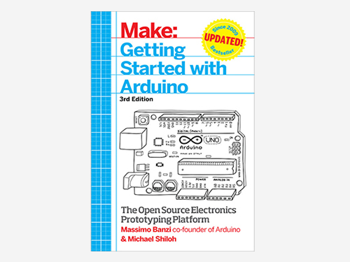

***Note: This page refers to a product that is retired.This can no longer be bought from us.***

This edition thorough introduction gives you lots of ideas for projects and helps you work with them right away!

Getting started with Arduino is a snap!

To use the introductory examples in this guide, all you need an Arduino Uno or earlier model, along with USB A-B cable and an LED.

The easy-to-use Arduino development environment is free to download. Join hundreds of thousands of hobbyists who have discovered this incredible (and educational) platform.
Written by the co-founder of the Arduino project, Getting Started with Arduino gets you in on all the fun! 

Inside, you will learn about:

* The Arduino hardware and software development
* Basics of electricity and electronics
* Prototyping on a solderless breadboard
* Drawing a schematic diagram

*Only available in English*

By Massimo Banzi, Michael Shiloh. 

Publisher: Maker Media, Inc. 

Final Release Date: December 2014. 

Pages: 262
