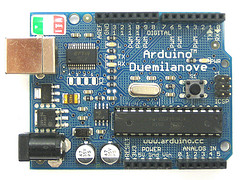
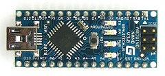
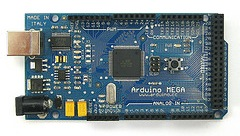
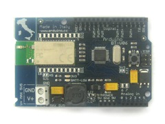
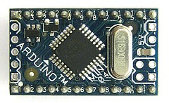
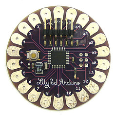
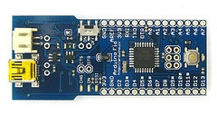
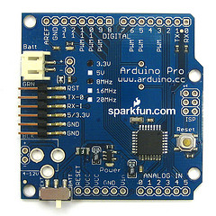
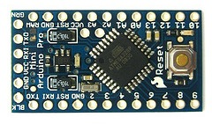

***Note: This page refers to products that are retired.***

There are multiple versions of the Arduino board. The current basic board, the Duemilanove, uses the Atmel ATmega328 ([datasheet](http://www.atmel.com/dyn/resources/prod%5Fdocuments/doc8161.pdf)). The older Diecimila, and the first run of Duemilanoves used the Atmel ATmega168 ([datasheet](http://www.atmel.com/dyn/resources/prod%5Fdocuments/doc2545.pdf)), while older boards use the ATmega8 ([datasheet](http://www.atmel.com/dyn/resources/prod%5Fdocuments/doc2486.pdf)). The Arduino Mega is based on the ATmega1280 ([datasheet](http://www.atmel.com/dyn/resources/prod%5Fdocuments/doc2549.pdf)). 

Note: The reference designs for arduino are distributed under a Creative Commons license [Attribution-ShareAlike 2.5](http://creativecommons.org/licenses/by-sa/2.5/). See [So you want to make an Arduino?](//www.arduino.cc/en/Main/Policy) for more information and guidelines on producing your own hardware.

## I/O Boards

Duemilanove - This is the latest revision of the basic Arduino USB board. It connects to the computer with a standard USB cable and contains everything else you need to program and use the board. It can be extended with a variety of shields: custom daughter-boards with specific features.

Nano - A compact board designed for breadboard use, the Nano connects to the computer using a USB Mini-B cable.

Mega - A larger, more powerful Arduino board, shield compatible with the Duemilanove and Diecmila.

Bluetooth® - The Arduino BT contains a Bluetooth® module that allows for wireless communication and programming. It is compatible with Arduino shields.

Mini - This is the smallest Arduino board. It works well in a breadboard or for applications in which space is at a premium. It connects to the computer using the Mini USB Adapter.

Mini USB Adapter - This board converts a USB connection into 5 volt, GND, TX and RX lines that you can connect to the Arduino Mini or other microcontroller.

LilyPad \- Designed for wearable application, this board can be sewn onto fabric, and is a stylish purple.

Fio - Designed for wireless applications. It includes a socket for an XBee radio, a connector for a LiPo battery, and integrated battery charging circuitry. [details](content/retired/01.boards/arduino-fio) 

Pro - This board is designed for advanced users who want to leave a board embedded in a project: it's cheaper than a Duemilanove and easily powered by a battery, but requires additional components and assembly.

Pro Mini - Like the Pro, the Pro Mini is designed for advanced users requiring a low-cost, small board and willing to do some extra work. 

Serial - It's a basic board that uses RS232 as an interface to a computer for programming or communication. This board is easy to assemble even as a learning exercise. 

Serial Single Sided - This board is designed to be etched and assembled by hand. It is slightly larger than the Diecimila, but still shield compatible. 

## Looking for an older board?

The [hardware index](content/retired/01.boards/arduino-older-boards) lists all the Arduino boards made and the differences between them.

## Shields

Shields are boards to be mounted on top of the Arduino board and that extend the functionality of Arduino to control different devices, acquire data, etc. 

* Xbee Shield - This shield allows multiple Arduino boards to communicate wirelessly over distances up to 100 feet (indoors) or 300 feet (outdoors) using the Maxstream Xbee Zigbee module.
* Motor Shield - This shield allows an Arduino board to control DC motors and read encoders.
* Ethernet Shield - This shield allows an Arduino board to connect to the internet. 

## Recommended Third-Party Hardware

Products from others that we've tried and liked; compatible with the Arduino software.

* [Boarduino](http://www.ladyada.net/make/boarduino/) from Adafruit Industries. For use in bread-boards with FTDI USB-to-TTL-Serial cable or other USB-to-serial adapter. Available as a bare PCB or in kit form.

## Other Related Hardware

Also check out the community-maintained [list of related hardware](http://www.arduino.cc/playground/Main/SimilarBoards) on the playground.