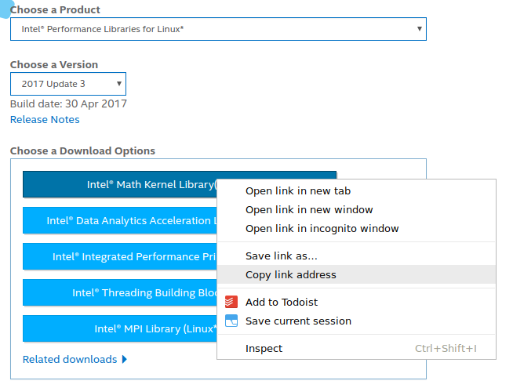
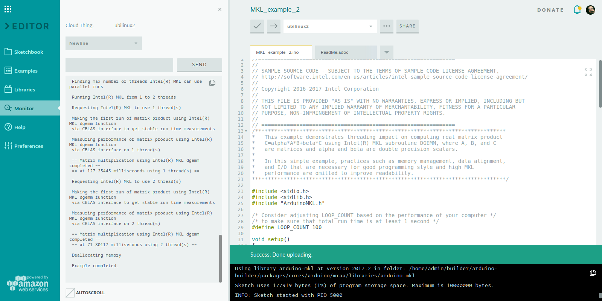

## Components and Supplies

- [UP2 Board](http://www.up-board.org/upsquared/)

## Apps and Online Services

- [Arduino Cloud Editor](https://create.arduino.cc/editor)

## About This Project

In this tutorial we'll learn how to integrate your sketch with the super-optimized Intel libraries for heavy mathematical computation (MKL for friends).

First of all, you need a suitable IoT gateway with a couple of free GB hard disk space (libraries can be heavy sometimes). Follow the Getting Started section of Create to get your Gateway up and running (choose Ubuntu distribution, for example).

### Why do I need so much space

**(AKA: how I learned to love shared libraries)**

In the Arduino world, a library is a collection of code which helps you interacting with a certain piece of hardware or perform particular operations.

On Linux, a library has the same properties, but can be shared between multiple programs. This allows saving a lot of space, since the function they contain can be used by different process at no cost.

## Setting up the Board

Libraries are usually shipped via the package manager or using an installer (we'll use the latter one in this example). First of all, access your board via ssh by using its IP address and the username/password you provided during installation. To do this, you can use Putty (if you are on Windows) or a serial terminal. The port must be set to 22 for SSH login to work properly.

Now we need to download the MKL package. Open your browser and go to [https://software.intel.com/en-us/mkl](https://software.intel.com/en-us/mkl), click "Free Download" and complete the registration process. Select "Intel Performance Libraries for Linux" and right click on "Intel Math Kernel Library", selecting "Copy link address" (or similar, depending on your browser).



Now reopen the SSH shell, type:

```arduino
wget
```

And paste the link you just copied. Press **Enter** and the download should start. Once downloaded, extract the package by typing:

```arduino
tar xvf l_mkl_2017*
```

Let's `cd` into the extract folder (typically with the same name of the downloaded package, without the extension) and type:

```arduino
./install.sh
```

Follow the on-screen instructions and after a couple of minutes your system will be ready.

## Time to Code!

Open Create with the provided example. We're going to demonstrate a very handy function of MKL library which helps parallelizing the code execution without worrying about threads or similar.

In the example, a matrix multiplication is performed using the optimized function `cblas_dgemm`included in MKL. The function is optimized for a variety of Intel hardware platforms, using the latest vectorization function available on the target CPU (AVX, SSE4 and so on).

But what happens if we have a multicore architecture? We are losing a lot of power because the function runs only on a thread, even though the problem it must solve is "splittable" into multiple, smaller problems, thus it's a perfect candidate for parallelization.

Using `mkl_set_num_threads`we can instruct the library to run on multiple threads (and cores) with no additional programming effort.

The example executes the same computation using multiple thread numbers, form 1 to the number of cores of the target CPU (could be double if HyperThreading is active) and benchmarks the various runs.


## Complete Sketch

<iframe src='https://create.arduino.cc/editor/Arduino_Genuino/f5053d38-afe9-4c59-ab94-0de193af2b4d/preview?embed&snippet' style='height:510px;width:100%;margin:10px 0' frameborder='0'></iframe>


### Let's Unleash the Monster

When ready, open the Monitor on the left panel, press "Upload" and wait a couple of seconds for upload and sketch start to happen. The output of the program will be printed on the Monitor.



## What Did We Learn?

If we take a look at the results, executing on two threads will bring almost double performances compared with single threads (on a dual core processor, of course). The performance impact in not exactly `x2` since there is a bit overhead when launching any additional thread and this penalty becomes bigger as long as the execution time is small. If most of the time is spent crunching numbers the speedup approximate the theoretical maximum.