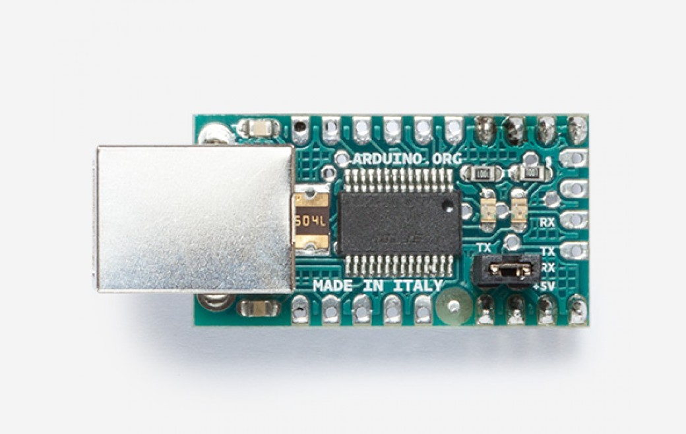

***Note: This page refers to a product that is retired.***

This board converts a **USB connection** to the 5V TX and RX an Arduino requires for communication. You can connect straight to the Arduino Mini or other microcontrollers, allowing them to talk to the computer.  
  
It is based on the **FT232RL** chip from FTDI (drivers are included with the Arduino software).