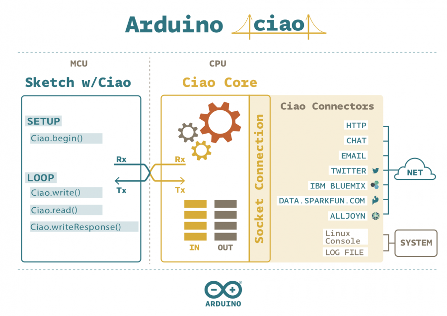

***This library is archived and is no longer being maintained. It can be still be downloaded and used, but is read-only and cannot be contributed to. For more information, you can view this repository on [GitHub](https://github.com/arduino-libraries/Ciao).***

Arduino Ciao is a easy-to-use and powerful technology that enables Arduino sketches to communicate intuitively with the "outside World". It aims to simplify interaction between microcontroller and Linino OS allowing a variety of connections with most common protocols, social networks, third-party services and applications.

Arduino Ciao - from now-on simply "Ciao" has been designed and developed to be modular and easily configurable. Its goal is to support several Connectors capable of interacting with system resources (filesystem, console, etc...) and to communicate with the most common and useful protocols (MQTT, XMPP, HTTP, SMTP, etc..) and applications (Jabber,Twitter, Facebook, etc.).

Ciao is made of two main parts:

- Ciao Library: developed in C;
- Ciao Core: developed in Python®;



This architecture is currently available on the following products:

- [Arduino Industrial 101](https://www.arduino.cc/en/Main/ArduinoBoardIndustrial101)
- [Arduino Tian](https://www.arduino.cc/en/Main/ArduinoBoardTian)
- [Arduino Yún LininoOS](https://www.arduino.cc/en/Main/ArduinoBoardYun)
- [Arduino Yún Mini](https://www.arduino.cc/en/Main/ArduinoBoardYunMini)

## Ciao Core
To communicate with the "outside world" the Ciao Library interacts with Ciao Core: the key component of the Ciao technology on the MPU (microprocessor) side. Ciao Core runs over Linino OS, it is developed in Python® and it has been designed to enable communication with "outside world" via several modules called Connectors. Such connectors communicate with Ciao Core using JSON strings sent over a TCP socket.

Ciao Core, thanks to this smart and effective design, is able to:

- interact with as many connectors as you can possibly imagine;
- support connectors written in any programming language available on Linino OS.
## Connectors

A Connector is a standalone module that on one hand communicates with Ciao Core to send/receive data to/from the microcontroller, and on the other connects to external services and/or applications through specific protocols. Connectors are the tools of Ciao to connect to the World. Main Connectors like RestServer, Shell, MQTT are pre-installed with Ciao, other connectors and Third party connectors are available in the Connectors Repository, and installable via opkg, see the installation section for more information.

## Examples
- [MQTTBluemix](https://www.arduino.cc/en/Tutorial/CiaoMQTTBluemix) : Sends via MQTT brightness and temperature information that will be shown graphically in the blueMix IBM system


## Internal connectors
---

### `Rest connector`
#### Description 
This connector allows to make “http” requests. Below the steps that you should follow to use the Rest connector:

- setup Rest connector;
- enable the connector;
- write a simple sketch;
- upload the sketch and enjoy.
#### Setup Connector
You can find Rest Connector configuration file at the following path: /usr/lib/python2.7/ciao/connectors/rest/rest.json.conf
```
{
 "name" : "rest",
 "description" : "REST connector for the Ciao Core",
 "authors": ["Arduino Team <swdev@arduino.org>;"],
 "repository" : "https://github.com/arduino-org/Ciao",
 "version" : "0.0.1",
 "params" : {
             }
}
```
The parameters at the beginning are for internal use, do NOT edit them (name, description, version, ciao) unless you know exactly what you are doing.

The configurable part is the one identified by "params" key: In this Connector there aren’t parameters to set.

#### Enable Connector
Each Ciao connector must have a configuration file for the Ciao Core, this simple file is mandatory to enable the connector.

To enable Rest connector please edit the file at the following path: /usr/lib/python2.7/ciao/conf/rest.ciao.json.conf
```
{
 "name" : "rest",
 "enabled": true,
 "type" : "managed",
 [...]
}
```
The key enabled must be set to true (boolean value). This is the only parameter you are required to edit in order to enable the Rest Connector. Once done Ciao Core will be ready and configured to use Rest Connector.

#### Example
```
#include <Wire.h>
#include <Ciao.h>
#define CONNECTOR     "rest"
#define SERVER_ADDR   "192.168.1.1" // change ip address with your server ip address
int buttonState; //this variable tracks the state of the button, low if not pressed, high if pressed
int ledState = HIGH; //this variable tracks the state of the LED, negative if off, positive if on
long lastDebounceTime = 0;  // the last time the output pin was toggled
long debounceDelay = 50;    // the debounce time; increase if the output flickers
String command = "/arduino/mode/13/output";
int previous_value = LOW;
void setup() {
  Ciao.begin();
  Ciao.write(CONNECTOR, SERVER_ADDR, command);
  pinMode(2, INPUT);
}
void loop() {
  //sample the state of the button - is it pressed or not?
  buttonState = digitalRead(2);
  //filter out any noise by setting a time buffer
  if ( (buttonState == HIGH) && (previous_value == LOW) && (millis() - lastDebounceTime) > debounceDelay ) {
    if (ledState == HIGH) {
      command = "/arduino/digital/13/0";
      ledState = LOW;
    }
    else {
      command = "/arduino/digital/13/1";
      ledState = HIGH;
    }
    lastDebounceTime = millis(); //set the current time
    CiaoData data = Ciao.write(CONNECTOR, SERVER_ADDR, command);
    if (!data.isEmpty()) {
      Ciao.println( "State: " + String (data.get(1)) );
      Ciao.println( "Response: " + String (data.get(2)) );
    }
    else {
      Ciao.println ("Write Error");
    }
  }
  previous_value = buttonState;
}
```

---

### `Rest Server connector`
#### Description 
This connector allows to make “http” requests. Below the steps that you should follow to use the Rest connector:

- setup Rest Server connector;
- enable the connector;
- write a simple sketch;
- upload the sketch and enjoy.
#### Setup Connector
You can find Rest Server Connector configuration file at the following path: /usr/lib/python2.7/ciao/connectors/restserver/restserver.json.conf
```
{
 "name" : "restserver",
 "description" : "REST server connector for the Ciao Core",
 "authors": ["Arduino Team <swdev@arduino.org>;"],
 "repository" : "https://github.com/arduino-org/Ciao",
 "version" : "0.0.2",
 "params" : {
            "port" : 80
             },
 "log" : {
         "level" : "info"
         }
}
```
The parameters at the beginning are for internal use, do NOT edit them (name, description, version, ciao) unless you know exactly what you are doing.

The configurable part is the one identified by "params" key:

- “port”: specifies the communication port. Default the port is number 80 but the advanced users can change it to speed up the communication
#### Enable Connector
Each Ciao connector must have a configuration file for the Ciao Core, this simple file is mandatory to enable the connector.

To enable Rest Server connector please edit the file at the following path: /usr/lib/python2.7/ciao/conf/restserver.ciao.json.conf
```
{
 "name" : "restserver",
 "enabled": true,
 "type" : "managed",
 [...]
}
```
The key enabled must be set to true (boolean value). This is the only parameter you are required to edit in order to enable the Rest Server Connector. Once done Ciao Core will be ready and configured to use Rest Server Connector.

#### Example
```
/*
  supported boards:Yun,Tian.
  Possible commands to send from the xmpp client:
  "/arduino/digital/PIN"       -> to read a digital PIN
  "/arduino/digital/PIN/VALUE"-> to write a digital PIN (VALUE:1/0)
  "/arduino/analog/PIN/VALUE"  -> to write in a PWM PIN(VALUE rang:0-255);
  "/arduino/analog/PIN"        -> to read a analog PIN
  "/arduino/servo/PIN/VALUE"   -> to write angle in a SERVO PIN(VALUE range:0-180);
  "/arduino/mode/PIN/VALUE"    -> to set the PIN mode (VALUE: input / output)
  Example:
  "/arduino/mode/13/output"-> pinMode(13, OUTPUT)
  "/arduino/digital/13/1"     -> digitalWrite(13, HIGH)
*/

#include<Ciao.h>
#include<Servo.h>
Servo servo;

void setup() {
  Ciao.begin();
}

void loop() {
  CiaoData data = Ciao.read("restserver");
  if (!data.isEmpty()) {
    String id = data.get(0);
    String sender = data.get(1);
    String message = data.get(2);
    message.toUpperCase();
    String command[3];
    splitString(message, "/", command, 3);
    execute(command, id);
  }
}

void execute(String cmd[], String id) {
  if (cmd[0] == "DIGITAL") {
    digitalCommand(cmd, id);
  }
  elseif(cmd[0] == "ANALOG") {
    analogCommand(cmd, id);
  }
  elseif(cmd[0] == "SERVO") {
    servoCommand(cmd, id);
  }
  elseif(cmd[0] == "MODE") {
    setMode(cmd, id);
  }
  else
    Ciao.writeResponse("restserver", id, "sorry, i don't understand :(");
}

void servoCommand(String cmd[], String id) {
  int pin, value;
  pin = (cmd[1]).toInt();
  if (cmd[2] != "-1") {
    value = (cmd[2]).toInt();
    if (value <= 180 && value >= 0) {
      servo.attach(pin);
      servo.write(value);
      Ciao.writeResponse("restserver", id, "Servo D" + String(pin) + " set to " + String(value) + " degrees");
    }
    else
      Ciao.writeResponse("restserver", id, "Invalid angle value");
  }

  else
    Ciao.writeResponse("restserver", id, "Invalid command");
}

void digitalCommand(String cmd[], String id) {
  int pin, value;
  pin = (cmd[1]).toInt();
  if (cmd[2] != "-1") {
    value = (cmd[2]).toInt();
    digitalWrite(pin, value);
    if (value == 1)
      Ciao.writeResponse("restserver", id, "Pin D" + String(pin) + " ON");
    elseif(value == 0)
    Ciao.writeResponse("restserver", id, "Pin D" + String(pin) + " OFF");
  }
  elseif(cmd[2] == "-1") {
    value = digitalRead(pin);
    Ciao.writeResponse("restserver", id, "D" + String(pin) + " value = " + String(value));
  }
}

void analogCommand(String cmd[], String id) {
  int pin, value;
  pin = (cmd[1]).toInt();
  if (cmd[2] != "-1") {
    value = (cmd[2]).toInt();
    analogWrite(pin, value);
    Ciao.writeResponse("restserver", id, "D" + String(pin) + " set to analog");
  }
  elseif(cmd[2] == "-1") {
    value = analogRead(pin);
    Ciao.writeResponse("restserver", id, "A" + String(pin) + " value = " + String(value));
  }
}

void setMode(String cmd[], String id) {
  int pin;
  pin = (cmd[1]).toInt();
  if (cmd[2] == "INPUT") {
    pinMode(pin, INPUT);
    Ciao.writeResponse("restserver", id, " pin D" + String(pin) + " set in INPUT mode");
    return;
  }
  if (cmd[2] == "OUTPUT") {
    pinMode(pin, OUTPUT);
    Ciao.writeResponse("restserver", id, " pin D" + String(pin) + " set in OUTPUT mode");
    return;
  }
  Ciao.writeResponse("restserver", id, "invalid mode");
}
```

---

### `File System connector`
#### Description 
This Connector allows to read and write a file on Linux side from an Arduino sketch. Below the steps that you should follow to use the File connector:

- setup File connector;
- enable the connector;
- write a simple sketch;
- upload the sketch and enjoy.
#### Setup Connector
You can find File Connector configuration file at the following path: /usr/lib/python2.7/ciao/connectors/file/file.json.conf
```
{
 "name" : "file",
 "description" : "File System connector for Ciao",
 "authors": ["Arduino Team <swdev@arduino.org>;"],
 "repository" : "https://github.com/arduino-org/Ciao",
 "version" : "0.0.1",
 "params" : {
              "root" : "/root",
              "eol" : "\n",
              "read_line" : false,
              "read_max_size" : 1024,
              "default_write_access_mode" : "w"
            },
 "log" :{
          "level" : "debug"
         }
}
```
The parameters at the beginning are for internal use, do NOT edit them (name, description, version, ciao) unless you know exactly what you are doing.

The configurable part is the one identified by "params" key:

- “root”: specifies the starting directory for relative Path.
- “eol”: specifies the End of Line symbol.
- “read_line”: specifies how to read the file, line by line (true) or entire (false).
- “read_max_size”: specifies the maximum value that it can be read each time.
- “default_write_access_mode”: specifies the write access mode, w to overwrite the file, instead a to write in append mode.
#### Enable Connector
Each Ciao connector must have a configuration file for the Ciao Core, this simple file is mandatory to enable the connector.

To enable File connector please edit the file at the following path: /usr/lib/python2.7/ciao/conf/file.ciao.json.conf
```
{
 "name" : "file",
 "enabled": true,
 "type" : "managed",
 [...]
}
```
The key enabled must be set to true (boolean value). This is the only parameter you are required to edit in order to enable the File Connector. Once done Ciao Core will be ready and configured to use File Connector.

#### Example
```
#include <Ciao.h>
int buttonPin = 5;
int pressed = 0;
void setup() {
  //init Ciao
  Ciao.begin();
  pinMode(buttonPin, INPUT);
}
void loop() {
  //Read digital input
  pressed = digitalRead(buttonPin);
  //Write value into a file in root folder. Root folder is specified into the connector
  //configuration file: /usr/lib/python2.7/ciao/connectors/file/file.json.conf
  //Else you can specify the absolute path for the file, eg: /tmp/my-file.log
  Ciao.write("file", "button.txt", (String)pressed, "w");
  //Delay the operations because IO is slow
  delay(1000);
}
```

---

### `Shell connector`
#### Description 
This Connector allows to execute Shell commands for Linux side from an Arduino sketch. Below the steps that you should follow to use the File connector:

- setup Shell connector;
- enable the connector;
- write a simple sketch;
- upload the sketch and enjoy.
#### Setup Connector
You can find File Connector configuration file at the following path: /usr/lib/python2.7/ciao/connectors/shell/shell.json.conf
```
{
 "name":"shell",
 "description":"Shell connector for the Ciao Core",
 "authors":["Arduino Team <swdev@arduino.org>;"],
 "repository":"https://github.com/arduino-org/Ciao",
 "version":"0.0.1",
 "params": {
                  "working_directory":"/root",
                  "read_max_size":1024
                  },
 "log":{
          "level":"debug"
          }
}
```
The parameters at the beginning are for internal use, do NOT edit them (name, description, version, ciao) unless you know exactly what you are doing.

The configurable part is the one identified by "params" key:

- “working_directory”: specifies the current working directory from where the command is executed.
- “read_max_size”: specifies the max byte value that Connector can read.
#### Enable Connector
Each Ciao connector must have a configuration file for the Ciao Core, this simple file is mandatory to enable the connector.

To enable Shell connector please edit the file at the following path: /usr/lib/python2.7/ciao/conf/shell.ciao.json.conf
```
{
 "name":"shell",
 "enabled":true,
 "type":"managed",
 [...]
}
```
The key enabled must be set to true (boolean value). This is the only parameter you are required to edit in order to enable the Shell Connector. Once done Ciao Core will be ready and configured to use Shell Connector.

#### Example
```
#include <Ciao.h>

void setup() {
  //init Ciao
  Ciao.begin();
  Serial.begin(9600);
}
void loop() {
  //Run commands in Linino OS to get date
  CiaoData data = Ciao.write("shell", "date");
  if (!data.isEmpty()) {
    //Get data back
    String usage = data.get(2);
    Serial.println(usage);
  }
  delay(10000);
}
```

---

### `MQTT connector`
#### Description 
This Connector allows to communicate using MQTT in an Arduino sketch. Below the steps that you should follow to use the MQTT connector:

- setup Shell connector;
- enable the connector;
- write a simple sketch;
- upload the sketch and enjoy.
#### Setup Connector
You can find MQTT Connector configuration file at the following path: /usr/lib/python2.7/ciao/connectors/mqtt/mqtt.json.conf
```
{
 "name" : "mqtt",
 "description" : "MQTT (v3.1) connector for Ciao Core",
 "version" : "0.0.1",
 "ciao": {
 "host" : "127.0.0.1",
 "port" : 8900
 },
 "params" : {
 "host" : "YOUR_MQTT_IP_OR_HOSTNAME",
 "port" : 1883,
 "username" : "USERNAME_IF_REQUIRED",
 "password" : "PASSWORD_IF_REQUIRED",
 "clean_session": true,
 "qos": 2,
 "subscribed_topic": [ "TOPIC_TO_SUBSCRIBE" ],
 "client_id": "",
 "lwt_topic": "",
 "lwt_message": ""
 }
}
```
The parameters at the beginning are for internal use, do NOT edit them (name, description, version, ciao) unless you know exactly what you are doing.

The configurable part is the one identified by "params" key:

- host (required): the IP or the hostname of the MQTT server you want to use (must be a string)
- port (required): specifies the port your MQTT server is listening to (must be an integer)
- username and password: provide username to use on the board and its password (must be string)
- clean_session: (boolean) specifies if it needs to delete the pending messages relative to a previous session. Default is set TRUE.
- qos: (integer) default this value is set 2, lower values improve the efficiency but increases latency.
subscribed_topic (required): specifies the topic that it need to execute via MQTT.
- client_id (required): specifies an username, it must be univocal.
- lwt_topic: (last will testament topic) specifies a topic where it will be written a message if you are disconnected.
- lwt_message: (last will testament message): specifies a message that it will be written if you are disconnected.
#### Enable Connector
Each Ciao connector must have a configuration file for the Ciao Core, this simple file is mandatory to enable the connector.

To enable MQTT connector please edit the file at the following path: /usr/lib/python2.7/ciao/conf/mqtt.ciao.json.conf
```
{
 "name" : "mqtt",
 "enabled": true,
 "type" : "managed",
 [...]
}
```
The key enabled must be set to true (boolean value).

This is the only parameter you are required to edit in order to enable the MQTT connector. Once done your LininoOS will be ready and configured to use Ciao Core and MQTT connector.

#### Example
```
#include <Ciao.h>

#define LED 13
String TOPIC = "topic_subscribed";

void setup() {
  pinMode(LED, OUTPUT);
  Ciao.begin();
}

void loop() {

  CiaoData data = Ciao.read("mqtt");

  if (!data.isEmpty() && !data.isError()) {

    String id = data.get(0);
    String sender = data.get(1);
    String message = data.get(2);

    message.toLowerCase();

    if (message == "ciao" )
      Ciao.write("mqtt", TOPIC, "Hello, i'm Arduino :-) ");
    else if ( message == "led on") {
      digitalWrite(LED, HIGH);
      Ciao.write("mqtt", TOPIC, "LED ON");
    }
    else if ( message == "led off") {
      digitalWrite(LED, LOW);
      Ciao.write("mqtt", TOPIC, "LED OFF");
    }
    else
      Ciao.write("mqtt", TOPIC, "Sorry i don't understand :-( ");
  }
}
```

## External Connectors 

---

### `XMPP connector`
#### Description 
This Connector allows to communicate using XMPP in an Arduino sketch. Below the steps that you should follow to use the XMPP connector:

- setup Shell connector;
- enable the connector;
- write a simple sketch;
- upload the sketch and enjoy.
#### Setup Connector
You can find XMPP configuration file at the following path: /usr/lib/python2.7/ciao/connectors/xmpp/xmpp.json.conf
```
{
 "name" : "xmpp",
 "description" : "XMPP connector for the Ciao Core",
 "version" : "0.0.1",
 "ciao": {
 "host" : "127.0.0.1",
 "port" : 8900
 },
 "params" : {
 "host" : "YOUR_XMPP_IP_OR_HOSTNAME",
 "domain" : "ACCOUNT_DOMAIN",
 "port" : 5222,
 "username" : "USERNAME",
 "password" : "PASSWORD",
 "tls" : false,
 "ssl" : false
 }
}
```
The parameters at the beginning are for internal use, do NOT edit them (name, description, version, ciao) unless you know exactly what you are doing.

The configurable part is the one identified by "params" key:

- host (required): the IP or the hostname of the XMPP server you want to use (must be a string)
- domain: specifies the domain for the user you want the board to use, really useful if you are using an XMPP server that support multiple domains (must be a string)
- port (required): specifies the port your XMPP server is listening to (must be an integer)
- username and password (both required): provide username - without domain - to use on the board and its password (must be string)
- tls: establishes if TLS must be used (boolean)
- ssl: establishes if SSL must be used (boolean)
#### Enable Connector
Each Ciao connector must have a configuration file for the Ciao Core, this simple file is mandatory to enable the connector.

To enable XMPP connector please edit the file at the following path: /usr/lib/python2.7/ciao/conf/xmpp.ciao.json.conf
```
{
 "name" : "xmpp",
 "enabled": true,
 "type" : "managed",
 [...]
}
```
The key enabled must be set to true (boolean value).

This is the only parameter you are required to edit in order to enable the XMPP connector. Once done your LininoOS will be ready and configured to use Ciao Core and XMPP connector.

#### Example
```
/*
  Arduino Ciao example

  This sketch uses ciao xmpp connector. It sends back “hello world” message to the xmpp client when receives “ciao” from it.

  Be sure to set the xmpp client in the "USER" field used to receive the response by MCU.

  Possible commands to send from the xmpp client:
   "ciao" -> random answers in 5 different languages
*/

#include <Ciao.h>

#define LED 13
String USER = "user@domain";;

void setup() {
  pinMode(LED, OUTPUT);
  Ciao.begin();
}

void loop() {

  CiaoData data = Ciao.read("xmpp");

  if (!data.isEmpty() && !data.isError()) {

    String id = data.get(0);
    String sender = data.get(1);
    String message = data.get(2);

    message.toLowerCase();

    if (message == "ciao" )
      Ciao.write("xmpp", USER, "Hello, i'm Arduino :-) ");
    else if ( message == "led on") {
      digitalWrite(LED, HIGH);
      Ciao.writeResponse("xmpp", id, "LED ON");
    }
    else if ( message == "led off") {
      digitalWrite(LED, LOW);
      Ciao.writeResponse("xmpp", id, "LED OFF");
    }
    else
      Ciao.write("xmpp", USER, "Sorry i don't understand :-( ");
  }
}
```

## Functions
---

### `Ciao.begin()`
#### Description 
Initializes the Ciao communication.

#### Syntax
```
Ciao.begin();

Returns
None

```
#### Example
```
#include <Ciao.h>

int ctrl=0;
void setup()
{
 Ciao.begin(); //Start the serial connection with the computer
 //to view the result open the serial monitor
 pinMode(9,OUTPUT);
}

void loop() // run over and over again
{
 //getting the voltage reading from the temperature sensor
 int readingTemp = analogRead(A0);
 // converting readingTemp to voltage
 float voltage = readingTemp * 4.56;
 voltage /= 1024;
 // now print out the temperature
 float temperatureC = (voltage - 0.5) * 100 ;
 int readingLum = analogRead(A2);

 analogWrite(9,map(readingLum,0,1023,0,255));

 if (ctrl>=10){
 Ciao.write("mqtt","iot-2/evt/status/fmt/json","{\"d\": {\"temperature\":"+String(temperatureC)+",\"luminosity\":"+String(readingLum)+"}}");
 ctrl=0;
 }
 ctrl++;
 delay(100);
}
```

---

### `Ciao.read()`
#### Description 
The read function is usually used to receive data from the specified connector. It returns a CiaoData object. It accepts three optional parameters that could be used by the connector to customize and process the read request.

#### Syntax
```
read(connector [, param 1] [, param 2] [, param 3])

Returns
The requested data

```
#### Example
```
CiaoData data =Ciao.read("restserver");
```

---

### `Ciao.write()`
#### Description 
The write function is usually used to send data outside the mcu through the specified connector. It returns a CiaoData object. It accepts three optional parameters that could be used by the connector to customize and process the write request.

#### Syntax
```
write(connector [, param 1] [, param 2] [, param 3])

Returns
None

```
#### Example
```
Ciao.write("file","button.txt","Hello!","w");
```

---

### `Ciao.writeResponse()`
#### Description 
The writeResponse function is used to send a response to a specific connector request. The request is identified by the id. The id is part of CiaoData object coming from a call to read or write.

#### Syntax
```
writeResponse(connector, id [, param 1] [, param 2] [, param 3])

Returns
None

```
#### Example
```
CiaoData data = Ciao.read("restserver");

if(!data.isEmpty()){
  String id = data.get(0);
  String request = data.get(2);
  Ciao.writeResponse("restserver", id,"Request received: "+ request);
   }
```

---

### `Ciao.get()`
#### Description 
The get function returns a string used to extract data from the CiaoData object. CiaoData could contains more than one information and all of these information are accessible through the index parameter. Data and information extracted and the index number depends on how the specified connector is implemented. See Connectors to know the meaning of each index.

#### Syntax
```
data.get(index);

Returns
The data at the selected index

```
#### Example
```
if(data.isError()){
  String id = data.get(0);
  String error = data.get(2);
  Serial.println("Error:" + error);
  }
```

---

### `Ciao.isError()`
#### Description 
The isError function enables the user to check if the CiaoData object contain an error code. Returns true if the operation failed or false if not. If the operation failed, the error message is available at index #2 through the get function.

#### Syntax
```
data.isError()

Returns
True if an error is detected, false otherwise

```
#### Example
```
if(data.isError()){
  String id = data.get(0);
  String error = data.get(2);
  Serial.println("Error:" + error);
}
```

---

### `Ciao.isEmpty()`
#### Description 
The isEmpty function enables the user to check if the CiaoData object is empty. Returns true if the operation isn’t yet completed by the connector, or false if the operation is completed and data is available.

#### Syntax
```
data.isEmpty();

Returns
True in case of empty data, false otherwise

```
#### Example
```
if(data.isError()){
  String id = data.get(0);
  String error = data.get(2);
  Serial.println("Error:" + error);
  }
```

---

### `Ciao.splitString()`
#### Description 
The splitString function enables the user to manage the MCU command sent by the connector. The function accepts up four parameters, the first is the serial command for the MCU, the second parameter is the character that should be used to split the serial command, while the third and fourth parameter are respectively, the array of strings used to split the serial command received and the size of the array itself .

#### Syntax
```
data.get(string, divisor, array, size);

Returns
The data at the selected index

```
#### Example
```
#include<ciao.h>

void setup() {
  Ciao.begin();
  Serial.begin(57600);
  }

void loop() {
  CiaoData data = Ciao.read("xmpp");
  String id = data.get(0);
  String sender = data.get(1);
  String message = data.get(2);
  String command[3];
  splitString(message,"/",command,3);
  Serial.println("command type: "+command[0])
  //output is digital Serial.println("pin: "+command[1])
  //output is 13 Serial.println("pin value: "+command[2]))
  //output is 1
   }
```