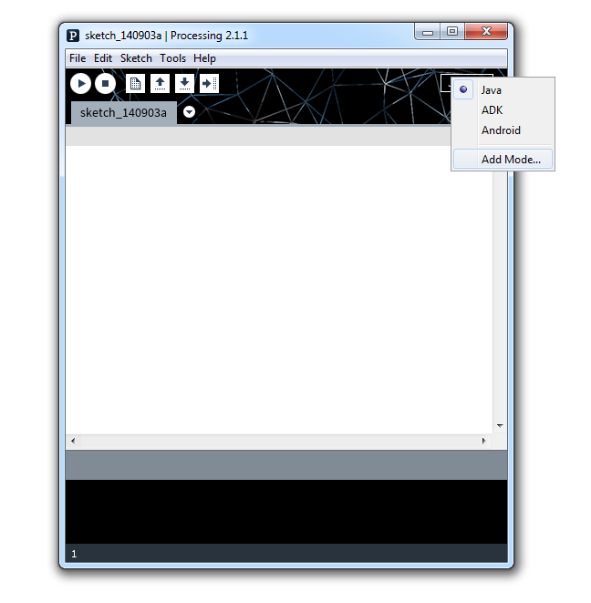
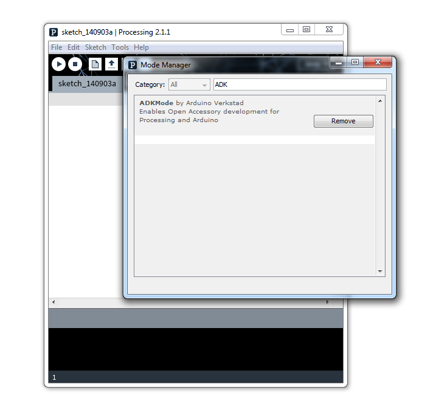
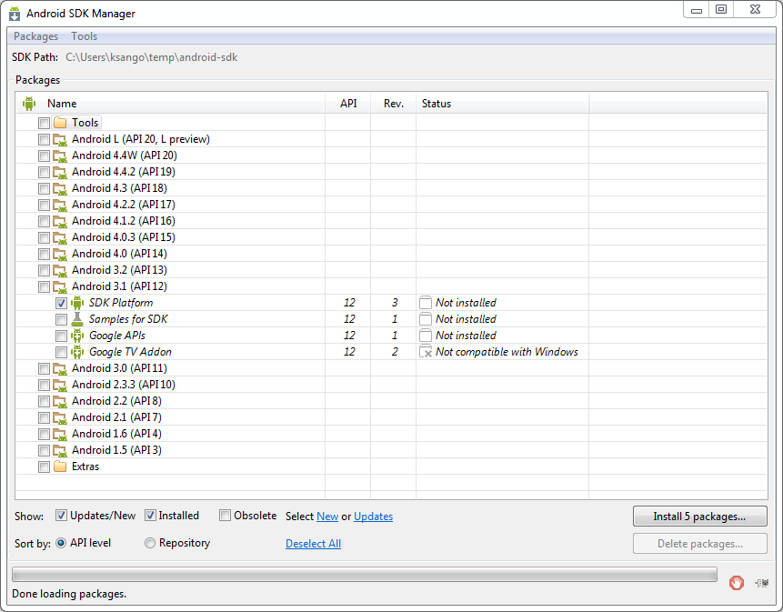
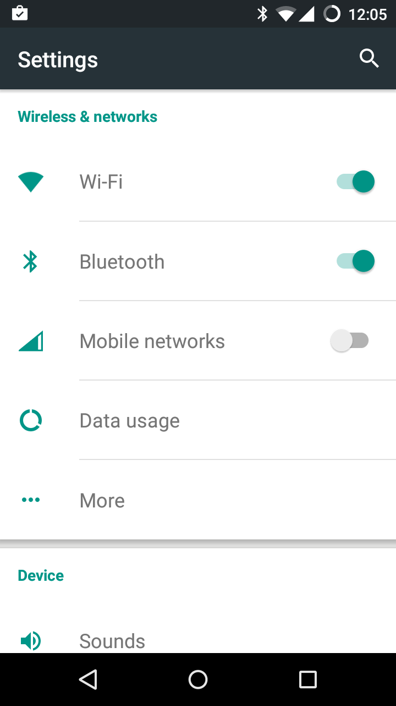
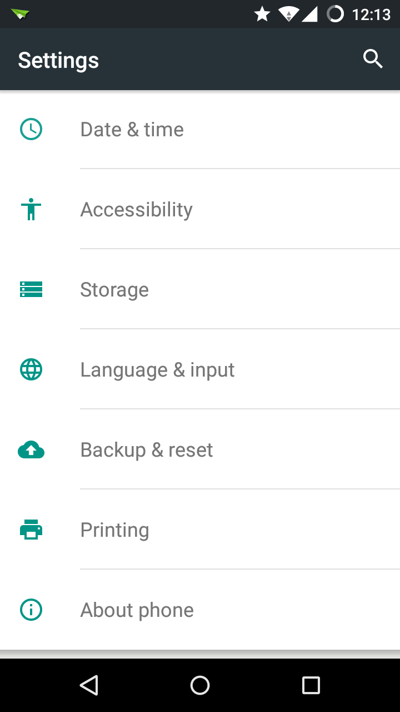
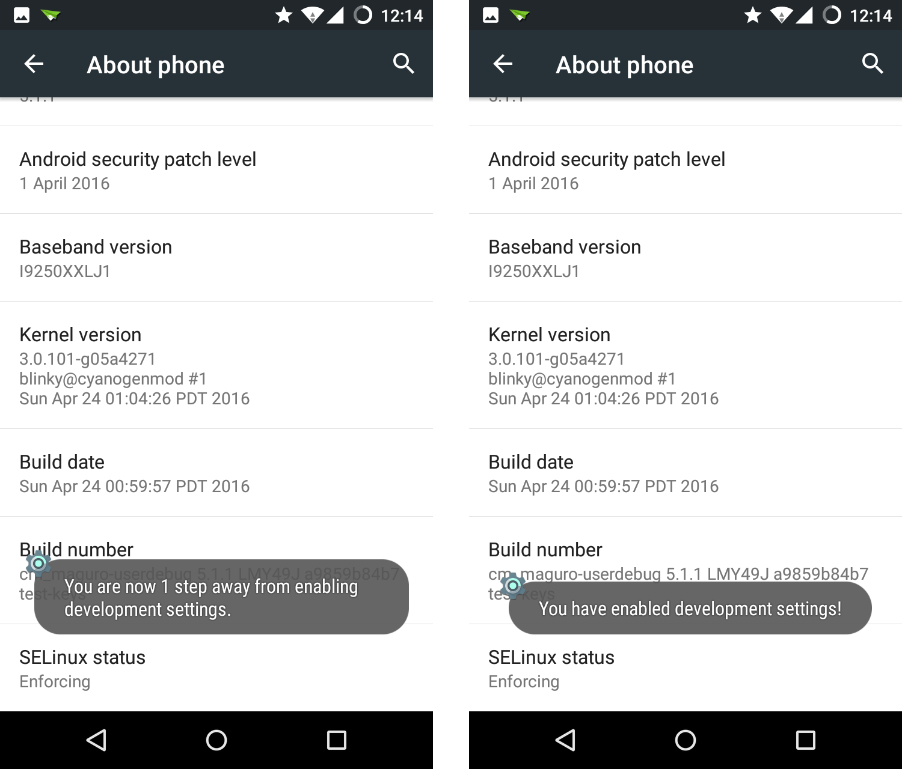
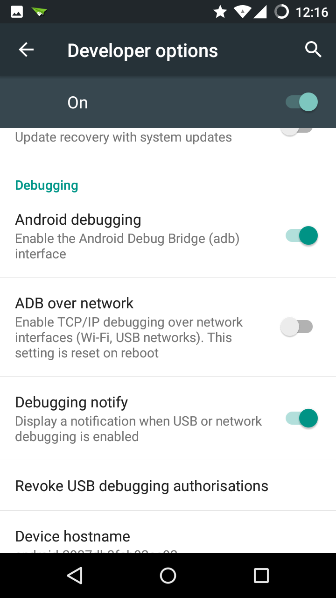
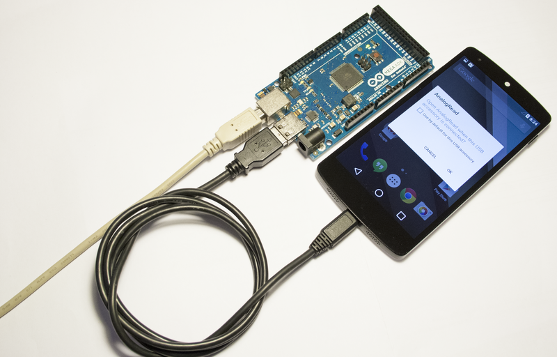
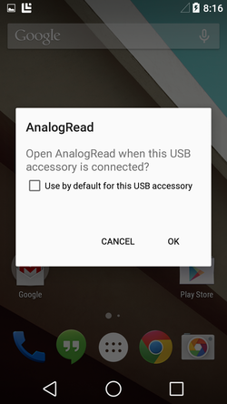
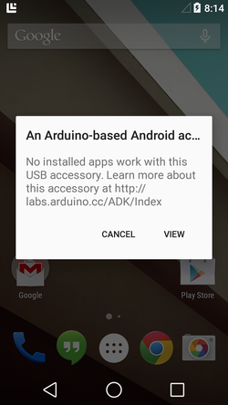

**This is a retired product and the information given could be inaccurate or obsolete. It is supplied AS IS for documentation purposes**

This guide describe how to connect an Android™ device to an Arduino ADK board ([Mega ADK](https://arduino.cc/en/Main/ArduinoBoardMegaADK) and [USB Host shield](https://arduino.cc/en/Main/ArduinoUSBHostShield)). Furthermore, we have tried to make it as easy as possible by concentrating in the use of Processing instead of Eclipse as the tool of choice for writing the Android Apps.

Here you can learn how to connect Arduino to Android™ via the USB cable the phone (or tablet) uses for data transfers as well as for recharging its battery. You might be interested in using Bluetooth® as an alternative to get Arduino and the Android artifact to talk to each other.

### Phones, Tablets & Connection Strategies

Before moving any further, you need to understand which the connection capabilities of your Android™ device are. It depends not only on the hardware configuration of your device, but also on the software you have running on it.

It is very hard to trace all the possible Android™ devices with all the existing OS versions and mods. Therefore we are going to concentrate in phones that haven't been rooted and have official updates. This doesn't mean the following explanations couldn't work for your device and we will be more than happy to list your configuration for others to know.

The different configurations listed in this table are Accessory Development Kit (ADK) which uses the Open Accessory library which lets Arduino act as the USB Host. The unofficial USB connection between an Arduino board and an Android™ device is built using sockets on top of the Android Debug Bridge (ADB) and may not be as stable as the ADK. USB Host is the standard USB connection where the Android™ device acts as the USB Host.
**Table 1: Configuration options**

| Android™ OS             | ADK             | ADB             | BT              | USB HOST        |
| ------------------------------ | --------------- | --------------- | --------------- | --------------- |
| OS < 2.2 (pre Froyo)           |                 |  |                 |                 |
| 2.3.3 ≥ OS ≥ 2.2 |                 |  |  |                 |
| OS ≥ 2.3.4 (phones)     |  |  |  |                 |
| OS ≥ 3.1 (tablets)      |  |  |  |  |

### Running Examples in ADK Mode

The examples for ADK Mode for Processing has been developed and tested on the Arduino [Mega ADK](https://arduino.cc/en/Main/ArduinoBoardMegaADK), but should work for other similar Open Accessory enabled boards as well for. The ADK mode requires the following hardware and software:

- An Arduino ADK compatible board or shield.

- Nexus 5, Nexus 7, Samsung Galaxy S5 or any other device supporting Open Accessory mode, most devices today support it. (refer to Table 1)

- Android™ SDK with all the updates up to the latest version of the APIs
- Processing 2.2.1 or newer.

- Arduino 1.0 or newer.

- the USB-ADK library for Arduino (includes the AndroidAccessory class).

- Arduino ADK Mode for Processing.

**Note**: Nexus 4 is confirmed that doesn't work with Open Accessory

### Installing the SDK and Getting Started with Development

#### Installation in Processing

There are two ways of installing the ADK Mode in Processing, through the Mode Manager and manually. To install it using Mode Manager in Processing, follow these steps:

1. Open the Mode Menu in the top right corner of your Processing IDE and select "Add Mode...", see Figure 1.

Figure 1: Locate the Mode Menu in Processing ID

Search for ADK in the textbox and select install, as shown in Figure 2.

Figure 2: Find the ADK Mode and select install

If the Mode Manager doesn't work for you, you always have the option of installing the mode manually. Follow these steps to install it manually:

1. Download the AdkMode.zip from [http://processing.arduino.cc/AdkMode.zip](http://processing.arduino.cc/AdkMode.zip) to a known location on your computer

2. Unzip the downloaded file, you should now have a folder called `AdkMode`

3. Locate your Processing sketchbook. Within it, there should be a folder called `modes`. Move your `AdkMode` folder here.

4. Restart Processing if it was open.

#### Installation in Arduino

You also need to download and install the Arduino libraries for Open Accessory. Follow these steps:

1. Download the `UsbHost.zip` file from [http://processing.arduino.cc/UsbHost.zip](http://processing.arduino.cc/UsbHost.zip)

2. Unzip this file, you should get a folder called `USB-ADK`

3. Move this folder to your Arduino Sketchbook libraries folder.

4. Restart Arduino if it was open

#### Installing the Android SDK

Before you can start working with the ADK Mode you'll need to also install the Android SDK. The Android SDK contains all the bells and whistles that make up an Android application - currently there are 18 different SDK versions available, you only need one of these to develop an application.

While the standard Processing Android Mode requires only version 10 (Android version 2.3.3) the ADK Mode requires version 12. This is because Open Accessory was first introduced in version 12 (the big "tablet" version).
The attentive reader who have researched Open Accessory already will have noticed that there is a way of getting Open Accessory working with version 10, however it is an add-on library which actually corresponds to version 2.3.4 of Android™.

To install the proper Android SDK version, follow these steps:

1. Download the Android SDK For An Existing IDE from [http://developer.android.com/sdk/index.html](http://developer.android.com/sdk/index.html)

2. Run the installer, or unzip the archive, depending on your computers operating system.

3. Open the SDK Manager and install Android 3.1, as shown in Figure 3.

Figure 3: Install Android 3.1

If you are working on a Windows computer you may need to run the SDK Manager as Administrator depending on where you choose to install the android SDK tools.

4. When you click Install you will be presented with a dialog asking you to confirm License agreements - either read them thoroughly or just choose Accept License and click Install.

### Working with real Android devices

When developing normal Android™ applications you always have the option of working towards an Android™ Emulator rather than a real device. However, there are some things the Emulator can't do, usually these things are related to hardware.

Open Accessory works with the standard USB port on your device and changes the way it internally works, the device can take both the Host and the Device roles. This is part of the On-The-Go (OTG) specification released in 2001. All this means that you need to have a real Android device to work with Open Accessory and ADK.

#### Enable Developer Mode on the phone

To work with real devices you first need to enable them as development devices, the procedure for enabling a device may vary from one vendor to another. The following instructions are applicable to stock Android™ devices such as the Nexus 5.

1. Open the settings application, see Figure 4.

Figure 4: Open settings

2. Select About Phone, as shown in Figure 5.

Figure 5: Select About Phone

3. Tap repeatedly on Build number until you receive the information that you are now a developer, see Figure 6.

Figure 6: Tap repeatedly on Build number

4. Go back one step and enter Developer Options, inside select the Android Debugging checkbox as shown in Figure 7.

Figure 7: Enable Android Debugging (adb)

You should now have a device that has ADB debugging enabled over USB. This means that the Android Debug Bridge is open and that you have access to the device (although limited) and can install unsigned applications directly to it from Processing.

### Installing the Drivers for your Phone

Depending on your operating systems you need to perform some different configurations on your computer before you can develop on your device.

#### Windows

Download the USB drivers for your device, for more information see the [OEM USB page](http://developer.android.com/tools/extras/oem-usb.html) on the Android website.

#### Mac OS

Mac users will probably not need to do any configurations at all, just plug your developer enabled device to your computer.

#### Linux

Linux users will need to modify their UDEV rules to match the id of the device vendor. Another option, if the UDEV rules do not work is adding the vendor id to the adb_usb.ini file which is located in your ~/.android/ folder. Read more [here](http://developer.android.com/tools/device.html#setting-up)

### The Development Process

Developing for Open Accessory and ADK is a little bit special, there are a few things you should keep in mind.

1. Installing a Processing app on the Android™ device will open the app, before you connect the Android™ device to your Arduino board you should close the application completely by pressing back.

**Note**: Hitting "Home" on the device does not close the application, it merely pauses it's execution.

2. Since the USB port is disconnected from your development environment you can't expect to get any use from the logcat, however the messages sent to logcat do survive the connections and when you've connected the Android device back to the computer you may read the messages using the terminal command `adb -d logcat`.

### Testing the Analog Read example

To test the available example/s follow these steps:

To test the available example/s follow these steps:

1. Open Processing, and switch to Adk Mode if it's not already enabled.

2. From the File menu, select Examples...

3. There are two categories, the **Basics** show who to perform the basic operations, **Topics** contain more complex examples. Expand **Basics** and select **AnalogRead**

4. If you scroll through the example you will first see the Processing sketch, at the bottom there will always be the corresponding Arduino example within a multi-line comment

5. Click "Run on Device" (Play). Wait for the application to compile, upload, and launch on your Android™ device

6. Copy the Arduino code to the Arduino IDE, make sure to remove the comments after you've copied it

7. Connect the Arduino Mega ADK (or another ADK compatible board)

8. Click Upload and allow the operation to finish

9. Close the Android™ application by tapping Back on the device

10. Disconnect the USB cord from your computer and connect it to the Arduino Mega ADK, as shown in Figure 8.

Figure 8: Connect the Androidapplication device to Arduino

11. If everything worked as expected you should be presented with the dialog shown in Figure 9

Figure 9: The connection was successful, and you may launch the appropriate application)

### Open Accessory 101

The Open Accessory protocol works by switching the USB port on the Android™ device between Host mode and Device mode, this enabled the Android™ phone to connect to both USB Accessories and USB Hosts.

When the phone detect that an Open Accessory enabled device was connected it will assume the role of an accessory meaning it will start drawing power from the USB port on Arduino.

Arduino will send a special identification pattern to the Android™ device, telling it what kind of Open Accessory it is, who is the vendor and it's version number. You can view this information in the Arduino code in each example. The information within the Arduino code must match the information defined in your Processing sketch. To view and edit the information in Processing open the **ADK** menu and select **Set ADK meta**.

If the information is not valid it will present the dialog in Figure 9, this means the Android™ device doesn't have an appropriate app installed to handle the Open Accessory, and will instead be presented with a link. This link could be either an URL to your company/organization website, or the link to the specific apk that control this Open Accessory.

Figure 10: An unknown Open Accessory was connected to the phone

The text of the Arduino getting started guide is licensed under a
[Creative Commons Attribution-ShareAlike 3.0 License](http://creativecommons.org/licenses/by-sa/3.0/). Code samples in the guide are released into the public domain.
