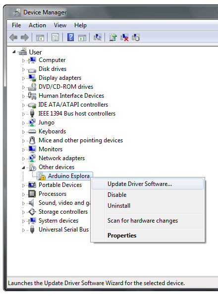
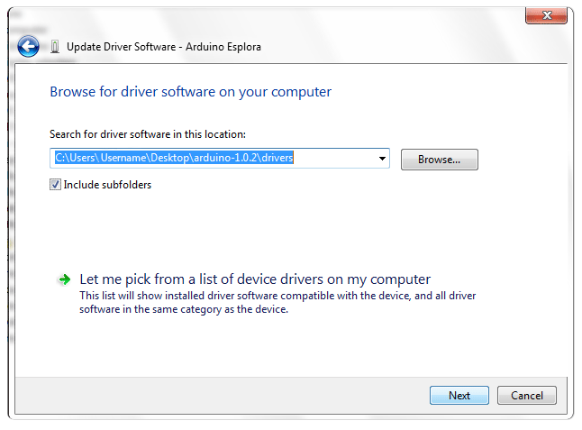
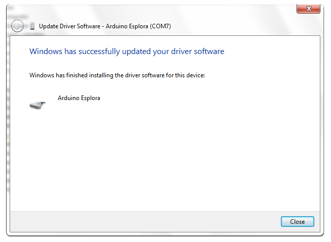

**This is a retired product.**

The Arduino Esplora is a device that has a tiny computer called a microcontroller, and a number of inputs and outputs. For inputs, there's a joystick, four buttons, a light sensor, a slider, a microphone, a temperature sensor, and an accelerometer. For outputs there's a buzzer and a three color LED. At first glance it looks like a videogame controller.

With the Esplora, you can write software that takes information from the inputs and use that to control the outputs on the board, or control your computer, just like a mouse or keyboard would.

The Esplora is different from all previous Arduino boards, in that it has inputs and outputs already connected to the board. This means that you don't need to know how to connect electronic sensors or actuators to use it as a result. As a result, programming for it is a bit different than for other Arduino boards. It has its own library that makes it easier to read from the input sensors and write to the output actuators. You'll see how to use the library in this guide and in the [Esplora library](https://arduino.cc/en/Reference/EsploraLibrary) reference pages as well.

The Arduino Esplora is programmed using the [Arduino Software (IDE)](https://arduino.cc/en/Main/Software), our Integrated Development Environment common to all our boards and running both [online](https://create.arduino.cc/editor) and offline. For more information on how to get started with the Arduino Software visit the [Getting Started page](https://arduino.cc/en/Guide/HomePage).

### Use your Arduino Esplora on the Arduino Web IDE


All Arduino boards, including this one, work out-of-the-box on the [Arduino Cloud Editor](https://create.arduino.cc/editor), you only need to install Arduino Create Agent to get started.

The Arduino Cloud Editor is hosted online, therefore it will always be up-to-date with the latest features and support for all boards. Follow this [simple guide](https://create.arduino.cc/projecthub/Arduino_Genuino/getting-started-with-arduino-web-editor-4b3e4a) to start coding on the browser and upload your sketches onto your board.


### Use your Arduino Esplora on the Arduino Desktop IDE

If you want to program your Arduino Esplora while offline you need to install the [Arduino Desktop IDE](https://arduino.cc/en/Main/Software).

#### Connect the board

Connect the Arduino board to your computer using the microUSB cable. The green power LED (labelled ON) should go on, and the yellow LED marked "L" should start glowing. After about 8 seconds, the yellow LED should start blinking on and off.

#### Install the drivers

##### Instructions for Mac OS X

- The first time you plug an Esplora into a Mac, the "Keyboard Setup Assistant" will launch. There's nothing to configure with the Esplora, so you can close this dialogue by clicking the red button in the top left of the window.


##### Instructions for Windows

The following instructions are for Windows 7. They are valid also for Windows XP, with small differences in the dialog windows.

- Plug in your board and wait for Windows to begin its driver installation process. If the installer does not launch automatically, navigate to the Windows Device Manager (Start>Control Panel>Hardware) and find the Arduino Esplora listing. Right click and choose **Update driver**.



- At the next screen, choose "Browse my computer for driver software", and click **Next**.


- Click the **Browse...** button. Another dialog appears: navigate to the folder with the Arduino software that you just downloaded. Select the **drivers** folder an click **OK**, then click **Next**.



- You will receive a notification that the board has not passed Windows Logo testing. Click on the button **Continue Anyway**.



- After a few moments, a window will tell you the wizard has finished installing software for Arduino Esplora. Press the **Close** button.

##### Instructions for Linux

There is no need to install drivers for Ubuntu 12.04.

#### Open the Esplora Blink example

Open the LED Blink example sketch: File > Examples > Esplora > Beginners > EsploraBlink.

#### Select your board type and port

You'll need to select the entry in the **Tools > Board** menu that corresponds to your Arduino board.

#### Upload the program

Now, simply click the "Upload" button in the environment. Wait a few seconds - you should see the RX and TX leds on the board flashing. If the upload is successful, the message "Done uploading." will appear in the status bar.

#### Upload the program

Now, simply click the "Upload" button in the environment. Wait a few seconds - you should see the RX and TX leds on the board flashing. If the upload is successful, the message "Done uploading." will appear in the status bar.

A few seconds after the upload finishes, you should see the yellow RGB LED on the board start to blink, changing color from red to green to blue to yellow to cyan to magenta to white. If it does, congratulations! You've gotten Esplora up and running.

### Tutorials

Now that you have set up and programmed your Esplora board, you may find inspiration in our [Project Hub](https://create.arduino.cc/projecthub/products/arduino-esplora) tutorial platform, or learn how to use the specific features of the Esplora with the Esplora library examples. You should look at the [Esplora library](https://arduino.cc/en/Reference/EsploraLibrary) reference pages for using various sensors and actuators with the Esplora library. You can see more examples on the [examples](https://arduino.cc/en/Tutorial/HomePage) page.

### Please Read...

#### Esplora library

The Esplora has input sensors, which you get information from using **read** commands, and output actuators, which you control using **write** commands using the [specific library](https://arduino.cc/en/Reference/EsploraLibrary). The RGB LED and the buzzer are the two main output actuators. The joystick, linear potentiometer slider, microphone, accelerometer, temperature sensor, and pushbuttons are the input sensors. You can also add your own inputs and outputs using the TinkerKit input and output connectors.

#### Drive the onboard RGB LED

In this example, you'll get the RGB LED to blink each of its colors once, then all three at the same time. The Esplora library, included at the beginning of the sketch, has a number of methods that will simplify the code you need to use.

The sketch below is similar to the EsploraBlink example, but controls the LED in a slightly different way. You can either use the Esplora.writeRGB() command, and give it red, green, and blue values like so:

```c
Esplora.writeRGB(255, 255, 255);  // sets red, green and blue all to full brightness
```

Or you can turn on each individual color using the Esplora.writeRed(), Esplora.writeGreen(), and Esplora.writeBlue() commands, as you see below.

Copy the code below, and paste it into the Arduino IDE. Make sure you have the right serial port and the Esplora board selected, as you did previously. Plug your board in and upload the code. Once it is uploaded, you should see the RGB LED flashing.

```c
// include the Esplora library
#include <Esplora.h>

void setup() {

  // nothing to setup
}

void loop() {

  // write light level to the red LED

  // 0 means the LED is off, 255 is full brightness

  Esplora.writeRed(255);

  // add a delay to keep the LED lit for

  // 1000 milliseconds (1 second)

  delay(1000);

  // turn the red LED off, and the green LED on

  Esplora.writeRed(0);

  Esplora.writeGreen(255);

  // add a delay

  delay(1000);

  // turn the green LED off, and the blue LED on

  Esplora.writeGreen(0);

  Esplora.writeBlue(255);

  // add a delay

  delay(1000);

  // turn all the LEDs on together

  Esplora.writeRGB(255, 255, 255);

  // add a delay

  delay(1000);

  // turn the LEDs off

  Esplora.writeRGB(0, 0, 0);

  // add a delay

  delay(1000);
}
```

#### Inputs changing outputs

The Esplora has a number of sensors right on its surface. In this example, you'll use the linear potentiometer (the slider at the bottom of the board) to change the brightness of the RGB LED.

Inputs on the Esplora give you values between 0 and 1023, except the pushbuttons, which give you 0 or 1. Outputs don't have the same range, however. The LED output ranges from 0 to 255. To get the value from the input to scale to the value for the output, you'll divide the input by 4. This new number will be the brightness level of the LED.

Copy the code below, and upload it as you did the previous examples. Once uploaded, move the slider back and forth. You should see the Red LED change its brightness.

```c
// include the Esplora library
#include <Esplora.h>

void setup() {
// nothing to setup
}

void loop() {

  // read the sensor into a variable

  int slider = Esplora.readSlider();

  // convert the sensor readings to light levels

  byte bright  = slider/4;

  // write the light levels to the Red LED

  Esplora.writeRed(bright);

  // add a small delay to keep the LED from flickering:

  delay(10);
}
```

#### Next steps

There are a number of example sketches in the **File -> Examples -> Esplora** that show you more of what you can do with your Esplora. They're divided into examples for programming Beginners or Experts. If you're just getting started in programming, or you want to see how to use one input or output at a time, start with the Beginners examples. If you're an experienced programmer, then the Advanced examples will give you some more ideas.

If you've never programmed before at all, there are more examples included with the IDE to show you some of the basic programming structures. Note that these examples will need to be modified a bit to work with the Esplora, however. You'll need to include the Esplora library by choosing Import Library... -> Esplora from the Tools menu, and you'll need to change the general Arduino inputs and outputs for the Esplora inputs and outputs. For more on this, see the [Guide to using Esplora with the Arduino Examples](https://arduino.cc/en/Guide/ArduinoEsploraExamples)

If you have problems, please see the [troubleshooting suggestions](https://arduino.cc/en/Guide/Troubleshooting).

The text of the Arduino getting started guide is licensed under a
[Creative Commons Attribution-ShareAlike 3.0 License](http://creativecommons.org/licenses/by-sa/3.0/). Code samples in the guide are released into the public domain.
