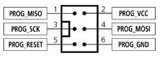

Using the input sensors and output actuators built onto the Esplora board is a little different than using the general inputs and outputs on other Arduino boards. As a result, the example sketches included with the Arduino IDE need a little modification before you can use them with the Esplora. This guide explains how to do it.

## Add the Esplora Library

You need to add the Esplora library to any sketch you want to use on the Esplora. To do so, choose Import Library... -> Esplora from the Sketch menu, and the IDE will automatically add the following at the top of your sketch:

```c
#include <Esplora.h>
```

## Digital Input and Output Changes

The other Arduino boards have two types of inputs: digital inputs, which have only two states, HIGH or LOW, and analog inputs, which have a varying range of states, typically from 0 to 1023. The pushbuttons on the Esplora are digital inputs, and the other sensors are analog inputs. To adapt the regular examples to the Esplora, you can substitute the pushbutton inputs for the digital inputs, and any of the other sensors for the analog inputs.

The digital inputs on the other Arduino boards can also be used as outputs, so they need to be declared as either input or output using a command called `pinMode()`. Because all of the Esplora's inputs or outputs are dedicated to one function, you don't need pinMode commands.

Whenever you see the command `digitalRead()` in an Arduino example, substitute the command `Esplora.readButton()`. Choose whichever button you want to read. Below, you can see the original [DigitalReadSerial](https://arduino.cc/en/Tutorial/BuiltInExamples/DigitalReadSerial) example (found in File -> Examples -> 01.Basics -> DigitalReadSerial) and the modified version that works on the Esplora using Switch 1:

**Original example:**

```c{numberLines: true}

// digital pin 2 has a pushbutton attached to it. Give it a name:
int pushButton = 2;                        // you don't need this line for the Esplora

// the setup routine runs once when you press reset:
void setup() {
  // initialize serial communication at 9600 bits per second:
  Serial.begin(9600);
  // make the pushbutton's pin an input:
  pinMode(pushButton, INPUT);       // you don't need this line for the Esplora
}

// the loop routine runs over and over again forever:
void loop() {
  // read the input pin:
  int buttonState = digitalRead(pushButton); // this line needs to change
  // print out the state of the button:
  Serial.println(buttonState);
  delay(1);        // delay in between reads for stability
}

```

**Modified example for use with Esplora:**

```c{numberLines: true}

#include <Esplora.h>     // you need to include the Esplora Library
// the setup routine runs once when you press reset:
void setup() {
  // initialize serial communication at 9600 bits per second:
  Serial.begin(9600);
}

// the loop routine runs over and over again forever:
void loop() {
  // read the input pin:
  int buttonState = Esplora.readButton(SWITCH_2);  // Esplora.readButton replaces digitalRead()
  // print out the state of the button:
  Serial.println(buttonState);
  delay(1);        // delay in between reads for stability
}

```

Most of the Arduino digitalRead() examples are written with the assumption that the pushbutton or switch attached to them will go HIGH when pressed, and LOW when not pressed. The Esplora's pushbuttons go LOW when pressed and HIGH when not pressed. So if you want to read when the Esplora's buttons are pressed, read for LOW instead of HIGH. If you want to read when they're not pressed, read for HIGH instead of LOW.

For most Arduino examples, LEDs are used as digital outputs, meaning that you can only turn them on or off (HIGH or LOW). The RGB LED on the Esplora, however, is used as an analog output, meaning that you can set its brightness from 0 to 255. To make it act like a digital output, set its level to 255 for HIGH and 0 for LOW.

Below, you'll see the [Button](https://arduino.cc/en/Tutorial/BuiltInExamples/Button) example (found in File -> 02.Digital -> Button) in its original and modified forms:

**Original example:** Highlit lines will change. Pin constants and pinMode() commands will go away because they're not needed.

```c{numberLines: true}

// constants won't change. They're used here to
// set pin numbers:
const int buttonPin = 2;     // the number of the pushbutton pin
const int ledPin =  13;      // the number of the LED pin

// variables will change:
int buttonState = 0;         // variable for reading the pushbutton status

void setup() {
  // initialize the LED pin as an output:
  pinMode(ledPin, OUTPUT);
  // initialize the pushbutton pin as an input:
  pinMode(buttonPin, INPUT);
}

void loop(){
  // read the state of the pushbutton value:
  buttonState = digitalRead(buttonPin);

  // check if the pushbutton is pressed.
  // if it is, the buttonState is HIGH:
  if (buttonState == HIGH) {
    // turn LED on:
    digitalWrite(ledPin, HIGH);
  }
  else {
    // turn LED off:
    digitalWrite(ledPin, LOW);
  }
}

```

**Modified example for use with Esplora:**

```c{numberLines: true}

#include <Esplora.h>   // you need to include the Esplora library

int buttonState = 0;   // variable for reading the pushbutton status

void setup() {
 // nothing to set up
}

void loop(){
  // read the state of the pushbutton value:
  // Esplora.readButton replaces digitalRead()
  buttonState = Esplora.readButton(SWITCH_1);

  // check if the pushbutton is pressed.
  // if it is, the buttonState is LOW:
  if (buttonState == LOW) {     // Button is pushed when LOW, not HIGH
    // turn LED on:
    Esplora.writeRed(255);  // Esplora.writeRed() replaces digitalWrite()
  }
  else {
    // turn LED off:
    Esplora.writeRed(0);  // Esplora.writeRed() replaces digitalWrite()
  }
}

```

You don't have to use only the red LED channel; you can use any of the RGB channels as digital outputs in this way. Likewise, you can use any of the pushbuttons to replace digital inputs.

## Analog Input and Output Changes

Changes to analog examples are similar to the digital ones. There's no pinMode() commands to remove, however, because the analog inputs on the other Arduino boards are inputs by default.

Here's another example, this time replacing an analog input with one the Esplora's analog inputs. The [ReadAnalogVoltage](https://arduino.cc/en/Tutorial/BuiltInExamples/ReadAnalogVoltage) example (found in File -> 01.Basics -> ReadAnalogVoltage) reads an analog input and tells you the voltage on the pin. Below, you'll replace the `analogRead()` command with the reading from the light sensor:

**Original example:**

```c{numberLines: true}

// the setup routine runs once when you press reset:
void setup() {
  // initialize serial communication at 9600 bits per second:
  Serial.begin(9600);
}

// the loop routine runs over and over again forever:
void loop() {
  // read the input on analog pin 0:
  int sensorValue = analogRead(A0);    // You need to change this line
  // Convert the analog reading (which goes from 0 - 1023) to a voltage (0 - 5V):
  float voltage = sensorValue * (5.0 / 1023.0);
  // print out the value you read:
  Serial.println(voltage);
}

```

**Modified example for use with Esplora:**

```c{numberLines: true}

#include <Esplora.h>     // you need to include the Esplora Library
// the setup routine runs once when you press reset:
void setup() {
  // initialize serial communication at 9600 bits per second:
  Serial.begin(9600);
}

// the loop routine runs over and over again forever:
void loop() {
  // read the input on analog pin 0:
  int sensorValue = Esplora.readLightSensor();  //Esplora.readLightSensor() replaces analogRead()
  // Convert the analog reading (which goes from 0 - 1023) to a voltage (0 - 5V):
  float voltage = sensorValue * (5.0 / 1023.0);
  // print out the value you read:
  Serial.println(voltage);
}

```

Most of the analog sensors on the Esplora can be substituted for `analogRead()` statements as-is, because they are simply that: analog sensors. The joystick is made of two potentiometers, so you can think of each of its axes as a single `analogRead()`. Similarly, the accelerometer can be thought of three `analogRead()` channels, one for each axis.

The temperature sensor on the Esplora is different from the other analog sensors, however. The `Esplora.readTemperature()` command doesn't simply give you the analog reading like the other sensor commands do. Instead, it converts the sensor's reading to Celsius or Fahrenheit. So you can't simply substitute the temperature sensor for an `analogRead()` command.

The `analogWrite()` command on other Arduinos works only on certain pins. Its range is from 0 to 255, just like the `Esplora.writeRed()`, `Esplora.writeGreen()`, and `Esplora.writeBlue()` commands, so you could replace `analogWrite()` statements with any of these three commands and see a working result. Note that `analogWrite()` takes two parameters, a pin number and a brightness level, while the `Esplora.writeRed()` and related commands only take one parameter, the brightness. Below you can see the [Fade](https://arduino.cc/en/Tutorial/BuiltInExamples/Fade) example (found in File -> Examples -> 01.Basics -> Fade) in its original and modified forms:

**Original example:**`pinMode()` command will be cut, as it's not needed.

```c{numberLines: true}

int led = 9;           // the pin that the LED is attached to
int brightness = 0;    // how bright the LED is
int fadeAmount = 5;    // how many points to fade the LED by

// the setup routine runs once when you press reset:
void setup()  {
  // declare pin 9 to be an output:
  pinMode(led, OUTPUT);
}

// the loop routine runs over and over again forever:
void loop()  {
  // set the brightness of pin 9:
  analogWrite(led, brightness);

  // change the brightness for next time through the loop:
  brightness = brightness + fadeAmount;

  // reverse the direction of the fading at the ends of the fade:
  if (brightness == 0 || brightness == 255) {
    fadeAmount = -fadeAmount ;
  }
  // wait for 30 milliseconds to see the dimming effect
  delay(30);
}


```

**Modified example for use with Esplora:**

```c{numberLines: true}

#include <Esplora.h>   // you need to include the Esplora library

int brightness = 0;    // how bright the LED is
int fadeAmount = 5;    // how many points to fade the LED by

// the setup routine runs once when you press reset:
void setup()  {
 // nothing to set up
}

// the loop routine runs over and over again forever:
void loop()  {
  // set the brightness of the blue channel:
  Esplora.writeBlue(brightness);    // Esplora.writeBlue() replaces analogWrite()

  // change the brightness for next time through the loop:
  brightness = brightness + fadeAmount;

  // reverse the direction of the fading at the ends of the fade:
  if (brightness == 0 || brightness == 255) {
    fadeAmount = -fadeAmount ;
  }
  // wait for 30 milliseconds to see the dimming effect
  delay(30);
}

```

## Communicating With Your Computer via USB

Serial communication over USB using the `Serial.read()`, `Serial.write()`, `Serial.print` and `Serial.println()` commands should work on the Esplora just the same as they do on other boards. However, the serial output of the Esplora works slightly faster than the Uno, so you might want to add a short delay to sketches that do nothing but read a sensor and serially print the result, so as not to fill your computer's serial input buffer. When your computer's serial buffer fills up, the Serial Monitor will run much slower, and you'll experience a delay when you change windows from it to the main IDE. A delay of even 1 millisecond will work fine.

You can also use the [USB Mouse and Keyboard libraries](https://arduino.cc/en/Reference/MouseKeyboard) on the Esplora. The examples found in File -> Examples -> 09.USB will work with only modifications for digital and analog I/O, as described above. There's an example for the Esplora called [EsploraJoystickMouse](https://arduino.cc/en/Tutorial/LibraryExamples/EsploraJoystickMouse) that lets you use the joystick as a mouse controller as well.

## Communicating With Other Devices

The other Arduinos offer two other forms of serial communication, SPI (using the [SPI library](https://arduino.cc/en/Reference/SPI)) and [I2C (using the Wire library)](https://arduino.cc/en/Reference/Wire). The Esplora can communicate via SPI using the ICSP header that's also used for optional in-circuit serial programming of the board. The ICSP connector's pins are laid out as follows. Pin 1 is the pin nearest the white dot on the Esplora board. It's the bottom right pin if you're holding the Esplora with the USB connector facing up:



To connect an SPI device to the Esplora, you'll have to make your own connector cable for this connector.

The Esplora doesn't expose pins to provide for I2C communication, so you won't be able to use examples that use the Wire library with the Esplora.

Generally, if you need SPI or I2C connectivity, you're better off using another model of Arduino.

## After The Esplora

Once you've mastered the Esplora, if you're looking for other Arduino boards to try, the next best step is the [Arduino Uno](https://arduino.cc/en/Main/ArduinoBoardUno), which is the heart of the Arduino line. It allows you to connect your own sensor and actuator circuits, or add-on shields for expanded capability. You might also want to consider the [Arduino Leonardo](https://arduino.cc/en/Main/ArduinoBoardLeonardo). It's based on the same processor as the Esplora, and can likewise act as a USB keyboard or mouse. It offers all of the functionality of the regular Arduino boards as well.
The text of the Arduino getting started guide is licensed under a
[Creative Commons Attribution-ShareAlike 3.0 License](http://creativecommons.org/licenses/by-sa/3.0/). Code samples in the guide are released into the public domain.
