## Getting Started with the Arduino Fio

The ATmega328P on the Arduino Fio comes preburned with a [bootloader](https://docs.arduino.cc/hacking/software/Bootloader) that allows you to upload new code to it without the use of an external hardware programmer. It communicates using the original STK500 protocol ([reference](http://www.atmel.com/dyn/resources/prod%5Fdocuments/doc2525.pdf), [C header files](http://www.atmel.com/dyn/resources/prod%5Fdocuments/avr061.zip)).

There are two ways you can upload new sketches to the Arduino Fio: you can use an FTDI USB-to-serial cable, or USB-to-serial adaptor board; or you can program it wirelessly, over a pair of XBee radios. If you're new to the XBee radios, it's helpful to know a bit about them before attempting the wireless programming. This [introduction](https://web.archive.org/web/20140813203852/http://itp.nyu.edu/physcomp/Tutorials/XbeeBasics) may help.

You can also bypass the bootloader and program the ATmega328P with an external programmer; see [these instructions](https://docs.arduino.cc/hacking/software/MiniBootloader) for details.

### Wired Programming

LIke all Arduino boards, the Arduino Fio can be programmed with the Arduino software ([download](//www.arduino.cc/en/Main/Software)). If you're new to Arduino, see the [Getting Started Guide](//www.arduino.cc/en/Guide/HomePage) , the [reference](//www.arduino.cc/en/Reference/HomePage) and [tutorials](https://docs.arduino.cc/tutorials/).

The Fio does not have a built-in USB-to-serial adaptor, so if you're going to program it over USB, you'll need an adapter. Either of these will work well:

[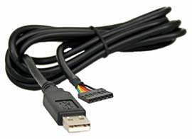Adafruit.com](http://www.adafruit.com/index.php?main%5Fpage=product%5Finfo&cPath=33&products%5Fid=70&zenid=820efea6fe32ea04a0a7879262db3e54) 

[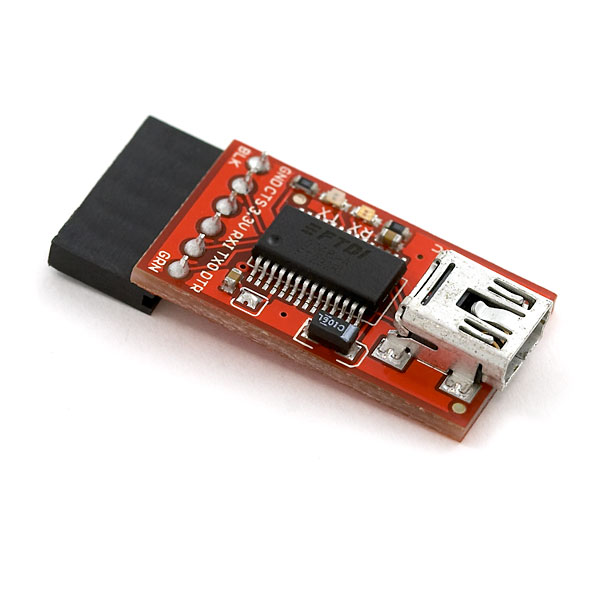](http://www.sparkfun.com/commerce/product%5Finfo.php?products%5Fid=8772)  

To program the Fio using either FTDI cable or an adaptor with the same pin configuration, attach a row of male pin headers to the cable or adaptor like so:

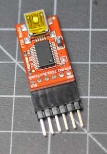

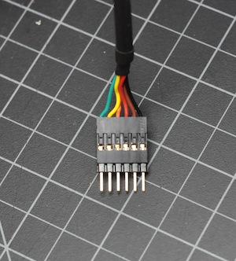

Then connect the headers to the FTDI pins on the Fio:

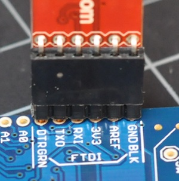 

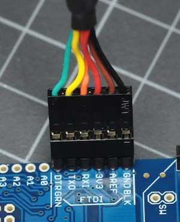

These are alternative ways to program a Fio with a L-shaped plug and low-profile sockets:

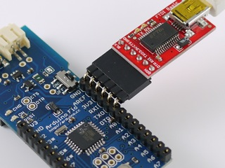

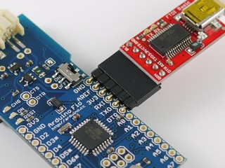

If your headers don't fit snugly in the holes (and most won't), you should hold the connector firmly so that the metal of the pins touches the metal of the holes while you're programming.

When your cable is connected to the Fio, open the Arduino programming environment, choose **Fio** from the **Tools-->Board** menu. Then choose your serial port from the serial port menu, and you're ready to program If you're using the FTDI adaptor, you'll see the TX and RX lights flicker. You won't see any visible sign on the Fio, but you will see the following in the IDE when you've successfully uploaded code:

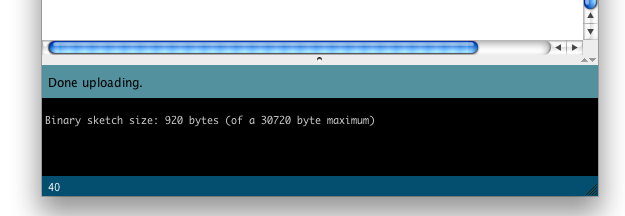

**NOTE:** Please remove a XBee modem from a Fio board while uploading sketches.

### Wireless Programming

*This tutorial borrows from [Xbee Adapter - wireless Arduino programming](http://www.ladyada.net/make/xbee/arduino.html) by Limor Fried* 

In order to upload sketches wirelessly using XBee radios, you'll need the following:

* **two [XBee or XBee Pro 802.15.4](http://www.digi.com/products/wireless/point-multipoint/xbee-series1-module.jsp#overview) XBee modules.** These are also known as Series 1 modules, for those who've worked with XBees for awhile. You can't use the DigiMesh or ZB series radios (aka Series 2 or 2.5). Those modules do not allow for automatic IO Line Passing that is required for toggling the reset pin when programming.
* **a recent version of the 802.15.4 firmware (10A5 or later).** If you need to upgrade your firmware, you need to use [X-CTU](http://ftp1.digi.com/support/utilities/40002637%5Fc.exe) (Windows only, unfortunately). If you confirmed these points, please follow the following steps.
* **a USB-to-serial adaptor** for one of the modules. You can use Sparkfun's [XBee Explorer USB](http://www.sparkfun.com/commerce/product%5Finfo.php?products%5Fid=8687) or Adafruit® [XBee Adapter kit](http://www.adafruit.com/index.php?main%5Fpage=product%5Finfo&cPath=29&products%5Fid=126&zenid=820efea6fe32ea04a0a7879262db3e54) or any other FTDI-to-XBee adaptor.

#### Modifying the XBee\-to-USB adaptor

On your USB-to-serial adaptor, solder in a tiny jumper between the RTS pin and D3 as shown here:

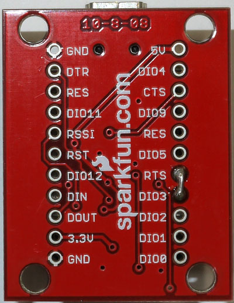


### Preparing the XBee radios

In order to program the Fio wirelessly, you need to configure two XBee radios, one for the Fio and one to connect to the programming computer serially. The latter will connect to your computer using the adapters mentioned in the last step. Once you've done that, you'll program the Fio using the radio link just like a normal Arduino USB-to-serial link.

The settings for the two radios are as follows:

||||
|-|-|-|
|**Parameter**|**Programming Radio**|**Fio Radio**|
|`BD`|4 (Atmega168) or 6 (Atmega328P)|4 (Atmega168) or 6 (Atmega328P)|
|`ID`|user's preference (0000 to FFFF)|user's preference (0000 to FFFF)|
|`MY`|User's preference, e.g. 0000|user's preference, e.g. 0001|
|`DL`|FFFF or Fio's MY value |programmer's MY value|
|`D3`|3|5| 
|`IC`|8|not set|
|`RR`|3|not set|
|`IU`|not set|0|
|`IA`|not set|FFFF|
|`RO`|10|10 

**Note:** If you set the programmer's destination address (DL) to FFFF, it will re-program all Fios in its PAN ID. To program one Fio at a time wirelessly while others are on, set the programmer's DL to that Fio's MY address.

#### Modifying the serial port settings (Windows only)

If you're running Windows, you have to make a slight change to the driver preferences. In the Device Manager, select the **USB COM port**. Then right click and select **Properties**. Click on the **Port Settings** tab, and click on **Advanced...**, then make **Set RTS On Close** is selected and click **OK** to apply settings.

## How to configure XBee modems

You can configure your radios using a terminal application, or using X-CTU on Windows, or you can use the [Fio XBee Config Tool](//www.arduino.cc/en/uploads/Main/XBeeConfigTool.zip). This is a modified version of Shigeru Kobayashi's XBeeConfigTool.

#### Using Arduino Fio XbeeConfigTool

**1.** Choose a proper serial port
**2.** Choose a proper mode (Programmer or Fio)
**3.** Choose a proper baud rate (57600bps)
**4.** Set a proper PAN ID (e.g. 1234, should be same on both)
**5.** Set a proper MY ID (e.g. 1, for end devices, 0 for programmer)
**6.** Press the Configure button to configure the XBee modem

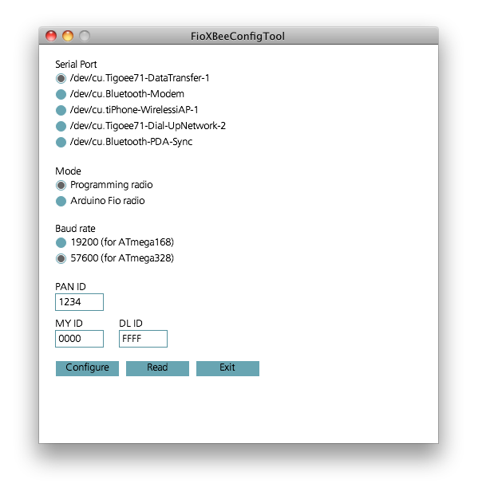

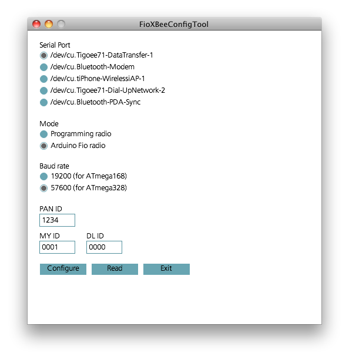

#### Configuring the radios using a serial terminal application

If you prefer to set your settings manually, you can set them using any Serial terminal application, such as [CoolTerm](http://freeware.the-meiers.org/). Connect the adapter to your computer, and open its serial port at 9600 bps using your favorite serial terminal application. 

Set your terminal application's termination string to be a carriage return (ASCI 0x0D) only. Then open the port, and type:

`+++` 

The XBee will respond:

`OK` 

For the programmer radio, type:

`ATRE,BD6,ID1234,MY0,DLFFFF,D33,IC8, RR3,RO10,WR` 

The XBee will respond:

```arduino
OK
OK
OK
OK
OK
OK
OK
OK
OK
```

For the Fio radio, type:

`ATRE,BD6,ID1234,MY1,DL0,D35,IU0,IAFFFF,RO10,WR` 

The XBee will respond:

```arduino
OK
OK
OK
OK
OK
OK
OK
OK
OK
OK
```

That's it! Now connect the Fio radio to your Fio, leave the programming radio in the XBee adapter, and you're ready to upload sketches to your Fio.
  
## Uploading sketches from an Arduino IDE to a Fio board

Uploading sketches to the Fio is similar to other Arduino boards.

**1.** Choose **Tools/Board/Arduino Fio** or **Tools/Board/Arduino Pro or Pro Mini (8MHz)**
**2.** Choose a proper serial port in **Tools/Serial Port**
**3.** Write a sketch and press the Upload button

As you upload, you should see the green RSSI light on the Fio light up. If you're using an XBee Explorer, you'll also see the TX and RX lights on it flicker as the sketch uploads. 

If the Fio does not respond, here are the most common causes of error:

**1.** make sure the Fio is powered. You can use USB power if you don't have a battery.
**2.** make sure the slider switch on the Fio is turned ON
**3.** Check your radio configurations. Did you miss a setting? This is particularly common if you configured them using a serial terminal application.

When in doubt, check the Fio by programming it over a wired connection as described above.

When your'e ready to start writing sketches for the Arduino Fio, here are some [programming tips](./../ArduinoBoardFioTips/content.md) that will make your life easier.  
  
*Last revision 2018/02/10 by SM*   
