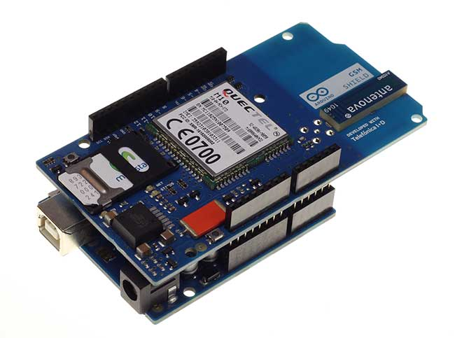
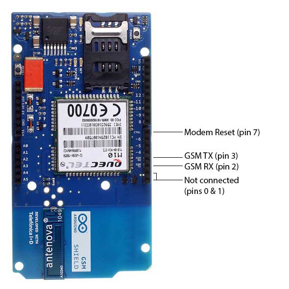
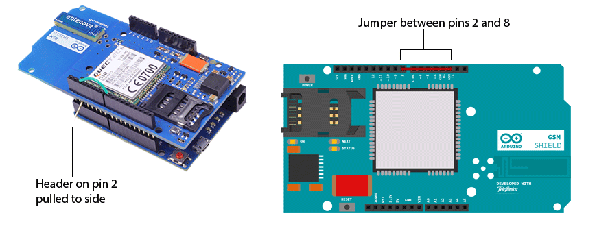
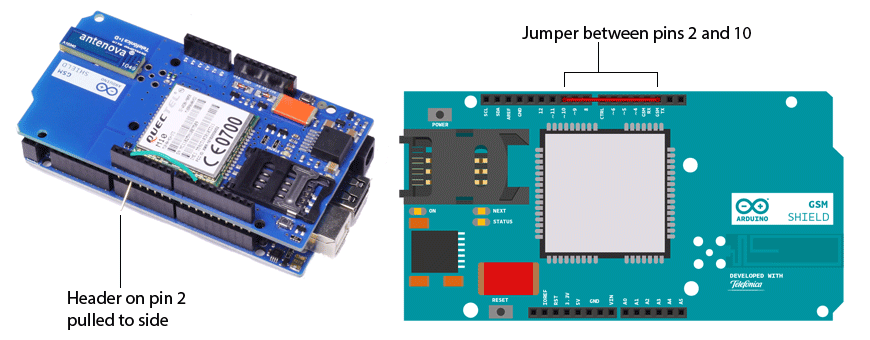

**This is a retired product.**

The [Arduino GSM shield](https://arduino.cc/en/Main/ArduinoGSMShield) allows an Arduino board to connect to the internet, send and receive SMS, and make voice calls using the [GSM library](https://arduino.cc/en/Reference/GSM).

The shield will work with the Arduino Uno out of the box. The shield will work with the Mega, Mega ADK, Yun, and Leonardo boards with [a minor modification](https://arduino.cc/en/Guide/GSMShieldLeonardoMega).
The Due is not supported at this time.

The [GSM library](https://arduino.cc/en/Reference/GSM) is included with [Arduino IDE 1.0.4 and later](https://arduino.cc/en/Main/Software).

### What is GSM

GSM is an international standard for mobile telephones. It is an acronym that stands for Global System for Mobile Communications. It is also sometimes referred to as 2G, as it is a second-generation cellular network.

To use GPRS for internet access, and for the Arduino to request or serve webpages, you need to obtain the Access Point Name (APN) and a username/password from the network operator. See the information in Connecting to the Internet for more information about using the data capabilities of the shield.

Among other things, GSM supports outgoing and incoming voice calls, Simple Message System (SMS or text messaging), and data communication (via GPRS).

The Arduino GSM shield is a a GSM modem. From the mobile operator perspective, the Arduino GSM shield looks just like a mobile phone. From the Arduino perspective, the Arduino GSM shield looks just like a modem.

### What is GPRS

GPRS is a packet switching technology that stands for General Packet Radio Service. It can provide idealized data rates between 56-114 kbit per second.

A number of technologies such as SMS rely on GPRS to function. With the GSM shield, it is also possible to leverage the data communication to access the internet. Similar to the Ethernet and WiFi libraries, the GSM library allows the Arduino to act as a client or server, using http calls to send and receive web pages.

### Network operator requirements

To access a network, you must have a subscription with a mobile phone operator (either prepaid or contract), a GSM compliant device like the GSM shield or mobile phone, and a Subscriber Identity Module (SIM) card. The network operator provides the SIM card, which contains information like the mobile number, and can store limited amounts of contacts and SMS messages.

To use GPRS for internet access, and for the Arduino to request or serve webpages, you need to obtain the Access Point Name (APN) and a username/password from the network operator. See the information in [Connecting to the Internet](#connecting-to-the-internet) for more information about using the data capabilities of the shield.

### SIM cards

In addition to the GSM shield and an Arduino, you need a SIM card. The SIM represents a contract with a communications provider. The communications provider selling you the SIM has to either provide GSM coverage where you are, or have a roaming agreement with a company providing GSM coverage in your location.

It's common for SIM cards to have a four-digit PIN number associated with them for security purposes. Keep note of this number, as it's necessary for connecting to a network. If you lose the PIN associated with your SIM card, you may need to contact your network operator to retrieve it. _Some SIM cards become locked if an incorrect PIN is entered too many times. If you're unsure of what the PIN is, look at the documentation that came with your SIM._

Using a PUK (PIN Unlock Code), it is possible to reset a lost PIN with the GSM shield and an Arduino. The PUK number will come with your SIM card documentation.

Look at the [PIN Management](https://arduino.cc/en/Tutorial/LibraryExamples/GSMToolsPinManagement) example in the "tools" folder, bundled with the GSM library for an example of how to manage your PIN number with the PUK.

There are a few different sizes of SIM cards; the GSM shield accepts cards in the mini-SIM format (25mm long and 15mm wide).

### Notes on the Telefonica/Movilforum SIM included with the shield

The GSM shield comes bundled with a SIM from Telefonica/Movilforum that will work well for developing machine to machine (M2M) applications. It is not necessary to use this specific card with the shield. You may use any SIM that works on a network in your area.

The Movilforum SIM card includes a roaming plan. It can be used on any supported GSM network. There is coverage throughout the Americas and Europe for this SIM, check the [Movilforum service availability page](http://arduinosim.movilforum.com/service.php) for specific countries that have supported networks.

Activation of the SIM is handled by Movilforum. Detailed instructions on how to register and activate your SIM online and add credit are included on a [small pamphlet](https://arduino.cc/en/uploads/Guide/GSMShield_Flyer.pdf) that comes with your shield. The SIM must be inserted into a powered GSM shield that is mounted on an Arduino for activation.

These SIM card come without a PIN, but it is possible to set one using the GSM library's [GSMPIN class](https://arduino.cc/en/Reference/GSMPINConstructor).

You cannot use the included SIM to place or receive voice calls.

You can only place and receive SMS with other SIMs on the Movilforum network.

It's not possible to create a server that accepts incoming requests from the public internet. However, the Movilforum SIM will accept incoming requests from other SIM cards on the Movilforum network.

For using the voice, and other functions of the shield, you'll need to find a different network provider and SIM. Operators will have different policies for their SIM cards, check with them directly to determine what types of connections are supported.

### Connecting the Shield

If you are using an Arduino Uno, follow the instructions below. If you are using an Arduino Mega, Mega ADK, Yun, or Leonardo, you must [follow these instructions](https://arduino.cc/en/Guide/GSMShieldLeonardoMega). The GSM shield is not currently supported on the Due.

To use the shield, you'll need to insert a SIM card into the holder. Slide the metal bracket away from the edge of the shield and lift the cradle up.


Insert the SIM in the plastic holder so the metal contacts are facing the shield, with the notch of the card at the top of the bracket.


Slide the SIM all the way into the bracket


Push the SIM to the board and slide the metal bracket towards the edge of the shield to lock it in place.


Once the SIM is inserted, mount it on top of an Arduino board.



To upload sketches to the board, connect it to your computer with a USB cable and upload your sketch with the Arduino IDE. Once the sketch has been uploaded, you can disconnect the board from your computer and power it with an external power supply.



Digital pins 2, 3 and 7 are reserved for communication between the Arduino and modem and cannot be used by your sketches. Communication between the moden and Arduino is handled by the [Software Serial library](https://arduino.cc/en/Reference/SoftwareSerial) on pins 2 and 3. Pin 7 is used for the modem reset.

When the yellow _status_ LED turns on, it means the modem is powered, and you can try connecting to the network.

Developer versions of the GSM shield required you to press press the _Power_ button on the shield for a few moments to turn the modem on. If you have an early version of the shield, and it does not turn on automatically, you can solder a jumper to the CTRL/D7 pad on the reverse side of the board, and it will turn on when an attached Arduino receives power.


The shield should work in any area with GSM coverage. Before buying the shield please verify that there is this kind of coverage where you plan to use it.

### GSM Library

The GSM library handles communication between Arduino and the GSM shield. The majority of functions are for managing data, voice, and SMS communication. There are also a number of utilities for managing information about the modem and the SIM card's PIN. See the [library reference](https://arduino.cc/en/Reference/GSM) pages for more information and a complete set of examples.

### Testing the modem and network connection

This sketch will check the modem's IMEI number. This number is unique to each modem, and is used to identify valid devices that can connect to a GSM network. Once the number has been read from the modem, the Arduino will print out the network carrier it is connected to, and the signal strength of the network over the serial port.

```c
// import the GSM library
#include <GSM.h>

// PIN Number
#define PINNUMBER ""

// initialize the library instance

GSM gsmAccess(true);     // include a 'true' parameter for debug enabled

GSMScanner scannerNetworks;

GSMModem modemTest;

// Save data variables

String IMEI = "";

// serial monitor result messages

String errortext = "ERROR";

void setup()
{

  // initialize serial communications

  Serial.begin(9600);

  Serial.println("GSM networks scanner");

  scannerNetworks.begin();

  // connection state

  boolean notConnected = true;

  // Start GSM shield

  // If your SIM has PIN, pass it as a parameter of begin() in quotes

  while(notConnected)

  {

    if(gsmAccess.begin(PINNUMBER)==GSM_READY)

      notConnected = false;

    else

    {

      Serial.println("Not connected");

      delay(1000);

    }

  }

  // get modem parameters

  // IMEI, modem unique identifier

  Serial.print("Modem IMEI: ");

  IMEI = modemTest.getIMEI();

  IMEI.replace("\n","");

  if(IMEI != NULL)

    Serial.println(IMEI);

  // currently connected carrier

  Serial.print("Current carrier: ");

  Serial.println(scannerNetworks.getCurrentCarrier());

  // returns strength and ber

  // signal strength in 0-31 scale. 31 means power > 51dBm

  // BER is the Bit Error Rate. 0-7 scale. 99=not detectable

  Serial.print("Signal Strength: ");

  Serial.print(scannerNetworks.getSignalStrength());

  Serial.println(" [0-31]");
}

void loop()
{

  // scan for existing networks, displays a list of networks

  Serial.println("Scanning available networks. May take some seconds.");

  Serial.println(scannerNetworks.readNetworks());

    // currently connected carrier

  Serial.print("Current carrier: ");

  Serial.println(scannerNetworks.getCurrentCarrier());

  // returns strength and ber

  // signal strength in 0-31 scale. 31 means power > 51dBm

  // BER is the Bit Error Rate. 0-7 scale. 99=not detectable

  Serial.print("Signal Strength: ");

  Serial.print(scannerNetworks.getSignalStrength());

  Serial.println(" [0-31]");

}


```

### Sending a SMS message

Once you have connected to your network with the sketch above, you can test some of the other functionality of the board. This sketch will connect to a GSM network and send a SMS message to a phone number of your choosing.

```c
#include <GSM.h>

#define PINNUMBER ""

// initialize the library instance

GSM gsmAccess; // include a 'true' parameter for debug enabled

GSM_SMS sms;

// char array of the telephone number to send SMS
// change the number 1-212-555-1212 to a number
// you have access to
char remoteNumber[20]= "12125551212";

// char array of the message
char txtMsg[200]="Test";

void setup()
{

  // initialize serial communications

  Serial.begin(9600);

  Serial.println("SMS Messages Sender");

  // connection state

  boolean notConnected = true;

  // Start GSM shield

  // If your SIM has PIN, pass it as a parameter of begin() in quotes

  while(notConnected)

  {

    if(gsmAccess.begin(PINNUMBER)==GSM_READY)

      notConnected = false;

    else

    {

      Serial.println("Not connected");

      delay(1000);

    }

  }

  Serial.println("GSM initialized");

  sendSMS();
}

void loop()
{
// nothing to see here
}

void sendSMS(){

  Serial.print("Message to mobile number: ");

  Serial.println(remoteNumber);

  // sms text

  Serial.println("SENDING");

  Serial.println();

  Serial.println("Message:");

  Serial.println(txtMsg);

  // send the message

  sms.beginSMS(remoteNumber);

  sms.print(txtMsg);

  sms.endSMS();

  Serial.println("\nCOMPLETE!\n");
}


```

### Connecting to the internet

In addition to the SIM card and a data plan, you will need some additional information from your cellular provider to connect to the internet. Every cellular provider has an Access Point Name (APN) that serves as a bridge between the cellular network and the internet. Sometimes, there is a username and password associated with the connection point. For example, the Movilforum APN is sm2ms.movilforum.es, but it has no password or login name.

[This page](http://arduinosim.movilforum.com/service.php) lists a number of carrier's information, but it may not be up to date. You may need to get this information from your service provider.

The sketch below will connect to arduino.cc/latest.txt and print out its contents.

_NB: Some network operators block incoming IP traffic. You should be able to run client functions, such as the sketch below, with no issues._

```c
// include the GSM library
#include <GSM.h>

// PIN number if necessary
#define PINNUMBER ""

// APN information obrained from your network provider
#define GPRS_APN       "GPRS_APN" // replace with your GPRS APN
#define GPRS_LOGIN     "login"    // replace with your GPRS login
#define GPRS_PASSWORD  "password" // replace with your GPRS password

// initialize the library instances

GSMClient client;

GPRS gprs;

GSM gsmAccess;

// This example downloads the URL "http://arduino.cc/latest.txt"

char server[] = "arduino.cc"; // the base URL
char path[] = "/latest.txt"; // the path
int port = 80; // the port, 80 for HTTP

void setup()
{

  // initialize serial communications

  Serial.begin(9600);

  Serial.println("Starting Arduino web client.");

  // connection state

  boolean notConnected = true;

  // Start GSM shield

  // pass the PIN of your SIM as a parameter of gsmAccess.begin()

  while(notConnected)

  {

    if((gsmAccess.begin(PINNUMBER)==GSM_READY) &

        (gprs.attachGPRS(GPRS_APN, GPRS_LOGIN, GPRS_PASSWORD)==GPRS_READY))

      notConnected = false;

    else

    {

      Serial.println("Not connected");

      delay(1000);

    }

  }

  Serial.println("connecting...");

  // if you get a connection, report back via serial:

  if (client.connect(server, port))

  {

    Serial.println("connected");

    // Make a HTTP request:

    client.print("GET ");

    client.print(path);

    client.println(" HTTP/1.0");

    client.println();

  }

  else

  {

    // if you didn't get a connection to the server:

    Serial.println("connection failed");

  }
}

void loop()
{

  // if there are incoming bytes available

  // from the server, read them and print them:

  if (client.available())

  {

    char c = client.read();

    Serial.print(c);

  }

  // if the server's disconnected, stop the client:

  if (!client.available() && !client.connected())

  {

    Serial.println();

    Serial.println("disconnecting.");

    client.stop();

    // do nothing forevermore:

    for(;;)

      ;

  }
}


```

### Making voice calls

Through the modem, it is possible to make voice calls. In order to speak to and hear the other party, you will need to add a speaker and microphone.


On the underside of the shield, there are through-holes labeled M1P and M1N. These are the positive and negative voice input pins for a microphone. The through-holes labeled S1P and S1N are the positive and negative voice output pins, to which you need to connect a speaker.

On page 43 of the [modem documentation](http://www.thaieasyelec.net/archives/Manual/M10_HD_V1.00.pdf), there is an example voice and sound circuit that will connect to an earphone:


The following sketch allows you to place a voice call. Using the serial monitor, you can enter the remote phone number and terminate the call. When you see the READY message, type a phone number. Make sure the serial monitor is set to send a just newline when you press return.

```c
#include <GSM.h>

// PIN Number
#define PINNUMBER ""

// initialize the library instance

GSM gsmAccess; // include a 'true' parameter for debug enabled

GSMVoiceCall vcs;

String remoteNumber = "";  // the number you will call
char charbuffer[20];

void setup()
{

  // initialize serial communications

  Serial.begin(9600);

  Serial.println("Make Voice Call");

  // connection state

  boolean notConnected = true;

  // Start GSM shield

  // If your SIM has PIN, pass it as a parameter of begin() in quotes

  while(notConnected)

  {

    if(gsmAccess.begin(PINNUMBER)==GSM_READY)

      notConnected = false;

    else

    {

      Serial.println("Not connected");

      delay(1000);

    }

  }

  Serial.println("GSM initialized.");

  Serial.println("Enter phone number to call.");

}

void loop()
{

  // add any incoming characters to the String:

  while (Serial.available() > 0)

  {

    char inChar = Serial.read();

    // if it's a newline, that means you should make the call:

    if (inChar == '\n')

    {

      // make sure the phone number is not too long:

      if (remoteNumber.length() < 20)

      {

        // show the number you're calling:

        Serial.print("Calling to : ");

        Serial.println(remoteNumber);

        Serial.println();

        // Call the remote number

        remoteNumber.toCharArray(charbuffer, 20);

        // Check if the receiving end has picked up the call

        if(vcs.voiceCall(charbuffer))

        {

          Serial.println("Call Established. Enter line to end");

          // Wait for some input from the line

          while(Serial.read()!='\n' && (vcs.getvoiceCallStatus()==TALKING));

          // And hang up

          vcs.hangCall();

        }

        Serial.println("Call Finished");

        remoteNumber="";

        Serial.println("Enter phone number to call.");

      }

      else

      {

        Serial.println("That's too long for a phone number. I'm forgetting it");

        remoteNumber = "";

      }

    }

    else

    {

      // add the latest character to the message to send:

      if(inChar!='\r')

        remoteNumber += inChar;

    }

  }
}


```

## Connecting to Yún, Mega & Leonardo

The [GSM shield](https://www.arduino.cc/en/Main/ArduinoGSMShield) communicates with an attached Arduino through the [Software Serial library](https://www.arduino.cc/en/Reference/SoftwareSerial). By default, this communication uses digital pins 2 and 3. On the [Uno](https://www.arduino.cc/en/Main/ArduinoBoardUno) this works without modification, but to use the [Leonardo](https://www.arduino.cc/en/Main/ArduinoBoardLeonardo), [Yun](https://www.arduino.cc/en/Main/ArduinoBoardYun), or [Mega](https://www.arduino.cc/en/Main/ArduinoBoardMega2560) boards, some slight changes are required.

The GSM_TX pin, pin 2 on the shield, sends information to the Arduino. The Arduino relies on an interrupt on this pin to know when information is available to read. On the Uno, this interrupt capability is on pin 2. The Leonardo, Yun, and Mega have interrupt capabilities on different pins.

You do not need to change any code to program the shield for use with the Leonardo, Yun, or Mega, as the library will change the Arduino's RX pin automatically depending on the board selected in the "Tools" menu of the IDE. You do, however, need to re-route the GSM_TX data to the appropriate pin on the Arduino.

### Arduino Leonardo and Arduino Yun

The [GSM library](https://www.arduino.cc/en/Reference/GSM) uses digital pin 8 to communicate with the Leonardo or the Yun. Thus, you need to route the signal from pin 2 of the GSM shield to pin 8 of the Arduino, and at the same time prevent this signal from connecting to pin 2 of the Arduino. The following two steps accomplish this:

On the GSM shield, connect a jumper wire between digital pins 2 and 8. This routes the signal from pin 2 of the GSM shield to pin 8 of the Arduino.

To prevent this signal from interfering with or being interfered by pin 2 of the
Arduino, bend the male header attached to pin 2 on the GSM shield to the side so it does not connect to the Leonardo or Yun.



### Arduino Mega

The [GSM library](https://www.arduino.cc/en/Reference/GSM) uses digital pin 10 to communicate with the Mega. Thus, you need to route the signal from pin 2 of the GSM shield to pin 10 of the Arduino, and at the same time prevent this signal from connecting to pin 2 of the Arduino. The following two steps accomplish this:

On the GSM shield, connect a jumper wire between digital pins 2 and 10. This routes the signal from pin 2 of the GSM shield to pin 10 of the Arduino.

To prevent this signal from interfering with or being interfered by pin 2 of the
Arduino, bend the male header attached to pin 2 on the GSM shield to the side so it does not connect to the Mega.



### Next steps

Now that you have tested the basic functionality of the board, see the [GSM library](https://arduino.cc/en/Reference/GSM) pages for information about the library's API and additional examples.

The text of the Arduino getting started guide is licensed under a
[Creative Commons Attribution-ShareAlike 3.0 License](http://creativecommons.org/licenses/by-sa/3.0/). Code samples in the guide are released into the public domain.
