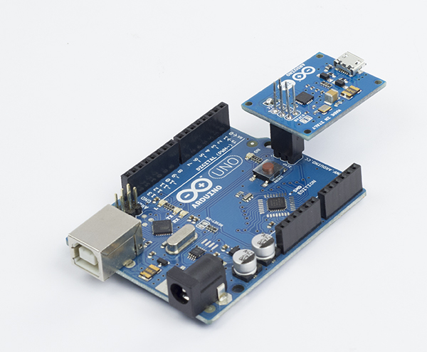
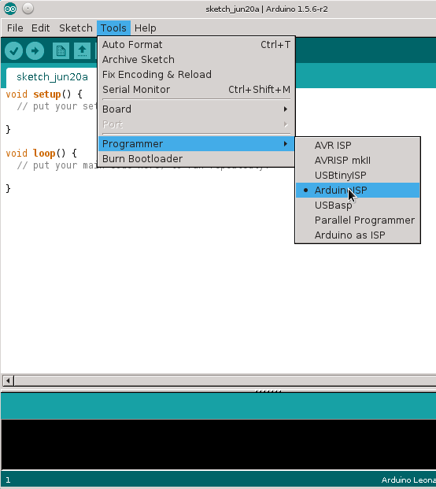
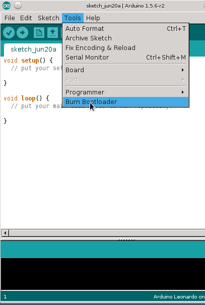
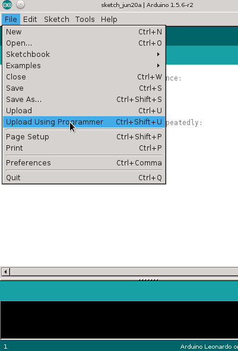

**This is a retired product.**

The [Arduino ISP](https://arduino.cc/en/Main/ArduinoISP) is an In-System-Programmer that is used to program AVR microcontrollers. You can use the Arduino ISP to upload sketches directly on the AVR-based Arduino boards without the need of the bootloader. Otherwise you can use it to restore the bootloader.

### How to connect the Arduino ISP

Plug the Arduino ISP on the 6-pin ICSP connector of the Arduino board you want to program, as shown in the picture.

Connect the Arduino ISP to your computer with a micro USB cable, and connect the target board to a power source (USB cable or with the power jack). The target board can also be powered from the Arduino ISP. To enable this feature you have to close the SJVCC jumper, with a soldering iron and a drop of soldering tin.

After you made all the connection you have to select the right programmer into the Arduino IDE like shown in the picture.

### Burning the bootloader

The bootloader is a small piece of software that allows your Arduino board to communicate with the Arduino IDE when you want to upload a sketch. Normally when you want to load a program on a microcontroller you need an external programmer, like the Arduino ISP. The bootloader eliminates the needs of an external programmer because, the protocol that allows your computer to program the flash memory of the AVR is contained inside the bootloader.
All the AVR-based Arduino boards comes with the bootloader pre-installed but sometimes the upload process or some sketches can corrupt the memory where the bootloader resides causing the failure of future upload procedures.
Burning again the bootloader with the Arduino ISP can restore the bootloader and bring back your Arduino to upload using the USB port again.
You can also use the Arduino ISP to burn the bootloader in a brand new ATmega. If you replace the ATmega microcontroller on your Arduino you will need to burn the bootloader in order to load sketches in the usual way. You can simply do it with the Arduino ISP.

Burning the bootloader is an easy-to-go feature provided by the Arduino IDE. To upload the bootloader on your board just connect everything as described before and click on _Burn bootloader_ in the Tools menu.

### Uploading a sketch

The Arduino ISP programmer can be also used to load sketches on the AVR-based Arduino boards or on other AVR microcontrollers supported by the Arduino software.

Uploading a sketch using the standard procedure needs the presence of the bootloader. Instead, by choosing the external programmer as option to upload a sketch will upload the sketch using the entire flash memory space. This may be useful if need more space for the sketch using the memory used by the bootloader.

**NOTE**: Remember that if you overwrite the bootloader you won't be able to upload other sketches by clicking on the upload button in the Arduino IDE. If you want to use again your Arduino as before, you have to burn the bootloader first.

After you finished your sketch and everything is correctly setup, go on the File menu and click on _Upload using Programmer_.
Alternatively, there is a keyboard shortcut. To upload using the programmer press the keys "CTRL+SHIFT+U".

### Programming fuse bits on ATmega microcontrollers.

The Arduino ISP can be used to program fuse bits on ATmega microcontrollers. Programming fuses allows you to configure the internal peripherals and the behavior of the microcontroller.
For example you can choose the clock frequency, programming the watchdog timer and much more. This requires some experience and attention because setting these fuses in a wrong way may cause the microcontroller not working anymore, and recovering it may be very difficult.

The text of the Arduino getting started guide is licensed under a
[Creative Commons Attribution-ShareAlike 3.0 License](http://creativecommons.org/licenses/by-sa/3.0/). Code samples in the guide are released into the public domain.
