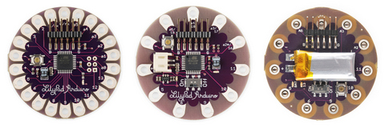
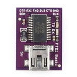
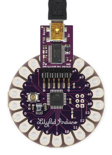
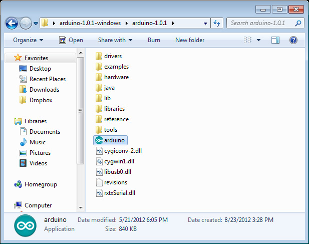
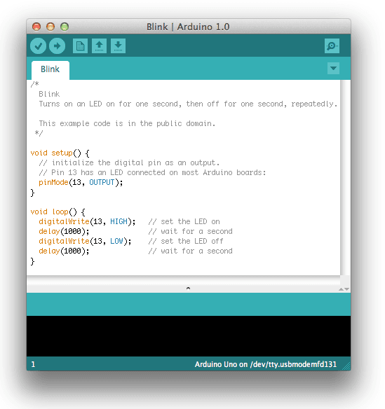
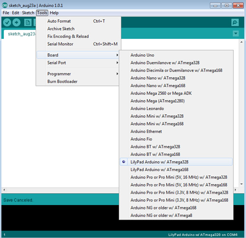
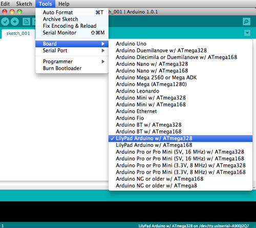
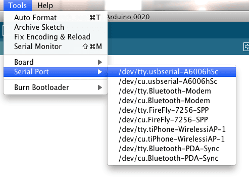

The LilyPad Arduino family of boards has been designed for wearable applications. It works on rechargeable batteries and allows easy connection with sensors and actuators developed for an easy integration in clothes and fabrics.

The LilyPad Arduino, LilyPad Arduino Simple and LilyPad Arduino Simple Snap are different from the usual Arduino boards because they need a USB to Serial interface to be programmed. The [Arduino USB 2 Serial](https://arduino.cc/en/Main/USBSerial) interface is the one we recommend, but any standard FTDI compatible interface is suitable. The Arduino USB 2 Serial interface behaves as an Arduino UNO and shares the same drivers.

The LilyPad Arduino, LilyPad Arduino Simple and LilyPad Arduino Simple Snap are programmed using the [Arduino Software (IDE)](https://arduino.cc/en/Main/Software), our Integrated Development Environment common to all our boards and running both [online](https://create.arduino.cc/editor) and offline.

### Use your LilyPad Arduino, LilyPad Arduino Simple and LilyPad Arduino Simple Snap on the Arduino Web IDE

All Arduino boards, including this one, work out-of-the-box on the [Arduino Cloud Editor](https://create.arduino.cc/editor), you only need to install Arduino Create Agent to get started.

The Arduino Cloud Editor is hosted online, therefore it will always be up-to-date with the latest features and support for all boards. Follow this [simple guide](https://create.arduino.cc/projecthub/Arduino_Genuino/getting-started-with-arduino-web-editor-4b3e4a) to start coding on the browser and upload your sketches onto your board.

### Use your LilyPad Arduino, LilyPad Arduino Simple and LilyPad Arduino Simple Snap on the Arduino Desktop IDE

If you want to program your LilyPad Arduino, LilyPad Arduino Simple and LilyPad Arduino Simple Snap while offline you need to install the [Arduino Desktop IDE](https://arduino.cc/en/Main/Software).

#### Connect the board

Connect the Arduino board to your computer using the USB 2 Serial adapter and a USB cable.

#### Open your first sketch

Open the LED blink example sketch: **File > Examples >01.Basics > Blink**.

#### Select your board type and port

You'll need to select the entry in the **Tools > Board** menu that corresponds to your Arduino board.

#### Upload the program

Now, simply click the "Upload" button in the environment. Wait a few seconds - you should see the RX and TX leds on the USB 2 Serial board flashing. If the upload is successful, the message "Done uploading." will appear in the status bar.

#### Learn more on the Desktop IDE

[See this tutorial](https://create.arduino.cc/projecthub/Arduino_Genuino/getting-started-with-the-arduino-software-ide-623be4) for a generic guide on the Arduino IDE with a few more infos on the Preferences, the Board Manager, and the Library Manager.

### Tutorials

Now that you have set up and programmed your LilyPad Arduino board, you may find inspiration in our [Project Hub](https://create.arduino.cc/projecthub/products/arduino-lilypad-main-board) tutorial platform.

<iframe frameborder='0' height='410' scrolling='no' src='https://create.arduino.cc/projecthub/luizzanotello/nama-f35d3c/embed?use_route=project' width='354' style='margin-top:30px'></iframe>

The text of the Arduino getting started guide is licensed under a
[Creative Commons Attribution-ShareAlike 3.0 License](http://creativecommons.org/licenses/by-sa/3.0/). Code samples in the guide are released into the public domain.

## Getting Started w/ LilyPad Arduino on Windows

### Get a LilyPad Arduino, FTDI board, and USB cable.

In this tutorial, we assume you're using a LilyPad Arduino Main Board, Simple Board, or SimpleSnap. This tutorial will also work for the LilyPad Arduino Protosnap boards: the ProtoSnap LilyPad Development Board and the Protosnap LilyPad Simple Board. If you have a LilyPad Arduino USB, read the corresponding page in the getting started guide for setup instructions.

You'll also need a standard mini USB cable and an [FTDI board](http://lilypadarduino.org/?p=452).

### Download the Arduino environment

Get the latest version from the [download page](https://www.arduino.cc/en/Main/Software).

When the download is finished, extract all of the contents of the .zip file to a location you will remember. The Desktop or the Program Files folder are good locations.

Once the .zip file is extracted to a folder titled something like "arduino - 1.0.x", double-click the folder to open it. Make sure that there are a few files and sub-folders inside it including an arduino.exe file.

### Connect the board

Attach the FTDI board to your LilyPad Arduino board. Attach one end of the USB cable to your FTDI board and the other end to a USB port on your computer.

### Install the drivers

You will need to install the drivers for the FTDI board that enables you to program the LilyPad Arduino. You need to download the latest version of the drivers from the [FTDI website](http://www.ftdichip.com/Drivers/VCP.htm).

Scroll down to the middle of this page, where there is a table listing drivers for different computers. Click on the most recent driver that is compatible with your computer.

If your computer is using Windows 7, Windows Vista, Windows XP, or an earlier operating system, see this website to determine whether you should use the x86 (32 bit) or x64 (64 bit) drivers. If your computer is using Windows 8 or a later operating system, you should download the x64(64 bit drivers).

When the download is finished, extract all of the contents of the .zip file to a location you will remember.

Follow the [guide on the FTDI website](http://www.ftdichip.com/Support/Documents/InstallGuides.htm) that corresponds to your operating system to complete the installation process.

You'll need to restart your computer after installing the drivers.

### Launch the Arduino application

Browse to your folder where you saved the Arduino software and double-click the arduino.exe file to open the software. (Note: if the Arduino software loads in the wrong language, you can change it in the preferences dialog. See the [environment page](https://docs.arduino.cc/learn/starting-guide/the-arduino-software-ide) for details.)

### Open the blink example

Open the LED blink example sketch: **File > Examples > 1.Basics > Blink**.

### Select your board

You'll need to select the entry in the **Tools > Board** menu that corresponds to your LilyPad Arduino. If your board was purchased in 2012 or later, you should select "LilyPad Arduino w/ ATmega328 from this menu".

### Select your serial port

Select the correct serial port from the **Tools > Serial Port** menu. This tells the Arduino software which USB port your LilyPad Arduino is attached to. On a PC this will be the highest numbered "COM" port. It is likely to be COM3 or higher.

To find out definitively which port your LilyPad Arduino is connected to, you can disconnect your LilyPad board and re-open the menu; the entry that disappears should be the LilyPad board. Reconnect the board and select that serial port.

### Upload the program

Now, click the "Upload" button in the Arduino environment. Wait a few seconds - you should see the RX and TX leds on the FTDI board flashing. If the upload is successful, the message "Done uploading." will appear in the status bar.

A few seconds after the upload finishes, you should see the LED on the board start to blink (in green). If it does, congratulations! You've gotten your LilyPad Arduino up-and-running.

If you have problems, see the [troubleshooting suggestions](http://edit.arduino.cc/en/Guide/Troubleshooting).

### Additional Resources

- [lilypadarduino.org](http://lilypadarduino.org/): a comprehensive guide to getting started with LilyPad
- [LilyPad Category on SparkFun](https://www.sparkfun.com/categories/135): sensors, actuators, and other boards for use with the LilyPad Arduino

The text of the Arduino getting started guide is licensed under a Creative Commons Attribution-ShareAlike 3.0 License. Code samples in the guide are released into the public domain. The text of the Arduino getting started guide is licensed under a [Creative Commons Attribution-ShareAlike 3.0 License](http://creativecommons.org/licenses/by-sa/3.0/). Code samples in the guide are released into the public domain.

## Getting Started w/ LilyPad Arduino on Mac OS

### Get a LilyPad Arduino, FTDI board, and USB cable.

In this tutorial, we assume you're using a LilyPad Arduino Main Board, Simple Board, or SimpleSnap. This tutorial will also work for the LilyPad Arduino Protosnap boards: the ProtoSnap LilyPad Development Board and the Protosnap LilyPad Simple Board. If you have a LilyPad Arduino USB, read the corresponding page in the getting started guide for setup instructions.

You'll also need a standard mini USB cable and an FTDI board.

### Download the Arduino environment

Get the latest version from the [download page](https://www.arduino.cc/en/Main/Software).

When the download is finished, double click the .zip file. This will expand the Arduino application.

### Install the Arduino Software

Copy the Arduino application into your Applications folder.

### Install the FTDI Drivers

You will need to install the drivers for the FTDI board that enables you to program the LilyPad Arduino. You need to download the latest version of the drivers from the [FTDI website](http://www.ftdichip.com/Drivers/VCP.htm).

Scroll down to the middle of this page, where there is a table listing drivers for different computers. Click on the most recent driver that is compatible with your computer. If your computer is running OS 10.5 or higher you should use the x64 (64-bit) drivers. If you're running OS 10.4 you should use the x32 (32-bit) drivers. Otherwise, you should use the PPC (PowerPC) drivers. To determine which OS your computer has, click on the apple icon in the upper right hand corner of your screen and click on "About This Mac" menu item.

For more detailed installation instructions, see the [guides on the FTDI website](http://www.ftdichip.com/Support/Documents/InstallGuides.htm).

Once downloaded, double click the package, and follow the instructions in the installer. You'll need to restart your computer after installing the drivers.

### Connect the board

Attach the FTDI board to your LilyPad Arduino board. Attach one end of the USB cable to your FTDI board and the other end to a USB port on your computer.

### Launch the Arduino application

Browse to your Applications folder and double-click the Arduino application to open the software. (Note: if the Arduino software loads in the wrong language, you can change it in the preferences dialog. See the [environment page](https://docs.arduino.cc/learn/starting-guide/the-arduino-software-ide) for details.)

### Open the blink example

Open the LED blink example sketch: **File > Examples > 1.Basics > Blink**.

### Select your board

You'll need to select the entry in the **Tools > Board** menu that corresponds to your LilyPad Arduino. If your board was purchased in 2012 or later, you should select "LilyPad Arduino w/ ATmega328 from this menu".

### Select your serial port

Select the correct serial port from the **Tools > Serial Port** menu. This tells the Arduino software which USB port your LilyPad Arduino is attached to. On the Mac, this should be something with **/dev/tty.usbserial** in its name.

### Upload the program

Now, click the "Upload" button in the environment. Wait a few seconds - you should see the RX and TX leds on the FTDI board flashing. If the upload is successful, the message "Done uploading." will appear in the status bar.

A few seconds after the upload finishes, you should see the LED on the board start to blink (in green). If it does, congratulations! You've gotten your LilyPad Arduino up-and-running.

If you have problems, see the [troubleshooting suggestions](http://edit.arduino.cc/en/Guide/Troubleshooting).

### Additional Resources

- [lilypadarduino.org](http://lilypadarduino.org/): a comprehensive guide to getting started with LilyPad
- [LilyPad Category on SparkFun](https://www.sparkfun.com/categories/135): sensors, actuators, and other boards for use with the LilyPad Arduino

The text of the Arduino getting started guide is licensed under a Creative Commons Attribution-ShareAlike 3.0 License. Code samples in the guide are released into the public domain. The text of the Arduino getting started guide is licensed under a [Creative Commons Attribution-ShareAlike 3.0 License](http://creativecommons.org/licenses/by-sa/3.0/). Code samples in the guide are released into the public domain.