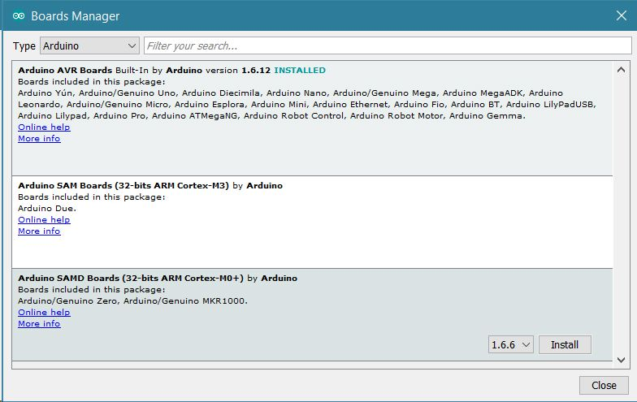
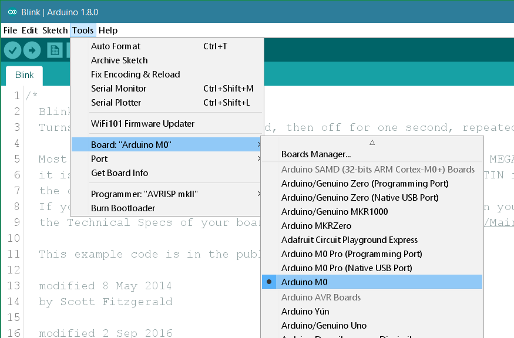
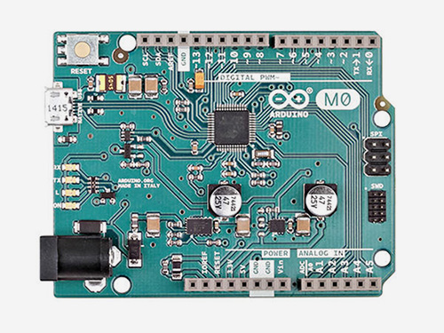

**This is a retired product.**

This board is a simple and powerful 32-bit extension of the platform established by the UNO. Learn how to prepare your computer with all you need to start making your own projects.

The Arduino M0 is programmed using the [Arduino Software (IDE)](https://arduino.cc/en/Main/Software), our Integrated Development Environment common to all our boards and running both [online](https://create.arduino.cc/editor) and offline. For more information on how to get started with the Arduino Software visit the [Getting Started page](https://arduino.cc/en/Guide/HomePage).

### Use your Arduino M0 on the Arduino Web IDE


All Arduino boards, including this one, work out-of-the-box on the [Arduino Web Editor](https://create.arduino.cc/editor), you only need to install Arduino Create Agent to get started.

The Arduino Web Editor is hosted online, therefore it will always be up-to-date with the latest features and support for all boards. Follow this [simple guide](https://create.arduino.cc/projecthub/Arduino_Genuino/getting-started-with-arduino-web-editor-4b3e4a) to start coding on the browser and upload your sketches onto your board.


### Use your Arduino M0 on the Arduino Desktop IDE

If you want to program your Arduino M0 while offline you need to install the [Arduino Desktop IDE](https://arduino.cc/en/Main/Software) and add the Atmel SAMD Core to it. This simple procedure is done selecting **Tools menu**, then **Boards** and last **Boards Manager**, as documented in the [Arduino Boards Manager](https://arduino.cc/en/Guide/Cores) page.



#### Installing Drivers for the M0

**OSX**
No driver installation is necessary on OSX. Depending on the version of the OS you're running, you may get a dialog box asking you if you wish to open the "Network Preferences". Click the "Network Preferences..." button, then click "Apply". The M0will show up as "Not Configured", but it is still working. You can quit the System Preferences.

**Windows (tested on XP, 7, Vista and 10)**
Connect the M0 to your computer with a USB cable via the USB Native port.
Windows should initiate its automatic driver installation process once the board is plugged in. When the process is complete, you should find in the Device Manager a port listing similar to "Arduino M0 Native Port (COM4)" If you have multiple COM devices, the M0 will probably be the COM port with the largest number.

**Linux**
No driver installation is necessary for Linux.

#### Open your first sketch

Open the LED blink example sketch: **File > Examples >01.Basics > Blink**.


#### Select your board type and port

You'll need to select the entry in the **Tools > Board** menu that corresponds to your Arduino board.



Select the serial device of the board from the Tools | Serial Port menu. This is likely to be **COM3** or higher (**COM1** and **COM2** are usually reserved for hardware serial ports). To find out, you can disconnect your board and re-open the menu; the entry that disappears should be the Arduino board. Reconnect the board and select that serial port.

#### Upload the program

Now, simply click the "Upload" button in the environment. Wait a few seconds - you should see the RX and TX leds on the board flashing. If the upload is successful, the message "Done uploading." will appear in the status bar.


A few seconds after the upload finishes, you should see the on-board LED start to blink (in orange). If it does, congratulations! You've gotten your M0 board up-and-running. If you have problems, please see the [troubleshooting suggestions](https://arduino.cc/en/Guide/Troubleshooting).

### Tutorials

Now that you have set up and programmed your M0 board, you may find inspiration in our [Project Hub](https://create.arduino.cc/projecthub/products/arduino-m0) tutorial platform, or have a look to the tutorial pages that explain how to use the various features of your board.

Here a list of tutorials that will help you in making very cool things!

[Simple Audio Player](https://arduino.cc/en/Tutorial/SimpleAudioPlayerZero)
[RTC](https://arduino.cc/en/Tutorial/SimpleRTC)
[Power consumption](https://arduino.cc/en/Tutorial/ArduinoZeroPowerConsumption)
[Adding mores Serial interfaces to SAMD microcontrollers](https://arduino.cc/en/Tutorial/SamdSercom)

### Please Read...

The microcontroller on the M0 runs at 3.3V, which means that you must never apply more than 3.3V to its inputs or outputs. Care must be taken when connecting sensors and actuators to assure that this is never exceeded. **Connecting higher voltages, like the 5V commonly used with the other Arduino boards, will damage the M0.**

#### Differences from ATMEGA based boards

The M0 has the same footprint as the Arduino Uno, and in general, you can program and use the M0 as you would do with other Arduino boards. There are, however, a few important differences and functional extensions, listed below.

**Voltage**

The microcontroller on the M0 runs at 3.3V, which means that you must never apply more than 3.3V to its inputs or outputs. When you connect sensors and actuators to the M0 always take care that the maximum voltage limits are not exceeded on the pins. **Connecting higher voltages, like the 5V commonly used with the other Arduino boards, will damage the M0.**

The board can take power from the USB connectors or from the DC plug (6-20V).

The M0 has an efficient switching voltage regulator, compliant with the USB host specification. Using the _Native_ port as USB host implies that the board has to provide power to the device, for example a mouse or a keyboard.

#### Serial ports on the M0



The M0 has one USB port available. The _Native_ USB port (which supports CDC serial communication using the _SerialUSB_ object) is connected directly to the SAMD21 MCU.

The USB connector of the _Native_ port is directly connected to the USB host pins of the SAMD21. Using the _Native_ port enables you to use the M0 as a client USB peripheral (acting as a mouse or a keyboard connected to the computer) or as a USB host device so that devices can be connected to the M0 (like a mouse, keyboard, or an Android phone). This port can also be used as a virtual serial port using the "SerialUSB" object in the Arduino programming language.

**Native port**

Opening and closing the _Native_ port at the baud rate of 1200bps triggers a "soft erase" procedure: the flash memory is erased and the board is restarted with the bootloader. This procedure is managed by the MCU, so if the MCU is interrupted for any reason, it is likely that the soft erase procedure would fail.

Opening and closing the _Native_ port at a baudrate other than 1200bps will not reset the SAMD21. To use the serial monitor, and see what your sketch does from the beginning, you'll need to add few lines of code inside the setup(). This will ensure the SAMD21 will wait for the SerialUSB port to open before executing the sketch:

```c
while (!Serial) ;
```

Pressing the Reset button on the M0 causes the SAMD21 to reset as well as resetting the USB communication. This interruption means that if the serial monitor is open, it's necessary to close and reopen it to restart the communication.

#### ADC and PWM resolutions

The M0 has the ability to change its analog read and write resolutions (defaults to 10-bits and 8-bits, respectively). It can support up to 12-bit ADC/PWM and 10-bit DAC resolutions. See the [analog write resolution](https://www.arduino.cc/reference/en/language/functions/zero-due-mkr-family/analogwriteresolution/) and [analog read resolution](https://www.arduino.cc/reference/en/language/functions/zero-due-mkr-family/analogreadresolution/) pages for information.

For more details on the Arduino M0, see the [hardware page](https://arduino.cc/en/Main/ArduinoBoardM0).

The text of the Arduino getting started guide is licensed under a
[Creative Commons Attribution-ShareAlike 3.0 License](http://creativecommons.org/licenses/by-sa/3.0/). Code samples in the guide are released into the public domain.
