**This is a retired product.**

In this document we explain the advanced features of this board, covering the Embedded Debugger characteristics, the bootloader programming and the usage of the Embedded Debugger with Atmel Studio.

### Embedded Debugger interfaces

The Arduino M0 Pro board is equipped with Atmel Embedded Debugger (EDBG) for on-board debugging. EDBG is a composite USB device having three different interfaces : a debugger, a Virtual COM Port and a Data Gateway Interface (DGI).
In conjunction with Atmel Studio, the EDBG debugger interface is able to program and debug the ATSAMD21G18A. On the board itself, there are two SWD interfaces : the first one is connected to the EDBG while the other is connected to ATSAMD21G18A.
Since the on-board Virtual COM Port is connected to a UART port on the ATSAMD21G18A, it provides an easy way to communicate with the target application through a simple terminal software. Its features are variable baud rates, parity and stop bit settings. Please note that the settings on the target device UART must match the given settings in the terminal software.
The DGI consists of several physical data interfaces to communicate with the host computer. Communication over the interfaces is bidirectional. It can be used to send events and values from the ATSAMD21G18A, or as a generic printf-style data channel. Traffic over the interfaces can be timestamped on the EDBG for a more accurate tracing of events. Note that timestamping imposes an overhead that reduces maximal throughput. The DGI uses a proprietary protocol, and is thus only compatible with Atmel Studio.

The EDBG controls two LEDs on the M0 Pro : a power and a status LED.

Operation modePower LEDStatus LEDNormal operationPower LED is lit when power is applied to the board.Activity indicator, LED blinks every time something happens on the EDBG.Bootloader mode (idle)The power LED and the status LED simultaneously blink.Bootloader mode (firmware upgrade)The power LED and the status LED blink in an alternating pattern.

### Burning Bootloader procedure

To properly write the bootloader of M0 PRO, you can use the programming port and the tool provided by ATMEL "AtmelStudio".
Follow these steps:

1. Open AtmelStudio;
   .

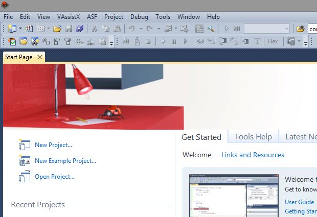

2. Plug the M0 PRO board via the "Programming Port" into a USB port of your PC

3. Go to "Tools -> Device Programming" or press the keys "CTRL + SHIFT + P"

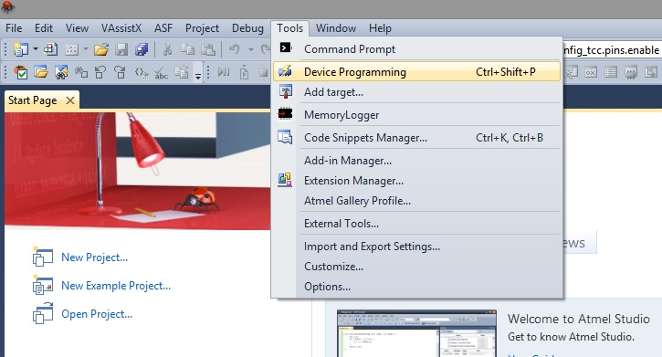

4. in Tool, select "EDBG"

5. in Device, select "ATSAMD21G18A"

6. in Interface, select "SWD"

7. press "Apply"

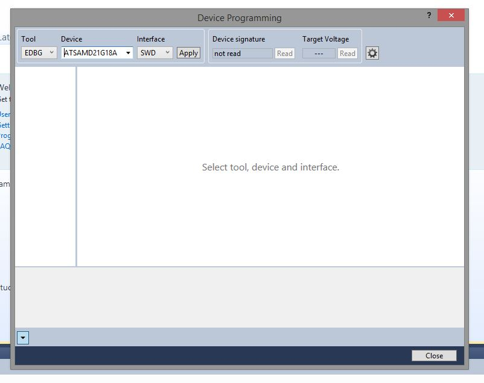

8. Go to "Memories"

9. Click "Erase now" and, if all has gone as it should, in the log console you will see "OK".

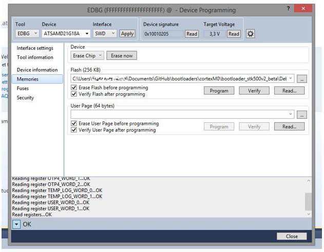

10. Go to "Fuses"

11. Ensure that the "NVMCTRL_BOOTPROT" is equal to "0x07", otherwise set this value by double clicking on the value.

12. Press "Program". In the log console, "OK" will be showed as output if everything has run smoothly.

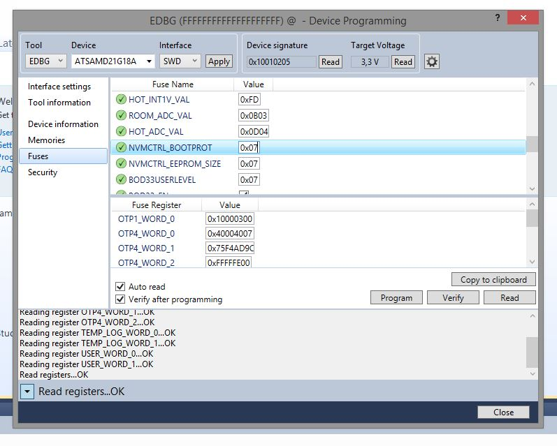

13. Go to "Memories"

14. Select the file to write (typically Bootloader_board_Vxxx.hex)

15. Click "Program" and again, in the log console you will see "OK".

### Debugging with ATMEL STUDIO 6

In this example we will be using Arduino Software (IDE) and [Atmel Studio 6](http://www.atmel.com/tools/ATMELSTUDIO.aspx).

#### Creating the file needed for debugging

Launch the Arduino Software (IDE), open the blink.ino sketch and then select the Arduino M0 Pro (Programming Port) from the boards menu :

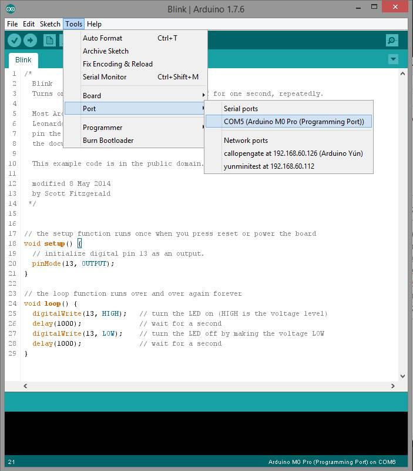

Comment out rows 26 and 28, to remove the delay call and save the sketch with a new name (i.e. save it as blink1.ino) :

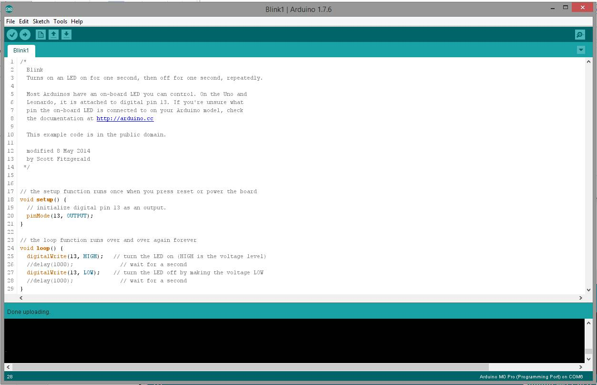

Click the arrow button so to compile the sketch and programming the Arduino M0 Pro. Once done, at this point copy into your clipboard the Blink1.cpp.bin path reported in the output shell (e.g. : C:\Users\...........\AppData\Local\Temp\build6278736204043834605.tmp) :

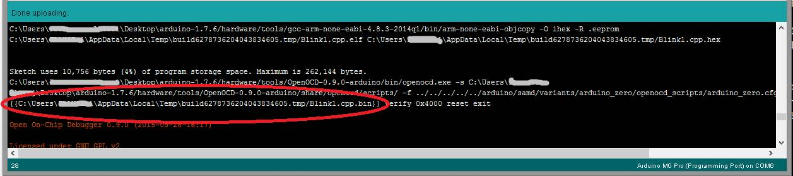

#### Use Atmel Studio 6 for debug

Now launch Atmel Studio 6 and from its main menu browse to : File -> Open -> Open Object File For Debugging

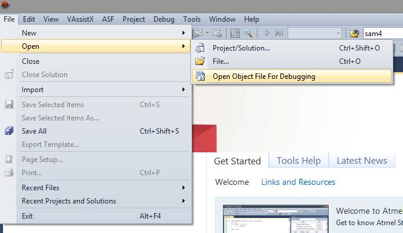

Select the file Blink1.cpp.elf in Object file To Debug, then click 'next' :

Choose SAMD21G18A, as shown in the next picture, and press 'finish' :

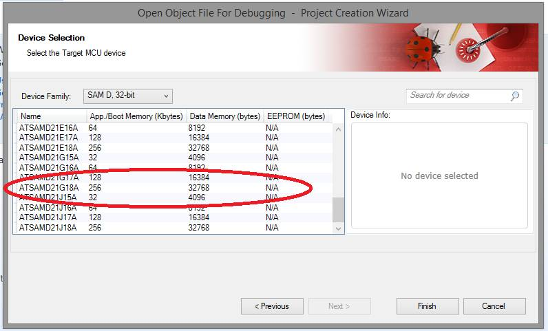

At this point, the "Remap Object Files To Disk Files" window will pop-up :

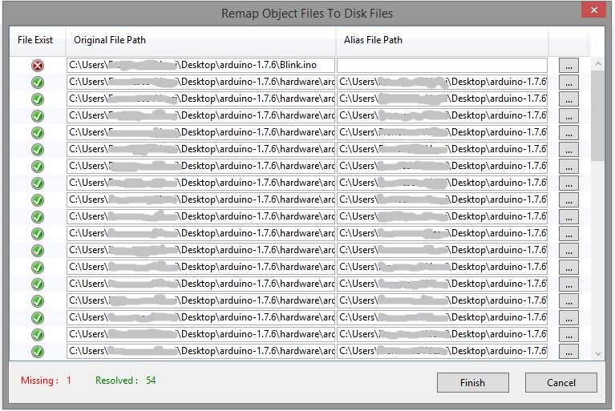

Select the three-point box in the same row of the Blink1.ino file:

[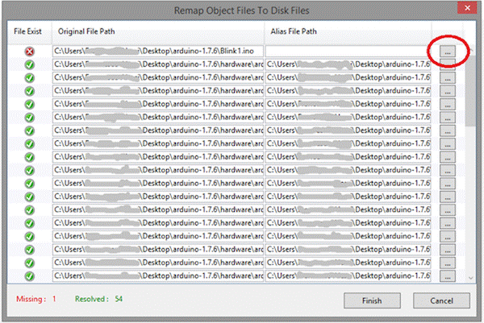](https://arduino.cc/en/uploads/Guide/M0_ADV_DBG_image018.gif)

and open the Blink1.ino file itself, then click on finish. Open now the Blink1.ino entry in the Solution Explorer workspace of the main window of Atmel Studio:

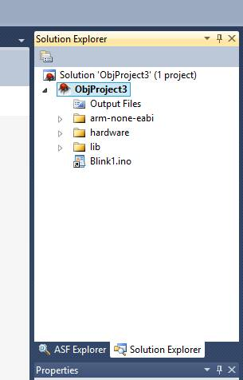

Click on the left side (the grayed out part) of the source code window to put a breakpoint (for example at row 25) in it:

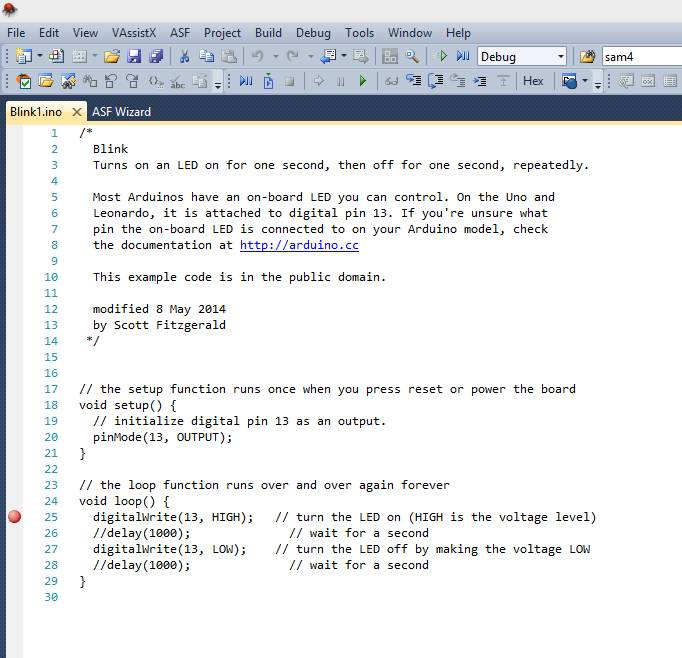

Press the play symbol in the top bar to start debugging:

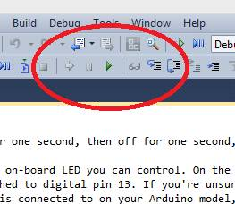

A window will pop-up asking you to choose the edbg debugger/programmer, press continue and then select the proper EDBG and SWD entries as shown in the image below:

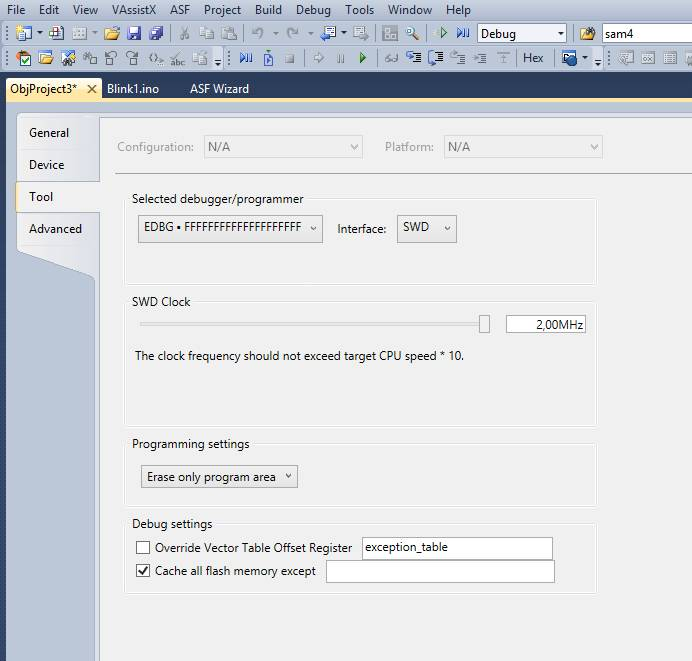

Press once again the play button and if required, update the edbg firmware entry and click play another time. Debugging will start and the code will stop at the breakpoint. You can go ahead in debugging by pressing F11 or F10. The software executes the next function or instruction, according to pressed key. Please pay attention at the code is executed on the board itself, this is why we commented out the two delay calls so to speed up the debugging example.

Go back to the Arduino M0 Pro [getting started page](././../ArduinoM0Pro/ArduinoM0Pro.md).

The text of the Arduino getting started guide is licensed under a
[Creative Commons Attribution-ShareAlike 3.0 License](http://creativecommons.org/licenses/by-sa/3.0/). Code samples in the guide are released into the public domain.
