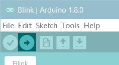
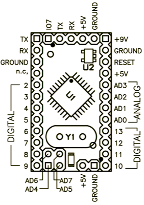
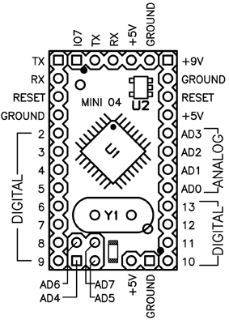
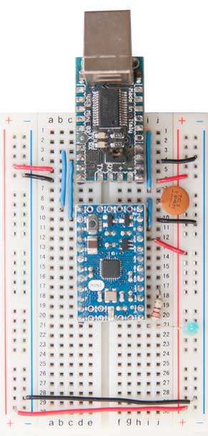
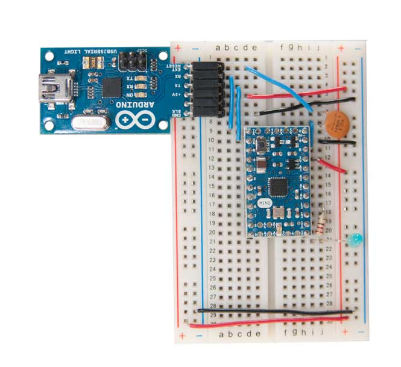
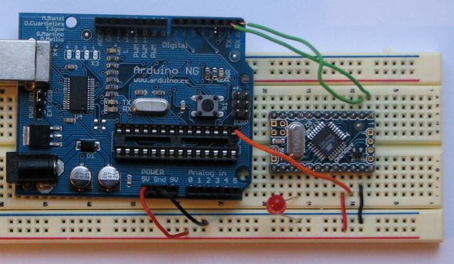

**This is a retired product.**

The Arduino Mini is a small microcontroller board originally based on the ATmega328P intended for use on breadboards and when space is at a premium. Because of its small size, connecting the Arduino Mini is a bit more complicated than a regular Arduino board ([see below](#connecting-the-arduino-mini) for instructions and photos).

The Arduino Mini is programmed using the [Arduino Software (IDE)](https://arduino.cc/en/Main/Software), our Integrated Development Environment common to all our boards and running both [online](https://create.arduino.cc/editor) and offline. For more information on how to get started with the Arduino Software visit the [Getting Started page](https://arduino.cc/en/Guide/HomePage).

### Use your Arduino Mini on the Arduino Web IDE

All Arduino boards, including this one, work out-of-the-box on the [Arduino Web Editor](https://create.arduino.cc/editor), you only need to install Arduino Create Agent to get started.

The Arduino Web Editor is hosted online, therefore it will always be up-to-date with the latest features and support for all boards. Follow this [simple guide](https://create.arduino.cc/projecthub/Arduino_Genuino/getting-started-with-arduino-web-editor-4b3e4a) to start coding on the browser and upload your sketches onto your board.

### Use your Arduino Mini on the Arduino Desktop IDE

If you want to program your Arduino Mini while offline you need to install the [Arduino Desktop IDE](https://arduino.cc/en/Main/Software)

#### Open your first sketch

Open the LED blink example sketch: **File > Examples >01.Basics > Blink**.

#### Select your board type and port

You'll need to select the entry in the **Tools > Board** menu that corresponds to your Micro board. The port will be the one corresponding to the USB to Serial you are using to interface the board.

#### Upload and Run your first Sketch

To upload the sketch to the Arduino Mini, you also need to press the reset button on the board immediately before pressing the upload button in the Arduino environment.

Click the **Upload** button in the upper left to load and run the sketch on your board:

Wait a few seconds - you should see the RX and TX leds on the board flashing. If the upload is successful, the message "Done uploading." will appear in the status bar.

The Arduino Micro doesn't have a built-in LED, therefore the Blink sketch needs a LED connected between D13 and GND to show its effects. A resistor is already mounted on that I/O to protect the microcontroller from overcurrents.

#### Learn more on the Desktop IDE

[See this tutorial](https://create.arduino.cc/projecthub/Arduino_Genuino/getting-started-with-the-arduino-software-ide-623be4) for a generic guide on the Arduino IDE with a few more infos on the Preferences, the Board Manager, and the Library Manager.

### Tutorials

Now that you have set up and programmed your Arduino Mini board, you may find inspiration in our [Project Hub](https://create.arduino.cc/projecthub/products/arduino-mini-05) tutorial platform.

### Please Read...

#### Information about the Arduino Mini

The microcontroller (an ATmega328P) on the Arduino Mini is a physically smaller version of the chip on the USB Arduino boards, with the following small difference:

- There are two extra analog inputs on the Mini (8 total). Four of these, however, are not connected to the legs that come on the Arduino Mini, requiring you to solder wires to their holes to use them. Two of these unconnected pins are also used by the Wire library (I2C), meaning that its use will require soldering as well.

Also, the Arduino Mini is more **fragile and easy to break** than a regular Arduino board.

- Don't connect more than 9 volts to the +9V pin or reverse the power and ground pins of your power supply, or you might kill the ATmega328P on the Arduino Mini.

- You can't remove the ATmega328P, so if you kill it, you need a new Mini.

#### Connecting the Arduino Mini

Here's a diagram of the pin layout of the Arduino Mini:

_Mini 03 pinout_ (compatible with earlier revisions)

_Mini 04 and 05 pinout_ (the ground on the left has moved down one pin)

To use the Arduino Mini, you need to connect:

- Power. This can be a regulated +5V power source (e.g. from the +5V pin of the Mini USB Adapter or an Arduino NG) connected to the +5V pin of the Arduino Mini. Or, a +9V power source (e.g. a 9 volt battery) connected to the +9V pin of the Arduino Mini.

- Ground. One of the ground pins on the Arduino Mini must be connected to ground of the power source.

- TX/RX. These pins are used both for uploading new sketches to the board and communicating with a computer or other device.

- Reset. Whenever this pin is connected to ground, the Arduino Mini resets. You can wire it to a pushbutton, or connect it to +5V to prevent the Arduino Mini from resetting (except when it loses power). If you leave the reset pin unconnected, the Arduino Mini will reset randomly.

- An LED. While not technically necessary, connecting an LED to the Arduino Mini makes it easier to check if it's working. Pin 13 has a 1 KB resistor on it, so you can connect an LED to it directly between it and ground. When using another pin, you will need an external resistor.

You have a few options for connecting the board: the Mini USB Adapter, a regular Arduino board, or your own power supply and USB/Serial adapter.

#### Connecting the Arduino Mini and Mini USB Adapter

The circuit shown here is the basic setup for an Arduino mini connected to a USB-to-serial converter. You can see power and ground from the USB are run to the rails of the breadboard so it's convenient for the other components on the board. The 0.1uF capacitor from the reset pin is connected to the RTS pin on the mini USB adaptor. This enables auto-reset when the serial port is opened, meaning you don't have to press the reset button every time you upload new code. If it gives you problems, you can remove it, and press reset every time.

You can use a USBSerial connector wired up in a similar fashion :

#### Connecting the Arduino Mini and a regular Arduino

Here's a photo of the Arduino Mini connected to an Arduino NG. The NG has its ATmega8 removed and is being used for its USB connection, power source, and reset button. Thus, you can reset the Arduino Mini just by pressing the button on the NG.

The text of the Arduino getting started guide is licensed under a
[Creative Commons Attribution-ShareAlike 3.0 License](http://creativecommons.org/licenses/by-sa/3.0/). Code samples in the guide are released into the public domain.
