**This is a retired product.**

The Arduino Primo combines the processing power from the Nordic nRF52 processor, an Espressif ESP8266 for WiFi, as well as several on-board sensors and a battery charger. The nRF52 includes NFC (Near Field Communication) and Bluetooth® Smart. The sensors include an on-board button, LED and infrared receiver and transmitter.

The Arduino Primo is programmed using the [Arduino Software (IDE)](https://arduino.cc/en/Main/Software), our Integrated Development Environment common to all our boards and running both [online](https://create.arduino.cc/editor) and offline. For more information on how to get started with the Arduino Software visit the [Getting Started page](https://arduino.cc/en/Guide/HomePage).

### Use your Arduino Primo on the Arduino Web IDE

All Arduino boards, including this one, work out-of-the-box on the [Arduino Cloud Editor](https://create.arduino.cc/editor), you only need to install Arduino Create Agent to get started.

The Arduino Cloud Editor is hosted online, therefore it will always be up-to-date with the latest features and support for all boards. Follow this [simple guide](https://create.arduino.cc/projecthub/Arduino_Genuino/getting-started-with-arduino-web-editor-4b3e4a) to start coding on the browser and upload your sketches onto your board.

### Use your Arduino Primo on the Arduino Desktop IDE

If you want to program your Arduino Primo while offline you need to install the [Arduino Desktop IDE](https://arduino.cc/en/Main/Software) and add the Arduino NRF52 Core to it. This simple procedure is done selecting **Tools menu**, then **Boards** and last **Boards Manager**, as documented in the [Arduino Boards Manager](https://arduino.cc/en/Guide/Cores) page.

#### Installing Drivers for the Primo

**OSX and Windows (tested on XP, 7, Vista and 10)**
No driver installation is necessary for these operating system after core installation.

**Linux**
Before you can use the board on Linux machines you needs to execute the [following script](https://arduino.cc/en/Sh/Txt).

#### Open your first sketch

Open the LED blink example sketch: **File > Examples >01.Basics > Blink**.

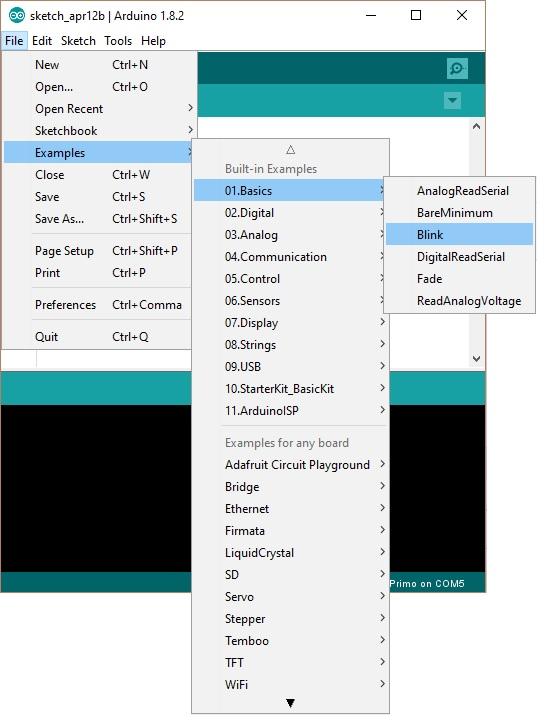

#### Select your board type and port

You'll need to select the entry in the **Tools > Board** menu that corresponds to your Arduino board.

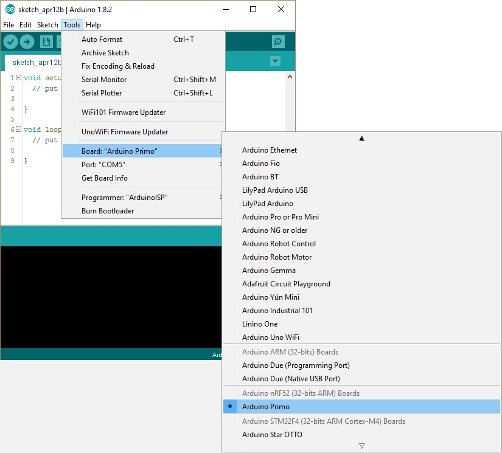

Select the serial device of the board from the Tools | Serial Port menu. This is likely to be **COM3** or higher (**COM1** and **COM2** are usually reserved for hardware serial ports). To find out, you can disconnect your board and re-open the menu; the entry that disappears should be the Arduino board. Reconnect the board and select that serial port.

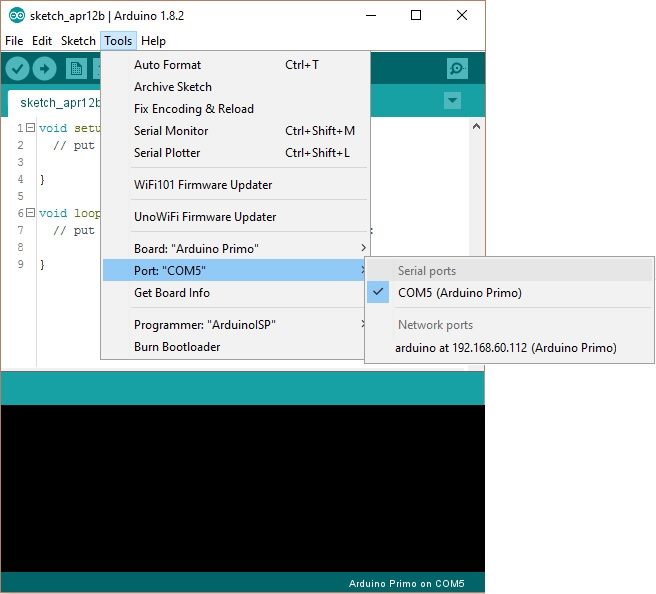

#### Upload the program

Now, simply click the "Upload" button in the environment.

Wait a few seconds - you should see the RX and TX LEDs on the board flashing. If the upload is successful, the message "Done uploading." will appear in the status bar.

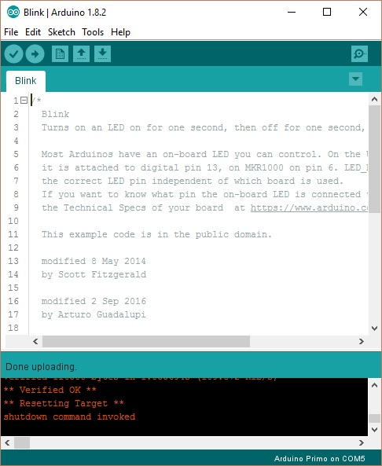

A few seconds after the upload finishes, you should see the on-board LED L9 start to blink. If it does, congratulations! You've gotten your Primo board up-and-running. If you have problems, please see the [troubleshooting suggestions](https://arduino.cc/en/Guide/Troubleshooting).

### Tutorials

Now that you have set up and programmed your Primo board, you may find inspiration in our [Project Hub](https://create.arduino.cc/projecthub/) tutorial platform, or have a look to the tutorial pages that explain how to use the various features of your board.

### Please Read...

#### First configuration

Your Arduino Primo needs a first configuration to join your WiFi network and it allows you to enter the relevant information creating its own Access Point. Please execute the following procedure every time you bring Arduino Primo in a location where the WiFi network access needs to be reconfigured.

Power the board and wait some time.
Search the board in the network list, it has an ESSID like this: **Arduino-Primo-xxxxxx**.

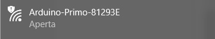

Connect your PC/MAC to the Arduino Primo AP:

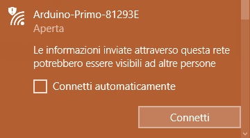

Open a browser and connect at this address: [http://192.168.240.1/](http://192.168.240.1/)

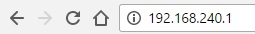

This is the screen that it will appear:

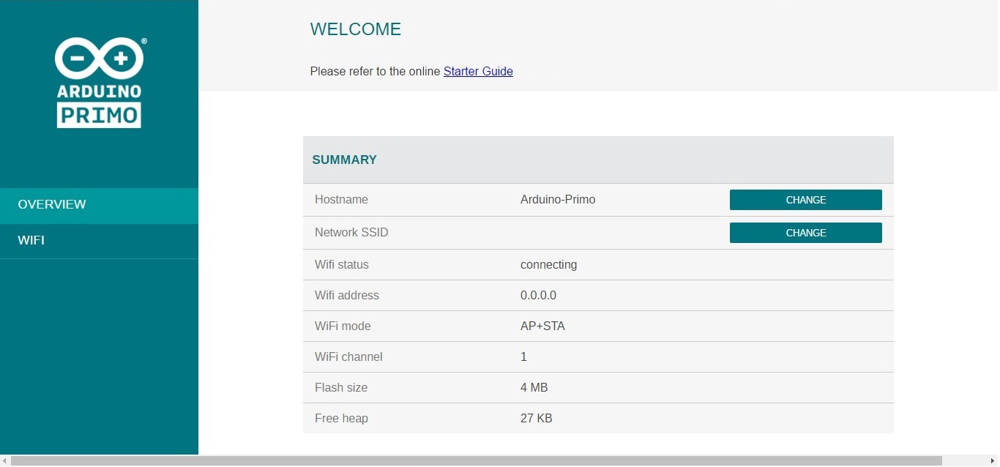

If you want to modify the hostname of the board then click on **CHANGE** from **OVERVIEW** menu or select the **WiFi** on the left menu and insert a new name under **HOSTNAME** field and after click on **CHANGE**.

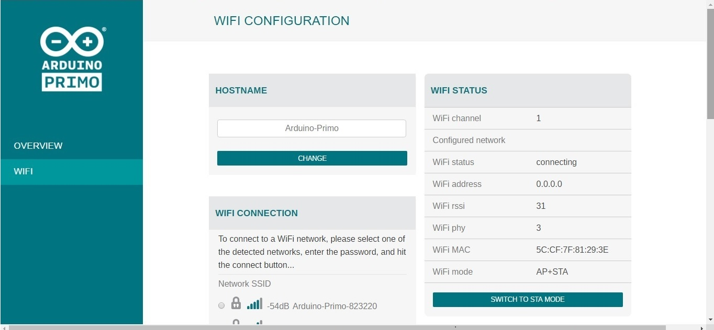

Connect the Arduino Primo to yours Access Point Router, selecting your network from WiFi Connection Menu. Type the correct password and click on **CONNECT**, as shown in the below image:

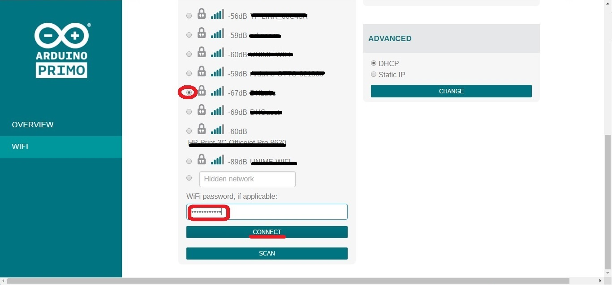

Accept the alert message:

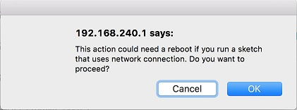

When the board will be connected to the network, it will be shown the board ip address.
Now, connect the PC to the same board network and try to access to the board inserting the ip address on the browser.
After click on **WiFi** in the left menu and change the wifi configuration mode switching to **STA MODE**, as shown in the below image:

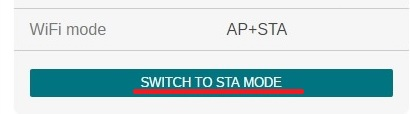

_Please note:_
It is important switching in **STA MODE** because so the board will be visible on the Arduino IDE and, furthermore, you will be able to protect it from possible attacks, since it will no longer be visible as open network.

Now your Arduino Primo is ready.

#### Hardware details

Your Arduino Primo maintains full compatibility with UNO shields and offers you some new connectors and features. The following picture details the various hardware parts of the Primo board..

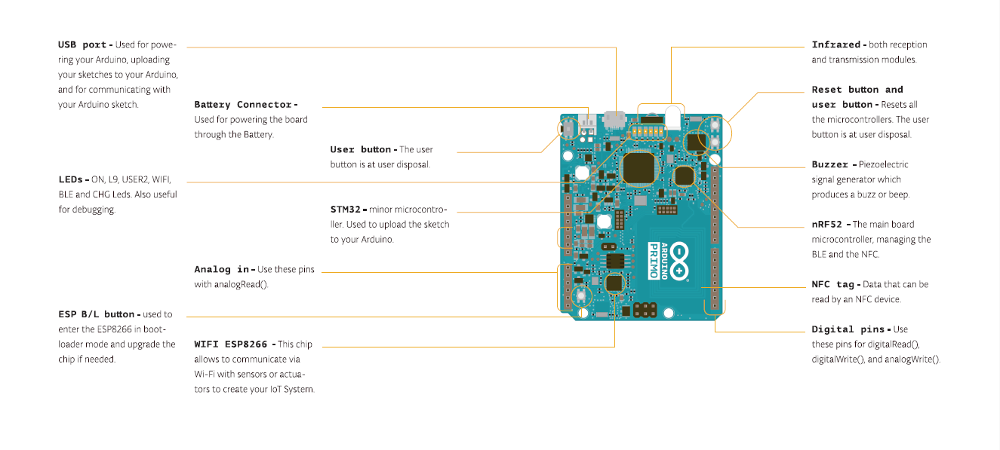

Following the **LED_BUILTIN** tradition, Arduino Primo has some other _define_ that you can use in your sketches. Following, the complete list.

- **LED_BUILTIN** - Pin 9 - LED_BUILTIN is the L9 Led onboard

- **BUZZER** - Pin 35 - Manage the buzzer onboard

- **USER1_BUTTON** - Pin 34 - used also in some Low Power library functionalities

- **USER2_BUTTON** - Pin 44 - It isn't possible to attach an Interrupt

- **USER2_LED** - Pin 38 - User2 Led onboard

- **BLE_LED** - Pin 40 - Bluetooth® Low Energy led onboard

#### Web panel functions details

The Arduino Primo has a Web Panel that it can be reached in different ways:

- If the board isn't been configured yet, you can access inserting in browser this address: **[http://192.168.240.1/](http://192.168.240.1/)**

In this case look at the First Configuration above to configure it.

- If the board is been correctly configured then you can insert the **ip address** (xxx.xxx.xxx.xxx) or the **hostname**(hostname.local/) from browser.

The Web Panel has a simple menu that it is formed from two items: **OVERVIEW** and **WIFI**.

The Home page of the Web Panel is the **OVERVIEW**. Here are shown all the information about the board, in particular the hostname, the network SSID, the Wifi address and the Wifi mode:

Selecting the **WIFI** section, you can change the hostname of the board, typing the new name in the dedicated field and clicking on **CHANGE** button, as shown in the below image:

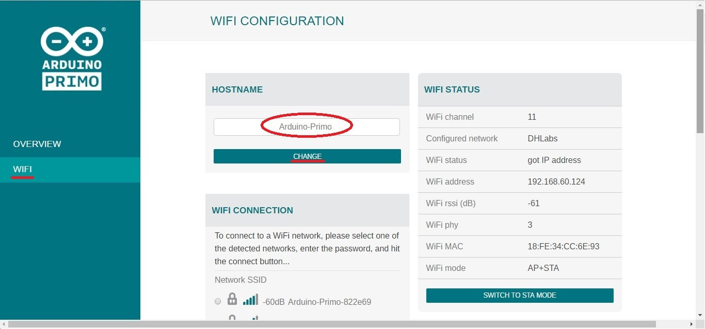

It is possible to switch to **STA MODE** or **STA+AP MODE** clicking the specific button in the WIFI STATUS box.

_Please note:_
Keep in mind that it is advised to switch only in STA MODE because so the board will be visible on the Arduino IDE and you will be able to protect it from possible attacks, since it will no longer be visible as open network.

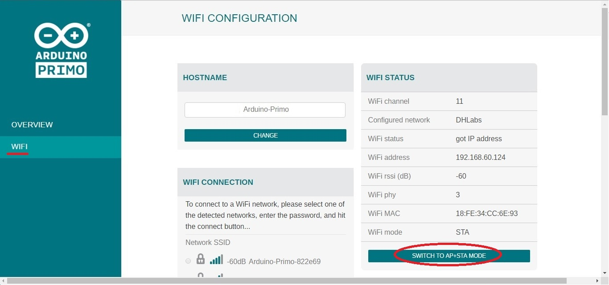

Furthermore from the **WIFI** menu you can connect the board at your network, selecting it from WiFi Connections field, inserting the correct password and clicking on **CONNECT** button.

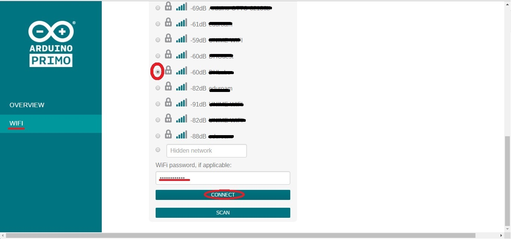

In this section you can also choose if to use the DHCP or the Static IP, as shown in the picture:

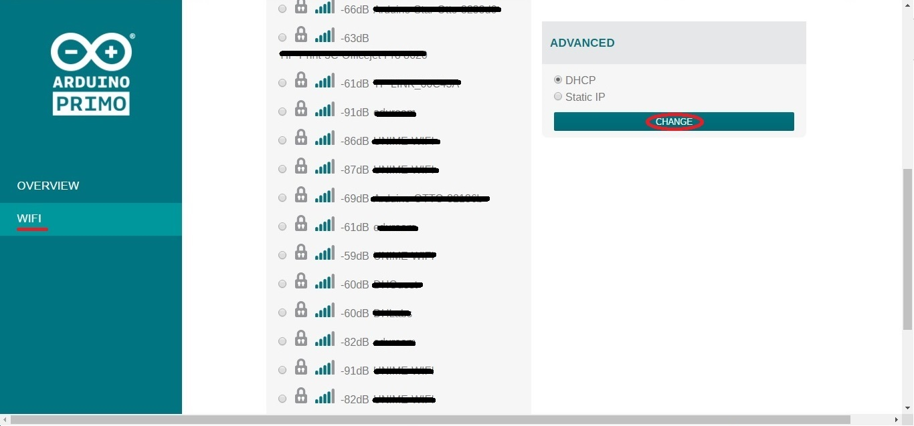

The text of the Arduino getting started guide is licensed under a
[Creative Commons Attribution-ShareAlike 3.0 License](http://creativecommons.org/licenses/by-sa/3.0/). Code samples in the guide are released into the public domain.
