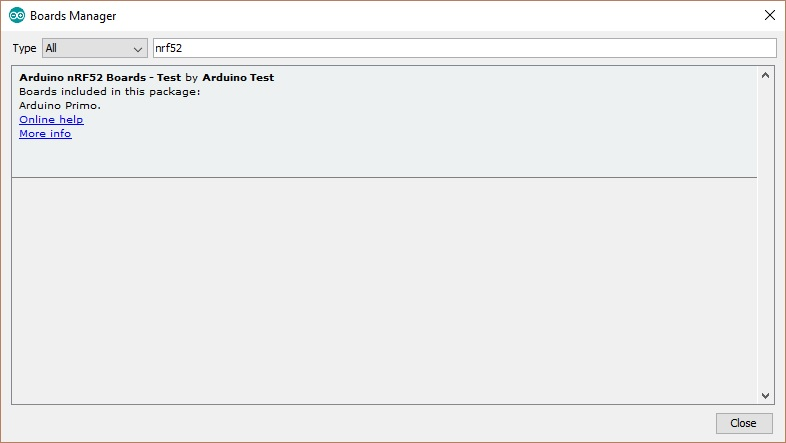
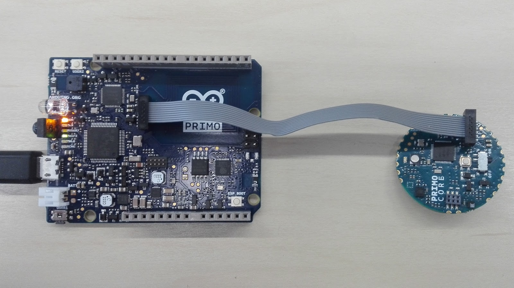
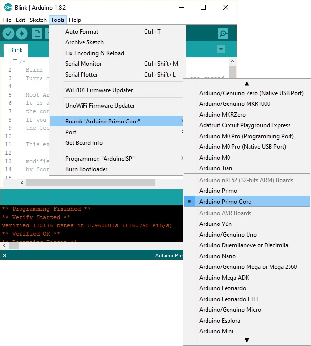
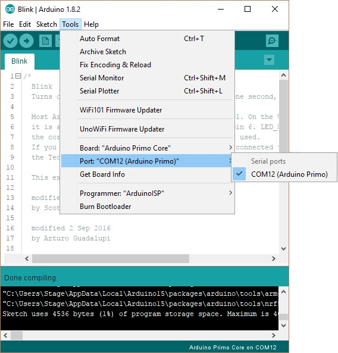
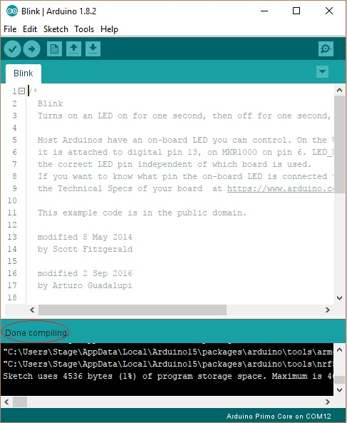
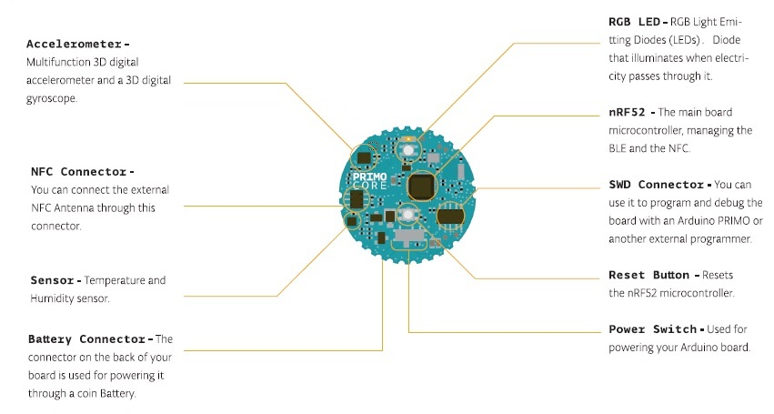

**This is a retired product.**

The PRIMO CORE is a compact device, using a Nordic nrf52832 chip with Bluetooth® smart (Bluetooth® Low Energy 4.0) and NFC-A tag functions , and also integrated motion and environmental sensors. The low power consumption permits powering the Primo Core with a coin cell battery.

The Arduino Primo Core is programmed using the [Arduino Software (IDE)](https://arduino.cc/en/Main/Software), our Integrated Development Environment common to all our boards and running only offline for this board. For more information on how to get started with the Arduino Software visit the [Getting Started page](https://arduino.cc/en/Guide/HomePage).

### Use your Arduino Primo Core on the Arduino Desktop IDE

If you want to program your Arduino Primo Core you need to install the [Arduino Desktop IDE](https://arduino.cc/en/Main/Software) and add the Arduino NRF52 Core to it. This simple procedure is done selecting **Tools menu**, then **Boards** and last **Boards Manager**, as documented in the [Arduino Boards Manager](https://arduino.cc/en/Guide/Cores) page. To find the proper core, you should search for Arduino nRF52.

#### Installing Drivers for the Primo Core

This board needs an external programmer like an Arduino Primo or an Atmel ICE; you also need an SWD connector that is not included in the box. Please install the relevant driver to connect the chosen programmer to your computer.

#### Open your first sketch

Open the LED blink example sketch: **File > Examples >01.Basics > Blink**.

#### Use an Arduino Primo as the programmer

In this procedure we assume that you will be using an Arduino Primo as the programming device. First connect the Arduino Primo Core to the Arduino Primo using a SWD connector. After plug-in the Arduino Primo to PC by an USB data cable and check that the button onboard is ON position. You should end up in a situation like the one below.

#### Select your board type and port

You'll need to select the entry in the **Tools > Board** menu that corresponds to your Arduino Primo Core.

Select the serial device of the board from the Tools | Serial Port menu. This is likely to be **COM3** or higher (**COM1** and **COM2** are usually reserved for hardware serial ports). To find out, you can disconnect the Arduino Primo board and re-open the menu; the entry that disappears should be the Arduino board. Reconnect the board and select that serial port.

#### Upload the program

Now, simply click the "Upload" button in the environment.

Wait a few seconds and look at the status bar at the bottom of the IDE interface. If the upload is successful, the message "Done uploading." will appear in the status bar.

A few seconds after the upload finishes, you should see the on-board LED starting to blink. If it does, congratulations! You've gotten your Primo Core board up-and-running. If you have problems, please see the [troubleshooting suggestions](https://arduino.cc/en/Guide/Troubleshooting).

### Tutorials

Now that you have set up and programmed your Primo board, you may find inspiration in our [Project Hub](https://create.arduino.cc/projecthub/) tutorial platform, or have a look to the tutorial pages that explain how to use the various features of your board.

### Please Read...

#### Hardware details

Your Arduino Primo Core supports its own piggyback modules to add functionalities. An NFC antenna is available to enable NFC functionality of the Nordic nRF52832.microcontroller. The following picture details the various hardware parts of the Primo Core board..

Following the **LED_BUILTIN** tradition, Arduino Primo Core has some other _define_ that you can use in your sketches. Following, the complete list.

- **LED_BUILTIN** - Blue LED onboard

- **LED_BUILTIN** - Blue LED onboard

- **RED_LED** - Red LED of RGB LED chip

- **GREEN_LED** - Green LED of RGB LED chip

- **BLUE_LED** - Blue LED of RGB LED chip

- **BLE_LED** - Blue LED of RGB LED chip

The text of the Arduino getting started guide is licensed under a
[Creative Commons Attribution-ShareAlike 3.0 License](http://creativecommons.org/licenses/by-sa/3.0/). Code samples in the guide are released into the public domain.
