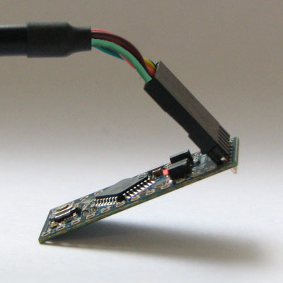
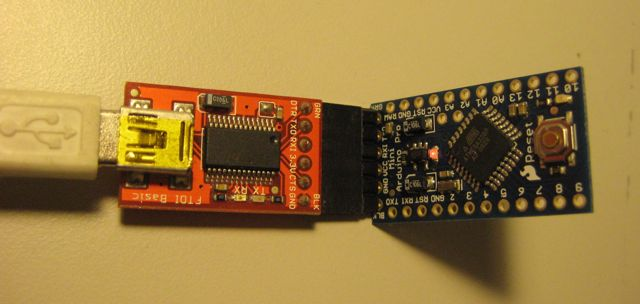

The [Arduino Pro Mini](https://store.arduino.cc/arduino-pro-mini) is intended for advanced users who require flexibility, low-cost, and small size. It comes with the minimum of components (no on-board USB or pin headers) to keep the cost down. It's a good choice for a board you want to leave embedded in a project. Please note that there are two versions of the board: one that operates at 5V (like most Arduino boards), and one that operates at 3.3V. Be sure to provide the correct power and use components whose operating voltage matches that of the board.

The Arduino Pro Mini is programmed using the [Arduino Software (IDE)](https://arduino.cc/en/Main/Software), our Integrated Development Environment common to all our boards and running both [online](https://create.arduino.cc/editor) and offline. For more information on how to get started with the Arduino Software visit the [Getting Started page](https://arduino.cc/en/Guide/HomePage).

### Use your Arduino Pro Mini on the Arduino Web IDE

All Arduino boards, including this one, work out-of-the-box on the [Arduino Web Editor](https://create.arduino.cc/editor), you only need to install Arduino Create Agent to get started.

The Arduino Web Editor is hosted online, therefore it will always be up-to-date with the latest features and support for all boards. Follow this [simple guide](https://create.arduino.cc/projecthub/Arduino_Genuino/getting-started-with-arduino-web-editor-4b3e4a) to start coding on the browser and upload your sketches onto your board.

### Use your Arduino Pro Mini on the Arduino Desktop IDE

If you want to program your Arduino Pro Mini while offline you need to install the [Arduino Desktop IDE](https://arduino.cc/en/Main/Software)

The board comes without built-in USB circuitry, so an off-board USB-to-TTL serial converter must be used to upload sketches. For the 3.3V Arduino Pro boards, this can be a [FTDI TTL-232R-3V3 USB - TTL Level Serial Converter Cable](https://ftdichip.com/products/ttl-232r-3v3/) or the SparkFun[FTDI Basic Breakout Board (3.3V)](http://www.sparkfun.com/commerce/product_info.php?products_id=8772). For the 5V Arduino Pro boards, use a [TTL-232R USB - TTL Level Serial Converter](https://ftdichip.com/products/ttl-232r-5v/) or the SparkFun[FTDI Basic Breakout Board (5V)](http://www.sparkfun.com/commerce/product_info.php?products_id=9115). (You can probably also get away with using a 5V USB-to-serial converter with a 3.3V board and vice-versa, but it's not recommended.)

If using the FTDI cable on Windows, you'll need to make one configuration change to enable the auto-reset. With the board connected, open the Device Manager (in Control Panels > System > Hardware), and find the USB Serial Port under Ports. Right-click and select properties, then go to Port Settings > Advanced and check Set RTS on Close under Miscellaneous Options.

#### Open your first sketch

Open the LED blink example sketch: **File > Examples >01.Basics > Blink**.

#### Select your board type and port

For the 3.3V versions of the Arduino Pro Mini, select **Arduino Pro or Pro Mini (3.3V, 8 MHz) w/ ATmega328P** or **Arduino Pro or Pro Mini (3.3V, 8 MHz) w/ ATmega168** from the **Tools > Board** menu (depending on the microcontroller on your board). For the 5V versions of the Arduino Pro Mini, select **Arduino Duemilanove or Nano w/ ATmega328P** or **Arduino Diecimila, Duemilanove, or Nano w/ ATmega168**.

_The Arduino Pro Mini connected to (and powered by) an FTDI TTL-232R-3V3 USB - TTL Level Serial Converter Cable. The green and black wires align with the labels "GRN" and "BLK" written next to the holes._

_The Arduino Pro Mini connected to (and powered by) a SparkFun FTDI Basic Breakout Board and USB Mini-B cable. Note that on earlier Pro Mini boards the orientation of the 6-pin header may be reversed; check that the words GRN and BLK align on the Pro Mini and FTDI Basic Breakout._

#### Upload and Run your first Sketch

To upload the sketch to the Arduino Pro Mini, you need to press the upload button in the Arduino environment.

Click the **Upload** button in the upper left to load and run the sketch on your board:

Wait a few seconds - you should see the RX and TX LEDs on the board flashing. If the upload is successful, the message "Done uploading." will appear in the status bar.

#### Learn more on the Desktop IDE

[See this tutorial](https://create.arduino.cc/projecthub/Arduino_Genuino/getting-started-with-the-arduino-software-ide-623be4) for a generic guide on the Arduino IDE with a bit more info on the Preferences, the Board Manager, and the Library Manager.

### Tutorials

Now that you have set up and programmed your Arduino Pro Mini board, you may find inspiration in our [Project Hub](https://create.arduino.cc/projecthub) tutorial platform.

<iframe frameborder='0' height='410' scrolling='no' src='https://create.arduino.cc/projecthub/sfrwmaker/simple-fm-radio-5bb328/embed?use_route=project' width='354' style='margin-top:30px; margin-right:20px'></iframe><iframe frameborder='0' height='410' scrolling='no' src='https://create.arduino.cc/projecthub/rayburne/magic-morse-on-arduino-f48633/embed?use_route=project' width='354' style='margin-top:30px'></iframe>
!!!Please Read...

#### Power

The board can be powered through USB via the six-pin programming header or from a regulated 5V or 3.3V (depending on the model) supply applied to the VCC pin or an unregulated supply on the RAW pin.

#### Connectors

Any standard 0.1" spaced header can be soldered to the holes on the Arduino Pro Mini. To use every pin requires two 12-pin headers, plus a six-pin header for programming if desired. Bare wire can also be soldered directly to the holes.

The text of the Arduino getting started guide is licensed under a
[Creative Commons Attribution-ShareAlike 3.0 License](http://creativecommons.org/licenses/by-sa/3.0/). Code samples in the guide are released into the public domain.
