**This is a retired product.**

The Arduino Uno WiFi is an Arduino Uno with an integrated WiFi module. The board is based on the ATmega328P with an ESP8266WiFi Module integrated. The ESP8266WiFi Module is a self contained SoC with integrated TCP/IP protocol stack that can give access to your WiFi network (or the device can act as an access point). One useful feature of Uno WiFi is support for OTA (over-the-air) programming, either for transfer of Arduino sketches or WiFi firmware.

The Arduino Uno WiFi is programmed using the [Arduino Software (IDE)](https://arduino.cc/en/Main/Software), our Integrated Development Environment common to all our boards and running both [online](https://create.arduino.cc/editor) and offline. For more information on how to get started with the Arduino Software visit the [Getting Started page](https://arduino.cc/en/Guide/HomePage).

### Use your Arduino Uno WiFi on the Arduino Web IDE

All Arduino boards, including this one, work out-of-the-box on the [Arduino Cloud Editor](https://create.arduino.cc/editor), you only need to install Arduino Create Agent to get started.

The Arduino Cloud Editor is hosted online, therefore it will always be up-to-date with the latest features and support for all boards. Follow this [simple guide](https://create.arduino.cc/projecthub/Arduino_Genuino/getting-started-with-arduino-web-editor-4b3e4a) to start coding on the browser and upload your sketches onto your board.

### Use your Arduino Uno WiFi on the Arduino Desktop IDE

If you want to program your Arduino Uno WiFi while offline you need to install the [Arduino Desktop IDE](https://arduino.cc/en/Main/Software). Full instructions on how to install it can be found in our [Getting Started page](https://arduino.cc/en/Guide/HomePage).

#### Installing Drivers for the Uno WiFi

**OSX**
The first time you plug an Uno WiFi into a Mac, the "Keyboard Setup Assistant" will launch. There's nothing to configure with the UNO WiFi, so you can close this window by clicking the red button in the top left of the window.

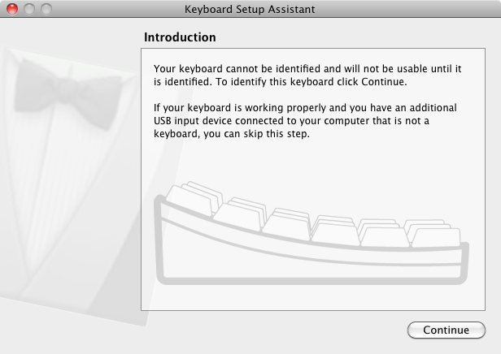

**Windows (tested on XP, 7, Vista and 10)**
At this point of this Getting Started guide you already have installed the drivers together with the Arduino Software (IDE) and the board will be recognized automatically.

**Linux**
There is no need to install drivers for Ubuntu 10.0.4 and later, but make sure port 5353 is not being blocked by a firewall.

#### Open your first sketch

Open the LED blink example sketch: **File > Examples >01.Basics > Blink**.

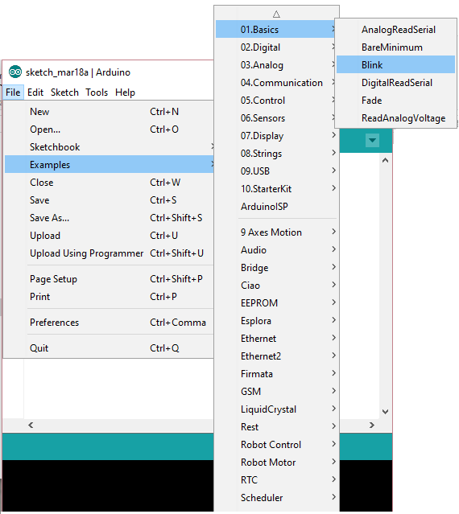

#### Select your board type and port

You'll need to select the entry in the **Tools > Board** menu that corresponds to your Arduino Uno WiFi board.

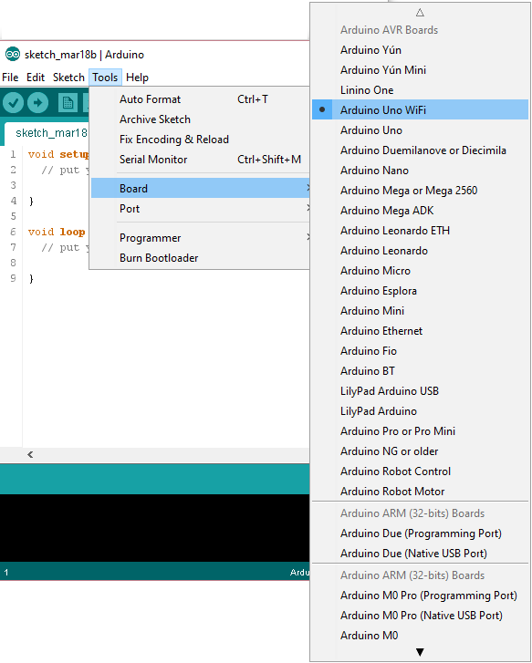

Select the serial device of the board from the Tools | Serial Port menu. This is likely to be **COM3** or higher (**COM1** and **COM2** are usually reserved for hardware serial ports). To find out, you can disconnect your board and re-open the menu; the entry that disappears should be the Arduino Uno WiFi board. Reconnect the board and select that serial port.

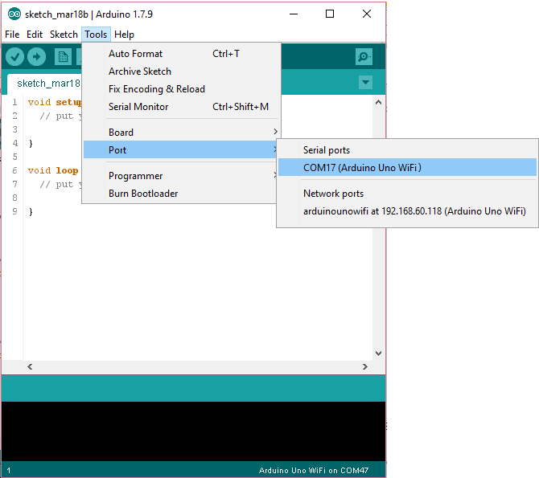

#### Upload the program

Now, simply click the "Upload" button in the environment.

Wait a few seconds - you should see the RX and TX LEDs on the board flashing. If the upload is successful, the message "Done uploading." will appear in the status bar.

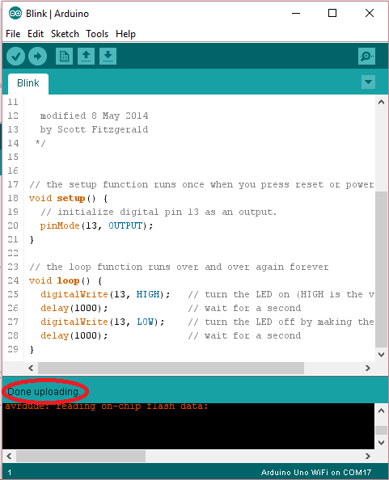

A few seconds after the upload finishes, you should see the on-board LED start to blink. If it does, congratulations! You've gotten your Uno WiFi board up-and-running for the USB programming. If you have problems, please see the [troubleshooting suggestions](https://arduino.cc/en/Guide/Troubleshooting).

### Programming via OTA

This board allows you to upload your sketches over the air (OTA) using the WiFi connection. To get this method working, you need that your board is already connected to the same WiFi network to which your PC is connected. Please refer to the _First Configuration_ chapter below to configure and connect the Arduino Uno WiFi to your WiFi network.

Power the board using the USB cable and a 5V USB power supply or use an external power supply connected to the power connector..
Now the procedure to program the board via OTA is the same of that shown above but it differs only when you select the port. Here are all the steps..

#### Select your board type and port

You'll need to select the entry in the **Tools > Board** menu that corresponds to your Arduino Uno WiFi board.

Select the board from **Tool>Port>Network** ports menu it will appear a device as shown in the below image:

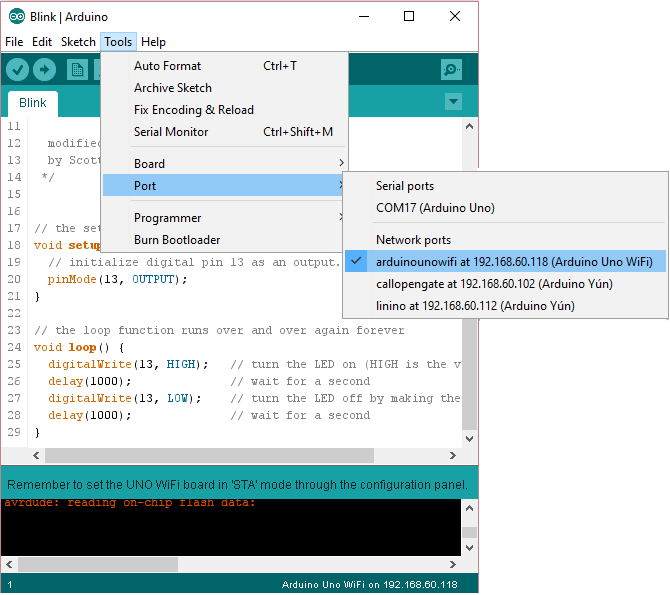

**Note:**
Be sure that the PC and the board are connected to the same network and that the board is in STA MODE, for more information see _First Configuration_ below.

#### Upload the program

Now, simply click the "Upload" button in the environment.

Wait a few seconds - you should see the RX and TX LEDs on the board flashing. If the upload is successful, the message "Done uploading." will appear in the status bar.

A few seconds after the upload finishes, you should see the on-board LED start to blink. If it does, congratulations! You've gotten your Uno WiFi board up-and-running for the USB programming. If you have problems, please see the [troubleshooting suggestions](https://arduino.cc/en/Guide/Troubleshooting).

### Tutorials

Now that you have set up and programmed your Uno WiFi board, you may find inspiration in our [Project Hub](https://create.arduino.cc/projecthub/) tutorial platform, or have a look to the tutorial pages that explain how to use the various features of your board. We suggest that you visit the [Ciao Library page](https://arduino.cc/en/Reference/Ciao) that explains the peculiar functions of this and a few other Arduino boards like the Yún family and the Industrial 101..

### Please Read...

#### First configuration

Your Arduino Uno WiFi needs a first configuration to join your WiFi network and it allows you to enter the relevant information creating its own Access Point. Please execute the following procedure every time you bring Arduino Uno WiFi in a location where the WiFi network access needs to be reconfigured.

Power the board and wait some time.
Search the board in the network list, it has an ESSID like this: **Arduino-Uno-WiFi-xxxxxx**.
Connect your PC/MAC to the Arduino Uno WiFi AP:
Open a browser and connect at this address: [http://192.168.240.1/](http://192.168.240.1/)

This is the screen that it will appear:

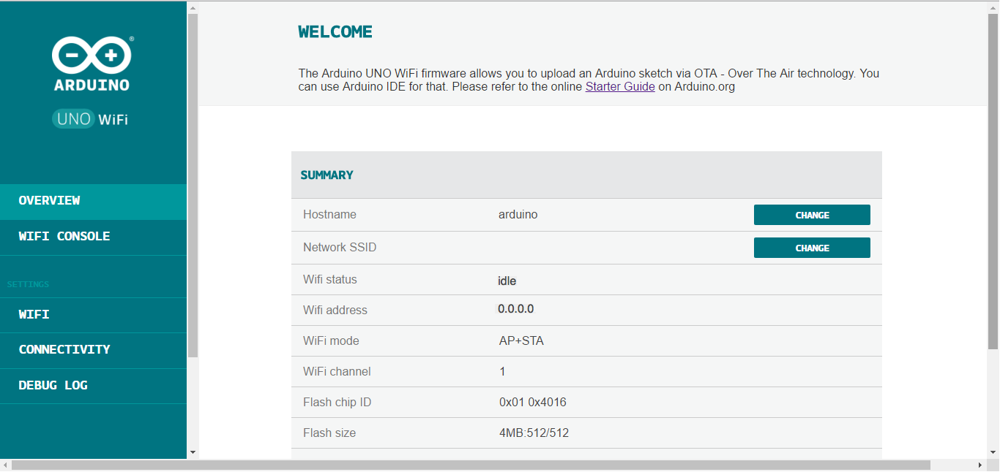

If you want to modify the hostname of the board then click on **CHANGE** from **OVERVIEW** menu or select the **WiFi** on the left menu and insert a new name under **HOSTNAME** field and after click on **CHANGE**.

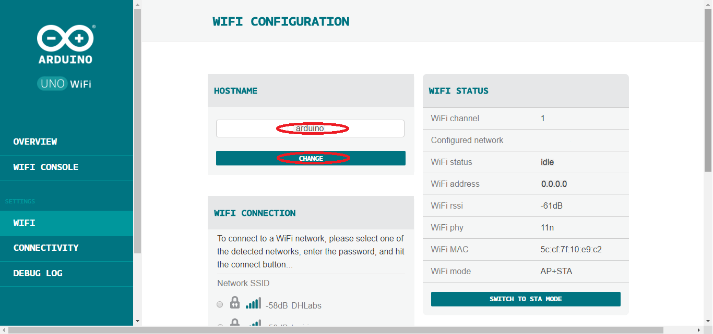

Connect the Arduino Uno WiFi to your AccessPoint Router, selecting your network from the **WiFi Menu**, insert the correct password and then click on **CONNECT**, as shown in the image below:

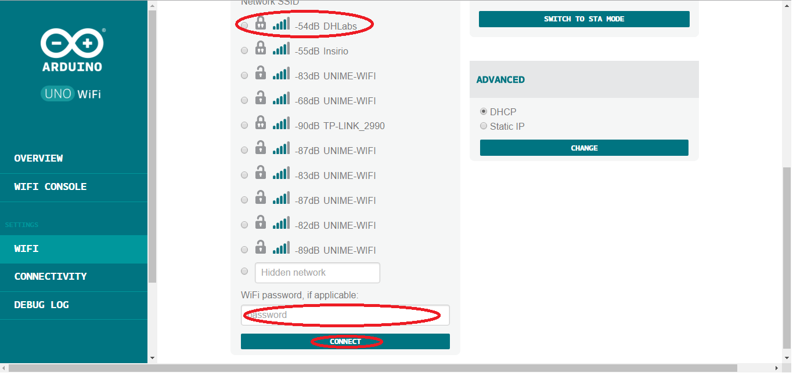

When the board is connected to the network, the ip address will appear at the top of the panel:

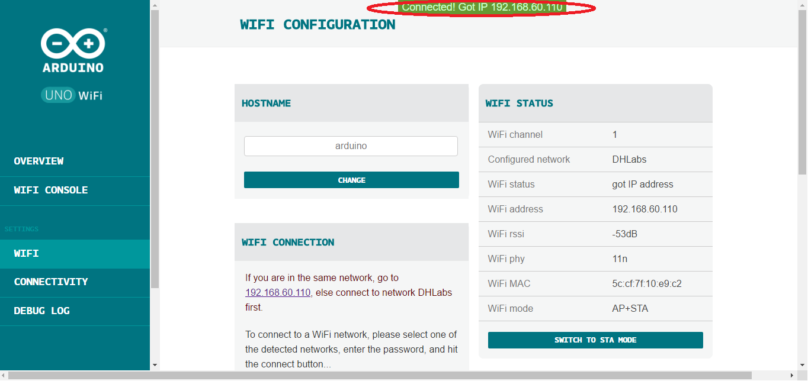

Now connect the PC to the same network to which the board is connected and try to access the board by inserting the ip address in the browser.

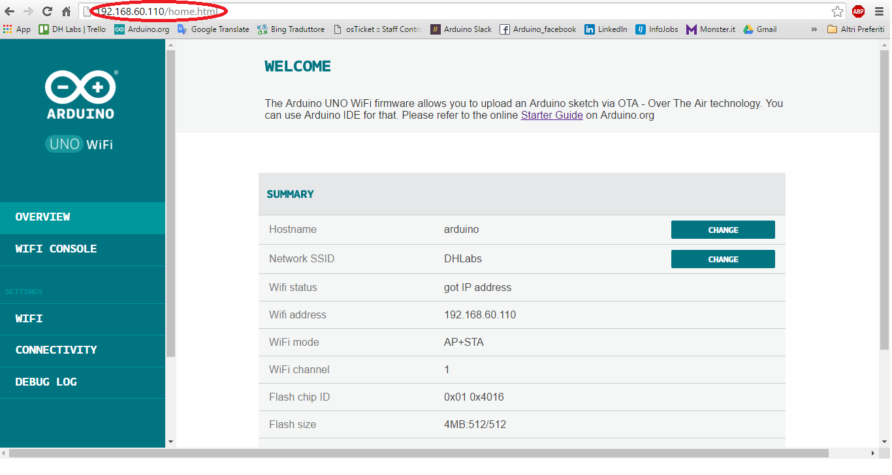

Click on **WiFi** in the left menu and change the Wi-Fi configuration mode switching to **STA MODE**, as shown in the image below:

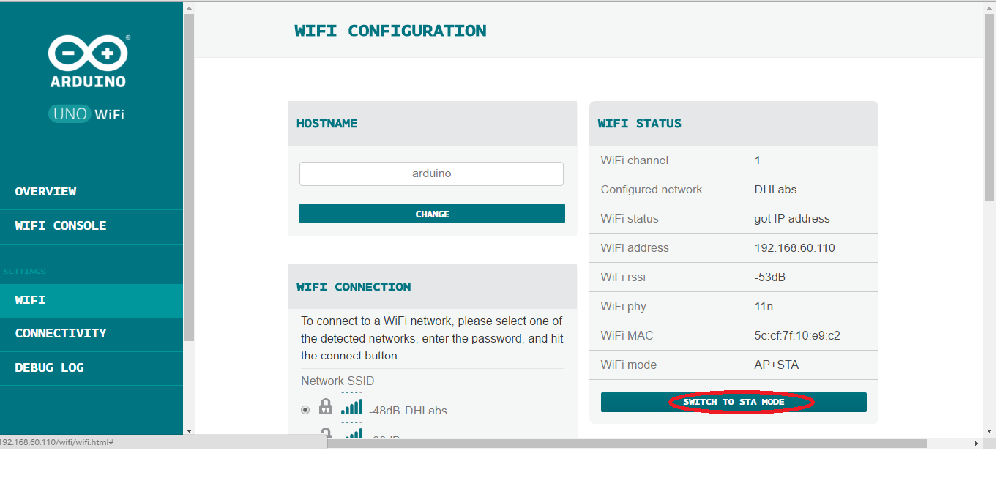

_Please note:_
It is important switching in **STA MODE** because so the board will be visible on the Arduino IDE and, furthermore, you will be able to protect it from possible attacks, since it will no longer be visible as open network.

Now the "Mode Changed" message should appear at the top of the panel:

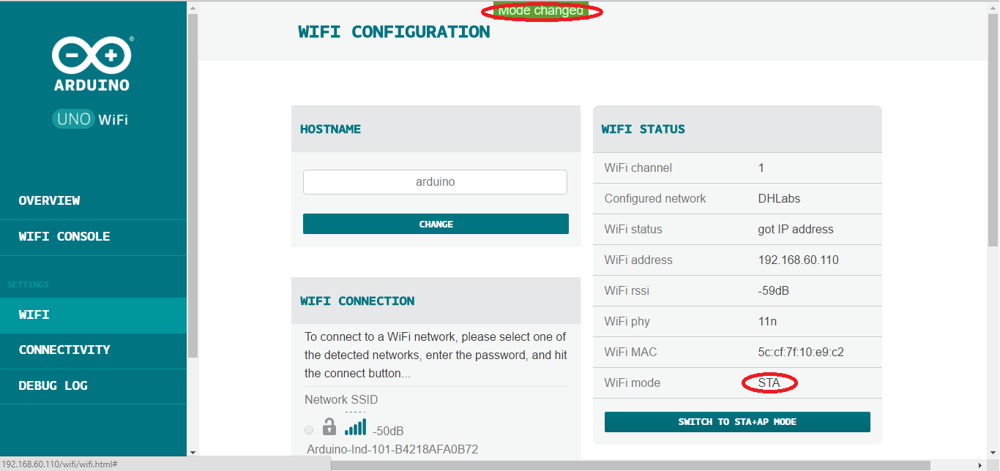

Now, you can access the webpage using your hostname: [http://hostname.local](http://hostname.local)

Your Arduino UNO WiFi is ready.

#### Web panel functions details

The Arduino UNO WiFi has a Web panel that it can be reached in different ways:

- If the board hasn't been configured yet, you can access it entering in the browser this link: [http://192.168.240.1/](http://192.168.240.1/)

to configure the board read the **First Configuration** paragraph.

- If the board is been configured already for your WiFi network then you can insert the ip address (xxx.xxx.xxx.xxx) or the hostname(hostname.local/) from browser.

The Web panel has a simple menu that it is formed from five items: **OVERVIEW**, **SERIAL MONITOR**, **WIFI**, **CONNECTIVITY** and **DEBUG LOG**.

The Home page of the Web Panel corresponds to **OVERVIEW** menu, as shown in the image below:

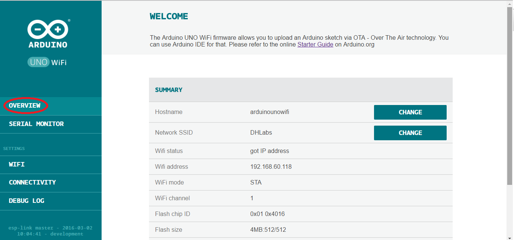

In the **Overview* is shown all the information about the configuration board: the ***hostname**, the network **SSID, **Wifi address**, **Wifi mode** and other details

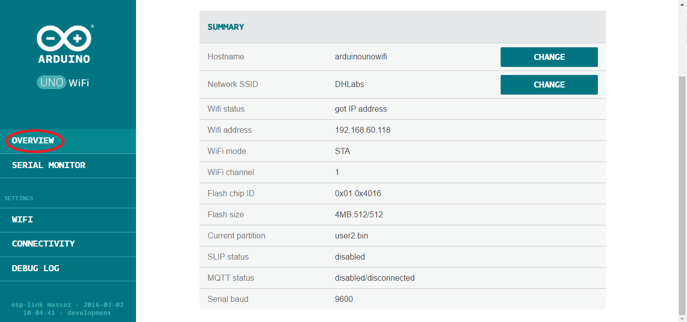

Clicking on **SERIAL MONITOR** displays a serial monitor, useful to display the results when you upload a sketch.

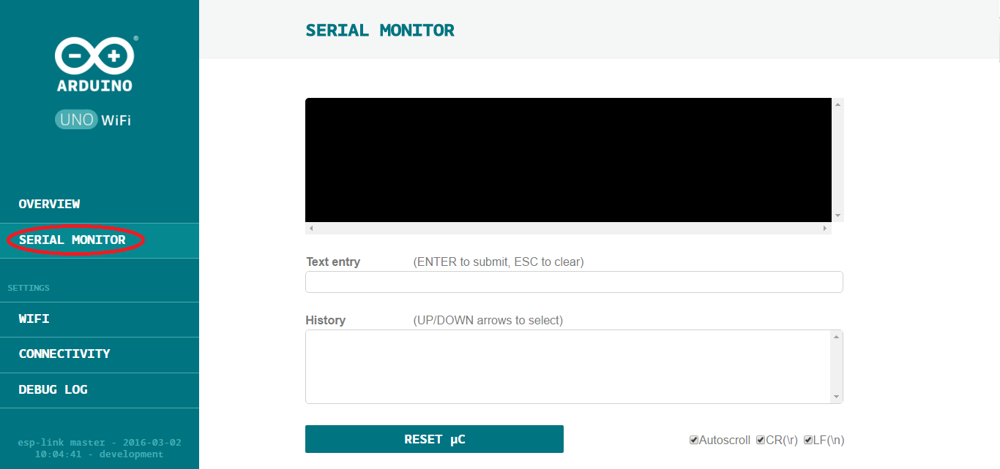

Furthermore in this section it is possible to reset the microcontroller clicking on RESET μC button.

Instead selecting from left menu the **WIFI** section, you can change the hostname simply typing the new hostname in the dedicated bar and after to click on CHANGE button, as shown in the below image:

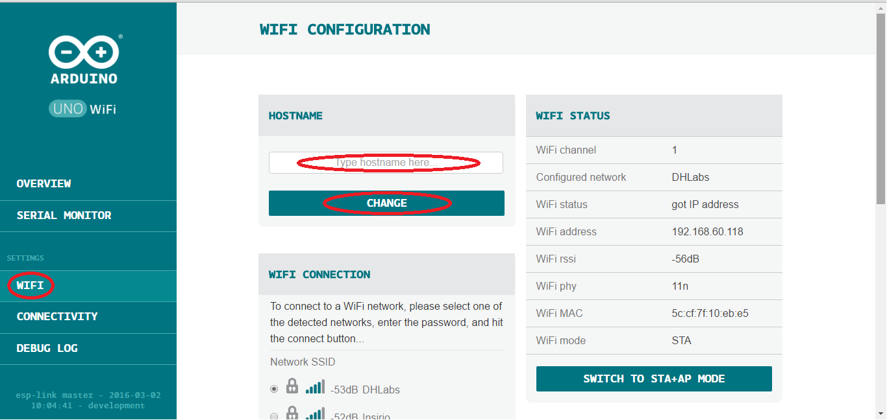

It is possible also to switch to **STA MODE** or **STA+AP MODE** clicking the specific button, but keep in mind that it is advised to switch only in STA MODE because so the board will be visible on the Arduino IDE and, furthermore, you will be able to protect it from possible attacks, since it will no longer be visible as open network.

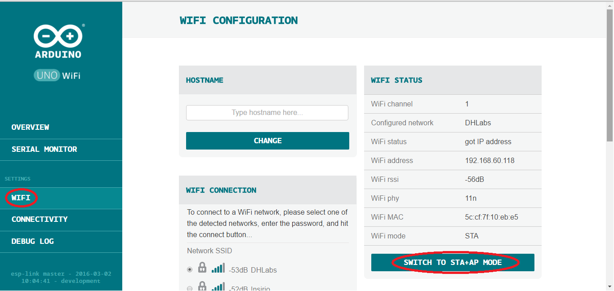

It is possible to connect the board to a network selecting it, inserting the correct password and clicking on CONNECTbutton.

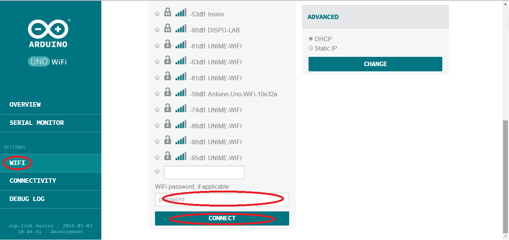

In this section you can also choose if to use the DHCP or the Static IP, as shown in the picture:

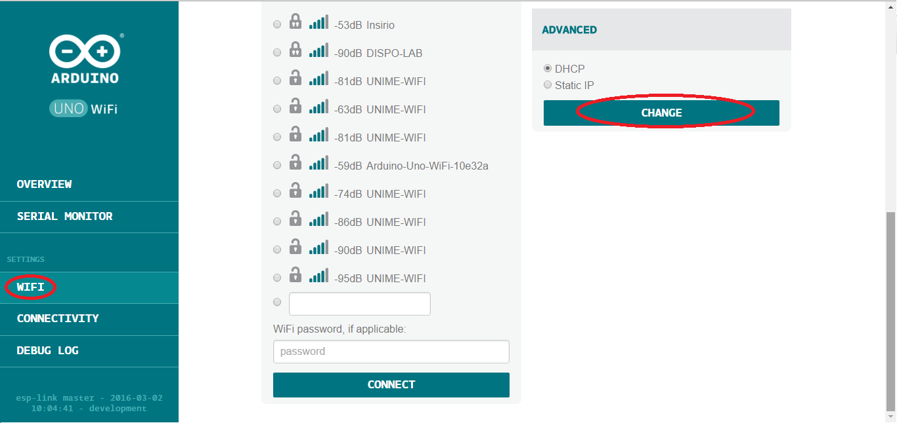

In the **CONNECTIVITY** section you can enable the connection services for example the client MQTT and the SLIP:

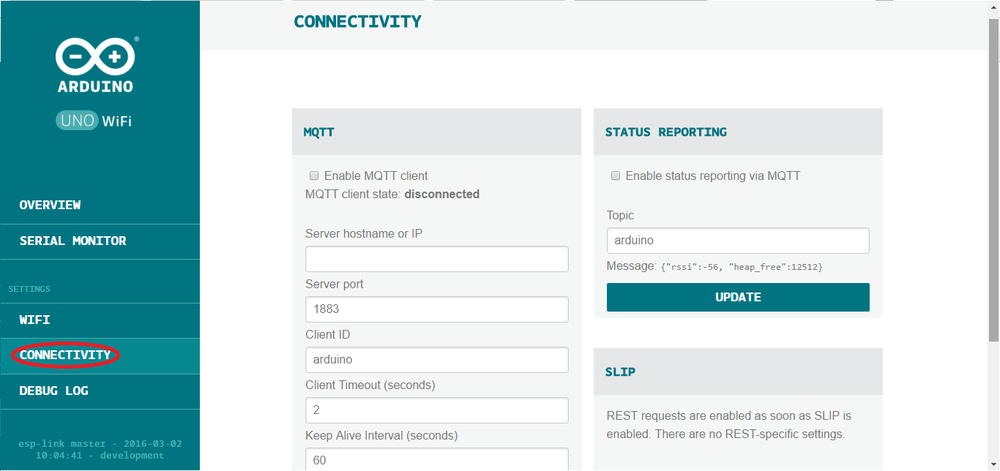

Finally in the **DEBUG LOG** it is shown the debug log and it is possible to reboot the WiFi clicking the WiFiREBOOTbutton:

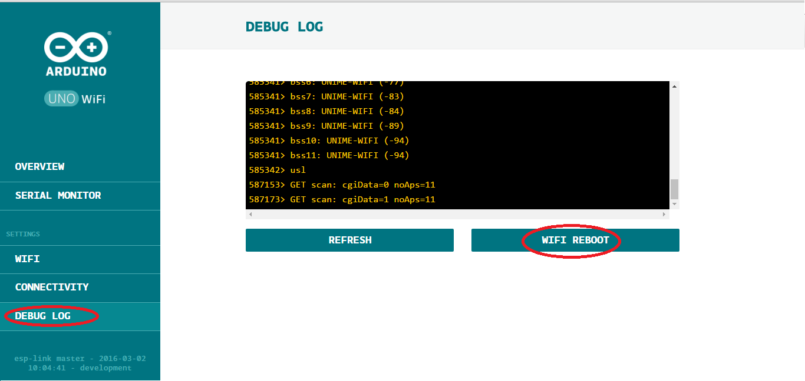

### See also

- [Firmware updater](https://arduino.cc/en/Guide/ArduinoUnoWiFiFwUpdater)
- [How to change Arduino Uno WiFi Firmware](https://arduino.cc/en/Guide/ArduinoUnoWiFiChangeFw)

The text of the Arduino getting started guide is licensed under a
[Creative Commons Attribution-ShareAlike 3.0 License](http://creativecommons.org/licenses/by-sa/3.0/). Code samples in the guide are released into the public domain.
