There are four different ways to change or upgrade the firmware on your Arduino UNO WiFi:

- burn the firmware using UNO WiFi Firmware Updater tool (for all O.S. via Serial);

- burn the firmware using Arduino Software (IDE) 1.7.x (for all O.S. via OTA );

- burn the firmware using ESP recovery (for all O.S. via Serial);

- burn the firmware using ESP Flash Download tool for Windows user (Only Windows via Serial).

All these ways are shown in below paragraphs.

## Burn the firmware using UNO WiFi Firmware Updater tool

If you are using the **Arduino 1.8.x** or later then you can upgrade the Esp firmware using the [UNO WiFi Firmware Updater tool](https://github.com/arduino-libraries/UnoWiFi-FirmwareUpdater-Plugin/releases). The complete guide is in this [link](https://arduino.cc/en/Guide/ArduinoUnoWiFiFwUpdater).

**Note:** This procedure is **recommended** for all **Operating System** and it is usable via serial.

## Burn the Firmware using the Arduino Software (IDE)

If you want burn the firmware using the file into **Arduino Software (IDE) 1.7.x**, then continue to follow the guide, if instead you are using the **Arduino Software (IDE) 1.8.x** then follow the [Arduino UNO WiFi Firmware Updater guide](https://arduino.cc/en/Guide/ArduinoUnoWiFiFwUpdater).

**Note:** This procedure is **recommended** for all **Operating System** and it is usable only via **OTA**.

- Download the latest Arduino Software (IDE) version. Click here.

- Launch the Arduino Software (IDE).

- Plug the Arduino UNO WiFi to PC.

- Select the board: Arduino UNO WiFi from Tools>Board menu.

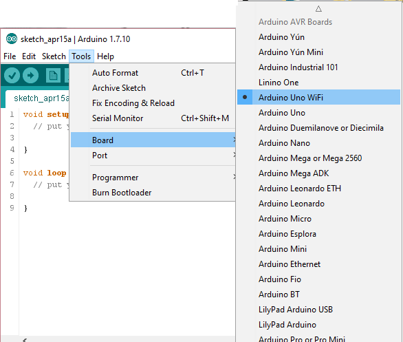

- Select the **Port** from **Tools**>**Ports**>**Network ports** menu.


- Select the **Programmer** from **Tools**>**Programmer**>**ESP8266 Over The Air** menu.

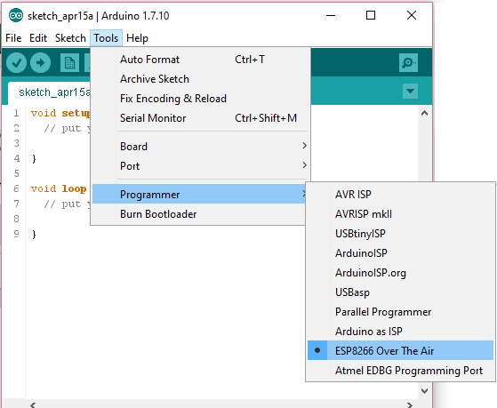

- Click on **Burn Bootloader** from Tools menu.

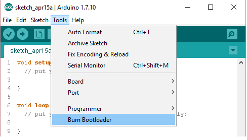

## Burn the firmware using EspRecovery

This procedure is **recommended** for all **Operating System** and it is usable only via **Serial**.

**1** - First you must upload the EspRecovery sketch on your Arduino UNO WiFi:

- Connect the Arduino UNO WiFi to PC with a USB cable.

- Open the Arduino Software (IDE).

- Select the correspondent port and board.

- Upload the **ESPRecovery** sketch from **File**>**Examples>Arduino UNO WiFI**>**Tools** menu of Arduino Software (IDE):

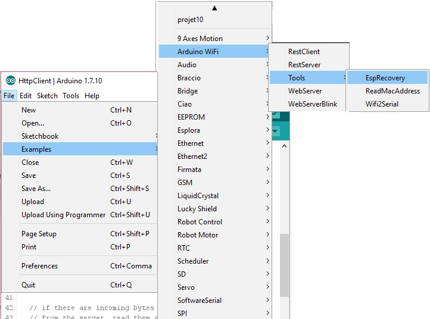

**2** - Enter the board in **bootloader mode:**

- Disconnect the Arduino Uno WiFi
- Reconnect the board while pressing the **ESP B/L** button.

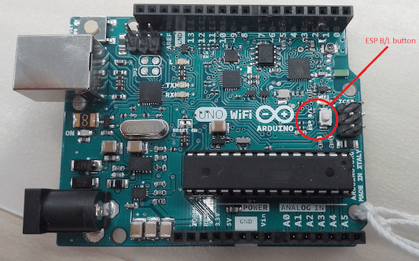

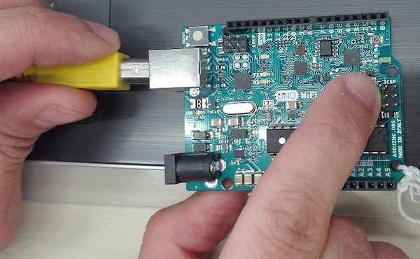

**3** - Open your terminal as Administrator.

**4** - Download the **ESPtool**, you can download from [here](https://arduino.cc/en/uploads/Guide/esptool.zip) or you can use the command:

`sudo pip install esptool`

**5** - Test the esptool, for example, inserting the below command to read the MAC address:

- `python esptool.py -p your port -b baudrate read_mac`

- Set the baudrate at **9600**.

For linux user, for example, the port will be /dev/ttyACM0:

`sudo python esptool.py -p /dev/ttyACM0 -b 9600 read_mac`

For Mac user, for example, the port will be /dev/tty.usbmodem1411:

`sudo python esptool.py -p /dev/tty.usbmodem1411 -b 9600 read_mac`

For Windows user:

for example in case that the tools is in \*\*\Users\XXXX\Desktop\esptool\esptool\*\* folder and the COM is 30:

`python \User\XXXX\Desktop\esptool\esptool\esptool.py -p COM30 -b 9600 read_mac`

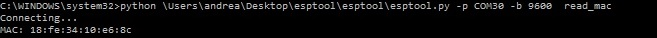

**6** If it appears on your MAC terminal, then continue the procedure:

`Connecting...`
`MAC: 18:fe:34:10:e2:85`

**7** - Use this command to write the firmware but **PAY ATTENTION** to set the correct path and insert your correspondent port:

```c
sudo python esptool.py -p /dev/ttyACM0 -b 9600 write_flash -ff 80m -fm qio -fs 32m
0x00000 20151223/boot_v1.4.bin_rep 0x1000 20151223/user1.bin 0x3FC000
20151223/esp_init_data_default.bin_rep 0x3FE000 20151223/blank.bin
```

For Windows user:
for example in case that the tools is in **\Users\XXXX\Desktop\esptool\esptool\*\* folder and the COM is **30\*\*:

```c
C:\WINDOWS\system32>python \Users\xxxx\Desktop\esptool\esptool\esptool.py -p COM30 -b 9600 write_flash -ff 80m -fm qio -fs 32m 0x00000

C:\Users\xxxxx\Desktop\esptool\esptool\20151223/boot_v1.4.bin_rep 0x1000

C:\Users\xxxxx\Desktop\esptool\esptool\20151223/user1.bin 0x3FC000

C:\Users\xxxxx\Desktop\esptool\esptool\20151223/esp_init_data_default.bin_rep 0x3FE000

C:\Users\xxxxx\Desktop\esptool\esptool\20151223/blank.bin
```

**8** - Wait some minutes that the process ends

**Note:** You can find the updated user1.bin file directly into Arduino Software (IDE), here the path: **arduino-1.7.x\hardware\arduino\avr\firmwares\esp8266\unowifi\firmware_arduino_esp8266_20xx_xx_xx_file1.bin**

## Burn the firmware using ESP Flash download tool

If you are a **Windows user** and you want to upgrade the firmware using a **baudrate higher than 9600** then follow the procedure below:

**Note:** This method allows to burn the firmware quickly (baudrate to 115200) but it needs an [USB2Serial](https://arduino.cc/en/Main/MiniUSB) and some welding.

**1** - First you must upload the Blink sketch on your Arduino UNO WiFi:

- Connect the Arduino UNO WiFi to your PC with a USB cable.

- Open the Arduino Software (IDE), you can download it here.

- Select the correspondent port and board.

- Upload the **Blink** sketch from **File**>**Examples**>**Basics** menu.

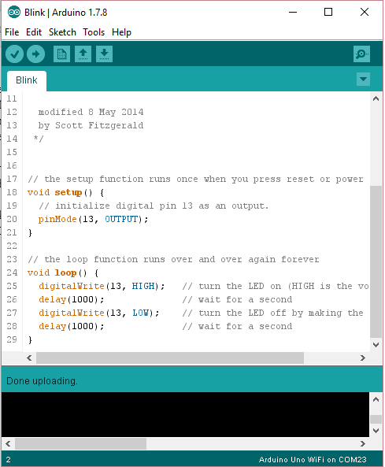

**2** - Create a jumper between **TP_GPIOESP** test point and **Ground**, as shown in the image below:

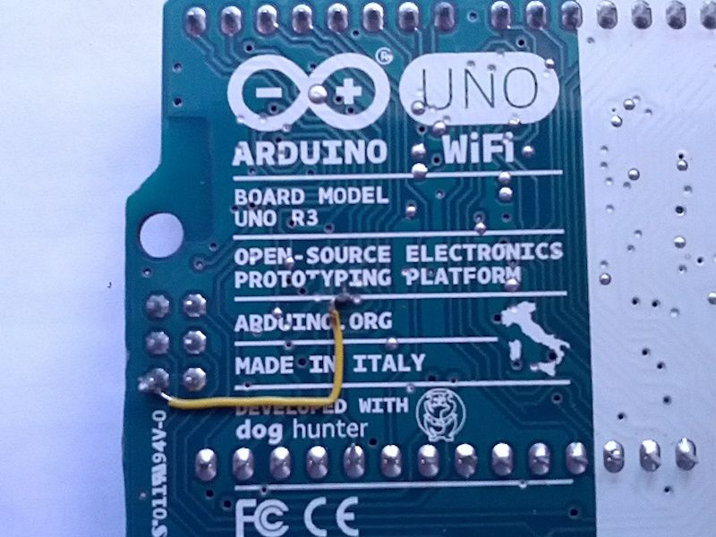

**3** - Connect the board to the **USB2Serial**:

- Using some jumpers follow these connections:

USB2SerialArduino Uno WiFiRXRXTXTXGNDGND

- Connect the USB2Serial converter to your PC.

**4** - Put the board in bootloader mode:

- Disconnect the Arduino Uno WiFi
- Reconnect the board while pressing the **ESP B/L** button.


**5** - Open the **ESP FLASH DOWNLOAD TOOL**, you can download it from [here](https://arduino.cc/en/Guide/ArduinoUnoWiFiChangeFw?action=upload&upname=FLASH_DOWNLOAD_TOOLS_v1.2_150512.zip)[ &#x394;](https://arduino.cc/en/Guide/ArduinoUnoWiFiChangeFw?action=upload&upname=FLASH_DOWNLOAD_TOOLS_v1.2_150512.zip).

- Extract it;

- Click on flash_download_tool_v1.2_150512.exe.

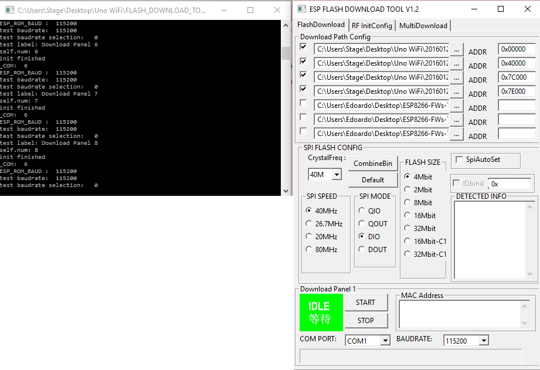

**6** - Setting the the **esptool**:

- Select the first row and insert the boot.bin_rep file and set the address: 0x00000.

- Select the second row and insert the user1.bin file and set the address: 0x40000.

- Select the third row and insert the esp_init_data_default.bin_rep file and set the address: 0x7C000.

- Select the quarter row and insert the blank.bin file and set the address: 0x7E000, as shown in the picture.

**Note:** You can find the updated user1.bin file directly into **Arduino Software (IDE)**, here the path: **arduino-1.7.x\hardware\arduino\avr\firmwares\esp8266\unowifi\firmware_arduino_esp8266_20xx_xx_xx_file1.bin**

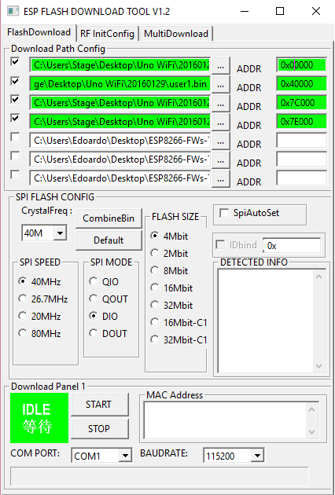

- Select the correspondent **USB2Serial COM**.

- Setting the baudrate to **115200**.

**7** - Execute the Firmware writing.

- Click on START

- Wait the ending of the process; **Finish** will appear when done, as shown in the image below.

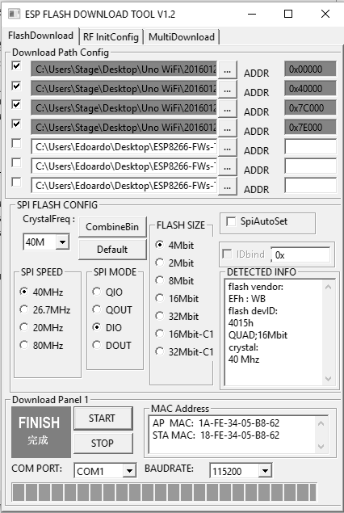

**8** - Now **remove the jumper** between **TP_GPIOESP** and **Ground**.

## See also

- [Getting started with Arduino Uno WiFi](https://arduino.cc/en/Guide/ArduinoUnoWiFi)
- [Firmware updater](https://arduino.cc/en/Guide/ArduinoUnoWiFiFwUpdater)

The text of the Arduino getting started guide is licensed under a
[Creative Commons Attribution-ShareAlike 3.0 License](http://creativecommons.org/licenses/by-sa/3.0/). Code samples in the guide are released into the public domain.
