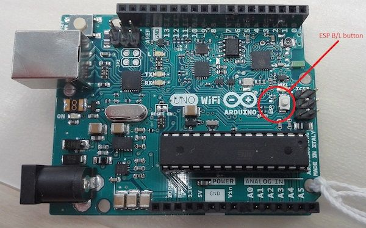
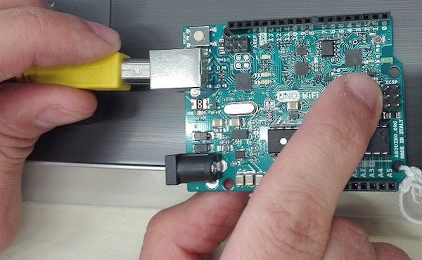
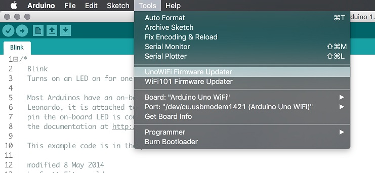
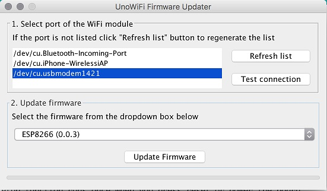

This tutorial will guide you in the process of updating the firmware of your Arduino UNO WiFi board.

## Hardware required

- [Arduino UNO WiFi](https://store.arduino.cc/products/arduino-uno-wifi-rev2)

## Circuit

Connect the board at the USB port of your computer ready with Arduino Software (IDE) 1.8.0 or later.

## UNO WiFi Firmware updater procedure

To simplify the process, we have prepared a tool - UNO WiFiFirmwareUpdater - available in Arduino IDE 1.8.0 or later.

Follow these steps to enable this tools into Arduino software:

- Download the tool [here](https://github.com/arduino-libraries/UnoWiFi-FirmwareUpdater-Plugin/releases).

- Create a folder called tools into the sketchbook directory (normally in **Documents** >**Arduino**).

- Extract it.

Now:

- Launch the Arduino Software (IDE) 1.8.0 or later.

- Connect the board to PC.

- Select the **Arduino UNO WiFi** as board in the **Tools**>**Board menu**.

- Select the corresponding serial port in the **Tools**>**Port menu**.

- Upload the **ESP Recovery sketch**. It is into the _UNOWiFiDev.Edition_ Library. Download it from **Library Manager**.

```c
/*ESP Recovery sketch*/
#include <Wire.h>
#include <UnoWiFiDevEd.h>

#define BAUD 9600

WifiData ESPSerial;

void setup()
{

 Serial.begin(BAUD);

 pinMode(13, OUTPUT);

 digitalWrite(13, LOW);

 ESPSerial.begin(BAUD);
}

void loop()
{

 while (Serial.available()) {

 char inChar = (char)Serial.read();

 ESPSerial.write(inChar);

 }

 while (ESPSerial.available()) {

 char inChar = (char)ESPSerial.read();

 Serial.write(inChar);

 }

}
```

- Put the board in **DFU** mode, keeping pressed the **ESP B/L** button and connect the board to PC





- Select the **UnoWiFi Firmware Updater** from the **Tools** menu.



- Click on **Refresh list** if the port is not listed.

- Select the corresponding port.



- Click on **Test connection**.

- Select from windows menu the ESP firmware requested.

- Click on **Update Firmware**.

- Wait the end of process.

**Warning:**
The process could last several minutes.


## See also

- [Getting started with Arduino Uno WiFi](https://arduino.cc/en/Guide/ArduinoUnoWiFi)
- [How to change the firmware](https://arduino.cc/en/Guide/ArduinoUnoWiFiChangeFw)

The text of the Arduino getting started guide is licensed under a
[Creative Commons Attribution-ShareAlike 3.0 License](http://creativecommons.org/licenses/by-sa/3.0/). Code samples in the guide are released into the public domain.
