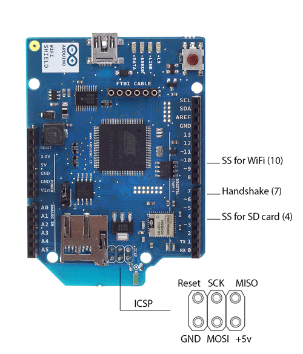
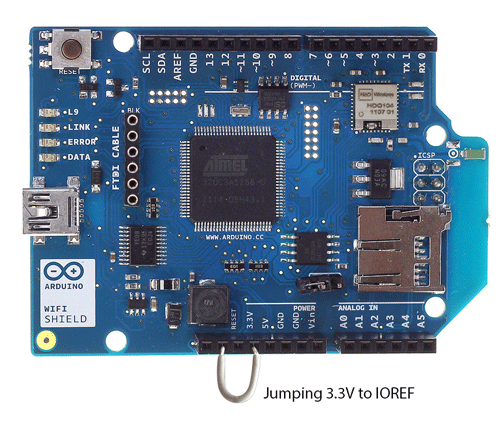
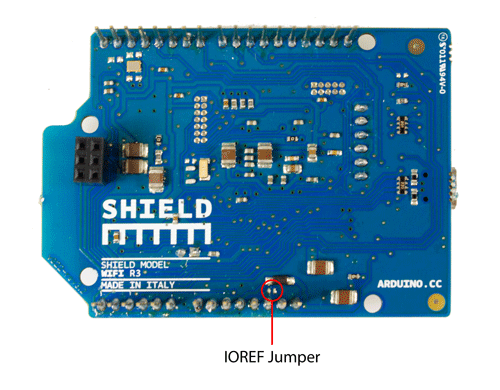
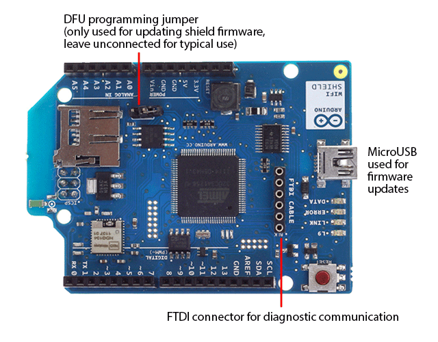
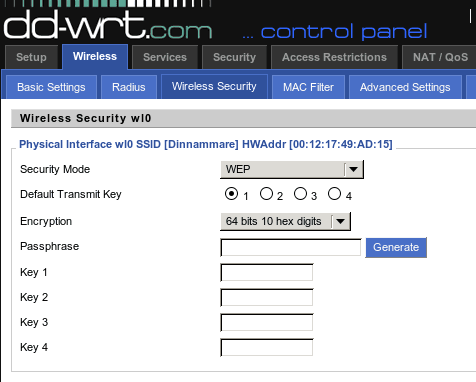

**This is a retired product.**

The [Arduino WiFi shield](https://arduino.cc/en/Main/ArduinoWiFiShield) allows an Arduino board to connect to the internet using the [WiFi library](https://arduino.cc/en/Reference/WiFi) and to read and write an SD card using the [SD library](https://arduino.cc/en/Reference/SD).

The WiFi Library is included with the most [recent version of the Arduino IDE](https://arduino.cc/en/Main/Software). _The firmware for the WiFi shield has changed in Arduino IDE 1.0.4. It is strongly recommended to install this update per [these instructions](https://arduino.cc/en/Hacking/WiFiShieldFirmwareUpgrading)_

The [WiFI library](https://arduino.cc/en/Reference/WiFi) is similar to the [Ethernet library](https://arduino.cc/en/Reference/Ethernet) and many of the function calls are the same.

### Connecting the Shield



To use the shield, mount it on top of an Arduino board (e.g. the Uno). To upload sketches to the board, connect it to your computer with a USB cable as you normally would. Once the sketch has been uploaded, you can disconnect the board from your computer and power it with an external power supply.

Digital pin 7 is used as a handshake pin between the WiFi shield and the Arduino, and should not be used.

### Using the Shield With Older Boards

**If you are using the WiFi shield with an Arduino earlier than the Uno rev3, you need to make the connection below for the board to work.** The WiFi board uses the IOREF pin on newer Arduino pin layouts (Uno rev3, Mega2560 rev3, and later) to sense the reference voltage for the I/O pins of the board to which it is attached. If you are using the shield with an older board, you need to connect the shield's IOREF pin to 3.3V. You can do this either with a jumper wire connecting IOREF to 3.3V as shown in the photo below, or by soldering the IOREF jumper on the bottom of the shield, shown below. **WARNING: If you use the solder jumper, do not connect the shield to a rev3 or later board. To be safe, remove the IOREF pin on the shield. Otherwise, you will be shorting 3.3V to 5V through the IOREF pin.**

Jumping 3.3V to IOREF (recommended)


Soldering 3.3V to IOREF


### Ports on the WiFi Shield


There is an onboard micro-USB connector. This is not for programming an attached Arduino, it is for updating the Atmega 32UC3 using the Atmel DFU protocol. The programming jumper adjacent to the power bus and analog inputs should be left unconnected for typical use. It is only used for DFU programming mode.

A FTDI connection enables serial communication with the 32UC3 for debugging purposes. A list of [available commands can be found here](https://arduino.cc/en/Hacking/WiFiShield32USerial).

### Network Settings

The shield will connect to open networks, as well as those using WEP and WPA2 Personal encryption. The shield will not connect to networks using WPA2 Enterprise encryption.

The SSID (network name) must be broadcast for the shield to connect.

Depending on your wireless router configuration, you need different information.

- For an open (unencrypted) network, you need the SSID.

- For networks using WPA/WPA2 Personal encryption, you need the SSID and password.

- WEP network passwords are hexadecimal strings known as keys. A WEP network can have 4 different keys; each key is assigned a "Key Index" value. For WEP encrypted networks, you need the SSID, the key, and key number.

### Scan for available networks

The sketch below is a good one to run the first time you use the board in a new area. This sketch will not connect to a network, but it will show you what networks the shield can view. Your WiFi shield will probably not see as many networks as a computer with a larger WiFi antenna. Once you have downloaded the sketch to your Arduino, open the serial port to see available networks.

```c
#include <SPI.h>
#include <WiFi.h>

void setup() {

  // initialize serial and wait for the port to open:

  Serial.begin(9600);

  while(!Serial) ;

  // attempt to connect using WEP encryption:

  Serial.println("Initializing Wifi...");

  printMacAddress();

  // scan for existing networks:

  Serial.println("Scanning available networks...");

  listNetworks();
}

void loop() {

  delay(10000);

  // scan for existing networks:

  Serial.println("Scanning available networks...");

  listNetworks();
}

void printMacAddress() {

  // the MAC address of your Wifi shield

  byte mac[6];

  // print your MAC address:

  WiFi.macAddress(mac);

  Serial.print("MAC: ");

  Serial.print(mac[5],HEX);

  Serial.print(":");

  Serial.print(mac[4],HEX);

  Serial.print(":");

  Serial.print(mac[3],HEX);

  Serial.print(":");

  Serial.print(mac[2],HEX);

  Serial.print(":");

  Serial.print(mac[1],HEX);

  Serial.print(":");

  Serial.println(mac[0],HEX);
}

void listNetworks() {

  // scan for nearby networks:

  Serial.println("** Scan Networks **");

  byte numSsid = WiFi.scanNetworks();

  // print the list of networks seen:

  Serial.print("number of available networks:");

  Serial.println(numSsid);

  // print the network number and name for each network found:

  for (int thisNet = 0; thisNet<numSsid; thisNet++) {

    Serial.print(thisNet);

    Serial.print(") ");

    Serial.print(WiFi.SSID(thisNet));

    Serial.print("\tSignal: ");

    Serial.print(WiFi.RSSI(thisNet));

    Serial.print(" dBm");

    Serial.print("\tEncryption: ");

    Serial.println(WiFi.encryptionType(thisNet));

  }
}


```

### Open network example

The sketch below shows you how to initiate a connection with an open network named "yourNetwork".

```c
#include <WiFi.h>

char ssid[] = "yourNetwork";     // the name of your network
int status = WL_IDLE_STATUS;     // the Wifi radio's status

void setup() {

  // initialize serial:

  Serial.begin(9600);

  // attempt to connect to an open network:

  Serial.println("Attempting to connect to open network...");

  status = WiFi.begin(ssid);

  // if you're not connected, stop here:

  if ( status != WL_CONNECTED) {

    Serial.println("Couldn't get a wifi connection");

    while(true);

  }

  // if you are connected :

  else {

      Serial.print("Connected to the network");

  }
}

void loop() {

  // do nothing
}
```

### WPA network example

The example below shows how to connect to a WPA/WPA2 Personal encrypted network named "yourNetwork" with a password "12345678".

```c
#include <WiFi.h>

char ssid[] = "yourNetwork";     //  your network SSID (name)
char pass[] = "12345678";    // your network password
int status = WL_IDLE_STATUS;     // the Wifi radio's status

void setup() {

  // initialize serial:

  Serial.begin(9600);

  // attempt to connect using WPA2 encryption:

  Serial.println("Attempting to connect to WPA network...");

  status = WiFi.begin(ssid, pass);

  // if you're not connected, stop here:

  if ( status != WL_CONNECTED) {

    Serial.println("Couldn't get a wifi connection");

    while(true);

  }

  // if you are connected, print out info about the connection:

  else {

    Serial.println("Connected to network");

  }
}

void loop() {

  // do nothing
}


```

### WEP Network example

Your router will most likely have a settings dialog similar to the one below for generating the WEP key based on an ASCII passphrase:



If you do not have access to your router's administrative tools, consult your network administrator.

Each key is 10 or 26 hexadecimal digits long (40 or 128 bits) and paired with a key number. For example, a 40-bit key, ABBADEAF01 will work, but ABBADEAF won't work (too short) and ABBAISDEAF won't work (I and S are not hexadecimal characters).vFor 128-bit, you need a string that is 26 characters long. D0D0DEADF00DABBADEAFBEADED will work because it's 26 characters, all in the 0-9, A-F range.

**NB : WEP provides a basic encryption mechanism, but it can be cracked. If you require strong encryption for your network, it is recommended you use WPA**

The example below shows how to connect to a WEP encrypted network named "yourNetwork" with a hex key of "ABBADEAF01", and a key index of 0.

```c
#include <WiFi.h>

char ssid[] = "yourNetwork";     //  your network SSID (name)
char key[] = "ABBADEAF01";    // your network key
int keyIndex = 0;            //your network key Index number
int status = WL_IDLE_STATUS;     // the Wifi radio's status

void setup() {

  // initialize serial:

  Serial.begin(9600);

  // attempt to connect using WEP encryption:

  Serial.println("Attempting to connect to WEP network...");

  status = WiFi.begin(ssid, keyIndex, key);

  // if you're not connected, stop here:

  if ( status != WL_CONNECTED) {

    Serial.println("Couldn't get a wifi connection");

    while(true);

  }

  // if you are connected, print out info about the connection:

  else {

    Serial.println("Connected to network");

  }
}

void loop() {

  // do nothing
}
```

### SD Card and SPI

The WiFI Shield includes a micro-SD card slot, which can be interfaced with using the [SD library](https://arduino.cc/en/Reference/SD). The SS for the SD card is pin 4.

Arduino communicates with the shield using the SPI bus. This is on digital pins 11, 12, and 13 on the Uno and pins 50, 51, and 52 on the Mega. On both boards, pin 10 is used as SS. On the Mega, the hardware SS pin, 53, is not used, but it must be kept as an output or the SPI interface won't work.

### Updating firmware on the shield

Please follow [this guide](https://arduino.cc/en/Hacking/WiFiShieldFirmwareUpgrading) to update the firmware on your shield.

### Next steps

Refer to the [WiFi library page](https://arduino.cc/en/Reference/WiFi) for more information on the functionality of the shield, as well as further examples.

The text of the Arduino getting started guide is licensed under a
[Creative Commons Attribution-ShareAlike 3.0 License](http://creativecommons.org/licenses/by-sa/3.0/). Code samples in the guide are released into the public domain.
