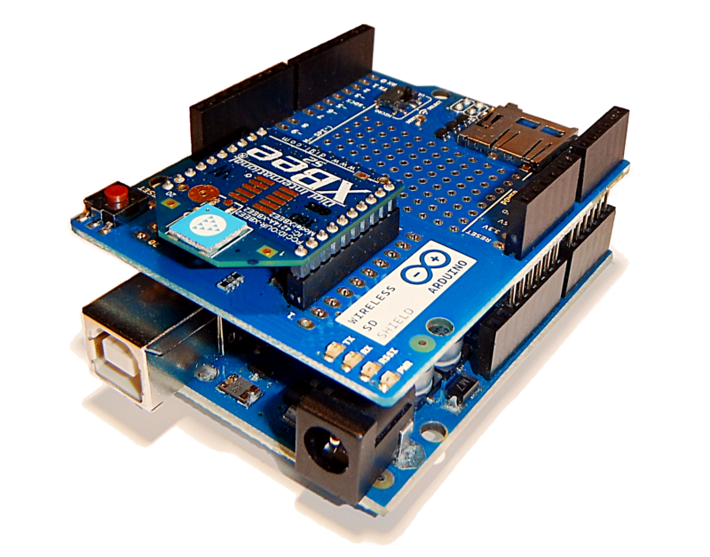
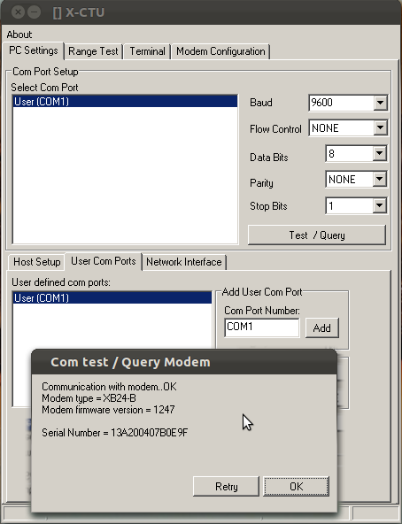
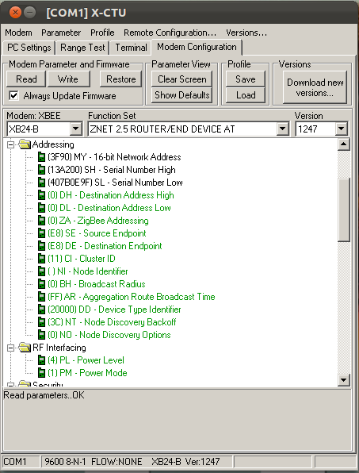
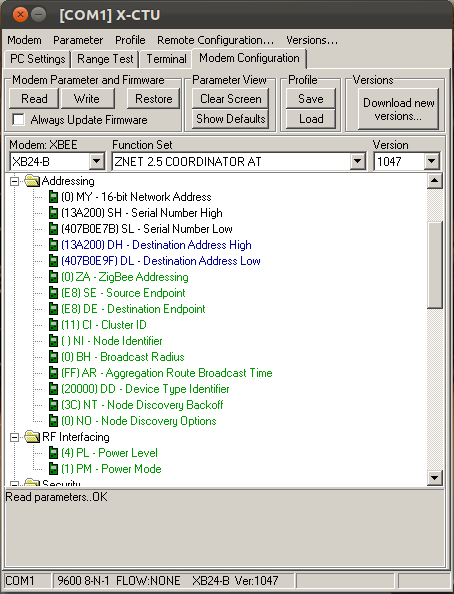

The Arduino Wireless Shield allows your Arduino board to communicate wirelessly using Zigbee®. This documentation describes the use of the shield with the [XBee® ZB Zigbee® RF Modules](http://www.digi.com/products/wireless-wired-embedded-solutions/zigbee-rf-modules/zigbee-mesh-module/xbee-zb-module.jsp) module. The [XBee® ZB Zigbee® RF Modules](http://www.digi.com/products/wireless-wired-embedded-solutions/zigbee-rf-modules/zigbee-mesh-module/xbee-zb-module.jsp) and the [XBee® 802.15.4 OEM RF Modules](http://www.digi.com/products/wireless-wired-embedded-solutions/zigbee-rf-modules/point-multipoint-rfmodules/xbee-series1-module#overview) are not compatible over-the-air because they use different chipsets. In particular in [XBee® 802.15.4 OEM RF Modules](http://www.digi.com/products/wireless-wired-embedded-solutions/zigbee-rf-modules/point-multipoint-rfmodules/xbee-series1-module#overview) implements the 802.15.4 protocol while the the [XBee® ZB Zigbee® RF Modules](http://www.digi.com/products/wireless-wired-embedded-solutions/zigbee-rf-modules/zigbee-mesh-module/xbee-zb-module.jsp) implements the Zigbee protocol or the ZNet 2.5 protocol. Digi International continue to support both Zigbee and Znet 2.5, so you are free to use either on the Series 2 radios. Remember that only radios with the same type of firmware can communicate with each other.

The Xbee 802.15.4 modules support point-to-point or multipoint communication without routing, so they are ready out of the box to establish peer communication between two radios without any configuration.

The XBee with ZNet 2.5 or ZB firmwares are designed to form networks with star, cluster tree or mesh topologies, where there is a hierarchy of devices and one coordinator is always necessary. Simple peer-to-peer communication with these modules is therefore more complicated than with the 802.15.4 modules. Each ZB module must have its firmware configured as coordinator, router, or endpoint before you can begin communication.

In a Zigbee network there must be only one coordinator that manages all the network. There can be several routers attached to each coordinator and many end devices that can communicate directly with a coordinator or pass messages to other end devices through router and the coordinator. Though each module must be configured for a specific role, the advantage is that you can form wider networks than you can with the 802.15.4 modules. The Zigbee protocol allows you to set up a radio link between the modules that are distant from each other by sending messages through multiple routers from endpoint to endpoint. You can also make networks in which the endpoints save power by sleeping, but don't lose messages when asleep.

To enable simple communication between two ZB radios, you'll need to configure one with the coordinator firmware, and one with router or endpoint firmware. The next section shows you how to do this.

## Set up a XBee Module

These instructions show you how to get two Arduino boards talking to each other over ZB radios using Wireless Shields.



To configure a ZB module as coordinator, router, or end device, you'll need to change the firmware. You need Digi's configuration software, X-CTU, to do this.
Download it from this [link](https://hub.digi.com/support/products/xctu/).


To configure the modules from the computer, put the serial switch to the USB position and upload an empty sketch, like this:

```c
void setup() { }
void loop() { }
```

Then mount the radio on your Wireless shield.

## Configuring the End Device

Open the X-CTU software and type the Arduino XBee module's COM port number into the "Com Port Number" field. Then click the Add button. The COM port you created will appear in the two text boxes on the left. Select both and then click the "Test / Query" button, will appear a screen like this:



The settings that are most important are the PAN ID (ID)and the serial number high word (SH) and low word (SL). Radios which share a PAN ID can communicate with each other. Radios on different PAN IDs will ignore each others messages. The Serial number consists of two 16-bit numbers, stored in two addresses: SH (serial high) and SL (serial low). This is the radio's unique address, and is used to send messages to it. In the settings below you only need to change the PAN ID. Use the same number for both radios so that they can communicate. Read the SH and SL parameters and take note of them, because you'll need to tell the coordinator this address in the next step.

Now the end device configuration is complete. Check the "Always Update Firmware" in the check box and press "Write" button, and the configuration will be uploaded on your module. If you are unable to read these parameters from the list, you can go in the "Terminal" tab and type three plus signs: +++ to enter in the configuration mode, then type ATSH an ATSL to get the serial number from the module, the module will answer like below:

**Send Command\*\***Expected Response\***\*What it does**` +++``OK `_`<CR>`_ Puts the radio in command mode
`ATSH`_`<press Enter>`_`13A200`_`<CR>`_ Reads the serial number high word
`ATSL`_`<press Enter>`_`407B0E9F`_`<CR>`_ Reads the serial number low word

You can also configure the PAN ID like so:

**Send Command\*\***Expected Response\***\*What it does**` +++``OK `_`<CR>`_ Puts the radio in command mode
`ATID1111`_`<press Enter>`_`OK`_`<CR>`_ Set the PAN ID to 1111
`ATWR`_`<press Enter>`_`OK`_`<CR>`_ Save the new configuration to flash memory



## Configuring the Coordinator

Mount the second module on the Wireless Shield socket and repeat the procedure for connecting to X-CTU. Click on the "Modem Configuration" tab and click the "Read" button. This module should be recognized with the XB24-B firmware and you have to change its function switching it on "ZNET 2.5 COORDINATOR AT".
The version number will change to 1047. Now you have to do three simple things:

**1.** Change the PAN ID an write the one you assigned in the End Device (1111 in the example above).

**2.** In the DH parameter write the numbers you noted from the SH parameter in the End Device.

**3.** In the DL parameter write the numbers you noted from the SL parameter in the End Device.

As for the previous module, the configuration is complete, you must only check the "Always Update Firmware" in the check box and press "Write" button and the configuration will be uploaded on your module.



Note that you didn't have to set the end device's destination address. That's because the end device always speaks to the coordinator. The modules now form a network. The coordinator is managing only one end node, so it's as if it were a transparent serial communication. You should be able to get two Arduino boards with Wireless Shields talking to each other using just the standard Arduino serial commands (described in the [reference](https://arduino.cc/en/Reference/HomePage)). Following is an example.

## A Simple Example

To upload a sketch to an Arduino board with a Wireless shield, place the switch in the USB position. Then, you can upload a sketch normally from the Arduino environment. In this case, upload the [**Communication | Physical Pixel**](https://arduino.cc/en/Tutorial/BuiltInExamples/PhysicalPixel) sketch to one of the boards. This sketch instructs the board to turn on the LED attached to pin 13 whenever it receives an 'H' over its serial connection, and turn the LED off when it gets an 'L'. You can test it by connecting to the board with the Arduino serial monitor (be sure it's set at 9600 baud), typing an H, and pressing enter (or clicking send). The LED should turn on. Send an L and the LED should turn off. If nothing happens, you may have an Arduino board that doesn't have a built-in LED on pin 13 (see the [board index](https://arduino.cc/en/Main/Boards) to check for sure), in this case you'll need to supply your own.

Once you've uploaded the Physical Pixel sketch and made sure that it's working, unplug the first Arduino board from the computer. Change the switch to the Micro setting. Now, you need to upload a sketch to the other board. Make sure its switch is in the USB setting. Then upload the following sketch to the board:

```c
void setup()
{

  Serial.begin(9600);
}

void loop()
{

  Serial.print('H');

  delay(1000);

  Serial.print('L');

  delay(1000);
}
```

When it's finished uploading, check that it's working with the Arduino serial monitor. You should see H's and L's arriving one a second. Turn off the serial monitor and unplug the board. Change the switch to the Micro setting. Now connect both boards to power. After a few seconds, you should see the LED on the first board turn on and off, once a second. (This is the LED on the Arduino board itself, not the one on the XBee shield, which conveys information about the state of the XBee module.) If so, congratulations, your Arduino boards are communicating wirelessly.

## A Few Notes

The Xbee module on the shield is set up to work at 9600 baud by default, so unless you reconfigure it, you'll need to make sure you're passing 9600 to the Serial.begin() command in your sketch.

If you want to deepen in the configuration and networking with Zigbee using XBee Series 2 modules we recommend that you read the book by Robert Faludi: [Building Wireless Sensor Networks](http://www.faludi.com/bwsn/), published by O'Reilly.

## References

For more information, see: the [hardware page](https://arduino.cc/en/Main/ArduinoWirelessShield) for the Xbee shield, and the [Digi Xbee page](http://www.digi.com/products/wireless-wired-embedded-solutions/zigbee-rf-modules/point-multipoint-rfmodules/).
The text of the Arduino getting started guide is licensed under a
[Creative Commons Attribution-ShareAlike 3.0 License](http://creativecommons.org/licenses/by-sa/3.0/). Code samples in the guide are released into the public domain.
