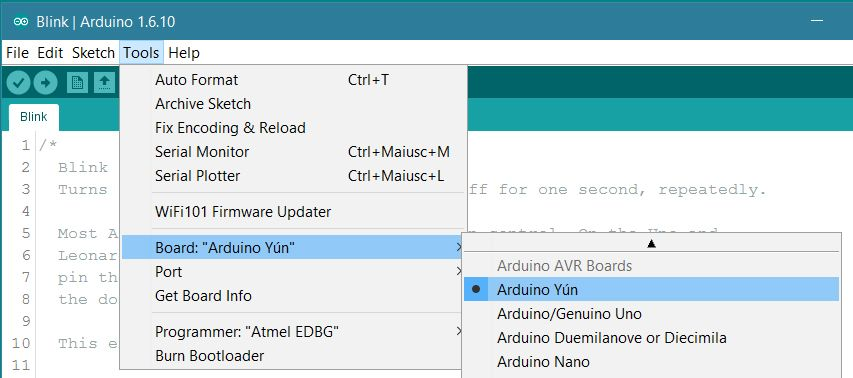
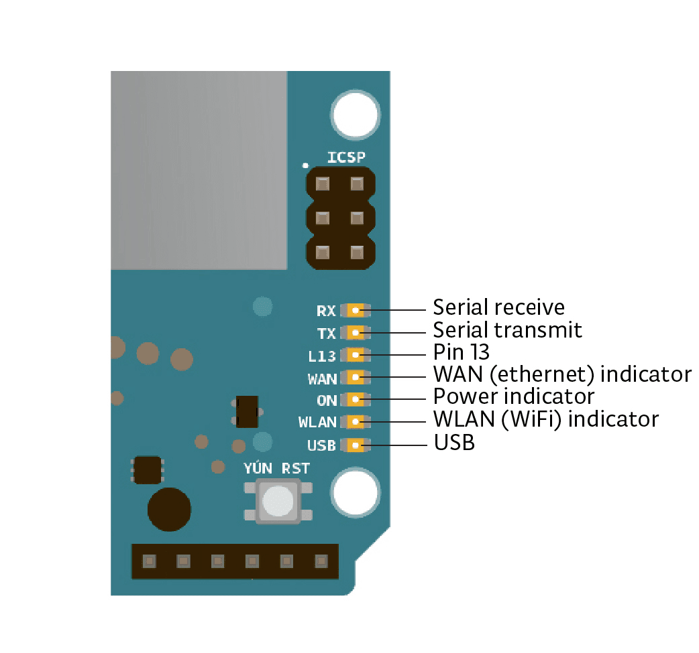
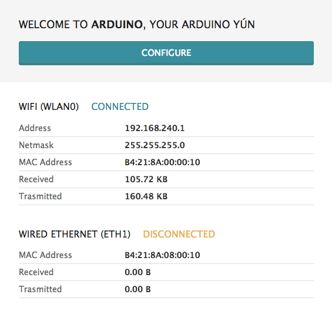

**This is a retired product.**

The Arduino Yún is an Arduino board unlike any other. While programming it is very similar to the Arduino Leonardo and uses the same processor, the Atmel ATmega32U4, it also has an additional processor, an Atheros AR9331, running Linux and the OpenWrt wireless stack. Programming the 32U4 via USB is identical to the [Arduino Leonardo](https://arduino.cc/en/Guide/ArduinoLeonardo). Once you've configured the Yún to connect to your WiFi network, you can program the 32U4 via WiFi as well.

### Quick Start

The Arduino Yún is programmed using the Arduino Software (IDE), our Integrated Development Environment common to all our boards. You should have already it installed on your PC, as explained in the home page of our [Getting Started](https://arduino.cc/en/Guide/HomePage).

#### Installing Drivers for the Yún

**OSX**
The first time you plug a Yún into a Mac, the "Keyboard Setup Assistant" will launch. There's nothing to configure with the Yún; you can close this dialogue by clicking the red button in the top left of the window.


**Windows**
Windows version of Arduino Software (IDE) already contains the proper drivers. When you installed it you let the operating system install them. Connect your Yún and the drivers will be installed automatically

**Linux**
There is no need to install drivers for Ubuntu 10.0.4 and later, but make sure port 5353 is not being blocked by a firewall.

#### Open your first sketch

Open the LED blink example sketch: **File > Examples >01.Basics > Blink**.


#### Select your board type and port

You'll need to select the entry in the **Tools > Board** menu that corresponds to your Arduino board.



Select the serial device of the board from the Tools | Serial Port menu. This is likely to be **COM3** or higher (**COM1** and **COM2** are usually reserved for hardware serial ports). To find out, you can disconnect your board and re-open the menu; the entry that disappears should be the Arduino board. Reconnect the board and select that serial port. When your board is properly configured on WiFi, you will find it in the Port list, as in our screenshot.


#### Upload the program

Now, simply click the "Upload" button in the environment. Wait a few seconds - you should see the RX and TX leds on the board flashing. If the upload is successful, the message "Done uploading." will appear in the status bar.


A few seconds after the upload finishes, you should see the on-board LED start to blink. If it does, congratulations! You've gotten your Arduino Yún up-and-running. If you have problems, please see the [troubleshooting suggestions](https://arduino.cc/en/Guide/Troubleshooting).

### Get inspired

Now that you have set up and programmed your Yún board, you may find inspiration in our [Project Hub](https://create.arduino.cc/projecthub/products/arduino-yun) tutorial platform, or you can dig in deeper with the [Bridge library and examples](https://arduino.cc/en/Reference/YunBridgeLibrary). You can also check out the [Yún hardware page](https://arduino.cc/en/Products/ArduinoYUN) for additional technical information.

### Please Read...

**Differences from the Arduino Leonardo**


In addition to the 32U4 chip, the Yún has an additional processor, an Atheros AR9331, which runs a distribution of Linux for embedded systems named OpenWrt-Yun, based on OpenWrt. A full install of Python® 2.7 is included as well.

The Yún has a number of different physical characteristics and connectors than the Leonardo. There is an on-board SD slot, Ethernet jack, and a USB-A Host connector. There is no power barrel connector on the Yún; it can be powered from the micro-USB connector.

There is no built in 5V regulator. If you power your Yún with more than 5V, you will likely damage it. If you are not powering the Yún from the micro-USB connection, you can apply power to the VIN and 5V pins on the board. If using the VIN pin, you cannot provide more than 5V, it will damage your board. It is recommended to power the Yún from the USB connection whenever possible.

The SD, Ethernet, and USB-A connectors are not physically connected to the 32U4 processor, they are connected to the AR9331.

The Yún's 32U4 functions in the same way as the Leonardo, except you cannot use `Serial1`. It is reserved for communication with the AR9331 processor.

The Yún also has a WiFi module built on board, allowing it to connect to a wireless router, or act as an access point.

The 32u4, WiFi, and AR9331 processors all have their own reset buttons.


There are several status LEDs on the Yún, indicating power, WLAN connection, WAN connection and USB. Additionally pin 13 is connected to one of the status lights.



#### OpenWrt-Yun

The Yún runs a distribution of Linux called OpenWrt-Yun, based on [OpenWrt](https://openwrt.org/). While it's possible to configure the system from the command line, there is a web page that allows you to configure many of the different options available. The interface (called [LuCi](http://luci.subsignal.org/trac)) gives you access to most any setting you would need for maintaining the WiFi interface.

Accessing the web interface is described below.

To install additional software on OpenWrt-Yun, you need to use the the Linux package manager **opkg**. For more information on the manager and some common commands, see [the Yún package manager page](https://arduino.cc/en/Tutorial/YunPackageManager).

When interfacing with the OpenWrt-Yun system, you have to use a command line, either accessing it through the Arduino's Bridge library, or via SSH. If you are unfamiliar with the command line, you may want to [read about some basics](https://arduino.cc/en/Tutorial/LinuxCLI) about it and some of the programs that are frequently used.

Due to continuous improvements and suggestions coming from both the OpenWrt community and the Arduino community, **version of OpenWrt-Yun installed on your Yún may be out of date**. Please check the [upgrade tutorial](http://arduino.cc/en/Tutorial/YunSysupgrade) and be sure you're running the latest version available.

#### Python®

An installation of Python® 2.7 is included with OpenWrt-Yun, with which you can write applications or scripts. For more on Python®, visit the [Python® 2.7 documentation pages](http://docs.python.org/2/).

If you're getting started with Python® for the first time, there are a number of excellent resources on-line. ["Learn Python® the Hard Way"](http://learnpythonthehardway.org/book/) will cover everything you need to know to get up and running with your own scripts.

#### External storage on the Yún

You're discouraged from using the Yún's built-in non-volatile memory, because it has a limited number of writes.

You can use external memory like a microSD card or thumb drive for saving data, or your own scripts, web pages, etc. For the Yún to access and store information on these drives through the 32U4, they need to have a directory named `arduino` in the root of the volume.

#### Web services

OpenWrt-Yun uses REST for clients and servers. REST is an acronym for "Representational State Transfer". It is a software architecture that exposes various parts of the Arduino hardware through URLs.

By default, the REST API access is password protected. It is possible to change this to access the services without a password. To change this setting, enter the Yún configuration panel. At the bottom of the page, you will see toggles for changing the access.


A nice introduction to the concepts behind REST [can be found here](http://stackoverflow.com/tags/rest/info).

The three REST end points recognized by the Yún are:

- /arduino

- /data

- /mailbox

The "/arduino" directory doesn't have anything pre-configured. Anything added to the URL after the end point is passed from the webserver to the sketch on the 32U4. You can define your APIs inside the sketch. See the Bridge example to see how this is done to access the pins on the board.

"/data" is used to access to the internal key/value storage. The available calls are:

- _/put/KEY/VALUE_ : stores a value inside the storage

- _/get/KEY_ : obtains the value of the requested key in JSON

- _/get_ : obtains the entire storage list in JSON.

- _/delete_ : deletes the internal storage

"mailbox" is used to add messages into a queue called Mailbox. The message queue is stored inside the Linux system and can be read by the Arduino microcontroller. The available REST call is:

- "/mailbox/message"

#### Resetting the processors (AR9331, WiFi, and 32U4)

To restart the AR9331, which reboots OpenWrt-Yun, press the "YÚN RST" reset button that is close to the analog inputs pins and the LEDs of the board.

To restart the the 32U4 and restart the currently installed Arduino sketch, tap the button next to the Ethernet port _two times_.

The reset button for WiFi is located next to the USB-A connector. It is labeled "WLAN RST". When you press the button, the WLAN LED will flash.

If you move to a different network and can no longer wirelessly access the Yún through its web interface, you can reset the Yún's network configuration by pressing the WiFi reset button (WLAN RST) for longer longer than 5 seconds, but less than
30, the AR9331 processor will reboot. The WiFi configuration will be reset and the Yún will start its own wiFi network Arduino Yún-XXXXXXXXXXXX. Any other modification/configuration will be retained.

To reset the OpenWrt-Yun distribution to its default state, press the WiFi reset button (WLAN RST) for at least 30 seconds. The board reverts to the original settings: like just taken out of the box or to the latest update of the OpenWRT image you have reflashed before. Among other things, this removes all installed files and network settings.

#### Resetting the password

The webpanel password can be reset and changed. Connect the Arduino Yún to your computer with an USB cable and upload the YunSerialTerminal sketch. It can be found in the Bridge examples in the Arduino IDE. When the Yún boot is complete, open the serial monitor, select New Line character in the dropdown menu and press Enter. Something like this should appear in your serial monitor:


Now you have to execute the **passwd** command to change the password. Type **passwd** into the serial monitor input and press enter.
You will be asked to type the new password, and re-type it to confirm. If you want, you can ignore the weak password error. If both passwords you typed match, the system password will be changed and you will be able to access to the webpanel with the new password.

#### Serial re-enumeration on reset.

Since the Yún does not have a dedicated chip to handle serial communication, it means that the serial port is **virtual** -- it's a software routine, both on your operating system, and on the board itself. Just as your computer creates an instance of the serial port driver when you plug in any Arduino, the 32u4 creates a serial instance whenever it runs its bootloader. The board is an instance of USB's **Connected Device Class (CDC)** driver.

This means that every time you reset the 32U4 processor, the USB serial connection will be broken and re-established. The board will disappear from the list of serial ports, and the list will re-enumerate. Any program that has an open serial connection to the Yún will lose its connection. This is in contrast to the Arduino Uno, with which you can reset the main processor (the ATmega328P) without closing the USB connection (which is maintained by the secondary ATmega8U2 or ATmega16U2 processor). This difference has implications for driver installation, uploading, and communication.

#### No reset when you open the serial port.

The Yún won't restart your sketch when you open a serial port on the computer. That means you won't see serial data that's already been sent to the computer by the board, including, for example, most data sent in setup().

This also applies to the Console, described below.

This means that if you're using any Serial or Console print(), println() or write() statements in setup(), they won't show up when you open the serial monitor or Console connection. To work around this, you can check to see if the port is open like so:

```c
// stops the program until Serial Monitor is opened

   while (!Serial) ;
```

or

```c
// stops the program until Console is opened

   while (!Console) ;
```

#### Configuring the onboard WiFi

The Yún has the ability to act as an Access Point, but it can also connect to an existing network. These instructions walk you through connecting your Yún to a wireless network. The Yún can connect to unencrypted networks, as well as networks that support WEP, WPA, and WPA2 encryption.

When you first power on the Yún, it will create a WiFi network called _ArduinoYun-XXXXXXXXXXXX_. Connect your computer to this network.

Once you've obtained an IP address, open a web browser, and enter
`http://arduino.local` or 192.168.240.1 in the address bar. After a few moments, a web page will appear asking for a password. Enter "`arduino`" and click the _Log In_ button.


You will find a page with some diagnostic information about the current network connections. The first is your WiFi interface, the second is your ethernet connection. Press the _Configuration_ button to proceed.



On the new page, you will configure your Yún, giving it a unique name and identifying what network you want to connect to.

In the _Yún NAME_ field, give your Arduino a unique name. You'll use this to refer to it in the future.

Choose a password of 8 or more characters for your Arduino. If you leave this field blank, the system retains the default password of `arduino`

If you wish, you can set the timezone and country. It is recommended to set these options as it may help connecting to local WiFi networks. Setting the local timezone also selects the country's regulatory domain.

Enter the name of the wiFi network you wish to connect to.

Select the security type, and enter the password.


When you press the _Configure & Restart_ button, the Arduino will reset itself and join the specified network. The Arduino network will shut down after a few moments.


You can now join the network you assigned to the Yún.

#### Programming the 32U4 over WiFi

When your Yún is on the same network as your computer, you can connect to it wirelessly to program it.

After configuring your Yún, connect to the network you specified in the configuration settings. Open the Arduino IDE.

Under the _Tools > Port_ menu, you should see an entry that lists your Yún's name and its IP address. Under the _Board_ menu, select Arduino Yún.

Open the Blink example (_File > Examples > 01.Basics > Blink_) and upload the sketch to the board. You will be prompted for the administrator password. Use the one you entered in the configuration screen.

Once the program is uploaded, the 32U4 processor will restart. You should see the LED connected to pin 13 blinking.

#### Using the onboard Ethernet

When you connect the Yun to a wired network with an ethernet cable, it will try to connect automatically via DHCP. The board will show up on the ports menu just as it would over WiFi.

If you want to connect the Yun directly to your computer, either configure the computer's interfaces to have a static IP address, or act as a DHCP server.

_NB: the ethernet interface is eth1, not eth0_

#### Communicating with OpenWrt-Yun via Bridge

The Bridge library enables communication between Arduino and OpenWrt-Yun. There are several different utility classes that facilitate different kinds of communication between the two, described below, and more in depth on the [Bridge library reference](https://arduino.cc/en/Reference/YunBridgeLibrary) pages.


The WiFi and Ethernet interfaces, USB host, and SD card are all connected to the AR9331. The Bridge library allows you to work with these devices, as well as run scripts and communicate with web services.

#### The Console

The Console, based on Bridge, enables you to send information from the Yún to a computer just as you would with the serial monitor, but wirelessly. It creates a secure connection between the Yún and your computer via SSH.

Load the following onto your Yún :

```c
#include <Console.h>

const int ledPin = 13; // the pin that the LED is attached to
int incomingByte;      // a variable to read incoming serial data into

void setup() {

  // initialize serial communication:

  Bridge.begin();

  Console.begin();

  while (!Console){

    ; // wait for Console port to connect.

  }

  Console.println("You're connected to the Console!!!!");

  // initialize the LED pin as an output:

  pinMode(ledPin, OUTPUT);
}

void loop() {

  // see if there's incoming serial data:

  if (Console.available() > 0) {

    // read the oldest byte in the serial buffer:

    incomingByte = Console.read();

    // if it's a capital H (ASCII 72), turn on the LED:

    if (incomingByte == 'H') {

      digitalWrite(ledPin, HIGH);

    }

    // if it's an L (ASCII 76) turn off the LED:

    if (incomingByte == 'L') {

      digitalWrite(ledPin, LOW);

    }

  }

  delay(100);
}
```

To see the Console, select your Yún's name and IP address in the Port menu. The Yún will only show up in the Ports menu if your computer is on the same LAN as the Yún. If your board is on a different network, you won't see it in the Ports menu. Open the Port Monitor. You'll be prompted for the Yún's password.

You can also see the Console by opening a terminal window and typing `ssh root@yourYunsName.local 'telnet localhost 6571'` then pressing enter.

_NB: If you are using Windows, you must install a terminal emulator. [PuTTY](http://www.chiark.greenend.org.uk/~sgtatham/putty/) is a reasonable choice, but you will have to enter the two commands above separately._

Type 'H' to turn the LED on pin 13 on and type 'L' to turn it off.

#### Process

The Process commands allow you to run Linux processes on OpenWrt-Yun through the Arduino.

In the following example, The OpenWrt-Yun will connect to a server with `curl`, and download some ASCII text. It prints the text a serial connection.

```c
#include <Process.h>

void setup() {

  // Initialize Bridge

  Bridge.begin();

  // Initialize Serial

  Serial.begin(9600);

  // Wait until a Serial Monitor is connected.

  while (!Serial);

  // run various example processes

  runCurl();
}

void loop() {

  // Do nothing here.
}

void runCurl() {

  // Launch "curl" command and get Arduino ascii art logo from the network

  // curl is command line program for transferring data using different internet protocols

  Process p;        // Create a process and call it "p"

  p.begin("curl");  // Process that launch the "curl" command

  p.addParameter("http://arduino.tips/asciilogo.txt"); // Add the URL parameter to "curl"

  p.run();      // Run the process and wait for its termination

  // Print arduino logo over the Serial

  // A process output can be read with the stream methods

  while (p.available()>0) {

    char c = p.read();

    Serial.print(c);

  }

  // Ensure the last bit of data is sent.

  Serial.flush();
}
```

#### Using Bridge to pass information between processors

Bridge allows you to pass information between the two processors using a key/value pairing.

This example shows how to use the Bridge library to access the digital and analog pins on the board through REST calls. It demonstrates how you can create your own API when using REST style calls through the browser.

When running this example, make sure your computer is on the same network as the Yun.

When you have have programmed the board, you can request the value on a pin, write a value to a pin, and configure a pin as an input or output.

When the REST password is turned off, you can use a browser with the following URL structure :

- [http://myArduinoYun.local/arduino/digital/13](http://myArduinoYun.local/arduino/digital/13) : calls digitalRead(13);

- [http://myArduinoYun.local/arduino/digital/13/1](http://myArduinoYun.local/arduino/digital/13/1) : calls digitalWrite(13,1);

- [http://myArduinoYun.local/arduino/analog/9/123](http://myArduinoYun.local/arduino/analog/9/123) : analogWrite(9,123);

- [http://myArduinoYun.local/arduino/analog/2](http://myArduinoYun.local/arduino/analog/2) : analogRead(2);

- [http://myArduinoYun.local/arduino/mode/13/input](http://myArduinoYun.local/arduino/mode/13/input) : pinMode(13, INPUT);

- [http://myArduinoYun.local/arduino/mode/13/output](http://myArduinoYun.local/arduino/mode/13/output) : pinMode(13, OUTPUT);

You can use the curl command from the command line instead of a browser if you prefer.

You need to include the Bridge, YunServer, and YunClient libraries :

```c
#include <Bridge.h>
#include <YunServer.h>
#include <YunClient.h>
```

Instantiate a server enabling the the Yun to listen for connected clients.

`YunServer server;`

In `setup()`, start serial communication for debugging purposes, and turn the built-in LED on pin 13 high while Bridge begins. `Bridge.begin()` is blocking, and should take about 2 seconds to complete. Once Bridge starts up, turn the LED off.

```c
void setup() {

  Serial.begin(9600);

  pinMode(13,OUTPUT);

  digitalWrite(13, LOW);

  Bridge.begin();

  digitalWrite(13, HIGH);
```

In the second part of `setup()`, tell the instance of YunServer to listen for incoming connections only coming from localhost. Connections made to OpenWrt-Yun will be passed to the 32U4 processor for parsing and controlling the pins. This happens on port 5555. Start the server with `server.begin()`.

```c
server.listenOnLocalhost();

  server.begin();
}
```

In `loop()`, you'll create an instance of the YunClient for managing the connection. If the client connects, process the requests in a custom function (described below) and close the connection when finished.

Putting a delay at the end of `loop()` will be helpful in keeping the processor from doing too much work.

```c
void loop() {

  YunClient client = server.accept();

  if (client) {

    process(client);

    client.stop();

  }

  delay(50);
}
```

Create a function named `process` that accepts the YunClient as its argument. Read the command by creating a string to hold the incoming information. Parse the REST commands by their functionality (digital, analog, and mode) and pass the information to the appropriately named function.

```c
void process(YunClient client) {

  String command = client.readStringUntil('/');

  if (command == "digital") {

    digitalCommand(client);

  }

  if (command == "analog") {

    analogCommand(client);

  }

  if (command == "mode") {

    modeCommand(client);

  }
}
```

Create a function to deal with _digital_ commands. Accept the client as the argument. Create some local variables to hold the pin and value of the command.

```c
void digitalCommand(YunClient client) {

  int pin, value;
```

Parse the client's request for the pin to work with using `client.parseInt()`.

If the character after the pin is a "/", it means the URL is going to have a value of 1 or 0 following. This value will assign a value to the pin, turning it HIGH or LOW. If there is no trailing "/", read the value from the specified pin.

```c
pin = client.parseInt();

  if (client.read() == '/') {

    value = client.parseInt();

    digitalWrite(pin, value);

  }

  else {

    value = digitalRead(pin);

  }
```

Print the value to the client and update the datastore key with the current pin value.

By wrapping the value to the client in `F()`, you'll be printing form the flash memory. This helps conserve space in SRAM, which is useful when dealing with long strings like URLs.

The key will be the pin, and type. For example _D2_ will be saved for for digital pin 2. The value will be whatever value the pin is currently set to, or was read from the pin.

```c
client.print(F("Pin D"));

  client.print(pin);

  client.print(F(" set to "));

  client.println(value);

  String key = "D";

  key += pin;

  Bridge.put(key, String(value));
}
```

Set up a function to handle analog calls in the same fashion, except setting the key to A instead of D when working with the analog input pins :

```c
void analogCommand(YunClient client) {

  int pin, value;

  pin = client.parseInt();

  if (client.read() == '/') {

    value = client.parseInt();

    analogWrite(pin, value);

    // Send feedback to client

    client.print(F("Pin D"));

    client.print(pin);

    client.print(F(" set to analog "));

    client.println(value);

    String key = "D";

    key += pin;

    Bridge.put(key, String(value));

  }

  else {

    value = analogRead(pin);

    client.print(F("Pin A"));

    client.print(pin);

    client.print(F(" reads analog "));

    client.println(value);

    String key = "A";

    key += pin;

    Bridge.put(key, String(value));

  }
}
```

Create one more function to handle pin mode changes. Accept the YunClient as the argument, and create a local variable to hold the pin number. Read the pin value just as you did in the digital and analog functions.

```c
void modeCommand(YunClient client) {

  int pin;

  pin = client.parseInt();
```

Check to make sure the URL is valid

```c
if (client.read() != '/') {

    client.println(F("error"));

    return;

  }
```

If it's a valid URL, store the URL as a string. If the mode is an `input` or `output`, configure the pin and report it to client. If the string doesn't match those values, return an error.

```c
String mode = client.readStringUntil('\r');

  if (mode == "input") {

    pinMode(pin, INPUT);

    // Send feedback to client

    client.print(F("Pin D"));

    client.print(pin);

    client.print(F(" configured as INPUT!"));

    return;

  }

  if (mode == "output") {

    pinMode(pin, OUTPUT);

    // Send feedback to client

    client.print(F("Pin D"));

    client.print(pin);

    client.print(F(" configured as OUTPUT!"));

    return;

  }

  client.print(F("error: invalid mode "));

  client.print(mode);
}
```

You can find more details on this example on the [Bridge Example](https://arduino.cc/en/Tutorial/Bridge) page.

#### Install additional software on Linux

The Yún comes with several pieces of software pre-installed on OpenWrt-Yun, including "curl" and "python". You may want to install other software on the Yún. On Linux systems, additional software can be installed using a tool called the "package management system". For more information, refer to the [package manager tutorial](https://arduino.cc/en/Tutorial/YunPackageManager).

The text of the Arduino getting started guide is licensed under a
[Creative Commons Attribution-ShareAlike 3.0 License](http://creativecommons.org/licenses/by-sa/3.0/). Code samples in the guide are released into the public domain.
