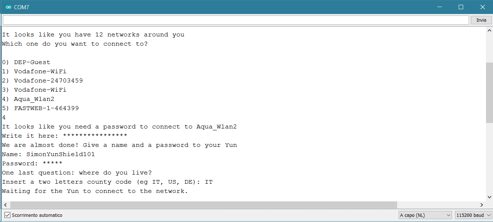
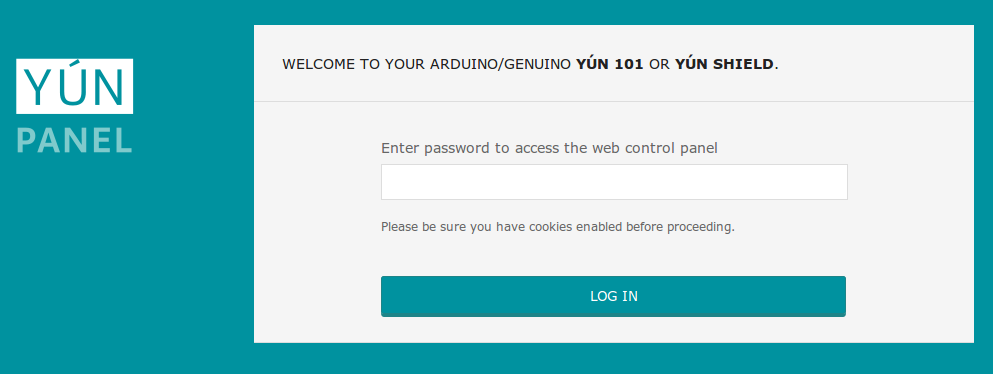
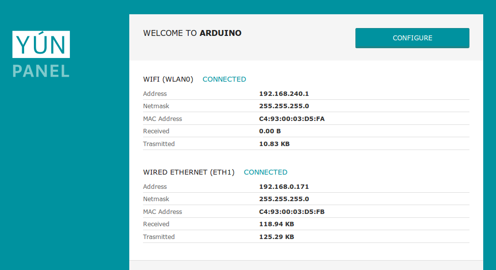
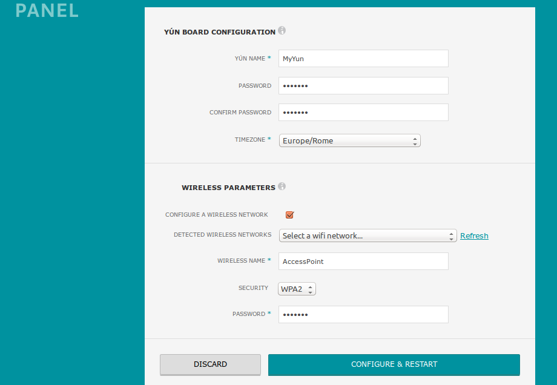
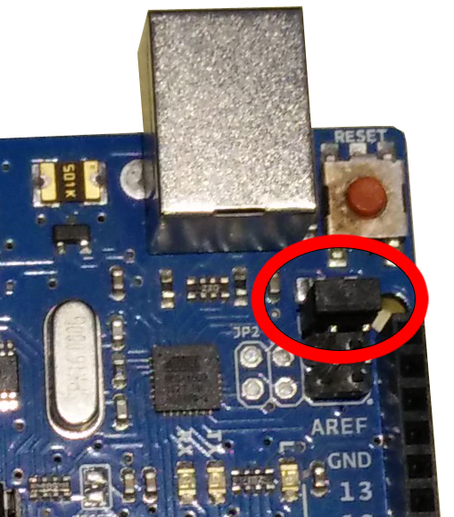
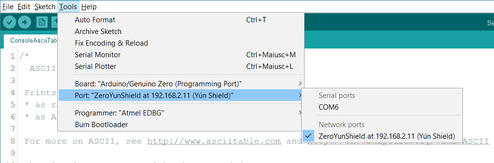
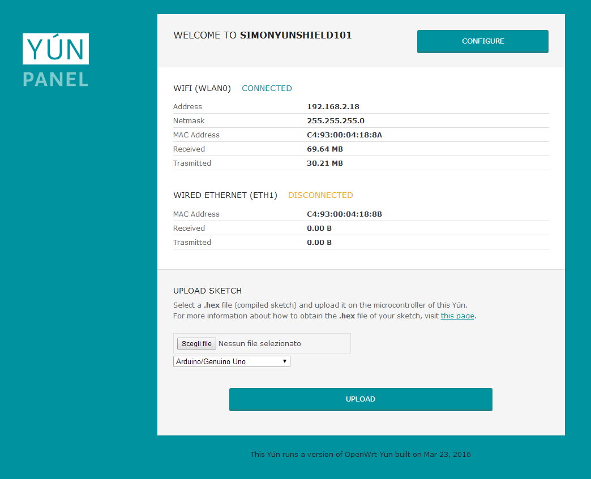
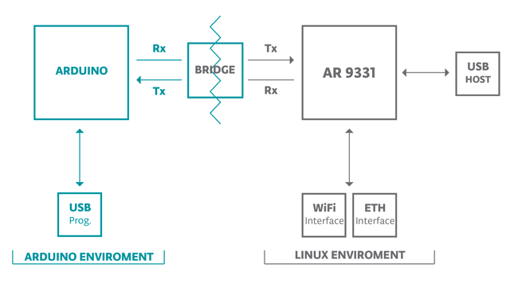

**This is a retired product.**

### Quick Setup

We have prepared a [first configuration sketch](https://arduino.cc/en/Tutorial/LibraryExamples/YunFirstConfig), available under **Examples -> Bridge -> YunFirstConfig**, that allows the easy configuration of the WiFi connection of your Yún Shield.

#### Easy setup for 101, Due, Leonardo and Zero boards

This sketch uses the Serial Monitor of your Arduino Software (IDE) to interact with you, asking the relevant information for the configuration. The shield uses the hardware serial port on pins 0 and 1 to communicate with the board. On the Zero and Due use the Native port to interact with the board.
Please get ready with SSID (the Access Point name) and the key or passphrase to access the WiFi network.
We assume that you have your board properly configured and that you have already attached the shield onto it.
Load the sketch and then open the Serial Monitor clicking on the Magnifier Lens icon on the right of the icon bar.
You will see a message as the one in the screenshot below.


The blue LED on the shield will start to blink after a while; when the scanning process is over, the sketch will offer all the available APs in a numbered list. The time required to scan the network depends on the number of APs and their signal strength.
You choose the AP to use typing in the input field the corresponding number. Please remember to enable "NewLine" in the Serial Monitor as End of Line.



The selection of the AP triggers the connection process and the Yún Shield will sense if the network is open or protected. In this later case, you will be asked to provide the key. The board needs to be named and protected with a password to allow easy and secure connections.
Following these step, your shield is ready to connect to the WiFi network, switching off the AP mode and initiating the access to the selected WiFi network. At the end of this process, the sketch will show the IP address obtained from the WiFi DHCP server.


If the connection fails, the sketch will report it and suggest to restart the whole procedure with a reset of your board.

#### Standard Setup for UNO Rev3, Mega2560 Rev3 boards

These boards do not have a second hardware serial port and therefore can't be used with the easy connection sketch described above. These boards can use the Yún Shield, but will have some limitations listed further down the page.

The Yún Shield has the ability to act as an Access Point, but it can also connect to an existing network. These instructions walk you through connecting your Yún Shield to a wireless network. The Yún Shield can connect to unencrypted networks, as well as networks that support WEP, WPA, and WPA2 encryption.

When you first power on the board to which the Yún Shield is attached, it will create a WiFi network called _ArduinoYun-XXXXXXXXXXXX_. Connect your computer to this network.

Once you've obtained an IP address, open a web browser, and enter
`http://arduino.local` or 192.168.240.1 in the address bar. After a few moments, a web page will appear asking for a password. Enter "`arduino`" and click the _Log In_ button.



You will find a page with some diagnostic information about the current network connections. The first is your WiFi interface, the second is your ethernet connection. Press the _Configuration_ button to proceed.



On the new page, you will configure your Yún Shield, giving it a unique name and identifying what network you want to connect to.

In the _Yún NAME_ field, give your Shield a unique name. You'll use this to refer to it in the future.

Choose a password of 8 or more characters for your Shield. If you leave this field blank, the system retains the default password of `arduino`

If you wish, you can set the timezone and country. It is recommended to set these options as it may help connecting to local WiFi networks. Setting the local timezone also selects the country's regulatory domain.

Enter the name of the wiFi network you wish to connect to.

Select the security type, and enter the password.



When you press the _Configure & Restart_ button, the shield will reset itself and join the specified network. The AP will shut down after a few moments.


You can now join the network you assigned to the Yún Shield.

#### Persistence of the configuration

The shield has an onboard Linux embedded systems based on OpenWRT which provides you a lot of features including storage. This means that the shield once configured keeps the configuration in its memory. Therefore if you detach the shield from a board and attach to another one, the configuration is still memorized and the shield will automatically connect to the last used network.
Once the configuration is set, the shield keeps it and waits for the connection to the stored WiFi network, even if it is not present or reachable. To reset the configuration and enter the AP mode again, you have to press the **Config-Reset** button for at least 5 seconds.

#### Video tutorial

Here you can find the video tutorial for the configuration of the Yún board, that is almost identical to the process described above.

<iframe width='560' height='315' src='https://www.youtube.com/embed/9-hPhWHWnvs' frameborder='0' allowfullscreen=''></iframe>

### Maintenance

The configuration and data stored in the Yún Shield can be managed as follows.

#### Resetting the AR9331 and WiFi

To reset the OpenWRT image to its default state, press the **Config-Reset** button for at least 30 seconds. The board reverts to the original settings: like just taken out of the box or to the latest update of the OpenWRT image you have reflashed before. Among other things, this removes all installed files and network settings.

#### Resetting the password

The webpanel password can be reset and changed. Connect the Arduino Yún Shield to your computer with an USB cable and upload the YunSerialTerminal sketch. It can be found in the Bridge examples in the Arduino IDE. When the Yún Shield boot is complete, open the serial monitor, select New Line character in the dropdown menu and press Enter. Something like this should appear in your serial monitor:


Now you have to execute the **passwd** command to change the password. Type **passwd** into the serial monitor input and press enter.
You will be asked to type the new password, and re-type it to confirm. If you want, you can ignore the weak password error. If both passwords you typed match, the system password will be changed and you will be able to access to the webpanel with the new password.

### Programming the attached board over WiFi

#### UNO Rev3, Mega2560 Rev3 boards special note

The UNO Rev3 and Mega2560 Rev3 boards do not have two hardware serial ports, therefore the only serial port available is connected to the Atheros processor. This keeps the serial port of the ATmega 328P busy and makes programming through USB not possible. Nevertheless, this shield can be used with the UNO board with the following caveats:

- the board with the shield mounted can't be programmed via USB
- the configuration of the shield must be made with the Captive AP procedure
- the sketches can be uploaded only through WiFi using the Arduino Software (IDE) or the Web interface or
- Sketches using serial communication with the user need to use **'Console.print**' instead of **'Serial.print**' and access the Serial Monitor through WiFi As explained further down, the **Console** requires its library to be included in the sketch.

To operate properly, a jumper must be installed on the UNO board to set the 16U2 chip in the proper state, with its serial interface disabled.


Please install this jumper to get the UNO boards to work with the Yún Shield.

#### Zero boards special note

If you are using a Zero board, verify that the SAMD core installed on your IDE is updated to the version 1.6.6 or later and that the bootloader has been [updated](https://arduino.cc/en/Tutorial/ZeroBootloaderUpdate) accordingly.
If you want to upload a sketch to the Zero board via network, through the Yún Shield, you need to power the board from the DC barrel jack or using the Programming USB port.

#### DUE boards special note

This board can be programmed remotely, but the way it interacts with the Yún shield requires a specific procedure that it is initialized by the `checkForRemoteSketchUpdate()` function. As suggested by the name this instruction is responsible to check if there is a new sketch to upload on the board. This is required only on the Due because you need to erase the flash before uploading a new sketch. The same action is performed automatically when you upload a sketch using any of the USB ports. Check the example called **RemoteDueBlink** includedin the Bridge library (_Example -> Bridge -> RemoteDueBlink_), which introduces you on how to use the `checkForRemoteSketchUpdate()` function. You must first load such a sketch via USB and also remember that any remotely loaded sketch must have that instruction to maintain the remote upload functionality.
In order to enable the remote upload feature you need to install the SAM core version 1.6.8 or greater.
To ensure that remote upload works you need to power the DUE from the barrel jack or using the Native USB port.

#### 101 boards special note

This board can be programmed only with a direct USB connection; Arduino Software (IDE) can connect to the IP Port and open the Serial Monitor It's not possible to program the 101 using upload via WiFi or through the web panel.

#### Programming using Arduino Software (IDE)

When your Yún Shield is on the same network as your computer, you can connect to it wirelessly to program the Arduino board attached to it.

After configuring your Yún Shield, connect to the network you specified in the configuration settings. Open the Arduino Software (IDE). Under the _Tools > Port_ menu, you should see an entry that lists your Yún Shield's name and its IP address.



As usual, under the _Board_ menu, select your board type.

To test the programming feature, open the Blink example (_File > Examples > 01.Basics > Blink_) and upload the sketch to the board. You will be prompted for the administrator password. Use the one you entered in the configuration screen. The usual messages should appear at the bottom of the IDE window, confirming the upload.

Once the sketch is uploaded, the board's processor will restart. You should see the LED connected to pin 13 blinking.

#### Programming using the web interface

Open your browser and input the IP address of the Yún Shield; log into the shield with your password and get to the main panel.



The bottom rectangle allows you to choose a ".hex" file to upload and the target board (the one attached to the shield). You can create the Hex file directly from your Arduino Software (IDE) using the menu Sketch ->Export Compiled Binary


that saves in the sketch folder two hex files. If you have connected an AVR Core board, you should use the .hex file that includes the bootloader. If you have connected a SAM or SAMD Core board, please use the one that doesn't include the bootloader. After selecting the right file, click on the _Upload_ bar and follow the output to check that the code has been properly programmed on your board.

**Note: programming the UNO boards through Web interface requires that your Yún Shield has firmware version 1.6.2 or newer. Please check the [upgrade tutorial](http://arduino.cc/en/Tutorial/YunSysupgrade) and be sure you're running the latest version available. **

### Interfacing and programming features

#### OpenWRT image

The Yún Shield runs a distribution of Linux called OpenWRT, based on [OpenWrt](https://openwrt.org/). While it's possible to configure the system from the command line, there is a web page that allows you to configure many of the different options available. The interface (called [LuCi](https://github.com/openwrt/luci)) gives you access to most any setting you would need for maintaining the WiFi interface. You already used this interface if you configured the board from the web browser.

To install additional software on OpenWRT, you need to use the the Linux package manager **opkg**. For more information on the manager and some common commands, see [the Yún package manager page](https://arduino.cc/en/Tutorial/YunPackageManager).

When interfacing with the OpenWRT system, you have to use a command line, either accessing it through the Arduino's Bridge library, or via SSH. If you are unfamiliar with the command line, you may want to [read about some basics](https://arduino.cc/en/Tutorial/LinuxCLI) about it and some of the programs that are frequently used.

Due to continuous improvements and suggestions coming from both the OpenWrt community and the Arduino community, **version of OpenWRT installed on your Yún Shield may be out of date**. Please check the [upgrade tutorial](http://arduino.cc/en/Tutorial/YunSysupgrade) and be sure you're running the latest version available.

#### Python®

An installation of Python® 2.7 is included with OpenWRT, with which you can write applications or scripts. For more on Python®, visit the [Python® 2.7 documentation pages](http://docs.python.org/2/).

If you're getting started with Python® for the first time, there are a number of excellent resources on-line. ["Learn Python® the Hard Way"](http://learnpythonthehardway.org/book/) will cover everything you need to know to get up and running with your own scripts.

#### Web services

OpenWRT uses REST for clients and servers. REST is an acronym for "Representational State Transfer". It is a software architecture that exposes various parts of the Arduino hardware through URLs.

By default, the REST API access is password protected. It is possible to change this to access the services without a password. To change this setting, enter the Yún Shield configuration panel. At the bottom of the page, you will see toggles for changing the access.


A nice introduction to the concepts behind REST [can be found here](http://stackoverflow.com/tags/rest/info).

The three REST end points recognized by the Yún Shield are:

- /arduino

- /data

- /mailbox

The "/arduino" directory doesn't have anything pre-configured. Anything added to the URL after the end point is passed from the webserver to the sketch on the microcontroller of the attached board. You can define your APIs inside the sketch. See the Bridge example to see how this is done to access the pins on the board.

"/data" is used to access to the internal key/value storage. The available calls are:

- _/put/KEY/VALUE_ : stores a value inside the storage

- _/get/KEY_ : obtains the value of the requested key in JSON

- _/get_ : obtains the entire storage list in JSON.

- _/delete_ : deletes the internal storage

"mailbox" is used to add messages into a queue called Mailbox. The message queue is stored inside the Linux system and can be read by the Arduino microcontroller. The available REST call is:

- "/mailbox/message"

#### Using the onboard Ethernet

When you connect the Yun Shield to a wired network with an ethernet cable, it will try to connect automatically via DHCP. The board will show up on the ports menu just as it would over WiFi.

If you want to connect the Yun Shield directly to your computer, either configure the computer's interfaces to have a static IP address, or act as a DHCP server.

_NB: the ethernet interface is eth1, not eth0_

#### Communicating with OpenWRT via Bridge

The Bridge library enables communication between Arduino and OpenWRT. There are several different utility classes that facilitate different kinds of communication between the two, described below, and more in depth on the [Bridge library reference](https://arduino.cc/en/Reference/YunBridgeLibrary) pages.



The WiFi and Ethernet interfaces and USB host are all connected to the AR9331. The Bridge library allows you to work with these devices, as well as run scripts and communicate with web services.

#### The Console

The Console, based on Bridge, enables you to send information from the Yún Shield to a computer just as you would with the serial monitor, but wirelessly. It creates a secure connection between the Yún Shield and your computer via SSH.

Load the following onto your Yún Shield:

```c
#include <Console.h>

const int ledPin = 13; // the pin that the LED is attached to
int incomingByte;      // a variable to read incoming serial data into

void setup() {

  // initialize serial communication:

  Bridge.begin();

  Console.begin();

  while (!Console){

    ; // wait for Console port to connect.

  }

  Console.println("You're connected to the Console!!!!");

  // initialize the LED pin as an output:

  pinMode(ledPin, OUTPUT);
}

void loop() {

  // see if there's incoming serial data:

  if (Console.available() > 0) {

    // read the oldest byte in the serial buffer:

    incomingByte = Console.read();

    // if it's a capital H (ASCII 72), turn on the LED:

    if (incomingByte == 'H') {

      digitalWrite(ledPin, HIGH);

    }

    // if it's an L (ASCII 76) turn off the LED:

    if (incomingByte == 'L') {

      digitalWrite(ledPin, LOW);

    }

  }

  delay(100);
}
```

To see the Console, select your Yún's name and IP address in the Port menu. The Yún Shied 101 will only show up in the Ports menu if your computer is on the same LAN as the Yún. If your board is on a different network, you won't see it in the Ports menu. Open the Port Monitor. You'll be prompted for the Yún's password.

You can also see the Console by opening a terminal window and typing `ssh root@yourYunsName.local 'telnet localhost 6571'` then pressing enter.

_NB: If you are using Windows, you must install a terminal emulator. [PuTTY](http://www.chiark.greenend.org.uk/~sgtatham/putty/) is a reasonable choice, but you will have to enter the two commands above separately._

Type 'H' to turn the LED on pin 13 on and type 'L' to turn it off.

#### Process

The Process commands allow you to run Linux processes on OpenWRT through the Arduino.

In the following example, The OpenWRT will connect to a server with `curl`, and download some ASCII text. It prints the text a serial connection.

```c
#include <Process.h>

void setup() {

  // Initialize Bridge

  Bridge.begin();

  // Initialize Serial

  Serial.begin(9600);

  // Wait until a Serial Monitor is connected.

  while (!Serial);

  // run various example processes

  runCurl();
}

void loop() {

  // Do nothing here.
}

void runCurl() {

  // Launch "curl" command and get Arduino ascii art logo from the network

  // curl is command line program for transferring data using different internet protocols

  Process p;        // Create a process and call it "p"

  p.begin("curl");  // Process that launch the "curl" command

  p.addParameter("http://arduino.tips/asciilogo.txt"); // Add the URL parameter to "curl"

  p.run();      // Run the process and wait for its termination

  // Print arduino logo over the Serial

  // A process output can be read with the stream methods

  while (p.available()>0) {

    char c = p.read();

    Serial.print(c);

  }

  // Ensure the last bit of data is sent.

  Serial.flush();
}
```

#### Using Bridge to pass information between processors

Bridge allows you to pass information between the two processors using a key/value pairing.

This example shows how to use the Bridge library to access the digital and analog pins on the board through REST calls. It demonstrates how you can create your own API when using REST style calls through the browser.

When running this example, make sure your computer is on the same network as the Yun Shield.

When you have have programmed the board, you can request the value on a pin, write a value to a pin, and configure a pin as an input or output.

When the REST password is turned off, you can use a browser with the following URL structure :

- [http://myArduinoYun.local/arduino/digital/13](http://myArduinoYun.local/arduino/digital/13) : calls digitalRead(13);

- [http://myArduinoYun.local/arduino/digital/13/1](http://myArduinoYun.local/arduino/digital/13/1) : calls digitalWrite(13,1);

- [http://myArduinoYun.local/arduino/analog/9/123](http://myArduinoYun.local/arduino/analog/9/123) : analogWrite(9,123);

- [http://myArduinoYun.local/arduino/analog/2](http://myArduinoYun.local/arduino/analog/2) : analogRead(2);

- [http://myArduinoYun.local/arduino/mode/13/input](http://myArduinoYun.local/arduino/mode/13/input) : pinMode(13, INPUT);

- [http://myArduinoYun.local/arduino/mode/13/output](http://myArduinoYun.local/arduino/mode/13/output) : pinMode(13, OUTPUT);

You can use the curl command from the command line instead of a browser if you prefer.

You need to include the Bridge, YunServer, and YunClient libraries :

```c
#include <Bridge.h>
#include <YunServer.h>
#include <YunClient.h>
```

Instantiate a server enabling the the Yun to listen for connected clients.

`YunServer server;`

In `setup()`, start serial communication for debugging purposes, and turn the built-in LED on pin 13 high while Bridge begins. `Bridge.begin()` is blocking, and should take about 2 seconds to complete. Once Bridge starts up, turn the LED off.

```c
void setup() {

  Serial.begin(9600);

  pinMode(13,OUTPUT);

  digitalWrite(13, LOW);

  Bridge.begin();

  digitalWrite(13, HIGH);
```

In the second part of `setup()`, tell the instance of YunServer to listen for incoming connections only coming from localhost. Connections made to OpenWRT will be passed to the 32U4 processor for parsing and controlling the pins. This happens on port 5555. Start the server with `server.begin()`.

```c
server.listenOnLocalhost();

  server.begin();
}
```

In `loop()`, you'll create an instance of the YunClient for managing the connection. If the client connects, process the requests in a custom function (described below) and close the connection when finished.

Putting a delay at the end of `loop()` will be helpful in keeping the processor from doing too much work.

```c
void loop() {

  YunClient client = server.accept();

  if (client) {

    process(client);

    client.stop();

  }

  delay(50);
}
```

Create a function named `process` that accepts the YunClient as its argument. Read the command by creating a string to hold the incoming information. Parse the REST commands by their functionality (digital, analog, and mode) and pass the information to the appropriately named function.

```c
void process(YunClient client) {

  String command = client.readStringUntil('/');

  if (command == "digital") {

    digitalCommand(client);

  }

  if (command == "analog") {

    analogCommand(client);

  }

  if (command == "mode") {

    modeCommand(client);

  }
}
```

Create a function to deal with _digital_ commands. Accept the client as the argument. Create some local variables to hold the pin and value of the command.

```c
void digitalCommand(YunClient client) {

  int pin, value;
```

Parse the client's request for the pin to work with using `client.parseInt()`.

If the character after the pin is a "/", it means the URL is going to have a value of 1 or 0 following. This value will assign a value to the pin, turning it HIGH or LOW. If there is no trailing "/", read the value from the specified pin.

```c
pin = client.parseInt();

  if (client.read() == '/') {

    value = client.parseInt();

    digitalWrite(pin, value);

  }

  else {

    value = digitalRead(pin);

  }
```

Print the value to the client and update the datastore key with the current pin value.

By wrapping the value to the client in `F()`, you'll be printing form the flash memory. This helps conserve space in SRAM, which is useful when dealing with long strings like URLs.

The key will be the pin, and type. For example _D2_ will be saved for for digital pin 2. The value will be whatever value the pin is currently set to, or was read from the pin.

```c
client.print(F("Pin D"));

  client.print(pin);

  client.print(F(" set to "));

  client.println(value);

  String key = "D";

  key += pin;

  Bridge.put(key, String(value));
}
```

Set up a function to handle analog calls in the same fashion, except setting the key to A instead of D when working with the analog input pins :

```c
void analogCommand(YunClient client) {

  int pin, value;

  pin = client.parseInt();

  if (client.read() == '/') {

    value = client.parseInt();

    analogWrite(pin, value);

    // Send feedback to client

    client.print(F("Pin D"));

    client.print(pin);

    client.print(F(" set to analog "));

    client.println(value);

    String key = "D";

    key += pin;

    Bridge.put(key, String(value));

  }

  else {

    value = analogRead(pin);

    client.print(F("Pin A"));

    client.print(pin);

    client.print(F(" reads analog "));

    client.println(value);

    String key = "A";

    key += pin;

    Bridge.put(key, String(value));

  }
}
```

Create one more function to handle pin mode changes. Accept the YunClient as the argument, and create a local variable to hold the pin number. Read the pin value just as you did in the digital and analog functions.

```c
void modeCommand(YunClient client) {

  int pin;

  pin = client.parseInt();
```

Check to make sure the URL is valid

```c
if (client.read() != '/') {

    client.println(F("error"));

    return;

  }
```

If it's a valid URL, store the URL as a string. If the mode is an `input` or `output`, configure the pin and report it to client. If the string doesn't match those values, return an error.

```c
String mode = client.readStringUntil('\r');

  if (mode == "input") {

    pinMode(pin, INPUT);

    // Send feedback to client

    client.print(F("Pin D"));

    client.print(pin);

    client.print(F(" configured as INPUT!"));

    return;

  }

  if (mode == "output") {

    pinMode(pin, OUTPUT);

    // Send feedback to client

    client.print(F("Pin D"));

    client.print(pin);

    client.print(F(" configured as OUTPUT!"));

    return;

  }

  client.print(F("error: invalid mode "));

  client.print(mode);
}
```

You can find more details on this example on the [Bridge Example](https://arduino.cc/en/Tutorial/Bridge) page.

#### Install additional software on Linux

The Yún Shield comes with several pieces of software pre-installed on OpenWRT, including "curl" and "python". You may want to install other software on the Yún. On Linux systems, additional software can be installed using a tool called the "package management system". For more information, refer to the [package manager tutorial](https://arduino.cc/en/Tutorial/YunPackageManager).

#### See also

Now that you've gotten the basics down, you can dig in deeper with the [Bridge library and examples](https://arduino.cc/en/Reference/YunBridgeLibrary). You can also check out the [Yún Shield product page](https://arduino.cc/en/Main/ArduinoYunShield) for additional technical information.

The text of the Arduino getting started guide is licensed under a
[Creative Commons Attribution-ShareAlike 3.0 License](http://creativecommons.org/licenses/by-sa/3.0/). Code samples in the guide are released into the public domain.
