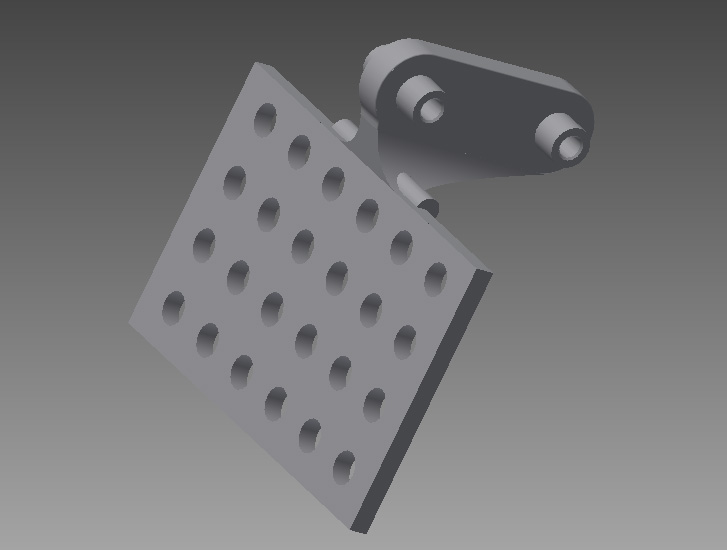
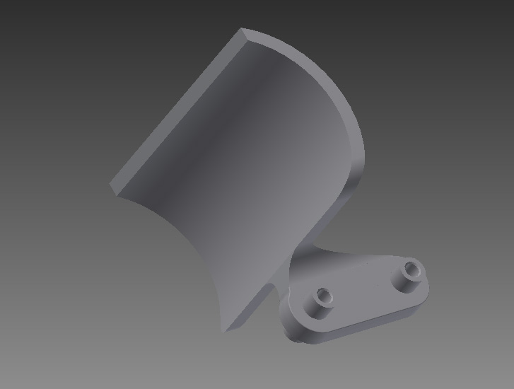
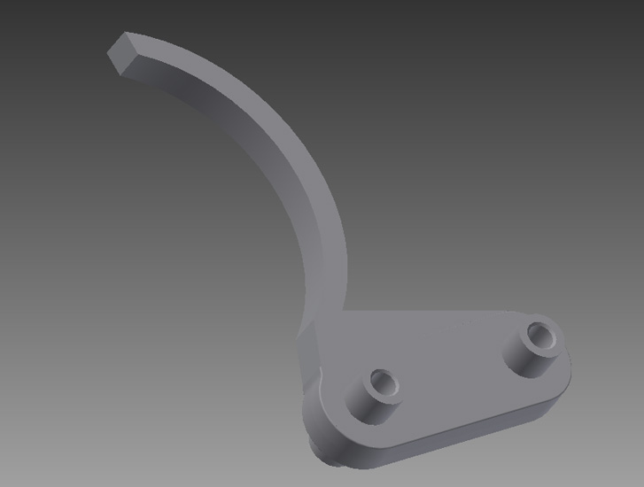
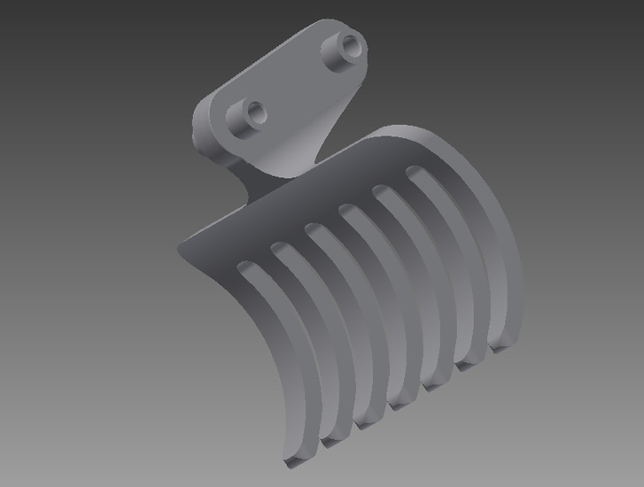
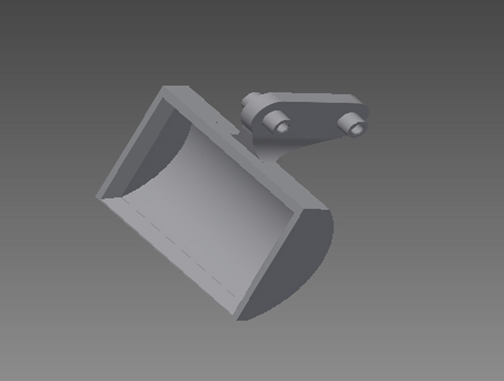
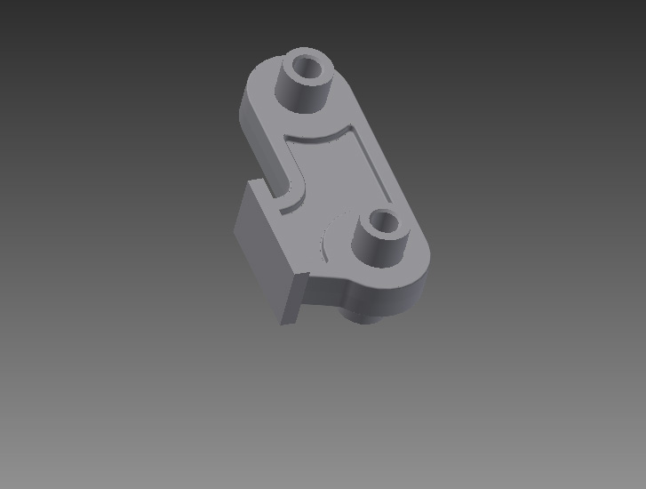
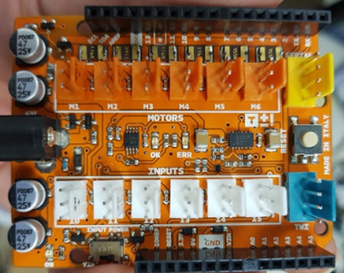
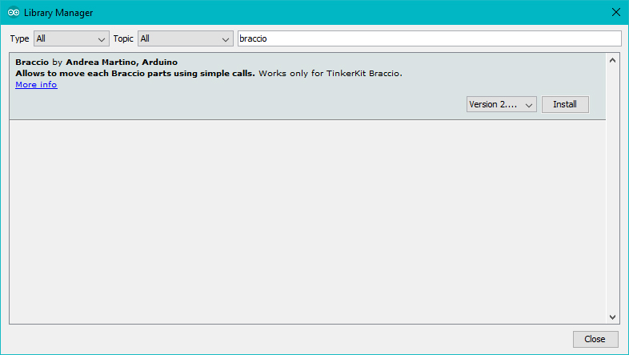

The TinkerKit Braccio is a fully operational robotic arm, controlled via Arduino. It can be assembled in several ways for multiple tasks such as moving objects. You can also attach a camera or solar panel. There are so many ways in which the Braccio can extend the reach of your devices.

## Assembly

Before you can use Tinkerkit Braccio you need to assemble it, so take your time, find a proper desk with enough space to place all the parts comfortably and follow our instructions.

You may follow our printed guide available inside the box, or you can [download an electronic copy](https://content.arduino.cc/assets/Braccio%20Quick%20Start%20Guide.pdf).

If you prefer to see all the steps to build it we have made a video that you can play, stop and repeat as you need.

<iframe width='560' height='315' src='https://www.youtube.com/embed/Lwb2ppat_bs' frameborder='0' allow='accelerometer; autoplay; encrypted-media; gyroscope; picture-in-picture' allowfullscreen=''></iframe>

## Hack your Braccio

We have prepared for you a set of alternative fingers that change the abilities of Braccio. One of these is without any specific **tool** and you may start from the 3D file to create your own tool. The supplied formats are STL (3D Mesh) and IPT (Autodesk Inventor).

 This is the 1000 holes finger, [IPT file here](https://content.arduino.cc/assets/a_DITO%20MILLEFORI.ipt) and [STL file here](https://content.arduino.cc/assets/a_DITO%20MILLEFORI.stl).

 This is the big cylinders finger, [IPT file here](https://content.arduino.cc/assets/b_DITO%20PER%20CILINDRI%20%20GROSSI.ipt) and [STL file here](https://content.arduino.cc/assets/b_DITO%20PER%20CILINDRI%20%20GROSSI.stl).

 This is the normal cylinders finger, [IPT file here](https://content.arduino.cc/assets/c_DITO%20PER%20CILINDRI.ipt) and [STL file here](https://content.arduino.cc/assets/c_DITO%20PER%20CILINDRI.stl).

 This is the forks finger, [IPT file here](https://content.arduino.cc/assets/e_DITO%20A%20FORCHETTA.ipt) and [STL file here](https://content.arduino.cc/assets/e_DITO%20A%20FORCHETTA.stl).

 This is the sand digger finger, [IPT file here](https://content.arduino.cc/assets/f_DITO%20PER%20SABBIA.ipt) and [STL file here](https://content.arduino.cc/assets/f_DITO%20PER%20SABBIA.ipt).

 This is the _design your own_ finger template, [IPT file here](https://content.arduino.cc/assets/G_DITO%20%20PER%20REALIZZARE%20NUOVE%20FORME.ipt), no STL as you need to create your own.

## Braccio Shield

The included Braccio shield allows you to hook up the servos directly to your Arduino board.

**Braccio Shield V4**

The latest version of Braccio shield is V4; you can recognize it by the power switch that is necessary to properly connect Arduino Yun, Tian and Primo: "VIN" position for Yun, Tian and Primo, "5V" for the other boards.



For a correct use of the Braccio shield V4 is necessary at least the IDE 1.7.11.

On the Braccio shield V4 a new feature is present: the "Soft-start". This function is included in the `Braccio.begin()` function and starts the Braccio softly and safe to protect the servo motors for the first 8 seconds.

The Soft-start works each time you call `Braccio.begin()`. During this phase the shield doesn't give the maximum voltage level to the servo motors and you should not use the Braccio to lift any weight.

If the Braccio hit something or is locked the resettable fuse on the Braccio shield could detach the power for the servo motor and is necessary to unplug and replug the power connector of the Braccio shield.

With the Braccio Shield V4 the digital 12 is not available if you are connecting the Braccio to the shield or if you are using M1, M2, M3, M4, M5, M6 connectors as digital.

Pin 12 is used to manage the voltage level of the Soft-start (on the shield there's a dot instead of "12").

If you want to disable the Soft-start function:

```arduino
pinMode(12, OUTPUT);    you need to set HIGH the pin 12
digitalWrite(12, HIGH);

Braccio.begin(SOFT_START_DISABLED); and set a proper parameter to disable the soft start
```

In this way you can normally use M1-M6 connectors as digital and you can use Braccio without the soft start.

The shield has 12 standard TinkerKit 3-pin connectors.

The connectors labeled M1 through M6 are connected to the PWM capable outputs of the Arduino board. The connectors labeled I0 through I5 are analog inputs.

Each of the motor connections have a protection fuse:

- M1 through M4 are limited to 1.1A

- M5 and M6 are limited to 750mA

The connectors are connected to the following pins on the shield:

| Connector Name | Shield pin  |
| -------------- | ----------- |
| M1             | 11          |
| M2             | 10          |
| M3             | 9           |
| M4             | 6           |
| M5             | 5           |
| M6             | 3           |
| I0             | A0 (aka 14) |
| I1             | A1 (15)     |
| I2             | A2 (16)     |
| I3             | A3 (17)     |
| I4             | A4 (18)     |
| I5             | A5 (19)     |
| TWI            | SCL, SDA    |
| Serial         | RX0, TX0    |

The 4-pin TWI connector allows your Arduino board to communicate with devices that support the TWI (Two Wire Interface) or I2C (Inter-Integrated Circuit) protocol through the Wire library in Arduino. Ground and 5 volt connections are provided on the connector.

NOTE: On the Arduino UNO, the I2C bus uses Analog Input 4 and 5 (A4 and A5), whereas on the Arduino Mega the I2C connection is on pins 20 and 21. Using the TWI connector on the UNO (and similar) will preclude the use of those analog inputs (A4 and A5).

The 4-pin SERIAL connector allows the board to communicate with other devices that support serial communication. Ground and 5 volt connections are provided on the connector for your convenience.

NOTE: If you're sending or receiving data to and from the computer this serial connector is not available.

The shield contains three status LEDs:

- Green LED (LED ON) signals that the shield is on

- Another green LED (LED OK) signals that the shield is correctly powered

- A red LED (LED ERR) signals that the shield is not correctly powered

A standard 6 mm pushbutton allows you to reset the board, and there is a jack for the external 5V 5000 mA power supply.

Compatible Boards:

- Uno

- Uno SMD

- Uno WiFi
- Due

- Mega 2560

- Ethernet

- Leonardo

- Leonardo ETH

- M0

- M0 Pro

- Yun\*

- Tian\*

Using the Arduino UNO WiFi, Leonardo Ethernet, Yún or Tian, you can control your Braccio through the network with your PC or your smartphone. See below for a demonstration.

### Note for Tian or Yun.

Take care plugging the shield on Tian or Yun, do not push the shield deeply due to not create a short circuit between the M1 connector and the ethernet plug.

### Note for the Arduino YÚN, Tian and Primo with Braccio Shield V4

To make its compatible with the shield, you must move the power switch to "VIN" position due to the fact that the Arduino Yun, Tian and Primo cannot be powered from the 5V pin.

## TinkerKit Braccio Library

To use your TinkerKit Braccio you need to load the Braccio library using the Library manager of the Arduino Software (IDE); see [these instructions](https://arduino.cc/en/Guide/Libraries) for details on installing libraries.



The functions available in this library are just two.

### Braccio.Begin()

Initialize and set up the initial position for Braccio

All the servo motors will be positioned in the "safety" position:<br />
Base (M1):90 degrees<br />
Shoulder (M2): 45 degree<br />
Elbow (M3): 180 degrees<br />
Wrist vertical (M4): 180 degrees<br />
Wrist rotation (M5): 90 degrees<br />
Gripper (M6): 10 degrees

### Braccio.ServoMovement (step delay, M1, M2, M3, M4, M5, M6)

With this function you can control all the Braccio's servos with only one command

Step Delay: a milliseconds delay between the movement of each servo. Allowed values from 10 to 30 msec.<br />
M1: base degrees. Allowed values from 0 to 180 degrees<br />
M2: shoulder degrees. Allowed values from 15 to 165 degrees<br />
M3: elbow degrees. Allowed values from 0 to 180 degrees<br />
M4: wrist vertical degrees. Allowed values from 0 to 180 degrees<br />
M5: wrist rotation degrees. Allowed values from 0 to 180 degrees<br />
M6: gripper degrees. Allowed values from 10 to 73 degrees. 10: the toungue is open, 73: the gripper is closed.

The text of the Arduino getting started guide is licensed under a
[Creative Commons Attribution-ShareAlike 3.0 License](http://creativecommons.org/licenses/by-sa/3.0/). Code samples in the guide are released into the public domain.
