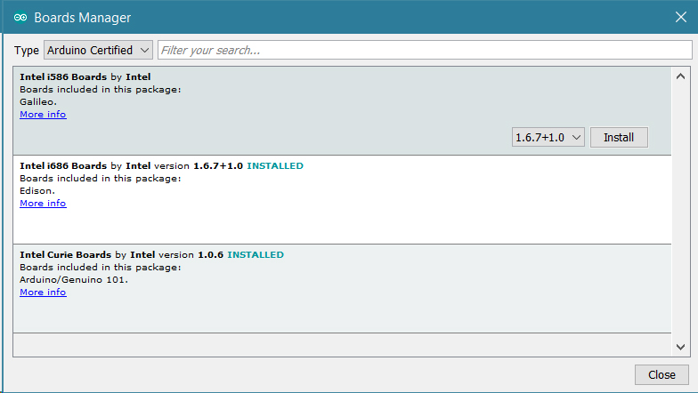
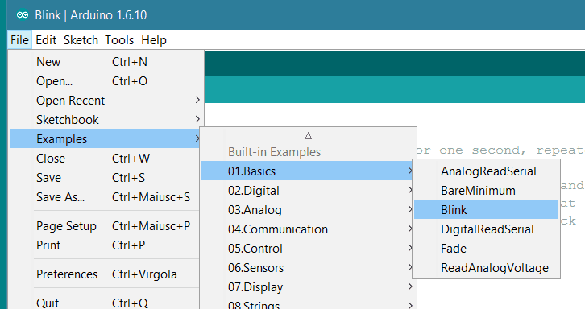
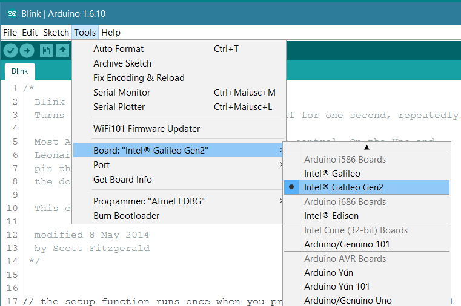
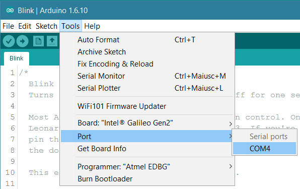
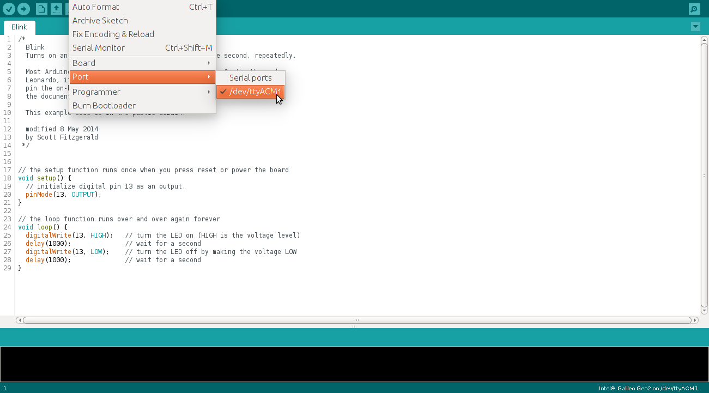
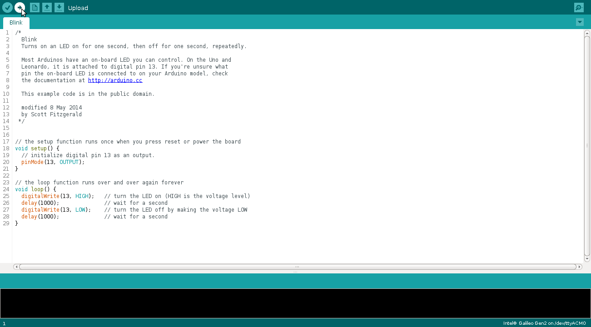

**This is a retired product.**

The [Intel® Galileo Gen2](/retired/getting-started-guides/IntelGalileoGen2) supports shields that operate at either 3.3v or 5v. The board is designed to be hardware and software pin-compatible with Arduino shields designed for the Uno R3. Digital pins 0 to 13 (and the adjacent AREF and GND pins), Analog inputs 0 to 5, the power header, ICSP header, and the UART port pins (0 and 1), are all in the same locations as on the Arduino Uno R3.

The Intel® Galileo Gen2 is programmed using the [Arduino Software (IDE)](https://arduino.cc/en/Main/Software), our Integrated Development Environment common to all our boards and running both [online](https://create.arduino.cc/editor) and offline. For more information on how to get started with the Arduino Software visit the [Getting Started page](https://arduino.cc/en/Guide/HomePage).

### Use your Intel® Galileo Gen2 on the Arduino Web IDE


All Arduino boards, including this one, work out-of-the-box on the [Arduino Cloud Editor](https://create.arduino.cc/editor), you only need to install Arduino Create Agent to get started.

The Arduino Cloud Editor is hosted online, therefore it will always be up-to-date with the latest features and support for all boards. Follow this [simple guide](https://create.arduino.cc/projecthub/Arduino_Genuino/getting-started-with-arduino-web-editor-4b3e4a) to start coding on the browser and upload your sketches onto your board.


### Use your Intel® Galileo Gen2 on the Arduino Desktop IDE

If you want to program your Intel® Galileo Gen2 while offline you need to install the [Arduino Desktop IDE](https://arduino.cc/en/Main/Software) and add the Intel® Galileo Gen2 Core to it. This simple procedure is done selecting **Tools menu**, then **Boards** and last **Boards Manager**, as documented in the [Arduino Boards Manager](https://arduino.cc/en/Guide/Cores) page.

This simple procedure is done selecting **Tools menu**, then **Boards** and last **Boards Manager**. Select _Arduino Certified_

```arduino
as type and then click on the *Intel i586 boards by Intel*. Select the latest core and then Install.
```



When the process is completed, the Intel Galileo Gen2 board will be available in the boards list.

#### Connect the board to your PC

To avoid damage to your Intel® Galileo Gen2, always apply power to the board via the included power supply
before connecting to your computer via USB. Once the board is connected to power, connect the Galileo to your computer with a microUSB cable.

#### Load the blink example

Load the LED blink example sketch: **File > Examples > 01.Basics > Blink**.



#### Select your board

You'll need to select the Intel® Galileo Gen 2 in the **Tools > Board** menu as shown below:



#### Select your serial port

Select the serial device of the board from the **Tools > Serial Port** menu. The easiest way to find what port the board is using is by disconnecting your board, restarting the IDE, and re-opening the menu; the entry that disappears should be the Intel® Galielo Gen 2 board. Reconnect the board, restart the IDE, and select that serial port.

**On Windows**

The port is likely to be COM3 or higher and is called "Intel Galileo Gen 2 Virtual Com Port" in the Device Manager. It is NOT "USB Serial Port". COM1 and COM2 are usually reserved for hardware serial ports:



**On Linux**

The port is likely to be /dev/ttyACM1:



**On Mac OS X**

The port is likely to be /dev/cu.usbmodemxxxx. If you have multiple such devices, select any one of them as they should all give the same results:


#### Upload and Run your first Sketch

Click the **Upload** button in the upper left to load and run the sketch on your board:



You should see a **Transfer complete** message when it has uploaded. Now your built-in led should blink.


You have successfully set up your Intel® Edison board and uploaded your first sketch. You are ready to move on with our tutorials and projects: choose your next destination below.

### Tutorials

Now that you have set up and programmed your Intel® Galileo Gen2 board, you may find inspiration in our [Project Hub](https://create.arduino.cc/projecthub/search?q=galileo) tutorial platform, or learn how to use the specific features of the Galileo board.

Here a list of tutorials that will help you in making very cool things!

[Linux Tutorial For Intel® Galileo Gen 2](https://communities.intel.com/docs/DOC-23764)
[GSM Controlled Star Light](https://communities.intel.com/docs/DOC-23562)
[Touchscreen Controlled Marionette](https://communities.intel.com/docs/DOC-23741)
[Real-Time Lamp](https://communities.intel.com/docs/DOC-23832)

The text of the Arduino getting started guide is licensed under a
[Creative Commons Attribution-ShareAlike 3.0 License](http://creativecommons.org/licenses/by-sa/3.0/). Code samples in the guide are released into the public domain.
