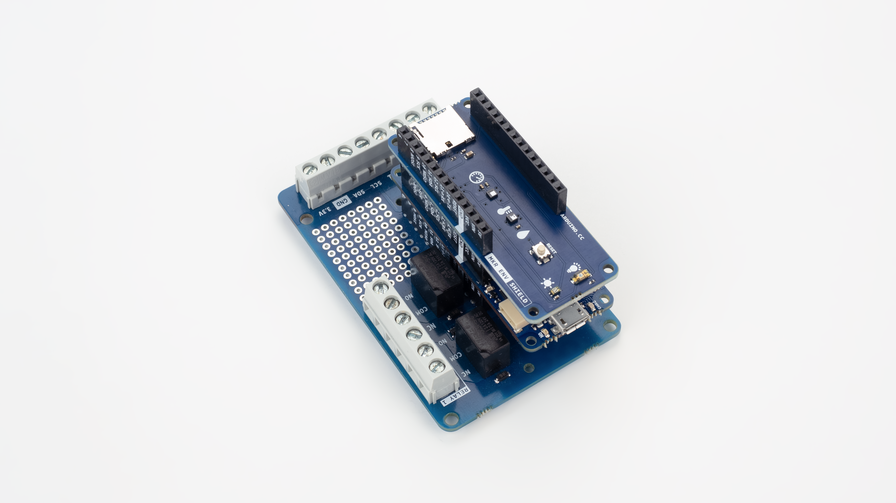
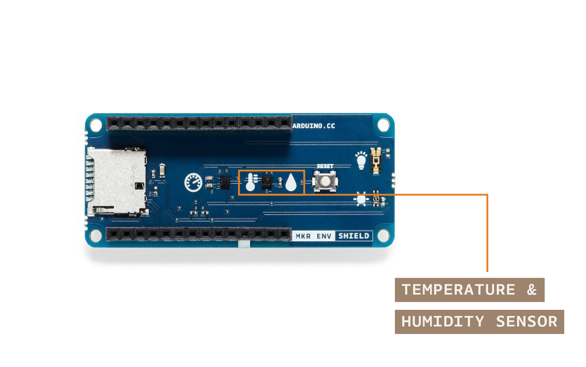
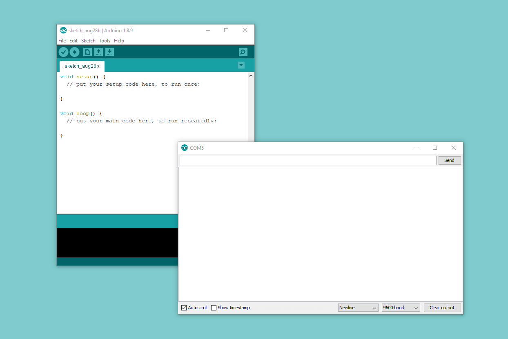
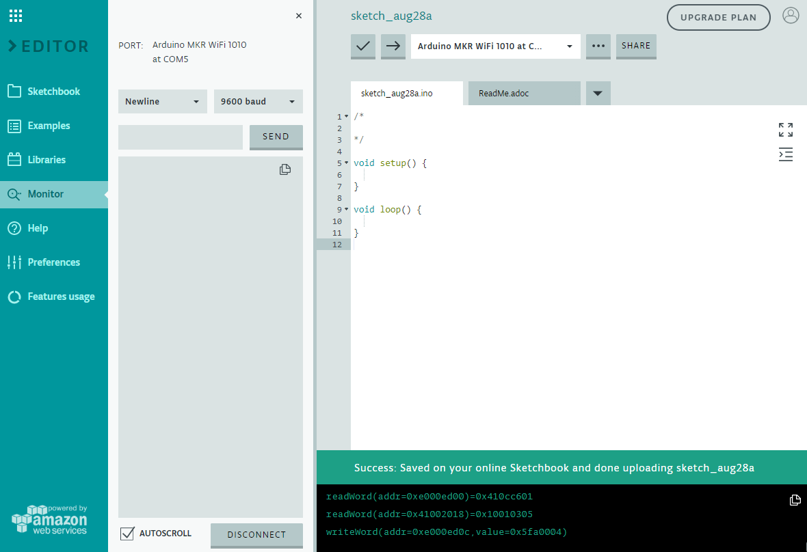
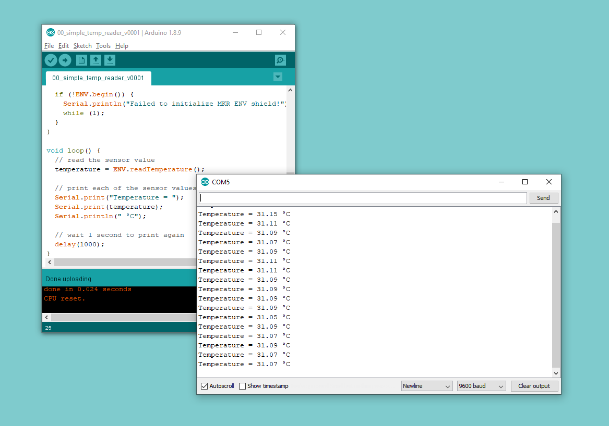

## IoT\-Prime Experiment 1:

## Get to know the kit

### Introduction

The IoT PRIME Bundle kit is made of three main boards and a series of components. There is an Arduino MKR1010, a MKR ENV Shield, and a MKR Relay Proto Shield. Each one of these boards has a different function that will help you to step-by-step construct a fully functional -yet minimal in features- weather station. In this experiment you will connect the different boards and capture temperature data that will be sent back to the computer via the serial port monitor.

### Learning Objectives

The goals of this exercise are:

* Understanding how different electronic components can connect to one another
* Learning about the installation of software and libraries that can be used for data collection
* Collecting data from a sensor using an existing library
* Sending data from a board to a computer via serial communication
* Learning about temperature sensors

### Exercise’s complexity

This exercise requires having previous knowledge in:

* Basic programming constructs
* Arduino’s code structure: [setup](https://www.arduino.cc/reference/en/language/structure/sketch/setup/) \+ [loop](https://www.arduino.cc/reference/en/language/structure/sketch/loop/) ([read more about it here](/learn/programming/sketches))

### Components Used

#### MKR1010

The *Arduino MKR1010* (read “maker ten ten”) is a microcontroller board featuring a chip that will allow you making either a **WiFi** or **Bluetooth** wireless connection to other boards or computers. We will see some of those features in action in this collection of exercises.

##### Start Using your Board

You can see how to connect this board to your computer by checking this [Getting Started Guide](https://www.arduino.cc/en/Guide/MKRWiFi1010). You can use that guide to install the offline Arduino IDE that will run from your computer, and to learn how to troubleshoot any potential issues you might have when writing your first programs. You can also start using the online version of Arduino’s code editor that you will find at: [https://create.arduino.cc](https://create.arduino.cc) Please note that you have to become a registered Arduino user to use the online editor.

#### MKR ENV Shield

A shield is a board that you add to an Arduino microcontroller board to add some extra functionality. The ENV Shield comes with the following sensors:

* Temperature
* Humidity
* Barometric pressure
* Lux
* UV radiation A and B

The different sensors communicate with the MKR1010 using either the SPI or I2C protocols, standard communication mechanisms within electronic circuit boards.

The ENV Shield comes with a microSD card slot. This can be used to store the data gathered by the sensors locally. This could be handy when designing systems that might not be connected or where the data gathering happens at such a pace that it is not possible to send all of the data through the network because of bandwidth issues.

##### ENV Shield Library

These new features come with associated software you will need to install. The software the allows using a certain shield is what we call a library. Follow this [step-by-step guide](https://www.arduino.cc/en/guide/libraries) in how to install any library, choose the needed ENV Shield library by typing its name in the search box, it will give you access to the different sensors in the shield.

#### MKR Relay Proto Shield

The MKR Relay Proto Shield is a board providing your MKR1010 board with two relays, which are electromechanical switches, that can be used to control any kind of electrical devices that could be activated with an on-off switch: lamps, fans, water pumps, electrical motors, heaters, etc. Activating the relays is as simple as activating one of the pins that control them, this will allow for electricity to flow.

The shield has a prototyping area that could be used to solder your own components and, in that way, make a more final installation using it. This is something we will not see throughout this course, but you should be aware of the possibility.

#### Mount the Boards

We recommend that you mount the three boards together from now and keep them this way throughout the course. The building configuration is simple to mount and keeps the components secure.




### Data Collected

In this exercise we are going to work with one single sensor. We will focus on working with the temperature sensor on the ENV Shield since it is easy to affect it and see how the changes of temperature can be registered and displayed on a computer.



The ENV Shield has a temperature and humidity sensor called HTS221. It is a sensor manufactured by *ST microelectronics*. You can see its [datasheet here](https://content.arduino.cc/assets/Iot-Prime/LPS22HB.pdf). The library exposes the sensor with a method called `readTemperature()`. You can call this method through the object named `ENV` that is built and exposed when instantiating the library. In other words, all of the sensors on the shield can be accessed by calling the command line `ENV.readSensor()` where `readSensor` has to correspond with the actual sensor being checked. In our case, it is the temperature, thus the method is called `readTemperature()`.

In the specific case of calling `readTemperature()`, it can be called with or without parameters. By default (no parameters) it will be answering with the temperature in *Celsius*. It is possible to call it in three possible ways:

* `ENV.readTemperature()`: default mode, answers with the temperature in Celsius degrees
* `ENV.readTemperature(CELSIUS)`: using the *CELSIUS* constant, it will read the temperature in Celsius degrees
* `ENV.readTemperature(FAHRENHEIT)`: using the *FAHRENHEIT* constant, it will read the temperature in Fahrenheit degrees

The sensor’s range and accuracy makes is suitable for a lot of interesting experimental settings. The temperature range goes between -40 and +120 (°C) and the accuracy is ± 0.5 °C in the range of 15 to +40 °C.

### How Data is Consumed

In this experiment we will be collecting temperature data from the sensor and sending it via the serial port to the code editor that will display the outcome. We will also how to experimentally change the code to display temperature in different scales.

We will use the serial port terminal (terminal for short), a dialog window that displays the data flowing between your board and the computer through the USB programming cable. The terminal allows receiving not only numerical values, but also text that will make the readings easier to understand. In the offline editor, the serial terminal is activated by clicking on the magnifying lens icon at the far-most right part of the toolbar.



The online editor has the terminal embedded in the UI, as shown in the following image.



### Schematic

In this project, the schematic is uber-simple, as the sensor we are going to use is part of the ENV Shield, there is no need to use the breadboard in the first place.


### Picture of the Construction


### Gradually Built Code

Before starting with programming, and after connecting your board to the computer, make sure you have selected the right board and communication port in the Tools menu of the offline IDE (or the drop-down list of the online one). You will not need to unplug the board in the process that follows.

#### The intro code

Start by making a new program, and give it a good name. For example: *00\_simple\_temp\_reader\_v0001*. This name reflects that this is the first program of the course (*00*) its name (*simple\_temp\_reader*) and the version number. You can develop your own technique on how to name files, but for the time being, let’s follow the one here shown.

```arduino
/*
  00 Simple Temp Reader v0001

  Read information from the temperature sensor on the MKR ENV Shield
  and send it back to the computer via the USB Cable

  (c) 2019 D. Cuartielles for Arduino

  This code is Free Software licensed under GPLv3
*/

#include <Arduino_MKRENV.h>

float temperature = 0;

void setup() {
  Serial.begin(9600);
  while (!Serial);

  if (!ENV.begin()) {
    Serial.println("Failed to initialize MKR ENV shield!");
    while (1);
  }
}

void loop() {
  // read the sensor value
  temperature = ENV.readTemperature();

  // print each of the sensor values
  Serial.print("Temperature = ");
  Serial.print(temperature);
  Serial.println(" °C");

  // wait 1 second to print again
  delay(1000);
}
```

[\[Get Code\]](//www.arduino.cc/en/IoT-Prime/Experiment01?action=sourceblock&num=1)

*Figure 7: code listing for the example*

This first example is reflecting the use of the ENV Shield library by the call to: `#include <Arduino_MKRENV.h>`

#### Using the serial port

You can see how the serial port is initialised on the board by the call to `Serial.begin(9600)`, at the same time, the following line `while (!Serial)` is telling the program not to proceed unless the terminal has been opened in the computer.

The call to `ENV.begin()` is both initialising the sensors on the board, and checking that there is a shield connected to the MKR1010 board and that the sensors are operating properly. You could test what happens when calling the program without the shield to test the error response.

#### Getting the sensor data

The readings for all of the values of the sensors are of float type, therefore the temperature variable is of that type `float temperature = 0`

When calling `temperature = ENV.readTemperature()` the program will be requesting the information about temperature in Celsius degrees from the shield and storing it in the temperature variable. You can then use the value from the variable anyway you want to into your program, we will simply print out the value to the terminal with `Serial.print(temperature)`, note how we print some text before and after the value to provide some context when looking at the data on the terminal. If you are working with just one sensor, this might not be that relevant, but once you start using all of the sensors on the shield, giving context makes a lot more sense.

### Data Displayed

It you are reading the temperature indoors, not letting direct sunlight affect the sensor, the values will most likely range between 20 and 30 degrees. It depends on the time of the year, your location, and which kind of climate control system you have. In our case, here you can see some readings of the temperature inside our lab in Sweden, during summertime, where we have to use fans to keep the temperature at a reasonable level.



### Challenge

Now that you have the information of the temperature, you could implement your own display for it using LEDs. Since you have red, yellow, green, and blue LEDs, use them to implement a visual display of the temperature where they represent temperature following the color code:

* Red: uncomfortably warm, over 35 degrees
* Yellow: warm, between 25 and 35 degrees
* Green: comfortable, between 18 and 25 degrees
* Blue: cold, less than 18 degrees

The hardware view of this project could look like follows:


### Wrapping Up

In this lesson you have been introduced to the components of Arduino’s official IoT Prime Bundle. This kit includes components that can be used to create connected devices like weather stations, or electronic control systems, and build any kind of automation in your work, or as a hobby project.

You saw how to install the software needed for programming your board, which are the three main parts of the kit: MKR1010, MKR ENV Shield, and MKR Relay Shield, and how to make a simple example where you captured the temperature and displayed it over the serial port.

We gave you challenge for building a visual cue to your board, and offered you a possible solution. In the next chapter we will see how to read even more information from the ENV Shield and how to display it and export it to files for using it later with other software packages.

[Learn more at Experiment 02](./../Experiment02/content.md)