## IoT\-Prime Experiment 2: 

## Ways of graphing your data

### Introduction

While sending data to the terminal is a good way of seeing what is happening on the board, there are other ways to see data that will help making sense of the information. Graphing data is a very powerful way to reaching a better understanding of what is going on with the data. While developing this project, you will be introduced to two different techniques for graphic real-life data coming from your board. 

The first technique will involve the use of the classic Arduino editor, which includes a simple tool to draw graphs out of data as it arrives over the serial port. The second technique will use an external program to store the data into a CSV (comma-separated values) file that you will be able to import into a spreadsheet program like Libreoffice Calc, Microsoft Excel, or Google Sheets. 

### Learning Objectives

The goals of this exercise are:

* Graphing data in real time with the Arduino editor
* Read data points and store them into files inside a computer
* Understanding how the CSV file format works
* Learning about humidity sensors

### Exercise’s complexity

This exercise requires having previous knowledge in:

* Using the Arduino offline code editor
* Handling files in your computer
* Installing and using third party applications

### Components Used

#### MKR1010

The *Arduino MKR1010* (read “maker ten ten”) is a microcontroller board featuring a chip that will allow you making either a **WiFi** or **Bluetooth** wireless connection to other boards or computers. We will see some of those features in action in this collection of exercises.

##### Start Using your Board

You can see how to connect this board to your computer by checking this [Getting Started Guide](https://www.arduino.cc/en/Guide/MKRWiFi1010). You can use that guide to install the offline Arduino IDE that will run from your computer, and to learn how to troubleshoot any potential issues you might have when writing your first programs. You can also start using the online version of Arduino’s code editor that you will find at: <https://create.arduino.cc> Please note that you have to become a registered Arduino user to use the online editor.

#### MKR ENV Shield

A shield is a board that you add to an Arduino microcontroller board to add some extra functionality. The ENV Shield comes with the following sensors:

* Temperature
* Humidity
* Barometric pressure
* Lux
* UV radiation A and B

The different sensors communicate with the MKR1010 using either the SPI or I2C protocols, standard communication mechanisms within electronic circuit boards.

The ENV Shield comes with a microSD card slot. This can be used to store the data gathered by the sensors locally. This could be handy when designing systems that might not be connected or where the data gathering happens at such a pace that it is not possible to send all of the data through the network because of bandwidth issues.

##### ENV Shield Library

These new features come with associated software you will need to install. The software the allows using a certain shield is what we call a library. Follow this [step-by-step guide](https://www.arduino.cc/en/guide/libraries) in how to install any library, choose the needed ENV Shield library by typing its name in the search box, it will give you access to the different sensors in the shield.

#### MKR Relay Proto Shield

The MKR Relay Proto Shield is a board providing your MKR1010 board with two relays, which are electromechanical switches, that can be used to control any kind of electrical devices that could be activated with an on-off switch: lamps, fans, water pumps, electrical motors, heaters, etc. Activating the relays is as simple as activating one of the pins that control them, this will allow for electricity to flow. 

The shield has a prototyping area that could be used to solder your own components and, in that way, make a more final installation using it. This is something we will not see throughout this course, but you should be aware of the possibility.

#### Mount the Boards

We recommend that you mount the three boards together from now and keep them this way throughout the course. The building configuration is simple to mount and keeps the components secure.


### Data Collected

In this exercise we are going to work with two sensors at once. Together with the temperature sensor that you used in the previous exercise, you will learn about the humidity sensor on the ENV Shield.

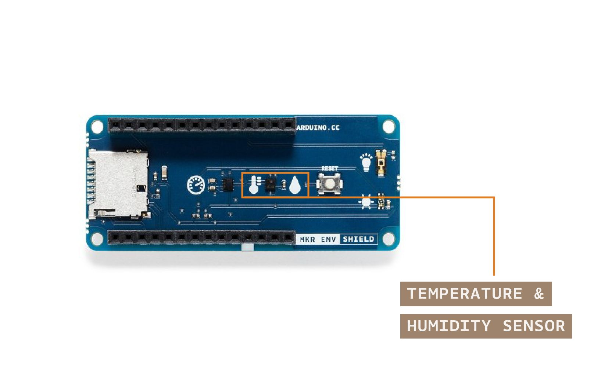

The ENV Shield has a temperature and humidity sensor called HTS221. It is a sensor manufactured by *ST microelectronics*. You can see its [datasheet here](https://content.arduino.cc/assets/Iot-Prime/LPS22HB.pdf). The library exposes the sensor with the methods `readTemperature()` and `readHumidity()`. You can call this method through the object named ENV that is built and exposed when instantiating the library. In other words, all of the sensors on the shield can be accessed by calling the command line `ENV.readSensor()` where `readSensor` has to correspond with the actual sensor being checked. In our case, it is the temperature and humidity, thus the methods are called `readTemperature()` and `readHumidity()`.

Read more about the specifics of the temperature sensor in the previous exercise. The humidity sensor, on the other hand, returns the relative humidity, a scientific unit expressed in percent that, given a volume of air, accounts for the amount of water in a gaseous state compared to the total amount the volume of air could hold. The measure of humidity made this way is a result of water pressure and temperature. 

The sensor’s range and accuracy makes is suitable for a lot of interesting experimental settings. The humidity range goes between ± 3.5% rH, at 20 (°C) to +80% rH. The rH sensitivity is of 0.004% rH. 

### How Data is Consumed Directly from the Serial Port

In this experiment we have the goal of representing the data in the form of a graph. Graphs help visualizing information out of the raw data. Instead of looking at streams of numbers, with graphs we can see, at a glimpse, the occurrence of events in the data and how the information relates to other variables like e.g. time. Let’s start by simply graphing the data coming from the serial port for the temperature readings using the code from the previous exercise. In this case you will be using the classic Arduino editor, which comes with a tool to automatically graph the data. Using the code from the previous experiment, simply go to the editor and instead of opening the serial port monitor, you will open the Serial Plotter tool available at the Tools menu of the editor.

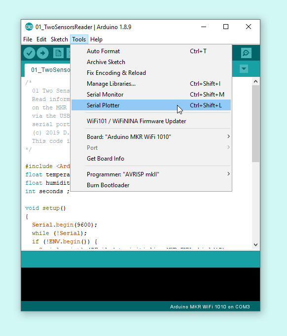

The same script that was before printing text on the terminal, will now produce a graph when using this other tool. Note: only one of the two tools can be operating at once. You can either have the plotter or the terminal checking the outcomes of your Arduino.

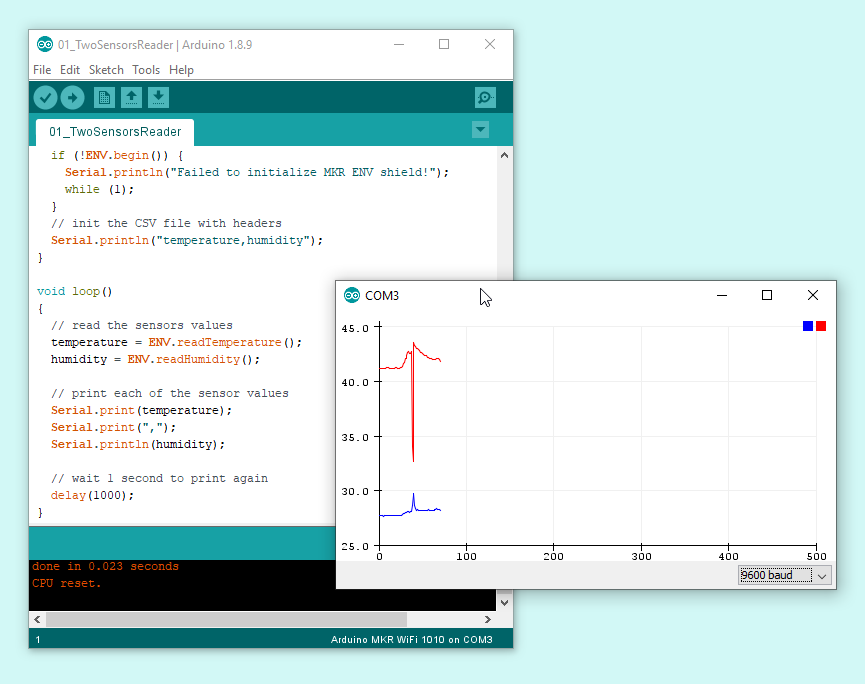

This technique is giving you a way to graph data as it arrives, but it is lost over time. We are interested in analysing historical data from your sensors, what requires storing it into files, or alternatively, onto the Cloud. In the second part of this exercise, you are going to be storing the data into a file and later opening it in a spreadsheet software.

### How Data can be Stored in Files from the Serial Port

The default serial terminal on the classic Arduino editor will not store the data arriving from the port into files. For that you could use different techniques:

* Use a third party serial port monitor like: [Bray Terminal](https://sites.google.com/site/terminalbpp/) (Windows), [Zterm](http://www.dalverson.com/zterm/) (OSX), or [CuteCom](https://gitlab.com/cutecom/cutecom/-/releases) (Linux). We will focus on using [CoolTerm](https://freeware.the-meiers.org/), a cross-platform alternative. For Chromebook you might want to explore using [Putty](https://www.bestchromebookapps.com/putty-for-chromebook/)
* Use command line (OSX / Linux) or PowerShell (Windows) to read the data and send the incoming bytes to a file as explained in [this tutorial](https://learn.sparkfun.com/tutorials/terminal-basics/command-line-windows-mac-linux)
* Create your own executable capable of reading data from the serial port and send it to a file

The option we will take in this case, as it is the easiest at this point, is to download and run [CoolTerm](https://freeware.the-meiers.org/), a third party software that simplifies the process of getting data coming from the serial port and sending it to a file. You should refer to the CoolTerm download file for instructions on how to install the software in your operating system. Once you have it running, it should look like follows:

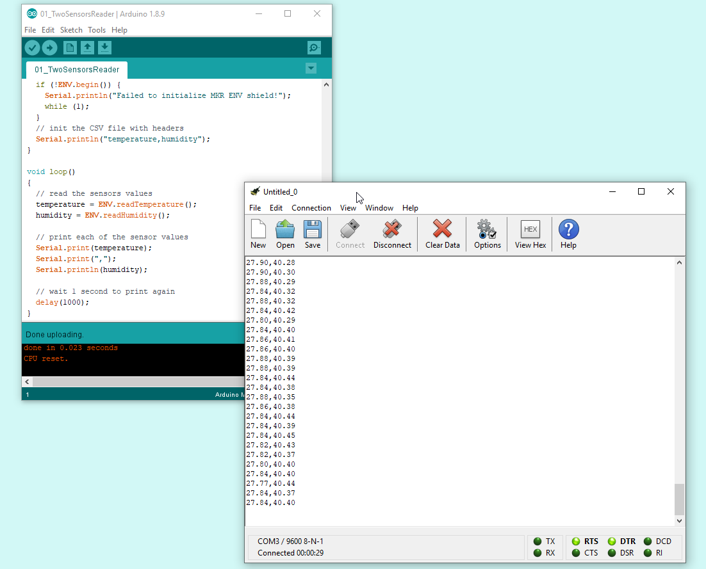

This software has an option in the menu Connection - Capture to text file - Start that will activate the logging of data incoming through the port directly into a text file.

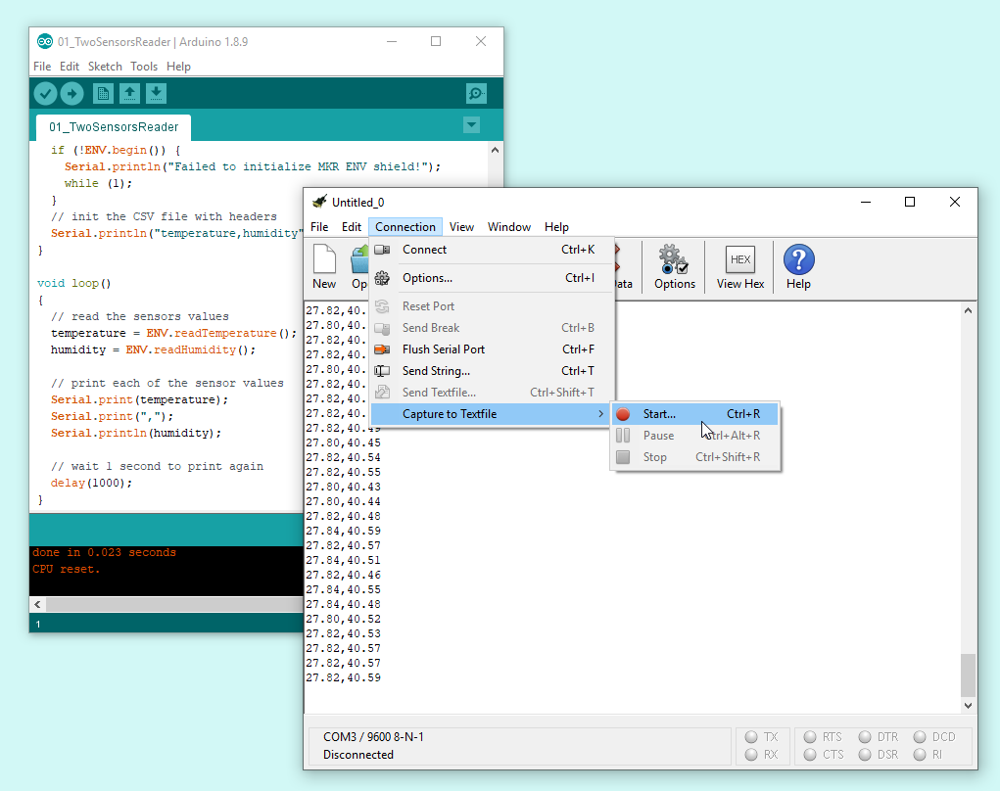

There is a challenge, however, regarding how information should be stored. In our case, we want information to end up in a file of type CSV that could be directly imported inside a spreadsheet software. The CSV format establishes that data can be separated by any kind of marker like a comma, a dot, an asterisk, etc. And that the different records are stored in lines. In other words, a CSV file would look more or less like the following:

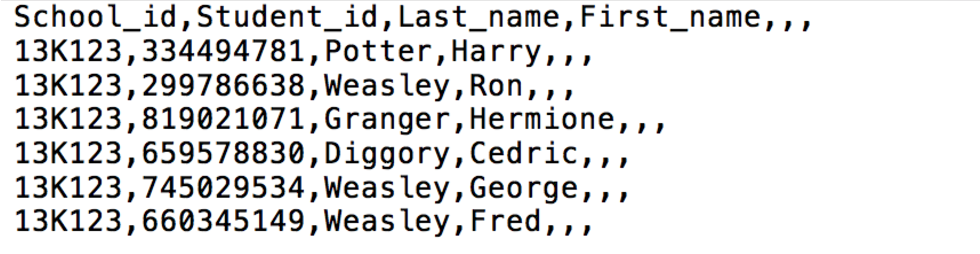

In this case we are going to have our Arduino board sending data over the serial port to reproduce this format, so that it will be almost automatic to import that data into the spreadsheet software of choice.

### Schematic

In this project, the schematic is uber-simple, as the sensor we are going to use is part of the ENV Shield, there is no need to use the breadboard in the first place.

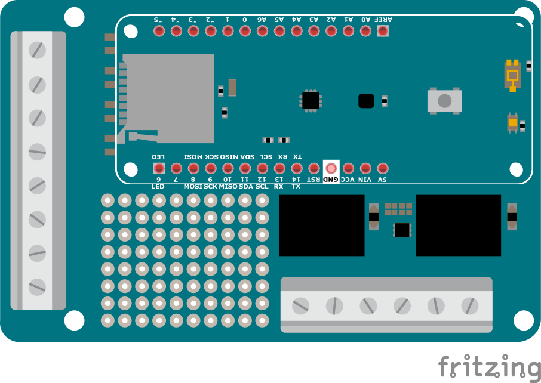

### Picture of the Construction


### Gradually Built Code

Before starting with programming, and after connecting your board to the computer, make sure you have selected the right board and communication port in the Tools menu of the offline IDE (or the drop-down list of the online one). You will not need to unplug the board in the process that follows.

#### The intro code

Start by making a new program, and give it a good name. For example: *01\_two\_sensors\_reader\_v0001*. This name reflects that this is the second program of the course (*01*) its name (*two\_sensors\_reader*) and the version number. You can develop your own technique on how to name files, but for the time being, let’s follow the one here shown.

```arduino
/*
  01 Two Sensors Reader v0001

  Read information from the temperature and humidity sensors
  on the MKR ENV Shield and send it back to the computer
  via the USB Cable in order to create a CSV file using a
  serial port monitor with logging option (e.g. CoolTerm)

  (c) 2019 D. Cuartielles for Arduino

  This code is Free Software licensed under GPLv3
*/

#include <Arduino_MKRENV.h>

float temperature = 0;
float humidity = 0;

void setup() {
  Serial.begin(9600);
  while (!Serial);

  if (!ENV.begin()) {
    Serial.println("Failed to initialize MKR ENV shield!");
    while (1);
  }

  // init the CSV file with headers
  Serial.println("temperature,humidity");
}

void loop() {
  // read the sensors values
  temperature = ENV.readTemperature();
  humidity = ENV.readHumidity();

  // print each of the sensor values
  Serial.print(temperature);
  Serial.print(",");
  Serial.println(humidity);

  // wait 1 second to print again
  delay(1000);
}
```

[\[Get Code\]](//www.arduino.cc/en/IoT-Prime/Experiment02?action=sourceblock&num=1)

*Figure 10: Code listing for the 01\_two\_sensors\_reader\_v0001 sketch* 

To use of the ENV Shield library call: `#include <Arduino_MKRENV.h>` 

#### Using the serial port

You can see how the serial port is initialised on the board by the call to `Serial.begin(9600)`, at the same time, the following line `while (!Serial)` is telling the program not to proceed unless the terminal has been opened in the computer. This is important as we will be storing the data in a file, and the file will not be initialized until the serial terminal software is not put to work.

The call to `ENV.begin()` is both initialising the sensors on the board, and checking that there is a shield connected to the MKR1010 board and that the sensors are operating properly. 

#### Getting the sensor data

The readings for all of the values of the sensors are of float type, therefore the variable declarations read `float temperature = 0` and `float humidity = 0` 

When calling `temperature = ENV.readTemperature()` and `humidity = ENV.readHumidity()` the program will be requesting the information about those sensors from the shield and storing them in their respective variables. The key aspect is going to be how to package that information to send it back to the computer that will retrieve it and put it in a file.

As you saw in the example CSV file, the information is separated by commas (you could use other separators instead) and each record is stored in separate lines. An important feature is that you can use the first line of the CSV file as indicators of the type of data to be stored. In that way, if you were to store the temperature first and humidity second, you could simply make sure that the first line of the data sent to the computer includes the string: **"temperature,humidity"** (if you needed to use blank spaces in the strings, you should use yet another separator). This first line should be included just once, for that you should add `Serial.println("temperature,humidity")` directly at the program’s setup, once the serial port has been made available.

In the loop, after requesting the data from the sensors, you will have to sequentially print each one of the pieces of the data to the serial port, including a comma between the information of each sensor: `Serial.print(temperature); Serial.print(","); Serial.println(humidity);` Note how the program finally calls to `Serial.println()` to include an end of line after printing the data. 

### Data Displayed

Besides the graphing we made using the plotter included in the Arduino editor, graphing the data from a CSV file is done by importing the data into a spreadsheet software and creating graphs with it. Upload the code to the Arduino board, open CoolTerm with the option of storing into a file previously configured, record data for a while, and let’s work with the resulting file.

#### Create the File

When calling the option of using a file in CoolTerm, it will give you the option of choosing where to record the file in your computer and how to name it. Just to make it easy, store the file on your desktop and name it *datalog.csv* 

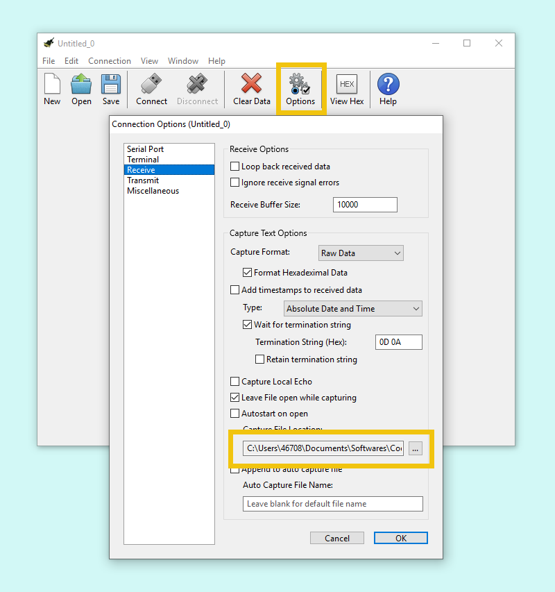

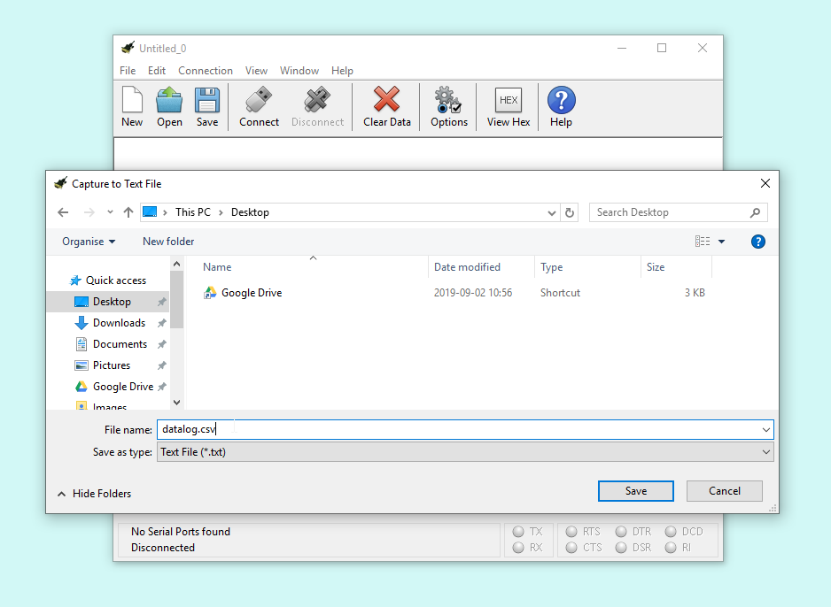

#### Open the Port and Capture Data

Click on the Connect button on CoolTerm’s interface, you will see how data is displayed while -in the background- it is being stored in the file you just created. Do not keep if for too long this time, we are recording data once every second, if you wait for a couple of minutes, you will have enough data to get some meaningful results. Since you are playing with temperature and humidity try to cover the sensor with your hand, blow air on it, place your board close to a cup with some hot liquid (not inside!!) … the data you will gather will be directly visible on the graph you will create later.

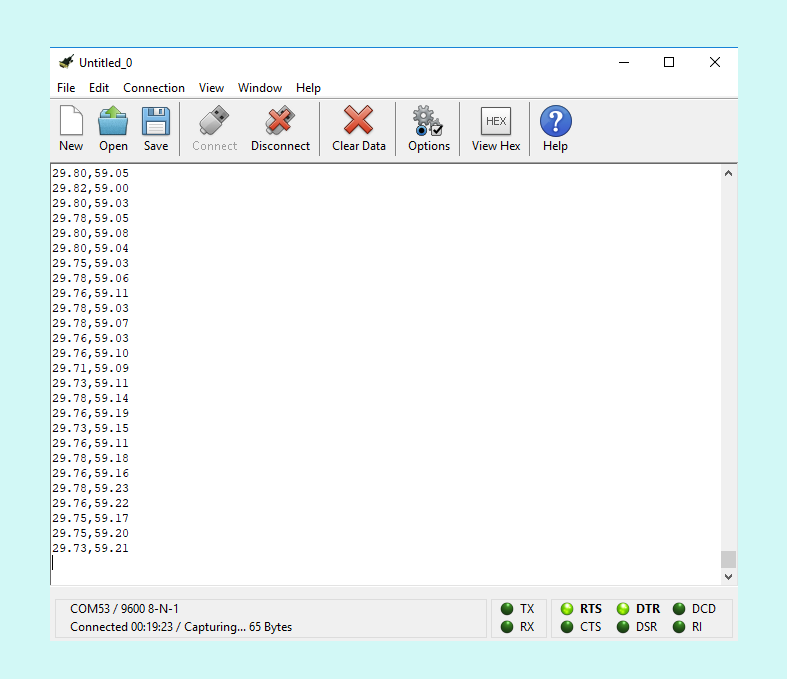


#### Close the Port and Check the File

Click on the Disconnect button on CoolTerm’s interface, this will close the connection to the board. Click on Stop in the menu to stop the recording. The file will be on your desktop. It is a plain text file, which means that you can open it using a normal text editor. As long as it is not too big, you could open it and look inside.

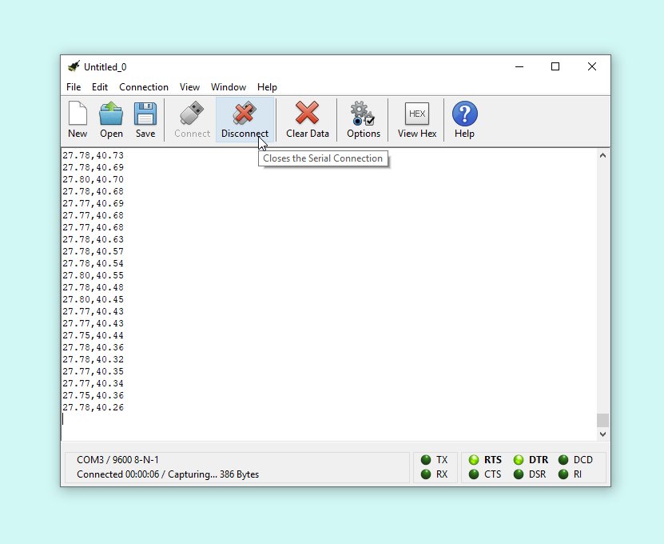


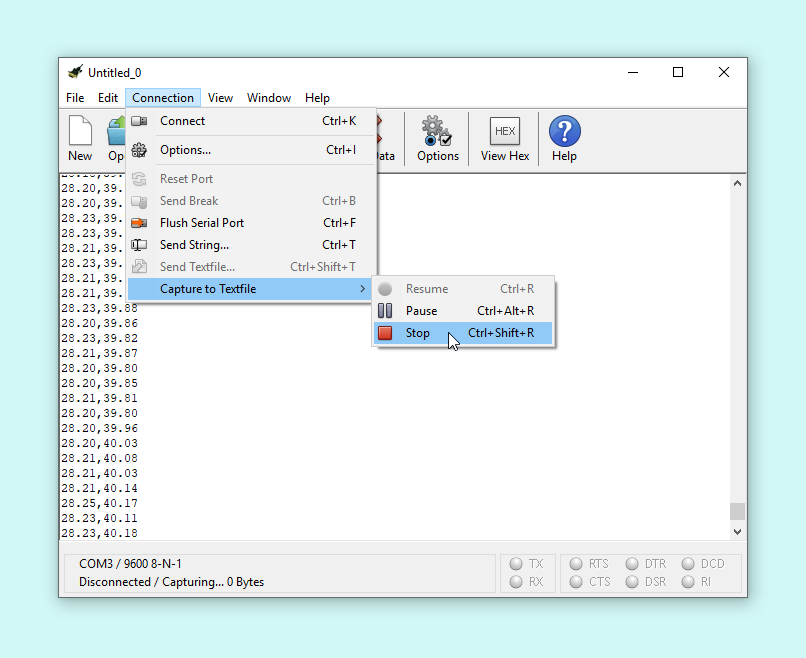

As you can see the file will be of a size of tens of kilobytes after recording data for 5 minutes. The bigger the file, the harder it will become to open it in a plain text editor. E.g. if your file is over 100KB, it is better not to look at it with this kind of software and instead directly import it in the spreadsheet program.

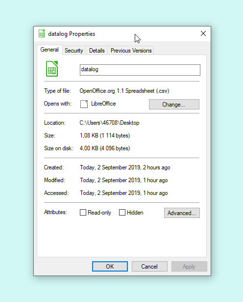


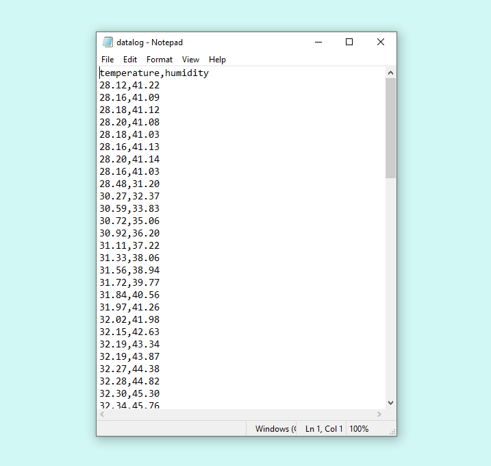

#### Import the File in your Spreadsheet Editor

In this example, we are going to use *LibreOffice Calc*, the free software spreadsheet editor that you can [download from here](https://www.libreoffice.org/) together with other free tools from *The Document Foundation* like a text editor, or a presentation (slideshow) editor. Calc is, for the purpose of this experiment, equivalent to [Microsoft Excel](https://products.office.com/en/excel), or [Google Sheets](https://www.google.com/sheets/about/) (especially if you are on a Chromebook). Feel free to try this with whatever tool you use in your everyday.

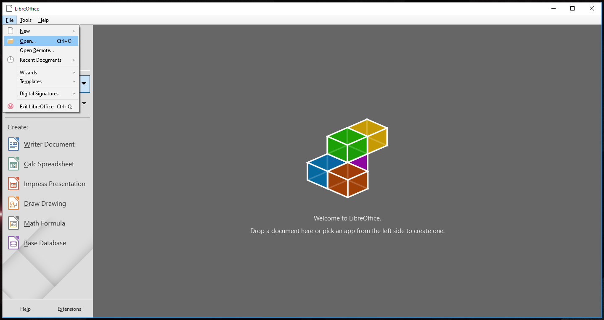

You will have to import the document by selecting the menu option File - Open. CSV is one of the available file formats. The program will open a menu with some options where you can configure the way in which the data will be imported in the spreadsheet. The options are used to determine which is the data separator (the comma, in our case), the size of the cells in the spreadsheet, etc.

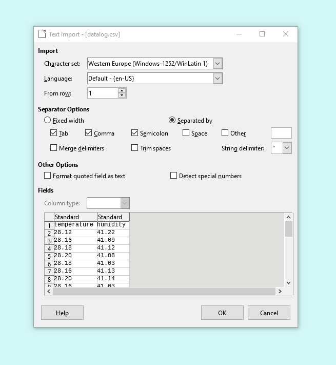

You will see a preview in the importing tool, beware the preview and the results do not always coincide. Most likely, for the kind of data we are dealing with, they will look exactly the same.

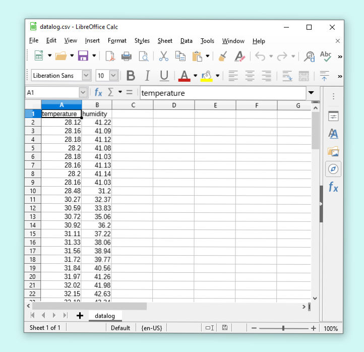

#### Make a Simple Graph

We have two different streams of data: temperature and humidity, next we will make a graph to display one of them. You can replicate the steps to graph the other data. Just follow these steps:

**1.** Select the column corresponding to the data you are going to graph
**2.** Click on the *Create Bar Graph* icon
**3.** Select the type of graph you want to make, we recommend the lines
**4.** Confirm the range of data you will be representing
**5.** Confirm that the first row is the name of the data
**6.** Enjoy your graph
      

<iframe width="640" height="360" src="https://youtu.be/MSCdl0H5O0k" frameborder="0" allow="accelerometer; autoplay; encrypted-media; gyroscope; picture-in-picture" allowfullscreen></iframe>

*Figure 21: Video showing the previous process step by step*

### Challenge: add a Timestamp

As of now we have simply recorded data. We know -because we wrote the program- that data is captured once per second, but will you remember the moment you check the data maybe some months from now? It is good practice to add a timestamp to your data, this will help you remember the pace at which data was captured. So do so, you should use the function `millis()`, which tells you how much time has passed since the program started, together with `Serial.print()` to add one more column to your data. You can later use that new column to add some more information to the X axis of your graph.

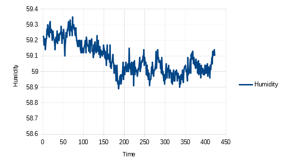

If you want to be getting an absolute timestamp, since we are using the MKR1010, it should be possible to get your board to connect to the internet, get the current date and time, and start using in your program. You can check [this example](https://www.arduino.cc/en/Tutorial/WiFiRTC), and challenge yourself to solve the project that will:

**1.** Get the date and time from the internet
**2.** Add a timestamp to the data
**3.** Store the data in a file
**4.** Graph the data using real time

### Wrapping Up

In this project you have learned how to get data from sensors, send it to a computer through the cable that connects the computer with the board, and either graph it directly or store it into a CSV file that could be used in a spreadsheet software. In the process you saw that there are third party tools that you could use both for data capturing, and data analysis.

These steps are basic if you want to use your board into any kind of scientific project of sorts where you need to collect data, and make graphs in order to come to conclusions about what happens with the data. We gave you the challenge of adding a timestamp to your data. You can both use relative and absolute timestamps. It is possible to get the date and time from the Internet, since the MKR1010 has wireless connectivity and can connect to other systems to collect that information. The more simple solution of using the internal time counter is also possible, and can work even if there is no Internet available.

[Learn more at Experiment 03](./../Experiment03/content.md) 