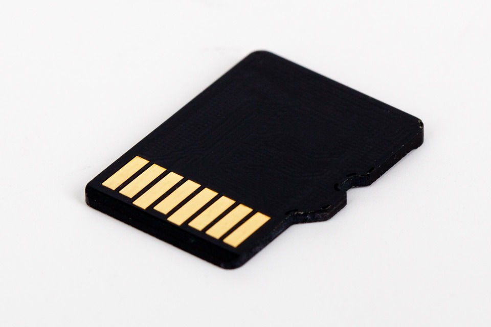
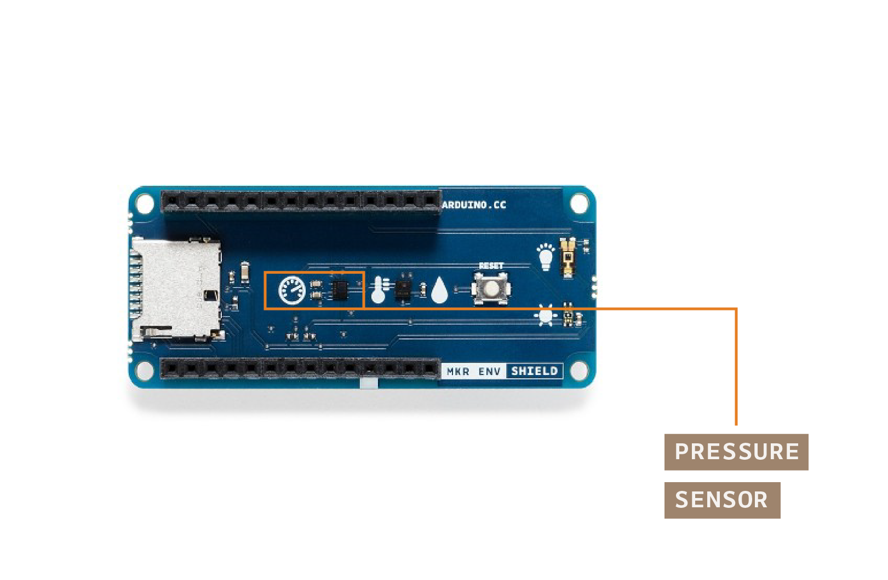
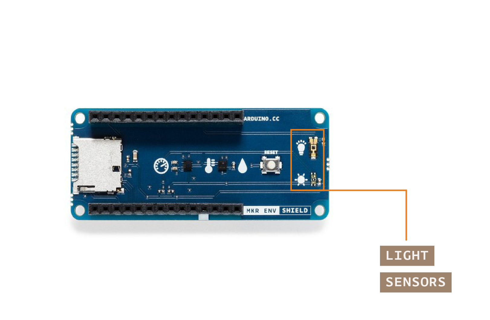
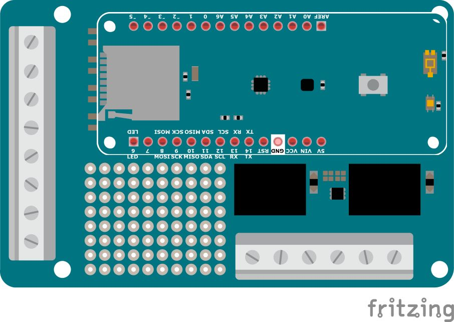
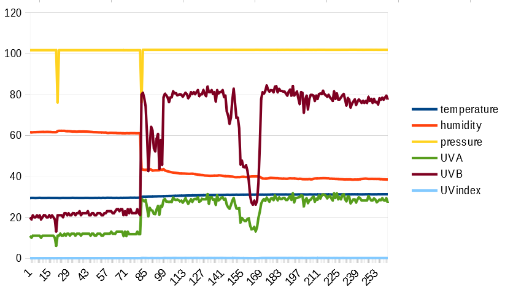
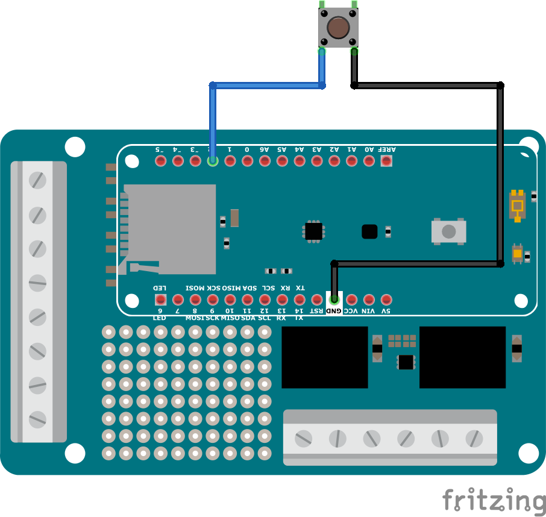

## IoT\-Prime Experiment 3:

## Store data in memory cards

### Introduction

This experiment will introduce you to the use of SD memory cards with your ENV Shield to store data into files that you can later transfer to your computer and use as explained in the previous experiment. In this case we will introduce the remaining sensors in the shield: barometric pressure, and different types of light radiation, collect data from all of the sensors and store it in a file inside an SD card for later analysis.

There are scenarios where it is not possible to send the data to a different location via WiFi or Bluetooth® (as you could do with the MKR1010), but you are still interested in collecting data for offline analysis. It could also be the case when you can only transmit small amounts of data in real time, but you are interested in collecting as much as possible for a later in-depth study. There is also the situation when you want to have a local backup of the data in case the communication fails at any given time. All of those scenarios are supported by the use of the SD card slot in the ENV Shield, the only thing you will need is a micro SD card.

### Learning Objectives

The objectives of this experiment are:

* Learning about Arduino’s SD library
* Creating files in the SD card, reading them in the computer
* Learning about barometric pressure sensors
* Learning about UV and Lux sensors

### Exercise’s complexity

This exercise requires having previous knowledge in:

* Using libraries
* Using CSV files

### Components Used

#### MKR1010

The *Arduino MKR1010* (read “maker ten ten”) is a microcontroller board featuring a chip that will allow you making either a **WiFi** or **Bluetooth** wireless connection to other boards or computers. We will see some of those features in action in this collection of exercises.

##### Start Using your Board

You can see how to connect this board to your computer by checking this [Getting Started Guide](https://www.arduino.cc/en/Guide/MKRWiFi1010). You can use that guide to install the offline Arduino IDE that will run from your computer, and to learn how to troubleshoot any potential issues you might have when writing your first programs. You can also start using the online version of Arduino’s code editor that you will find at: [https://create.arduino.cc](https://create.arduino.cc) Please note that you have to become a registered Arduino user to use the online editor.

#### MKR ENV Shield

A shield is a board that you add to an Arduino microcontroller board to add some extra functionality. The ENV Shield comes with the following sensors:

* Temperature
* Humidity
* Barometric pressure
* Lux
* UV radiation A and B

The different sensors communicate with the MKR1010 using either the SPI or I2C protocols, standard communication mechanisms within electronic circuit boards.

The ENV Shield comes with a microSD card slot. This can be used to store the data gathered by the sensors locally. This could be handy when designing systems that might not be connected or where the data gathering happens at such a pace that it is not possible to send all of the data through the network because of bandwidth issues.

##### ENV Shield Library

These new features come with associated software you will need to install. The software the allows using a certain shield is what we call a library. Follow this [step-by-step guide](https://www.arduino.cc/en/guide/libraries) in how to install any library, choose the needed ENV Shield library by typing its name in the search box, it will give you access to the different sensors in the shield.

#### MKR Relay Proto Shield

The MKR Relay Proto Shield is a board providing your MKR1010 board with two relays, which are electromechanical switches, that can be used to control any kind of electrical devices that could be activated with an on-off switch: lamps, fans, water pumps, electrical motors, heaters, etc. Activating the relays is as simple as activating one of the pins that control them, this will allow for electricity to flow.

The shield has a prototyping area that could be used to solder your own components and, in that way, make a more final installation using it. This is something we will not see throughout this course, but you should be aware of the possibility.

#### Mount the Boards

We recommend that you mount the three boards together from now and keep them this way throughout the course. The building configuration is simple to mount and keeps the components secure.


#### SD card and Reader

Note that there is no memory card provided in the kit, you will have to find one externally. Also, if your computer doesn’t have a card reader, you will need an external card reader, or learn how to use your Arduino board and a serial terminal software (CoolTerm) as a way to transfer the file into your computer.



### Data Collected

In this exercise we are going to collect data from all sensors on the ENV Shield. Besides the temperature and humidity sensors that you used in the previous exercises, you will learn about the barometric pressure and light sensors on the shield.

#### The Pressure Sensor



The ENV Shield has a barometric pressure sensor called LPS22HB. It is a sensor manufactured by ST microelectronics. You can see its datasheet here. The library exposes the sensor with the method readPressure() which can take either no parameters or one of the following three, that will determine the units in which pressure will be expressed:

* *PSI*, sensor returns data in Pound per Square Inch
* *MILLIBAR*, sensor returns data in millibars
* *KILOPASCAL*, sensor returns data in kilopascal, this is the default option

You can call this method through the object named ENV that is built and exposed when instantiating the library. In other words, all of the sensors on the shield can be accessed by calling the command line ENV.readSensor() where readSensor has to correspond with the actual sensor being checked. In our case, it is the barometric pressure, thus the method is called readPressure().

The absolute pressure sensor functions as a digital output barometer, it processes the data collected from the movement of a suspended silicon membrane. The change of pressure on the membrane affects a Wheatstone bridge where piezoresistances are measured with an analog-to-digital converter and processed digitally. The sensor is also able to read temperature, this feature is however not present in the ENV Shield library since we are reading the temperature from the temperature + humidity sensor.

The sensor’s range and accuracy makes is suitable for a lot of scientific experiments. The pressure range goes between 260 and 1260 hPa, with an accuracy of ±0.1 hPa, in the temperature range from 0 °C to +65 °C. However, the sensor can operate with a more constrained pressure range between the extended temperature range from -40 °C to +85 °C.

#### The Light Sensors



The ENV Shield has two light sensors called VEML6075 ([datasheet here](https://content.arduino.cc/assets/Iot-Prime/VEML6075.pdf)) and TEMT6000 ([datasheet here](https://content.arduino.cc/assets/Iot-Prime/TEMT6000.pdf)). Both sensors are manufactured by *Vishay Semiconductors*. The library exposes the sensors with the methods `readUVA()`, `readUVB()`, `readUVIndex()`, and `readUVIlluminance()` being the first three methods working with the VEML6075 sensor, and the last one with the TEMT6000.

Solar radiation is mainly of optical nature. It is composed of ultraviolet (UV), visible, and infrared (IR) components. There are other components, but they cannot be measured by the sensors on the ENV Shield in any way. UV radiation can be divided into UVA, UVB, and UVC, depending on their wavelength. Due to the atmosphere, not all of the ultraviolet light components make it to the surface of the earth, only long wave ultraviolet (UVA) and short wave ultraviolet (UVB) cross the atmosphere and reach us. The total UV radiation is made of 95% of UVA type and 5% of UVB type. In the past, the only UV radiation affecting us, humans, animals, and plants, was coming from the sun. In the present, there are other sources of UV radiation coming from human-made machinery.

The UV Index is a tool meant to communicate to the general public about the UV radiation. It was proposed by the World Health Organization, United Nations, among others. The UV Index is a unit-less value obtained from the total amount of radiation measured in Watts per square meter (W/m^2). The UV Index should be in the range of 0 to 12 at the earth’s surface, being values over 11 considered extreme. The UV index is calculated taking the UVA and UVB radiation values as parameters.

Read more about the UV Index calculation and the forms of UV radiation .

The UV sensor’s range and accuracy makes is suitable for a lot of scientific experiments. The temperature range of operation goes from -40 °C to +85 °C.

On the other hand the luminance, as can be captured by the TEMT6000 sensor, expresses the intensity of the light in the visible part of the light spectrum. In other words, it can measure how intense is the light we can see with our eyes (remember that UV and IR light are invisible). A call to `readUVIlluminance()` can have three different parameters based on the units chosen for the expected outcome:

* *FOOTCANDLE*
* *METERCANDLE*
* *LUX*, this is the default option

Let’s focus on the LUX unit, as the others can be obtained by making a mathematical calculation out of that one. This unit represents one lumen per square meter. Unlike a measurement of Watts per square meter, which weights the power of signals in different frequencies of the spectrum differently, the lumens are calculated by looking at the mathematical response of the human eye to different wavelengths. In that way, LUX comes to be a measurement of how intense the light is for the human eye.

At technical level, the TEMT6000 sensor is a *phototransistor*, a component that will allow electrons to flow differently based on the amount of light shining on it. It has been calculated to be adapted to the human eye sensitivity. In other words, this sensor is telling you how intense light is for your eyes. The sensor’s range and accuracy makes is suitable for a lot of scientific experiments. The sensor’s opening angle is ±60 °, and while it peaks up at 570 nm, it is detecting light in the range from 440 nm to 800 nm, in the temperature range from -40 °C to +100 °C.

#### Other Sensors

Read more about the specifics of the temperature and humidity sensors in the [previous exercise](./../Experiment02/content.md).

### How Data is Consumed

In this example, the data will be stored in an SD card, which can be later connected to a computer where we will be able of graphing the information directly from the CSV file generated by the Arduino board. Ideally you will mount the circuit with an external power source, like a battery pack or similar and let it run for some time. Once the data has been captured, you will either extract the SD card and connect it to your computer using a card reader, or will use a sketch in your Arduino board that will read the data from the board and send it back to the computer, where you will create a file with a serial terminal software like e.g. CoolTerm.

### Schematic

In this project, the schematic is uber-simple, since we will only be using sensors in the ENV Shield, there is no need to use the breadboard in the first place.



### Picture of the Construction


### Gradually Built Code

Before starting with programming, and after connecting your board to the computer, make sure you have selected the right board and communication port in the Tools menu of the offline ide (or the drop-down list of the online one). You will not need to unplug the board in the process that follows.

#### The intro code

Start by making a new program, and give it a good name. For example: *02\_sensors\_to\_SD\_v0001*. This name reflects that this is the third program of the course (*02*) its name (*sensors\_to\_SD*) and the version number. You can develop your own technique on how to name files, but for the time being, let’s follow the one here shown.

```arduino
/*
  02 Sensors to SD v0001
  Read information from the all of the sensors
  on the MKR ENV Shield and store it on a
  CSV file inside an SD card. Connect the SD
  card to the slot on the ENV Shield
  (c) 2019 D. Cuartielles for Arduino
  This code is Free Software licensed under GPLv3
*/

#include <Arduino_MKRENV.h>
#include <SPI.h>
#include <SD.h>

// chip select for SD card
const int SD_CS_PIN = 4;

// variables
float temperature = 0;
float humidity = 0;
float pressure = 0;
float UVA = 0;
float UVB = 0;
float UVIndex = 0;

// file object
File dataFile;

void setup() {
  Serial.begin(9600);

  // init the ENV Shield
  if (!ENV.begin()) {
    Serial.println("Failed to initialize MKR ENV shield!");
    while (1);
  }

  // init SPI
  SPI.begin();
  delay(100);

  // init SD card
  if(!SD.begin(SD_CS_PIN)) {
    Serial.println("Failed to initialize SD card!");
    while (1);
  }

  // init the logfile
  dataFile = SD.open("log-0000.csv", FILE_WRITE);
  delay(1000);

  // init the CSV file with headers
  dataFile.println("temperature,humidity,pressure,UVA,UVB,UVindex");

  // close the file
  dataFile.close();
  delay(100);
}

void loop() {
  // init the logfile
  dataFile = SD.open("log-0000.csv", FILE_WRITE);
  delay(1000);

  // read the sensors values
  temperature = ENV.readTemperature();
  humidity = ENV.readHumidity();
  pressure = ENV.readPressure();
  UVA = ENV.readUVA();
  UVB = ENV.readUVB();
  UVIndex = ENV.readUVIndex();

  // print each of the sensor values
  dataFile.print(temperature);
  dataFile.print(",");
  dataFile.print(humidity);
  dataFile.print(",");
  dataFile.print(pressure);
  dataFile.print(",");
  dataFile.print(UVA);
  dataFile.print(",");
  dataFile.print(UVB);
  dataFile.print(",");
  dataFile.println(UVIndex);

  // close the file
  dataFile.close();

  // wait 1 second to print again
  delay(1000);
}
```

[\[Get Code\]](//www.arduino.cc/en/IoT-Prime/Experiment03?action=sourceblock&num=1)

*Figure 7: Code listing of 02\_sensors\_to\_SD\_v0001*

To use of the ENV Shield library call: `#include <Arduino_MKRENV.h>`

The call to `ENV.begin()` is both initialising the sensors on the board, and checking that there is a shield connected to the MKR1010 board and that the sensors are operating properly.

#### Using the SD card

Arduino has an official library that you can use to write and read files from SD cards, create directories, etc. Check the reference to that library here. Using it requires calling `#include <SPI.h>` as well as `#include <SD.h>` plus initializing the library in the setup method of you sketch. SD cards are controlled via SPI communication, therefore the need to import that library in the first place.

In the setup method we check whether the SD card was properly initialized by checking the outcome of calling `SD.begin()` which will need as parameter the pin at which the SD card slot enable pin is connected. In our case is pin number 4\. If the answer from `SD.begin()` was not satisfactory, the program would not continue.

The line `File dataFile = SD.open("log-0000.csv", FILE_WRITE)` will create a plain text file with the name *“log-0000.csv”* and open it for writing. This will allow subsequent calls to `dataFile.print()` and `dataFile.println()` to send data to the file as if you were using the serial port.

#### Using the serial port - NOT

Unlike the previous examples where we were sending data over the serial port back to the computer, in this case we should NOT use a call to either Serial.begin(9600), nor while (!Serial). This would block our program and it would not start to log data as we will not be using the serial port when deploying the board somewhere.

#### Getting the sensor data

The readings for all of the values of the sensors are of float type, therefore the variable declarations read `float temperature = 0`, `float humidity = 0`, `float pressure = 0`, `float UVA = 0`, `float UVB = 0`, `float UVIndex = 0`

When calling `temperature = ENV.readTemperature()`, `humidity = ENV.readHumidity()`, and so on, the program will be requesting the information about the sensors from the shield and storing them in their respective variables. The key aspect is going to be how to package that information to store it in a file inside the SD card.

As you saw in the example CSV file in the previous experiment, the information is separated by commas (you could use other separators instead) and each record is stored in separate lines. Also, the first line of the CSV file can be filled up with strings indicating the type of data to be stored. We will therefore start by sending the string: *“temperature,humidity,pressure,UVA,UVB,UVindex”* to the card. This first line should be included just once, directly at the program’s setup, once the SD card has been made available.

In the loop, after requesting the data from the sensors, you will have to sequentially print each one of the pieces of the data to the card, including a comma between the information of each sensor: `datafile.print(temperature); datafile.print(“,”); [...] datafile.print(UVIndex);` Note how the program finally calls to `datafile.println()` to include an end of line after printing the data.

### Data Displayed

No data is displayed, as it is simply stored in the SD card, but all data is captured. Next you could use the technique explained in the previous program to open the resulting CSV file in a spreadsheet editor and graph the different columns of data.



#### What to do if you don’t have an SD reader

In the case that you don’t have an SD card reader, you can still dump the data from the file in the SD card to the serial terminal, once you connect the board to your computer, and use CoolTerm as explained at a previous experiment to transfer that data straight into a file in your computer. Just program your Arduino board with the DumpFile example from the SD card library, configure CoolTerm to store data in a file, and open the connection from the serial terminal software.

### Challenge

There are endless possibilities on how to improve this experiment. For example, you could add a mechanism to start and stop the recording of data at will. You could e.g. add a button to toggle the recording state.



Another technique that could improve your process, would be the creation of a logging system that will be assigning new names to the logfiles every time the program starts. This will require checking the existing files and adding a number to the count of files. This is a pure software challenge, go for it!

### Wrapping Up

In this experiment you have seen how to use the SD card to store data from the sensors. In the IoT world it is not always possible to have high speeds of data transfer, but it is still needed to capture all of the data, while transferring only some. Having local backups of the data in any kind of Flash memory devices is a good technique to do this.

You have seen how to use all of the features of the ENV Shield in this example. We have used all of the available sensing chips for measuring temperature, humidity, barometric pressure, light intensity, and light radiation, as well as the SD card slot to write and read data from external cards.

You got two possible challenges: one to add a button to the project to start and stop the recording, and a second one where you are supposed to create different files every time the program runs. If you implemented any of those, they will be come very handy whenever you run offline experiments in the future.

Let’s dive in the final experiment of the series by looking at how to send data to the Arduino Cloud. [Learn more at Experiment 04](./../Experiment04/content.md)