## IoT\-Prime Experiment 4:

## Connect to the Arduino Cloud

### Introduction

So far you have seen how to read sensors, send their status to a computer or store it locally in files, and opening those files to produce graphs of historical data. However, it was not possible to produce real-time graphs with a board not connected to a computer. This exercise will introduce you to one of the possible scenarios on how to do that. You will hook up your MKR1010 to the Arduino Cloud and map data about temperature and humidity.

Note: to make this experiment you need to have an Arduino Create account that will give you access to the online compilation tool, and to the Arduino Cloud Dashboard. Get your [free tier account here](https://create.arduino.cc).

### Learning Objectives

In this exercise you will:

* Learn about the Arduino Cloud
* Connect sensors to your Cloud’s dashboard

### Components Used

#### MKR1010

The *Arduino MKR1010* (read “maker ten ten”) is a microcontroller board featuring a chip that will allow you making either a **WiFi** or **Bluetooth** wireless connection to other boards or computers. We will see some of those features in action in this collection of exercises.

##### Start Using your Board

You can see how to connect this board to your computer by checking this [Getting Started Guide](https://www.arduino.cc/en/Guide/MKRWiFi1010). You can use that guide to install the offline Arduino IDE that will run from your computer, and to learn how to troubleshoot any potential issues you might have when writing your first programs. You can also start using the online version of Arduino’s code editor that you will find at: [https://create.arduino.cc](https://create.arduino.cc) Please note that you have to become a registered Arduino user to use the online editor.

#### MKR ENV Shield

A shield is a board that you add to an Arduino microcontroller board to add some extra functionality. The ENV Shield comes with the following sensors:

* Temperature
* Humidity
* Barometric pressure
* Lux
* UV radiation A and B

The different sensors communicate with the MKR1010 using either the SPI or I2C protocols, standard communication mechanisms within electronic circuit boards.

The ENV Shield comes with a microSD card slot. This can be used to store the data gathered by the sensors locally. This could be handy when designing systems that might not be connected or where the data gathering happens at such a pace that it is not possible to send all of the data through the network because of bandwidth issues.

##### ENV Shield Library

These new features come with associated software you will need to install. The software the allows using a certain shield is what we call a library. Follow this [step-by-step guide](https://www.arduino.cc/en/guide/libraries) in how to install any library, choose the needed ENV Shield library by typing its name in the search box, it will give you access to the different sensors in the shield.

#### MKR Relay Proto Shield

The MKR Relay Proto Shield is a board providing your MKR1010 board with two relays, which are electromechanical switches, that can be used to control any kind of electrical devices that could be activated with an on-off switch: lamps, fans, water pumps, electrical motors, heaters, etc. Activating the relays is as simple as activating one of the pins that control them, this will allow for electricity to flow.

The shield has a prototyping area that could be used to solder your own components and, in that way, make a more final installation using it. This is something we will not see throughout this course, but you should be aware of the possibility.

#### Mount the Boards

We recommend that you mount the three boards together from now and keep them this way throughout the course. The building configuration is simple to mount and keeps the components secure.

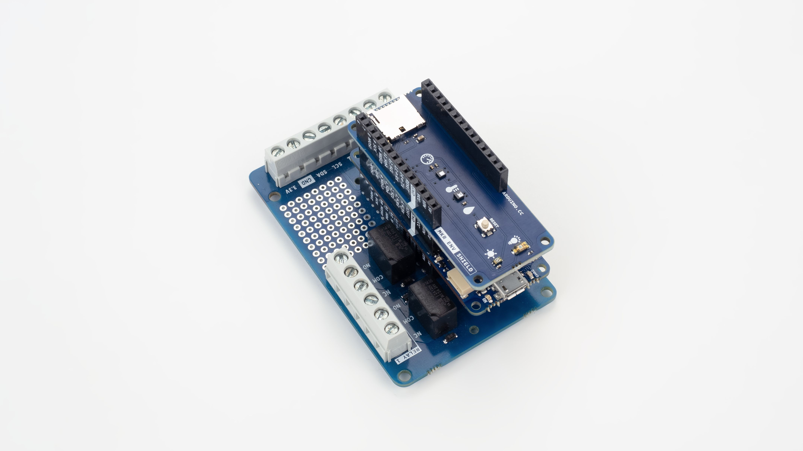

### Data Collected

In this case we will be collecting data from the temperature and humidity sensors. You saw the specifics to those sensors in experiments 1 and 2 from this series. However, this time, we will send the data to the Arduino Cloud where data will be displayed onto graphs available on the dashboard.


### How Data is Consumed

As mentioned earlier, data will be displayed live on your Arduino Dashboard. If you are interested in storing the data into files as well, you could consider a double strategy, as explained in exercise 3, where data could be stored in an SD card locally on the board, while it is also sent to the Cloud via wireless communication.

### Schematic

In this project, the schematic is uber-simple, since we will only be using sensors in the ENV Shield, there is no need to use the breadboard in the first place.


### Picture of the Construction


### Gradually Built Code

The complexity of this exercise resides not in the use of the ENV Shield, something that you have already learned at previous experiments, but at the use of the Cloud. The Arduino Cloud has been created with the goal of producing simple interfaces for users willing to connect their devices to the internet.

#### Go to the Arduino IoT Cloud icon

Go to [https://create.arduino.cc](https://create.arduino.cc), make sure you have created your account before moving on with this experiment.

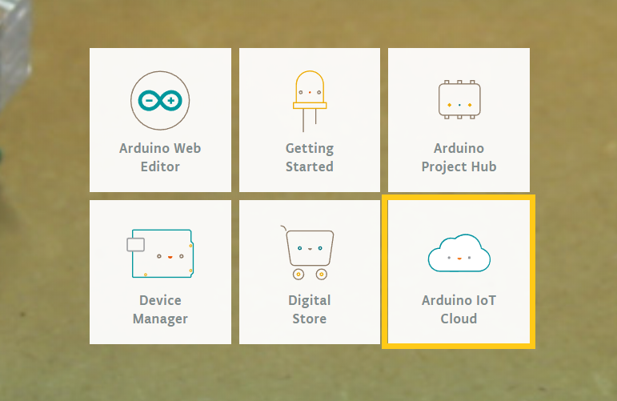

Once on the dashboard, select the Arduino IoT Cloud icon.

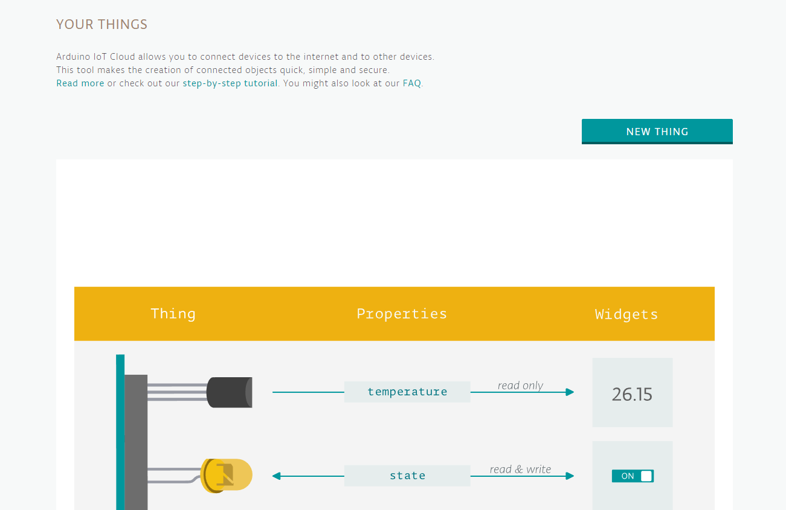

On this page, you will see that you can create new Things, that is what we call the devices that you can connect to the internet. Things represent, for example, your MKR1010, or any other board with connectivity. On top of that, each one of the boards can have different parameters. These are variables that will be exposed not only to the code on the board, but also to the Cloud, thanks to the Arduino Cloud library. If you are interested in learning about the process of setting a new Thing, please take the step-by-step tutorial linked [on this page](https://create.arduino.cc/projecthub/133030/iot-cloud-getting-started-c93255).

#### Make a new Thing

If you decide to skip the step-by-step tutorial, you can choose to make the Thing by hand by clicking on “New Thing”. Note that, free-tier Arduino IoT accounts allow for only one Thing. If you want to have more than one, you will have to upgrade to a paid plan for the Arduino Cloud. For the time being, we are just working with one single Thing, therefore, the free-tier will work for this experiment.

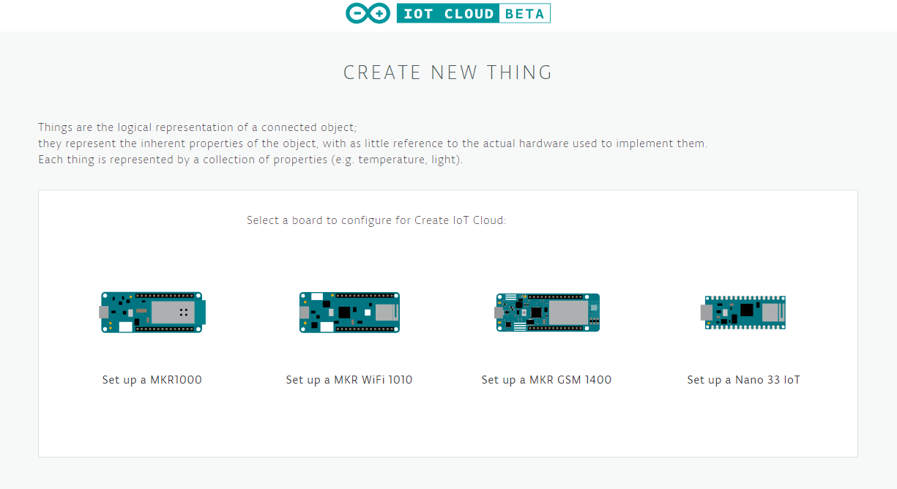

Once you have chosen which board you are working with (MKR1010), the window will explain the process of installing the Arduino Create Agent, the software needed for having your board talking to the computer over the USB cable. If you already installed the client before, this process will go quickly and open the interface inviting you to give a name to the board.

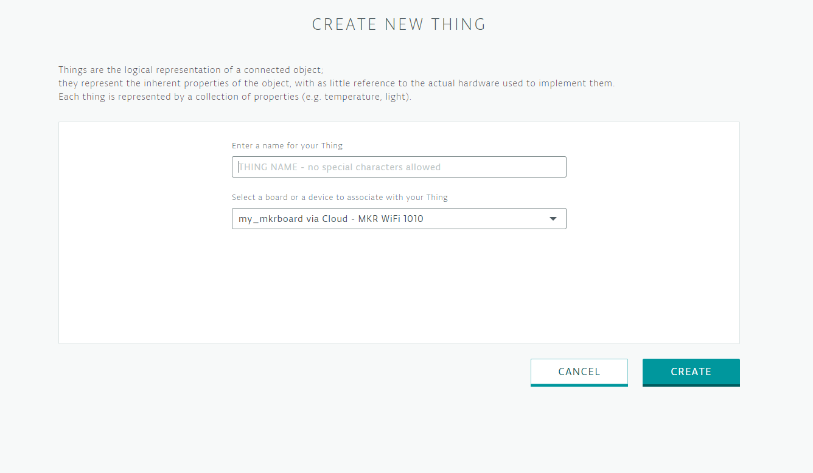

After naming your board, you will be given the option to configure the board’s crypto chip. This is a process you have to go through. The crypto chip on the MKR boards allow for unique identification of the boards against the Arduino infrastructure. This process will take a couple of minutes. Once it is done, the interface will give you the option to return to the IoT configuration.

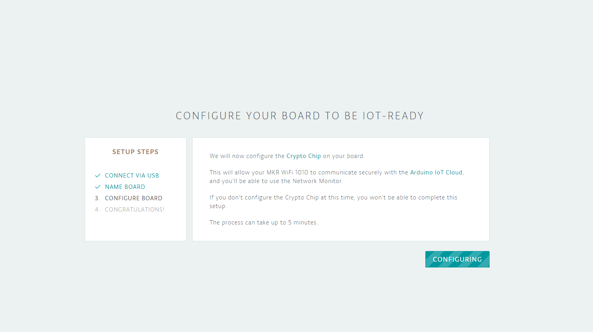

In the following dialog, insert the name for the Thing. If you installed the Arduino Create interface earlier and you registered your board, the UI will give you the opportunity to select that board at the drop-down list. Alternatively you could register your board at this point. Since the ENV Shield invites to build a weather station of sorts, a possible name for the Thing would be WeatherStation.


#### Register properties

Once you have registered the Thing, the interface will offer you the possibility of adding properties to it. Properties represent variables in Arduino code that will also readable in the Cloud. We will map two variables / properties: temperature and humidity. You will have to run the process twice. The definition of these properties includes determining:

* Name: take Temperature for one property and Humidity for the other
* Variable Name: this will be autogenerated to be the same as the property name, but in lowercase
* Variable type: in our case, we need variables of type float
* The boxes for minimum (Min) and maximum (Max) value will unfold. You should take the limits given by the datasheets that are presented in experiments 1 and 2\. For the temperatures we are talking about a range from -40 °C to 120 °C, while the humidity is from 3.5% rH to 80% rH.
* These are “Read Only” variables, as they are inputs to the system
* We will be updating the data regularly, which means that we need to also determine how often the data will be sent to the Cloud in the “Every” textfield. Take 10 seconds
* Select the checkbox “Show history visualization” what will give you the option of seeing the data in a graph on the dashboard

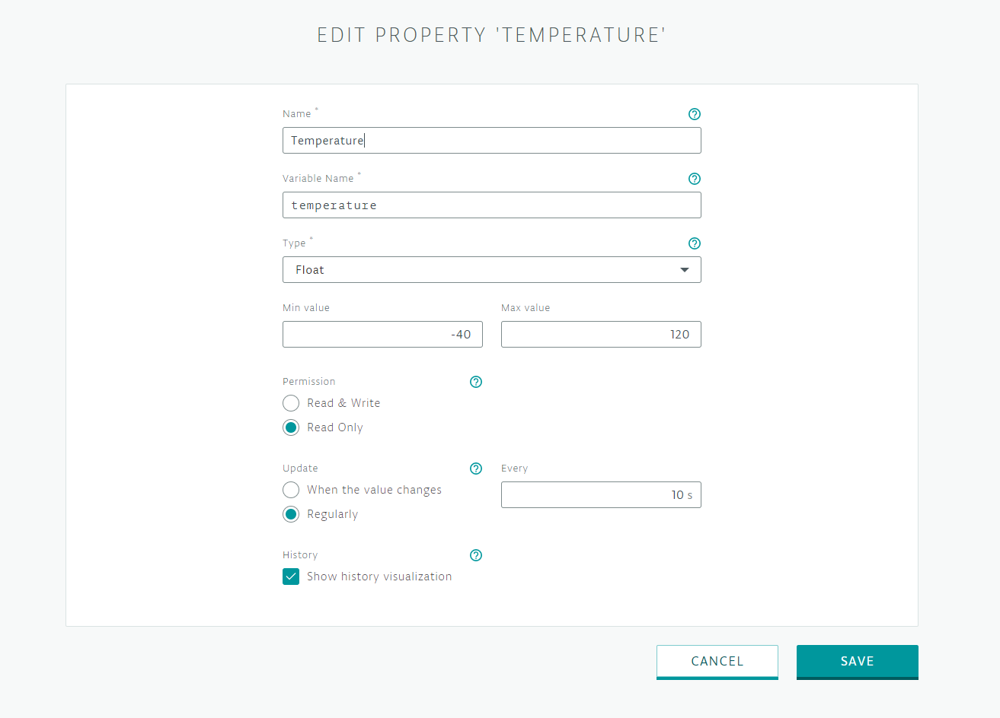

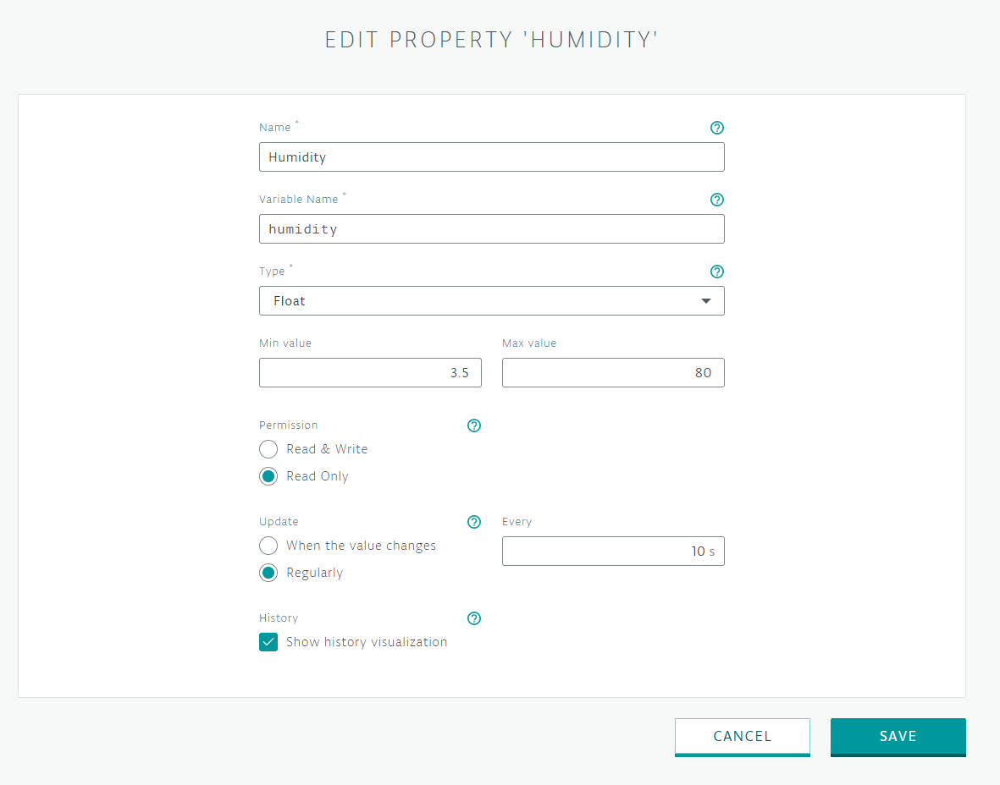

#### Create the sketch

Once you have added the properties, you should click the “Edit Sketch” button that will open the code editor with the self-generated sketch. This includes the libraries needed for the cloud communication to work. You will have to add the libraries for the ENV Shield, the SSID and password to connect to your WiFi network, and whatever code you are going to use to update variables in your program.

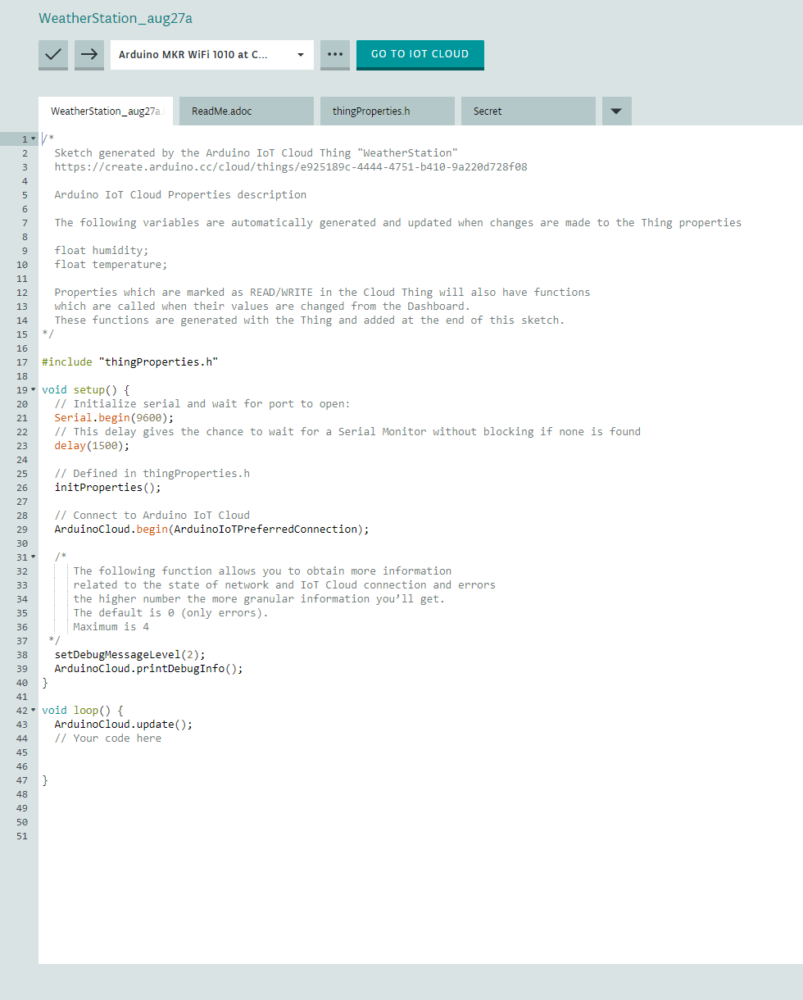

First, go to the “Secret” tab and edit the properties of your network.

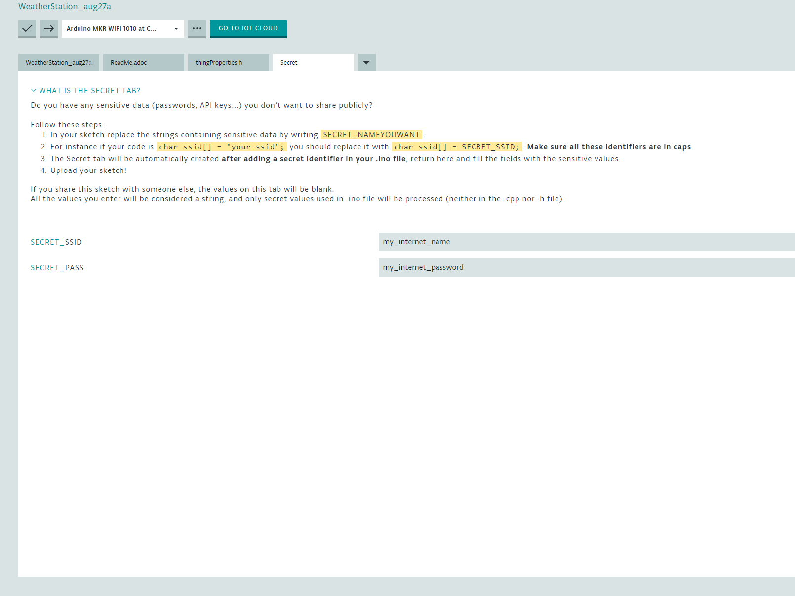

Next, go back to the main tab, and import the ENV Shield library.

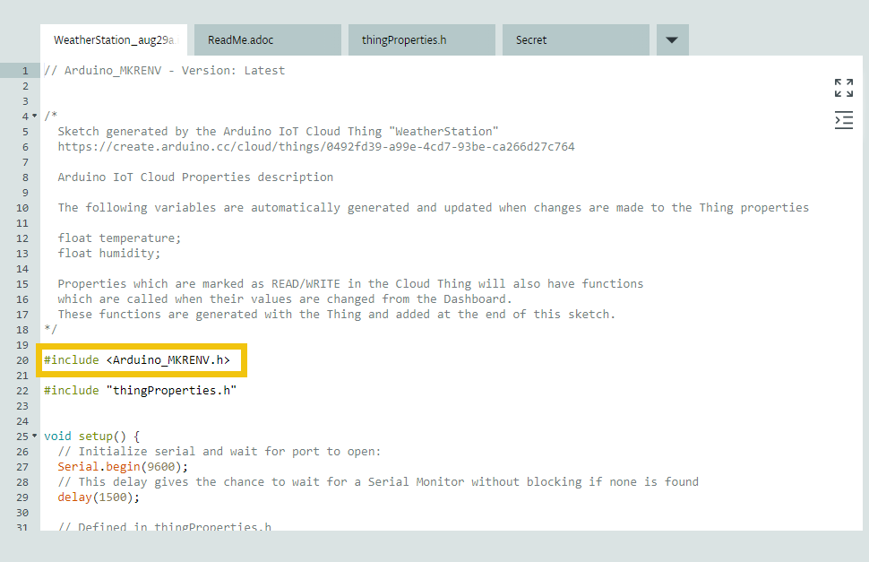

Finally, go into the loop part of the program, which just contains the update for the Arduino Cloud variable, and add code to check whether the shield is working, read the two sensors, and send them to the Serial port. Note how the variables temperature and humidity are pre-defined in the *“thingProperties.h”* tab.

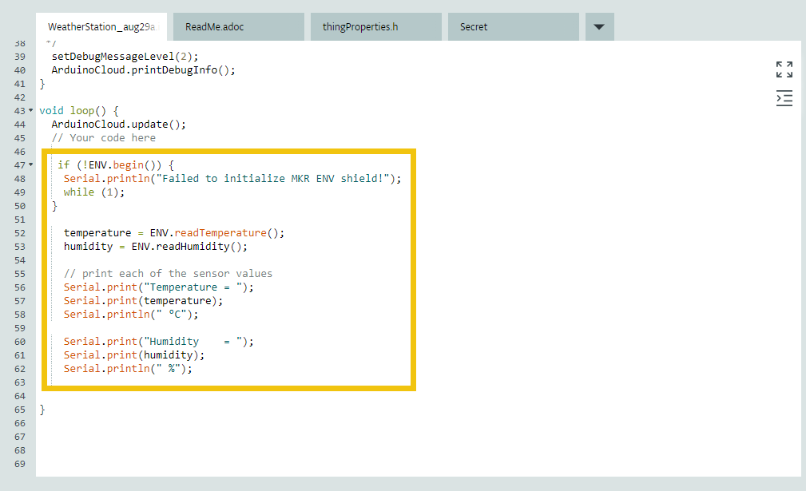

For reference, let's include here the code that should be in the main tab of your sketch.

// Arduino\_MKRENV - Version: Latest

```arduino
// Arduino_MKRENV - Version: Latest


/*
  Sketch generated by the Arduino IoT Cloud Thing "WeatherStation"
  https://create.arduino.cc/cloud/things/XXXXXXX-XXXXX-XXXXX-XXXX <-- this code will be different for your program

  Arduino IoT Cloud Properties description

  The following variables are automatically generated and updated when changes are made to the Thing properties

  float temperature;
  float humidity;

  Properties which are marked as READ/WRITE in the Cloud Thing will also have functions
  which are called when their values are changed from the Dashboard.
  These functions are generated with the Thing and added at the end of this sketch.
*/

#include <Arduino_MKRENV.h>
#include "thingProperties.h"

void setup() {
  // Initialize serial and wait for port to open:
  Serial.begin(9600);

  // This delay gives the chance to wait for a Serial Monitor without blocking if none is found
  delay(1500);

  // Defined in thingProperties.h
  initProperties();

  // Connect to Arduino IoT Cloud
  ArduinoCloud.begin(ArduinoIoTPreferredConnection);

  /*
     The following function allows you to obtain more information
     related to the state of network and IoT Cloud connection and errors
     the higher number the more granular information you’ll get.
     The default is 0 (only errors).
     Maximum is 4
 */
  setDebugMessageLevel(2);
  ArduinoCloud.printDebugInfo();

  //timer = millis();
}

void loop() {
  ArduinoCloud.update();
  // Your code here


    if (!ENV.begin()) {
      Serial.println("Failed to initialize MKR ENV shield!");
      while (1);
    }

    temperature = ENV.readTemperature();
    humidity = ENV.readHumidity();

    // print each of the sensor values
    Serial.print("Temperature = ");
    Serial.print(temperature);
    Serial.println(" °C");

    Serial.print("Humidity    = ");
    Serial.print(humidity);
    Serial.println(" %");

}
```

[\[Get Code\]](//www.arduino.cc/en/IoT-Prime/Experiment04?action=sourceblock&num=1)

*Figure 17: Code Listing, main tab*

On the other hand, be aware that there is data in the *“thingProperties.h”* that you should not touch as it is generated by the platform. Each time you add a new Thing, it will get a specific number that will associate the device to the Cloud. In particular, the **ThingID** is a unique number that should be used only for that one device you created throughout the Wizard. That number, in combination with the crypto chip on your board create a unique way of identifying the board against the platform, what makes the communication safe, both for you and for our infrastructure.

### Data Displayed

In this example, you are sending data from the board to the Arduino Cloud and graphing it using the widgets on the Cloud's dashboard. By adding the properties to the Thing as described earlier in this experiment, you will have enabled them to be graphed almost *automagically*.

Start by uploading the code to your board as you would do normally using the online editor.

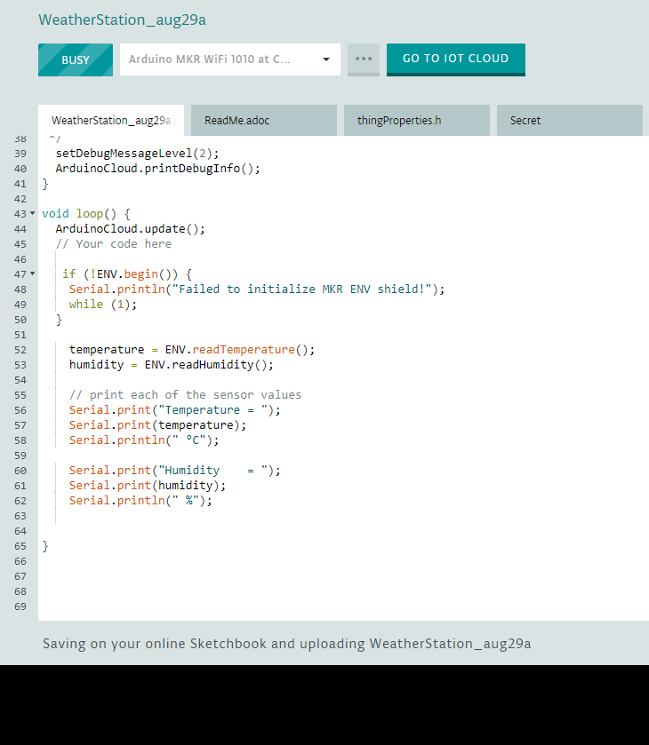

Once the code has been uploaded, hit the Serial Monitor icon. You will see how the board connects to your internet connection, next to the Arduino Cloud, and next will start printing out data being obtained from the sensors once every ten seconds.


Change view to the Cloud by hitting the button at the right of the board drop-down list on the editor. Once in the Cloud view of your Arduino Create account, click on the *Dashboard* tab and you will see the information flowing in. By default the data is shown in large numbers inside different widgets on the window.

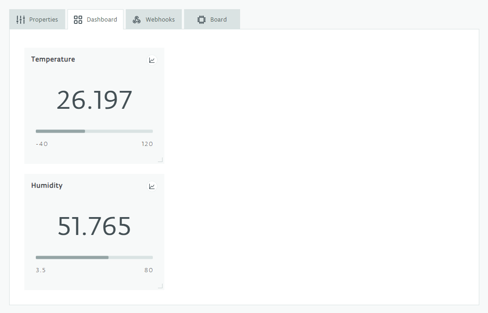

Finally, click on the graph icon as show next:

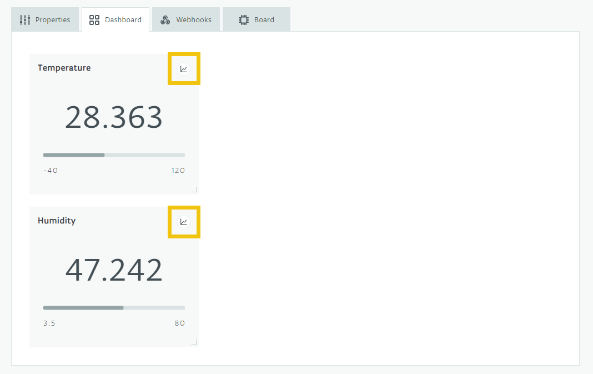

The view of the data will now be transformed into a graph. Data will be shown for as long as you have the browser running.

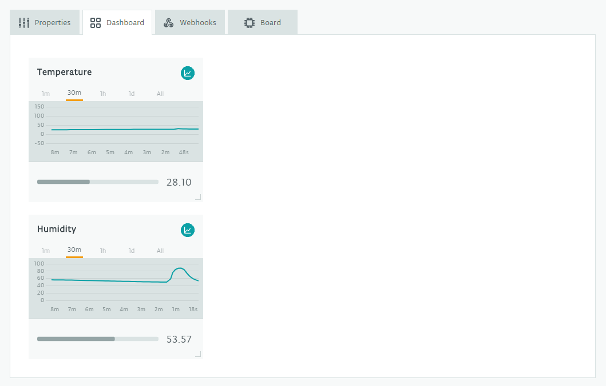

### Challenge

You have now created a dashboard displaying the information of two different sensors, can you add all of the other sensors on the shield as well? As soon as you have that, you will have created a remote weather station. As long as there is WiFi, your board will be able of sending data straight into the Arduino Cloud and you will be able of consulting it from your computer.

The SD card allows for faster data collection than the Cloud, can you modify the code to include the possibility of logging data on the SD card and not just sending it to the Internet?

### Wrapping Up

This experiment guided you in the process of connecting devices, that we call Things, to the Arduino Cloud and representing the data they send, that we call Properties, directly on your user dashboard. It is possible to present plenty of different combinations of data. The Arduino Cloud will help you generating the scaffolding code needed to build and embedded application that will run inside your Arduino board and send the data up to the Cloud.

Once you have physically attached sensors and actuator to your board, you simply need to register them on the Cloud, and then work in modifying the template code provided to you by Arduino Create, the Arduino online editor.

This closes the series of introductory tutorials to the IoT Prime Bundle by Arduino. See more projects using these components [at the Arduino Project Hub](https://create.arduino.cc/projecthub)