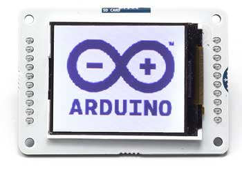
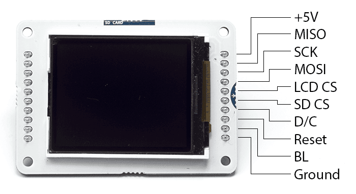
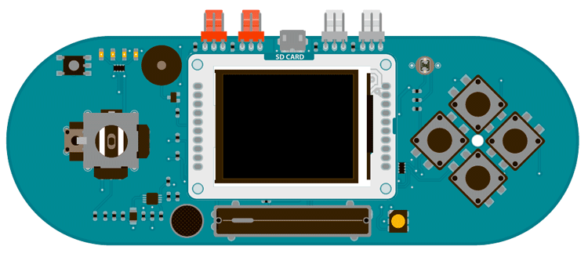
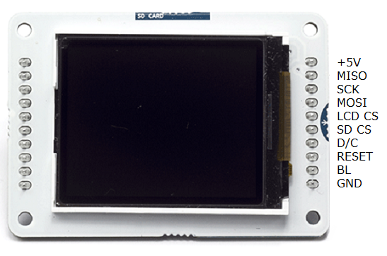
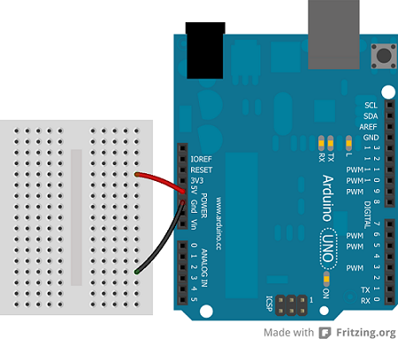
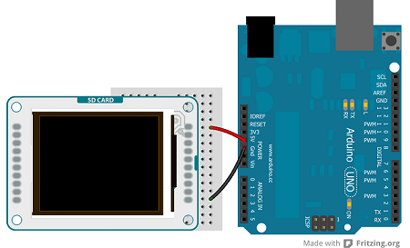
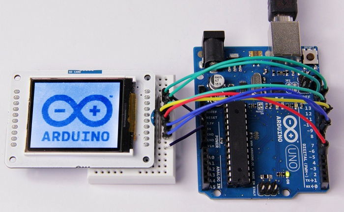
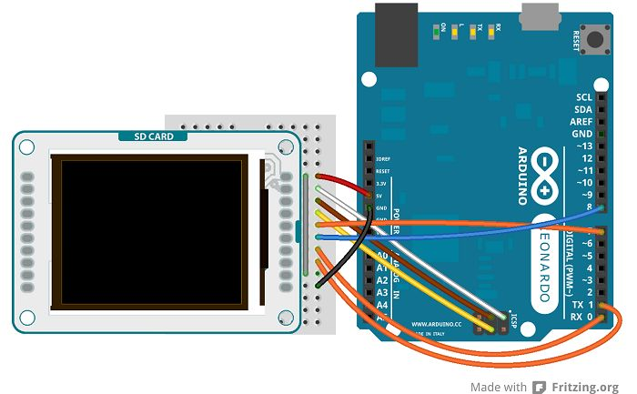
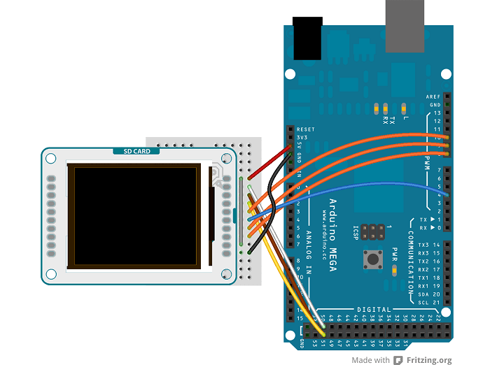
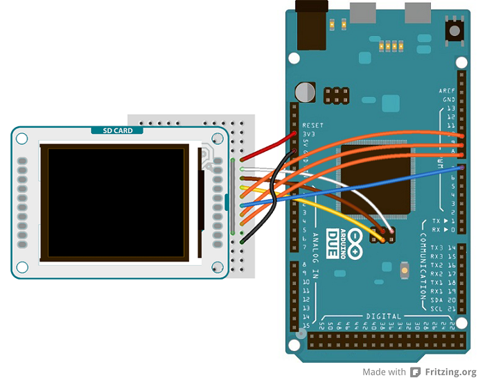

**This is a retired product.**

The Arduino TFT screen is a backlit TFT LCD screen with a micro SD card slot in the back. You can draw text, images, and shapes to the screen with the [TFT library](https://arduino.cc/en/Reference/TFTLibrary).



The screen's pin layout is designed to easily fit into the socket of an [Arduino Esplora](https://arduino.cc/en/Main/ArduinoBoardEsplora) and [Arduino Robot](https://arduino.cc/en/Main/Robot), but it can be used with any Arduino board.

The [TFT library](https://arduino.cc/en/Reference/TFTLibrary) is included with [Arduino IDE 1.0.5 or later](https://arduino.cc/en/Main/Software).

## Library

The Arduino TFT library extends the [Adafruit® GFX](https://github.com/adafruit/Adafruit-GFX-Library), and [Adafruit® ST7735 libraries](https://github.com/adafruit/Adafruit-ST7735-Library) that it is based on. The GFX library is responsible for the drawing routines, while the ST7735 library is specific to the screen on the Arduino screen. The Arduino specific additions were designed to work as similarly to the Processing API as possible.

The library is backwards compatible, which means you can still use the Adafruit® functions [described here](http://learn.adafruit.com/adafruit-gfx-graphics-library/overview).

The TFT library relies on the [SPI library](https://arduino.cc/en/Reference/SPI), which must be included in any sketch that uses the scree. If you wish to use the SD card, you need to include the [SD library](https://arduino.cc/en/Reference/SD) as well.

## Screen layout

By default, the screen is oriented so it is wider than it is tall. The top of the screen is the same side as the text 'SD CARD''. In this orientation, the screen is 160 pixels wide and 128 pixels high.

When thinking about coordinates on the screen, imagine a grid. Each square in the grid is a pixel. You can identify the placement of pixels with specific coordinates. A dot in the top left corner would have coordinates of 0,0. If this dot were to move to the top right of the screen, its coordinates would be 0, 159; in the bottom left corner, the coordinates would be 127,0, and in the bottom right it would be 127,159.

It is possible to use the screen in a vertical, (also called "portrait") orientation, by calling `setRotation(0)`. When you call this, the x and y-axes change accordingly, and calls to `screen.width()` or `screen.height()` change as well.

## Colors

The screen has the ability to show 16-bit color. The red and blue have 5-bits of resolution each (32 levels of red and blue), the green has 6-bits of resolution (64 different levels). For consistency with other applications, the library deals with color in 8-bit values for the red, green, and blue channels (0-255), and scales the colors appropriately.

## Hardware vs software SPI interface

The screen can be configured for use in two ways. One is to use an Arduino's hardware SPI interface. The other is to declare all the pins manually. There is no difference in the functionality of the screen between the two methods, but using hardware SPI is significantly faster when drawing.

If you plan on using the SD card on the TFT module, you must use hardware SPI.

All the examples are written for hardware SPI use.

## Connecting the screen



### Connecting to the Esplora

There is a socket on the front of the Esplora for the screen. Insert the screen into the socket with the blue tab that says "SD Card" closest to the USB port.



### Connecting to other Arduino boards

To connect the screen to other Arduino boards, read the tutorial on this [link](http://arduino.cc/en/Guide/TFTtoBoards).

## Write your first program

To get started with the screen, first write a program that will draw a line, then 2 rectangles horizontally across the screen in different colors.

The first set of instructions are for the Uno, Leonardo, and similar boards. For use with the Esplora, see below.

First, declare the pins to use, import the necessary libraries, and instantiate a named instance of the TFT library. :

```c
#include <TFT.h> // Hardware-specific library
#include <SPI.h>

#define CS   10
#define DC   9
#define RESET  8

// pin definition for the Leonardo
// #define CS   7
// #define DC   0
// #define RESET  1

TFT myScreen = TFT(CS, DC, RESET);
```

In `setup()`, you need to start the library with `begin()` and clear the screen by filling it in black with `background()`.

```c
void setup(){

  myScreen.begin();

  myScreen.background(0,0,0);  // clear the screen with black

  delay(1000);  // pause for dramatic effect
}
```

in `loop()`, to draw a line across the screen, call `line()`. `line()` takes four arguments, the the starting x and y coordinates, and the ending x and y coordinates. For drawing a box, use `rect()`. `rect()` take four arguments as well : the x and y coordinates of the top left corner, followed by the width in pixels, and the height in pixels. Between each of these calls, change the color with `stroke()` or `fill()`. `stroke()` will change the color of a line, or the outline around a shape. `fill()` changes the internal color of a shape. Calling `noStroke()` will stop the library from drawing an outline around any shapes that follow it. If you call `stroke()` after `noStroke()`, the screen will again draw lines.

```c
void loop(){

  myScreen.stroke(255, 0, 0); // set the stroke color to red

  myScreen.line(0, 10, myScreen.width(), 10); // draw a line across the screen

  delay(1000);

  myScreen.noStroke(); // don't draw a line around the next rectangle

  myScreen.fill(0,255,0); // set the fill color to green

  myScreen.rect(0,20,myScreen.width(),10); //draw a rectangle across the screen

  delay(1000);

  myScreen.fill(0,0,255); // set the fill color to blue

  myScreen.stroke(255,255,255); // outline the rectangle with a white line

  myScreen.rect(0,45,myScreen.width(),45); // draw a fat rectangle

  delay(1000);

  myScreen.background(0,0,0); // clear the screen before starting again

  delay(1000);
}
```

If you are using an Esplora, the structure of the program is the exact same. As the Esplora has a socket designed for the screen, and the pins for using the screen are fixed, an Esplora only object is created when targeting sketches for that board. You can reference the screen attached to an Esplora through `EsploraTFT`.

You do not need to declare any pins in your sketch; the object is instantiated for you automatically :

```c
#include <TFT.h> // Hardware-specific library
#include <SPI.h>
#include <Esplora.h>

void setup(){

  EsploraTFT.begin();

  EsploraTFT.background(0,0,0);  // clear the screen with black

  delay(1000);  // pause for dramatic effect
}

void loop(){

  EsploraTFT.stroke(255, 0, 0); // set the stroke color to red

  EsploraTFT.line(0, 10, EsploraLCD.width(), 10); // draw a line across the screen

  delay(1000);

  EsploraTFT.noStroke(); // don't draw a line around the next rectangle

  EsploraTFT.fill(0,255,0); // set the fill color to green

  EsploraTFT.rect(0,20,EsploraTFT.width(),20); //draw a rectangle across the screen

  delay(1000);

  EsploraTFT.fill(0,0,255); // set the fill color to blue

  EsploraTFT.stroke(255,255,255); // outline the rectangle with a white line

  EsploraTFT.rect(0,45,EsploraTFT.width(),50); // draw a fat rectangle

  delay(1000);

  EsploraTFT.background(0,0,0); // clear the screen before starting again

  delay(1000);
}
```

## Movement across the screen

To give the illusion of motion, you need to quickly erase and draw images on the screen. When using Processing on a powerful computer, you can call `background()` every time through your `draw()` function to erase the window contests and dra objects in their new positions. The Arduino is not as fast, is it takes a little time to clear the screen when calling `background()` with the TFT library.

To create the illusion of motion, it's usually best to check if an object has moved each time through `loop()`. If it has, then you should draw over the object with your background color, then redraw the object in its new location. Because you're not updating all the pixels on the screen, it helps maintain the illusion of motion.

This example draws a single point, and has it bounce around on the screen. You'll set up the program in the same way you did previously, adding some variables to keep track of the point's current and previous locations, as well as the velocity and direction of the point.

```c
#include <TFT.h> // Hardware-specific library
#include <SPI.h>

#define CS   10
#define DC   9
#define RESET  8

// pin definition for the Leonardo
// #define CS   7
// #define DC   0
// #define RESET  1

TFT myScreen = TFT(CS, DC, RESET);

// initial position of the point is the middle of the screen
// initial position of the point is the middle of the screen
int xPos = 80;
int yPos = 64;

// direction and speed
int xDir = 1;
int yDir = 1;

// variables to keep track of the point's location
int xPrev = xPos;
int yPrev = yPos;

void setup(){

  myScreen.begin();

  myScreen.background(0,0,0); // clear the screen
}
```

In @@loop()@ you'll first update the position of the dot by adding the direction to the x and y position variables. After that, check to see if there is a difference between the current and the previous locations of the point. If there is a difference, erase the previous location by filling in the dot the same color as the background, then drawing a new dot in the updated location. If the point happens to run into the boundaries of the screen, have it reverse direction.

```c

void loop(){

  // update the location of the dot

  xPos = xPos + xDir;

  yPos = yPos + yDir;

  // check if the current location is different than the previous

  if(xPos != xPrev || yPos != yPrev){

    myScreen.stroke(0,0,0); // set the stroke color to black

    myScreen.point(xPrev, yPrev); // color in the previous point

  }

  // draw a point in the current location

  myScreen.stroke(255,255,255);

  myScreen.point(xPos, yPos);

  // if the x or x position is at the screen edges, reverse direction

  if(xPos >= 160 || xPos <= 0){

    xDir = xDir*-1;

  }

  if(yPos >= 128 || yPos <= 0){

    yDir = yDir*-1;

  }

  // update the point's previous location

  xPrev=xPos;

  yPrev=yPos;

  // a 33ms delay means the screen updates 30 times a second

  delay(33);

}
```

The Esplora version is below :

```c
#include <TFT.h> // Hardware-specific library
#include <SPI.h>
#include <Esplora.h>

// initial position of the point is the middle of the screen
int xPos = 80;
int yPos = 64;

// direction and speed
int xDir = 1;
int yDir = 1;

// variables to keep track of the point's location
int xPrev, yPrev;

void setup(){

  EsploraTFT.begin();

  EsploraTFT.background(0,0,0);
}

void loop(){

  // update the location of the dot

  xPos = xPos + xDir;

  yPos = yPos + yDir;

  // check if the current location is different than the previous

  if(xPos != xPrev || yPos != yPrev){

    EsploraTFT.stroke(0,0,0); // set the stroke color to black

    EsploraTFT.point(xPrev, yPrev); // color in the previous point

  }

  // draw a point in the current location

  EsploraTFT.stroke(255,255,255);

  EsploraTFT.point(xPos, yPos);

  // if the x or x position is at the screen edges, reverse direction

  if(xPos >= 160 || xPos <= 0){

    xDir = xDir*-1;

  }

  if(yPos >= 128 || yPos <= 0){

    yDir = yDir*-1;

  }

  // update the point's previous location

  xPrev=xPos;

  yPrev=yPos;

  // slight pause

  delay(33);

}
```

## Draw some text

The TFT library includes a basic font for drawing text on screen. By default, characters are 5 pixels wide and 8 pixels tall. It is possible to change the font size to 10x16, 15x24, or 20x32. For additional information on the underlying font capabilities, see the [Adafruit® page on graphic primitives](http://learn.adafruit.com/adafruit-gfx-graphics-library/graphics-primitives).

In this example, you'll create a basic counter that will update a number on screen every half second. As in the earlier examples, include the necessary libraries and variables before `setup()`.

In `setup()` send the static text that won't change to the screen. With `setTextSize()` you can increase the font size to make important parts stand out. Dynamic text for the screen should be stored in a char array. The [String class](https://arduino.cc/en/Reference/StringObject) makes it easy to update the text over time in the array.

```c
#include <TFT.h> // Hardware-specific library
#include <SPI.h>

#define CS   10
#define DC   9
#define RESET  8

// pin definition for the Leonardo
// #define CS   7
// #define DC   0
// #define RESET  1

TFT myScreen = TFT(CS, DC, RESET);

// variable to keep track of the elapsed time
int counter = 0;
// char array to print time
char printout[4];

void setup(){

  myScreen.begin();

  myScreen.background(0,0,0); // clear the screen

  myScreen.stroke(255,0,255);

  // static text

  myScreen.text("Running for",0,0);

  myScreen.text("seconds",0,30);

  // increase font size for text in loop()

  myScreen.setTextSize(3);
}


```

In `loop()`, you'll get the current time, and store the number in a char array. Before each loop ends, erase the text you wrote earlier so it doesn't overwrite itself.

```c
void loop(){

    // get elapsed time

    counter = millis();

    // convert to a string

    String elapsedTime = String(counter/1000);

    // add to an array

    elapsedTime.toCharArray(printout,4);

    // print out and erase

    myScreen.stroke(255,255,255);

    myScreen.text(printout,0,10);

    delay(1000);

    myScreen.stroke(0,0,0);

    myScreen.text(printout,0,10);
}
```

The Esplora code :

```c
#include <TFT.h> // Hardware-specific library
#include <SPI.h>
#include <Esplora.h>

// variable to keep track of the elapsed time
long counter = 0;
// char array to print time
char printout[4];

void setup(){

  EsploraTFT.begin();

  EsploraTFT.background(0,0,0); // clear the screen

  EsploraTFT.stroke(255,0,255);

  // static text

  EsploraTFT.text("Running for",0,0);

  EsploraTFT.text("seconds",0,30);

  // increase font size for text in loop()

  EsploraTFT.setTextSize(3);
}

void loop(){

    // get elapsed time

    counter = millis();

    // convert to a string

    String elapsedTime = String(counter/1000);

    // add to an array

    elapsedTime.toCharArray(printout,4);

    // print out and erase

    EsploraTFT.stroke(255,255,255);

    EsploraTFT.text(printout,0,10);

    delay(1000);

    EsploraTFT.stroke(0,0,0);

    EsploraTFT.text(printout,0,10);
}
```

## Draw an image from the SD card

The TFT library has the ability to read .bmp files off a SD card and display them on the screen. Images can be smaller or larger than the screen resolution (160x128), but there is no method on the Arduino for image manipulation. The images should be sized before you put them on the SD card.

In the following example, a bitmap that is 160x128 pixels named "arduino.bmp" is in the root directory of a SD card. When read by the library and drawn, the image will fill the screen.

In addition to the libraries you have been including to this point, you will also need to include the SD library. You'll also need to declare a CS pin for the SD slot.

The PImage class is used to load the image and can also check if the image is a valid file that the library can read.

Once read, the image will be rendered from the coordinates you decide. In this case, it starts drawing from the top left of the screen.

```c
// include the necessary libraries
#include <SPI.h>
#include <SD.h>
#include <TFT.h> // Hardware-specific library

// pin definition for the Uno
#define SD_CS  11
#define LCD_CS 10
#define DC    9
#define RESET    8

// pin definition for the Leonardo
// #define SD_CS  8
// #define LCD_CS 7
// #define DC   0
// #define RESET  1

TFT myScreen = TFT(LCD_CS, DC, RESET);

// this variable represents the image to be drawn on screen

PImage image;

void setup() {

  // initialize the serial port

  Serial.begin(9600);

  while (!Serial) {

    // wait for serial line to be ready

    // needed for the Leonardo

  }

  // try to access the SD card

  Serial.print("Initializing SD card...");

  if (!SD.begin(SD_CS)) {

    Serial.println("failed!");

    return;

  }

  Serial.println("OK!");

  // initialize and clear the GLCD screen

  myScreen.begin();

  myScreen.background(255, 255, 255);

  // load the image from the SD card

  image = myScreen.loadImage("arduino.bmp");

  // check if the image loaded properly

  if (image.isValid() != true) {

    Serial.println("error while loading arduino.bmp");

  }

  //write the image on screen

  myScreen.image(image, 0, 0);
}

void loop(){
// nothing happening here
}
```

For the Esplora :

```c

// include the necessary libraries
#include <SPI.h>
#include <SD.h>
#include <TFT.h> // Hardware-specific library
#include <Esplora.h>

// SD Chip Select pin
#define SD_CS    8

// this variable represents the image to be drawn on screen

PImage image;

void setup() {

  // initialize the serial port

  Serial.begin(9600);

  while (!Serial) {

    // wait for serial line to be ready

  }

  // try to access the SD card

  Serial.print("Initializing SD card...");

  if (!SD.begin(SD_CS)) {

    Serial.println("failed!");

    return;

  }

  Serial.println("OK!");

  // initialize and clear the GLCD screen

  EsploraTFT.begin();

  EsploraTFT.background(255, 255, 255);

  // load the image from the SD card

  image = EsploraTFT.loadImage("arduino.bmp");

  // check if the image loaded properly

  if (image.isValid() != true) {

    Serial.println("error while loading arduino.bmp");

  }

  //write the image on screen

  EsploraTFT.image(image, 0, 0);
}

void loop(){
// nothing happening here
}
```

## Connecting to Other Arduino Boards

Even if the screen's headers are designed to fit into the socket on the front of the Arduino Esplora or the Arduino Robot but, this module is compatible with any AVR-based Arduino (UNO, Leonardo, etc...) or with the Arduino Due. If you want to use one these other boards, some slight changes on connections are required.



You can either connect the screen with hardware SPI pins, or define your own set of pins. Using the hardware SPI is faster when drawing to the screen.

### Arduino Uno

Connect power and ground to the breadboard.



Connect the screen to the breadboard. The headers on the side of the screen with the small blue tab and arrow should be the ones that attach to the board. Pay attention to the orientation of the screen, in these images, it is upside down.



Connect the pins following this default configuration:

|         |        |
| ------- | ------ |
| +5V:    | +5V    |
| MISO:   | pin 12 |
| SCK:    | pin 13 |
| MOSI:   | pin 11 |
| LCD CS: | pin 10 |
| SD CS:  | pin 4  |
| D/C:    | pin 9  |
| RESET:  | pin 8  |
| BL:     | +5V    |
| GND:    | GND    |


Connecting the pins in the proper way, you can see the lcd screen working with your Uno (or Duemilanove) just uploading the simple *"TFTBitmapLogo"* sketch.



### Arduino Leonardo & Arduino Yún

The Arduino Leonardo & Arduino Yún use different pins to be compatible with the lcd screen. To set the pins MISO, MOSI and SCK, you have to use the ICSP terminals.

|         |                                |
| ------- | ------------------------------ |
| +5V:    | +5V                            |
| MISO:   | Miso pin (white wire on ICSP)  |
| SCK:    | Sck pin (brown wire on ICSP)   |
| MOSI:   | Mosi pin (yellow wire on ICSP) |
| LCD CS: | pin 7                          |
| SD CS:  | pin 8                          |
| D/C:    | pin 0                          |
| RESET:  | pin 1                          |
| BL:     | +5V                            |
| GND:    | GND                            |

The image below shows an Arduino Leonardo but it works for an Arduino Yún too.



The screen will show this message: **"Arduino TFT Bitmap Example. Open serial monitor to run the sketch"**. Open the serial monitor to view the Arduino Logo.

### Arduino Mega 2560 or Mega ADK

To connect the lcd screen to a Mega board, use this pin configuration:

|         |                               |
| ------- | ----------------------------- |
| +5V:    | +5V                           |
| MISO:   | 50 on Mega 2560 (Miso on ADK) |
| SCK:    | 52 on Mega 2560 (Sck on ADK)  |
| MOSI:   | 51 on Mega 2560 (Mosi on ADK) |
| LCD CS: | pin 10                        |
| SD CS:  | pin 4                         |
| D/C:    | pin 9                         |
| RESET:  | pin 8                         |
| BL:     | +5V                           |
| GND:    | GND                           |



### Arduino Due

To connect the lcd screen to an Arduino Due, use this pin configuration and don't forget to set the right value for the variable *"sd_cs"* (`#define sd_cs 7`) in the sketch:

|         |                               |
| ------- | ----------------------------- |
| +5V:    | +3.3V                         |
| MISO:   | Miso pin (white wire on SPI)  |
| SCK:    | Sck pin (brown wire on SPI)   |
| MOSI:   | Mosi pin (yellow wire on SPI) |
| LCD CS: | pin 10                        |
| SD CS:  | pin 7                         |
| D/C:    | pin 9                         |
| RESET:  | pin 8                         |
| BL:     | +3.3V                         |
| GND:    | GND                           |



## Next steps

Now that you have tested the basic functionality of the screen, see the [TFT library](https://arduino.cc/en/Reference/TFTLibrary) pages for information about the library's API and additional examples. It's also recommended to visit the Adafruit® graphics library page for additional information on functions not covered.

The text of the Arduino getting started guide is licensed under a
[Creative Commons Attribution-ShareAlike 3.0 License](http://creativecommons.org/licenses/by-sa/3.0/). Code samples in the guide are released into the public domain.
