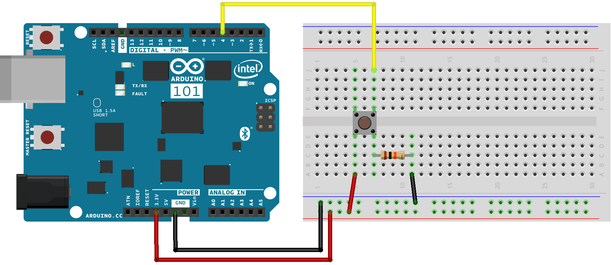
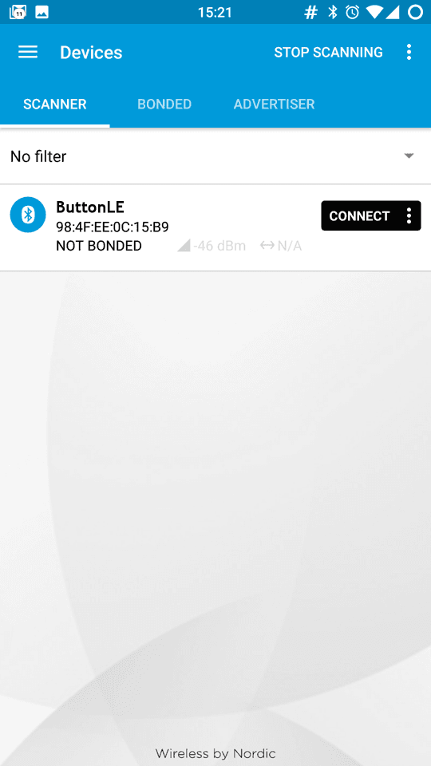
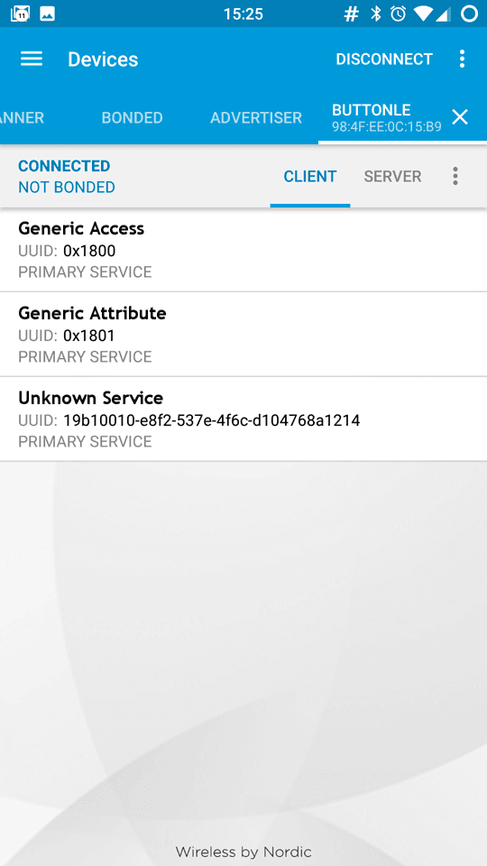
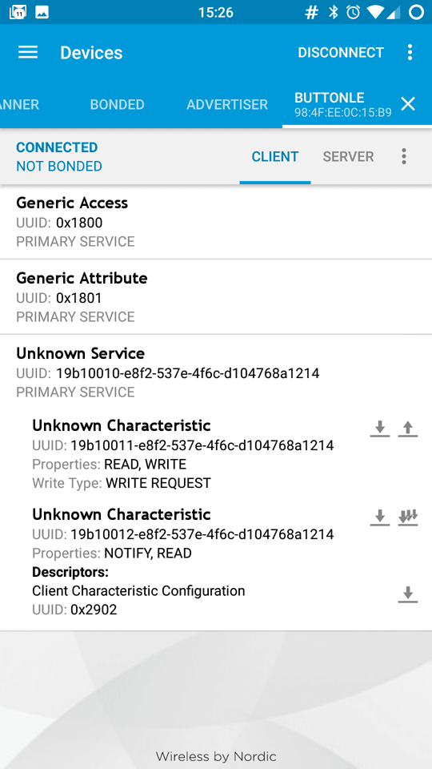
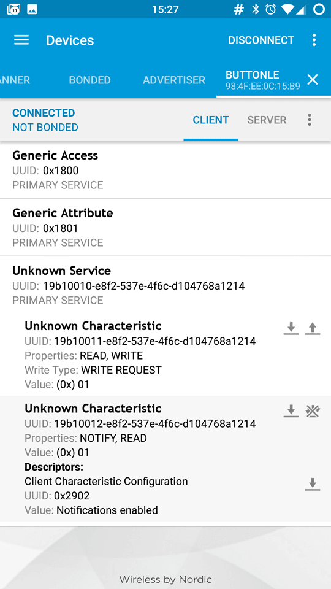
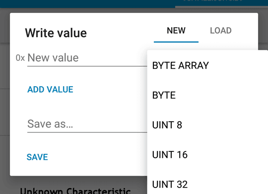
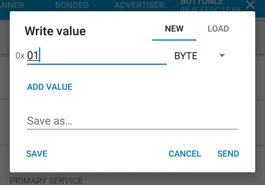

With this tutorial you learn to use the Curie Bluetooth® Low Energy library to connect your board with a smartphone or tablet. A pushbutton connected to the board allows you to turn on and off the onboard LED on Pin 13. The same action can be performed from the smartphone and the smartphone is capable of reading the LED status. This bidirectional communication happens between the Bluetooth® Low Energy central (smartphone) and the peripheral (our 101 board).

## Hardware Required

- [Arduino 101](https://www.arduino.cc/en/Main/ArduinoBoard101)
- pushbutton

- 10k ohm resistor

- breadboard

- hook-up wires

- Smartphone or Tablet Android or iOS

## Software Required

- nRF Master Control Panel(Bluetooth® Low Energy) for [Android](https://play.google.com/store/apps/details?id=no.nordicsemi.android.mcp&amp;hl=en) and [iOS](https://itunes.apple.com/us/app/nrf-master-control-panel-ble/id1054362403?mt=8)

## The Circuit



image developed using [Fritzing](http://www.fritzing.org).

You need to connect a pushbutton to your 101 with a 10k ohm resistor that keeps the level of D4 LOW as long as the pushputton is not pressed. When this happens, the D4 pin is connected to 3.3V and it is read as HIGH.

## Software Essentials

### Libraries

*CurieBLE.h* is the library that gives access to all the parameters, features and functions of the Bluetooth® Low Energy module of the 101 board. With Bluetooth® Low Energy it is possible to connect to and communicate with smartphones, tablets and peripherals that support this standard. In this tutorial it is used to establish a connection with a control application on the smartphone and get the value used to turn on or off a LED either using the physical pushbutton or writing the value of a "virtual" pushbutton.

### Functions

None

## On the Smartphone

To drive the onboard LED of Arduino 101, you need the nRF Master Control Panel(Bluetooth® Low Energy) for [Android](https://play.google.com/store/apps/details?id=no.nordicsemi.android.mcp&amp;hl=en) and [iOS](https://itunes.apple.com/us/app/nrf-master-control-panel-ble/id1054362403?mt=8). Launch it and do a SCAN. You should find the **ButtonLE** tab with a *connect* button



Tap on *connect* to open the following screen, where you find the description of our Bluetooth® Low Energy service offered by the 101 board. The unknown service has a UUID 19B10000-E8F2-537E-4F6C-D104768A1214 and it is set by the `BLEService ledService("19B10000-E8F2-537E-4F6C-D104768A1214");` statement at the beginning of the sketch.



Tap the **Unknown Service** to open up its characteristic, as shown below. It includes properties that can be written with a Write Request and properties that can be read and receive notifications. You also find two icons on the right of the first Unknown Characteristic. The arrow pointing down means *read*, the other means *write*.



If you tap on the second Unknown Characteristic and you set the rightmost little icon - the one with multiple down arrows - with an "X" on it, you enable notifications. This allows you to see the LED status that changes every time you press or release the pushbutton.



Tap the arrow pointing up in the first Unknown Characteristic to open the **Write value** popup, then set the data type to *BYTE* . This will add a small "0x" in front of the input line to show that an HEX format input is needed.



Tap on the line to write your chosen value (either "00" or "01"). As soon as you tap on *send* the value is sent to the 101 board and the LED instantly changes accordingly.



## Code

```arduino
/*

 * Copyright (c) 2016 Intel Corporation.  All rights reserved.

 * See the bottom of this file for the license terms.

 */

#include <CurieBLE.h>

const int ledPin = 13; // set ledPin to on-board LED

const int buttonPin = 4; // set buttonPin to digital pin 4

BLEPeripheral blePeripheral; // create peripheral instance

BLEService ledService("19B10010-E8F2-537E-4F6C-D104768A1214"); // create service

// create switch characteristic and allow remote device to read and write

BLECharCharacteristic ledCharacteristic("19B10011-E8F2-537E-4F6C-D104768A1214", BLERead | BLEWrite);
// create button characteristic and allow remote device to get notifications

BLECharCharacteristic buttonCharacteristic("19B10012-E8F2-537E-4F6C-D104768A1214", BLERead | BLENotify); // allows remote device to get notifications

void setup() {

  Serial.begin(9600);

  pinMode(ledPin, OUTPUT); // use the LED on pin 13 as an output

  pinMode(buttonPin, INPUT); // use button pin 4 as an input

  // set the local name peripheral advertises

  blePeripheral.setLocalName("ButtonLED");

  // set the UUID for the service this peripheral advertises:

  blePeripheral.setAdvertisedServiceUuid(ledService.uuid());

  // add service and characteristics

  blePeripheral.addAttribute(ledService);

  blePeripheral.addAttribute(ledCharacteristic);

  blePeripheral.addAttribute(buttonCharacteristic);

  ledCharacteristic.setValue(0);

  buttonCharacteristic.setValue(0);

  // advertise the service

  blePeripheral.begin();

  Serial.println("Bluetooth® device active, waiting for connections...");
}

void loop() {

  // poll peripheral

  blePeripheral.poll();

  // read the current button pin state

  char buttonValue = digitalRead(buttonPin);

  // has the value changed since the last read

  boolean buttonChanged = (buttonCharacteristic.value() != buttonValue);

  if (buttonChanged) {

    // button state changed, update characteristics

    ledCharacteristic.setValue(buttonValue);

    buttonCharacteristic.setValue(buttonValue);

  }

  if (ledCharacteristic.written() || buttonChanged) {

    // update LED, either central has written to characteristic or button state has changed

    if (ledCharacteristic.value()) {

      Serial.println("LED on");

      digitalWrite(ledPin, HIGH);

    } else {

      Serial.println("LED off");

      digitalWrite(ledPin, LOW);

    }

  }
}

/*

  Copyright (c) 2016 Intel Corporation. All rights reserved.

  This library is free software; you can redistribute it and/or

  modify it under the terms of the GNU Lesser General Public

  License as published by the Free Software Foundation; either

  version 2.1 of the License, or (at your option) any later version.

  This library is distributed in the hope that it will be useful,

  but WITHOUT ANY WARRANTY; without even the implied warranty of

  MERCHANTABILITY or FITNESS FOR A PARTICULAR PURPOSE. See the GNU

  Lesser General Public License for more details.

  You should have received a copy of the GNU Lesser General Public

  License along with this library; if not, write to the Free Software

  Foundation, Inc., 51 Franklin Street, Fifth Floor, Boston, MA 02110-

  1301 USA

*/
```


*Last revision 2016/04/05 by SM*