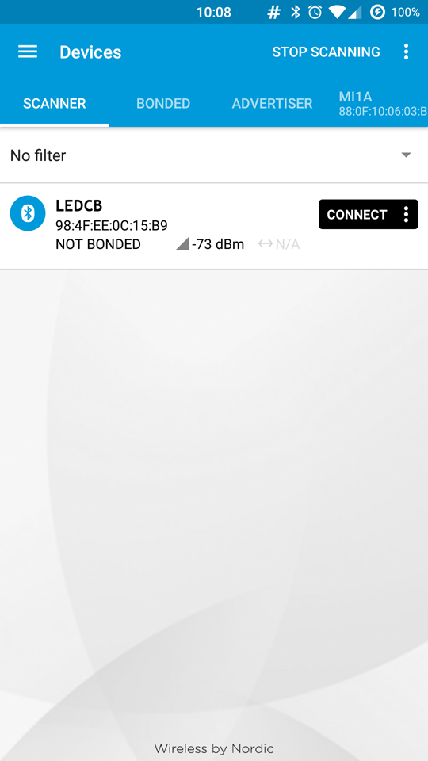
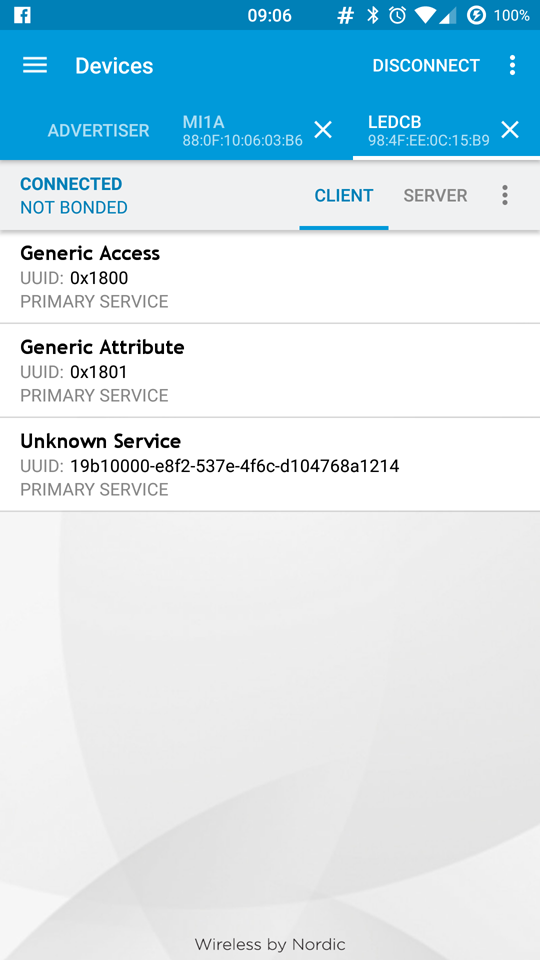
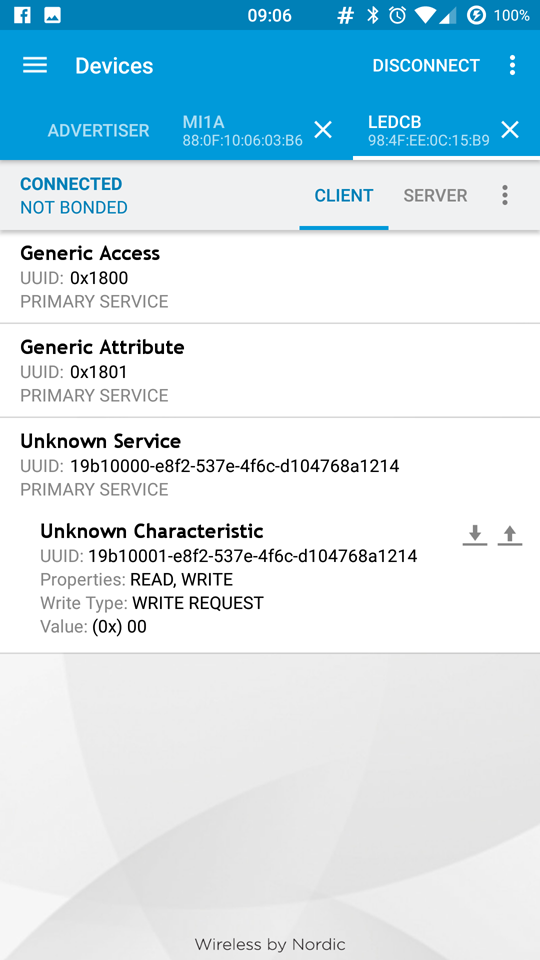
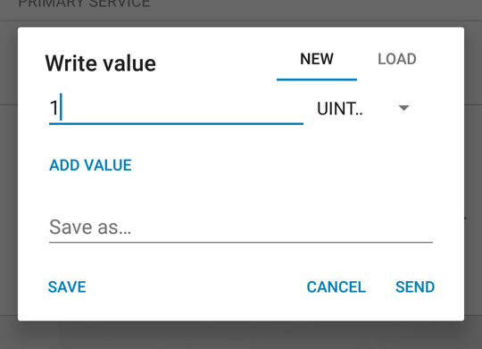

With this tutorial you use the Arduino 101's onboard Bluetooth® Low Energy capabilities to turn on and of the LED connected to Pin 13 from a smartphone or tablet. You create a LED service that polls the central and creates Bluetooth® Low Energy events that are managed with callbacks. The values are sent using nRF Master Control Panel(Bluetooth® Low Energy) app, available for Android and iOS.

## Hardware Required

- [Arduino 101](https://www.arduino.cc/en/Main/ArduinoBoard101)
- Smartphone or Tablet Android or iOS

## Software Required

- nRF Master Control Panel(Bluetooth® Low Energy) for [Android](https://play.google.com/store/apps/details?id=no.nordicsemi.android.mcp&amp;hl=en) and [iOS](https://itunes.apple.com/us/app/nrf-master-control-panel-ble/id1054362403?mt=8)

## The Circuit


image developed using [Fritzing](http://www.fritzing.org).

## Software Essentials

### Libraries

*CurieBLE.h* is the library that gives access to all the parameters, features and functions of the Bluetooth® Low Energy module of the 101 board. With Bluetooth® Low Energy it is possible to connect to and communicate with smartphones, tablets and peripherals that support this standard. In this tutorial it is used to establish a connection with a control application on the smartphone and get the value used to turn on or off a LED.

### Functions

The following functions are callbacks driven by the Bluetooth® Low Energy events.

*blePeripheralConnectHandler()* - called when Bluetooth® Low Energy central connects to the 101 board. It prints a connect message with Bluetooth® Low Energy central address on the Arduino Software (IDE) Serial Monitor.

*blePeripheralDisconnectHandler ()* - called when Bluetooth® Low Energy central disconnects from the 101 board. It prints a disconnect message with Bluetooth® Low Energy central address on the Arduino Software (IDE) Serial Monitor.

*switchCharacteristicWritten ()* - called when Bluetooth® Low Energy central writes the switch characteristic. It switches LED on or off depending on the value written to that characteristic by the user on the nRF Master Control Panel.

## On the Smartphone

To drive the onboard LED of Arduino 101, you need the nRF Master Control Panel(Bluetooth® Low Energy) for [Android](https://play.google.com/store/apps/details?id=no.nordicsemi.android.mcp&amp;hl=en) and [iOS](https://itunes.apple.com/us/app/nrf-master-control-panel-ble/id1054362403?mt=8). Launch it and do a SCAN. You should find the **LEDCB** tab with a *connect* button



Tap on *connect* to open the following screen, where you find the description of our Bluetooth® Low Energy service offered by the 101 board. The unknown service has a UUID 19B10000-E8F2-537E-4F6C-D104768A1214 and it is set by the `BLEService ledService("19B10000-E8F2-537E-4F6C-D104768A1214");` statement at the beginning of the sketch.



Tap the **Unknown Service** to open up its characteristic, as shown below. It includes properties that can be written with a Write Request. you also find two icons on the right of the Unknown Characteristic. The arrow pointing down means *read*, the other means *write*.



Tap the arrow pointing up to open the **Write value** popup, then set the data type to *UINT 8* and tap on the line to write your chosen value (either "0" or "1"). As soon as you tap on *send* the value is sent to the 101 board and the LED instantly changes accordingly.



## Code

```arduino
/*

 * Copyright (c) 2016 Intel Corporation.  All rights reserved.

 * See the bottom of this file for the license terms.

 */

#include <CurieBLE.h>

const int ledPin = 13; // set ledPin to use on-board LED

BLEPeripheral blePeripheral; // create peripheral instance

BLEService ledService("19B10000-E8F2-537E-4F6C-D104768A1214"); // create service

// create switch characteristic and allow remote device to read and write

BLECharCharacteristic switchChar("19B10001-E8F2-537E-4F6C-D104768A1214", BLERead | BLEWrite);

void setup() {

  Serial.begin(9600);

  pinMode(ledPin, OUTPUT); // use the LED on pin 13 as an output

  // set the local name peripheral advertises

  blePeripheral.setLocalName("LEDCB");

  // set the UUID for the service this peripheral advertises

  blePeripheral.setAdvertisedServiceUuid(ledService.uuid());

  // add service and characteristic

  blePeripheral.addAttribute(ledService);

  blePeripheral.addAttribute(switchChar);

  // assign event handlers for connected, disconnected to peripheral

  blePeripheral.setEventHandler(BLEConnected, blePeripheralConnectHandler);

  blePeripheral.setEventHandler(BLEDisconnected, blePeripheralDisconnectHandler);

  // assign event handlers for characteristic

  switchChar.setEventHandler(BLEWritten, switchCharacteristicWritten);
// set an initial value for the characteristic

  switchChar.setValue(0);

  // advertise the service

  blePeripheral.begin();

  Serial.println(("Bluetooth® device active, waiting for connections..."));
}

void loop() {

  // poll peripheral

  blePeripheral.poll();
}

void blePeripheralConnectHandler(BLECentral& central) {

  // central connected event handler

  Serial.print("Connected event, central: ");

  Serial.println(central.address());
}

void blePeripheralDisconnectHandler(BLECentral& central) {

  // central disconnected event handler

  Serial.print("Disconnected event, central: ");

  Serial.println(central.address());
}

void switchCharacteristicWritten(BLECentral& central, BLECharacteristic& characteristic) {

  // central wrote new value to characteristic, update LED

  Serial.print("Characteristic event, written: ");

  if (switchChar.value()) {

    Serial.println("LED on");

    digitalWrite(ledPin, HIGH);

  } else {

    Serial.println("LED off");

    digitalWrite(ledPin, LOW);

  }
}

/*

  Copyright (c) 2016 Intel Corporation. All rights reserved.

  This library is free software; you can redistribute it and/or

  modify it under the terms of the GNU Lesser General Public

  License as published by the Free Software Foundation; either

  version 2.1 of the License, or (at your option) any later version.

  This library is distributed in the hope that it will be useful,

  but WITHOUT ANY WARRANTY; without even the implied warranty of

  MERCHANTABILITY or FITNESS FOR A PARTICULAR PURPOSE. See the GNU

  Lesser General Public License for more details.

  You should have received a copy of the GNU Lesser General Public

  License along with this library; if not, write to the Free Software

  Foundation, Inc., 51 Franklin Street, Fifth Floor, Boston, MA 02110-

  1301 USA

*/
```


*Last revision 2016/04/05 by SM*