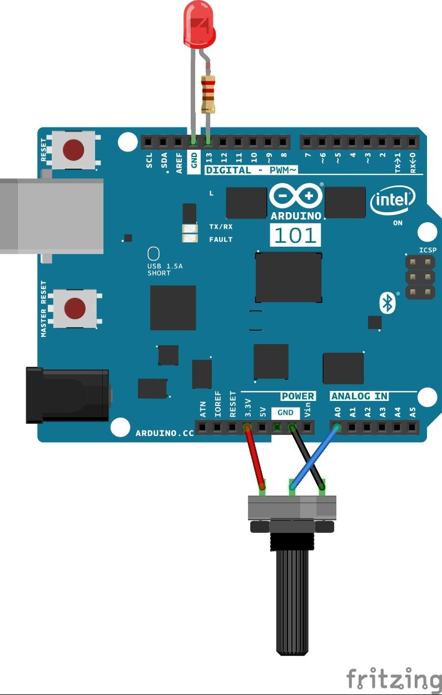
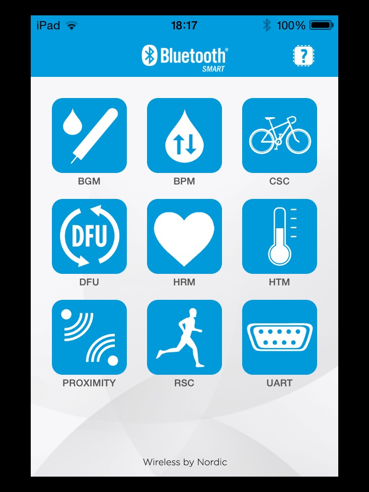
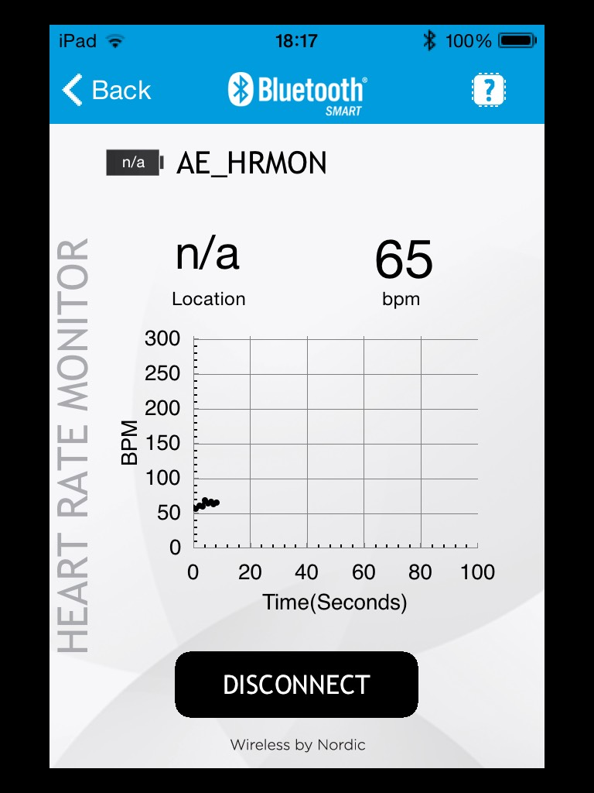

This tutorial demonstrates the Arduino 101's onboard Bluetooth® Low Energy capabilities. The sketch implements the [standard Bluetooth® Low Energy "Heart Rate Monitor" service](https://www.bluetooth.org/docman/handlers/downloaddoc.ashx?doc_id=239866). The Heart Rate service takes values from a heart rate sensor (in this tutorial emulated by an analog sensor) and sends them over Bluetooth® Low Energy to your smartphone/device to create a graph of the data using the app [nRF Toolbox for Bluetooth® Low Energy](https://www.nordicsemi.com/Products/Development-tools/nRF-Toolbox).

## Hardware Required

- [Arduino 101](https://www.arduino.cc/en/Main/ArduinoBoard101)
- An Android or iOS device running the nRF Toolbox for Bluetooth® Low Energy App

- A Potentiometer or other analog sensor

## The Circuit



image developed using [Fritzing](http://www.fritzing.org).

## Instructions

Set up the Arduino software as described in [Getting Started with Arduino 101](https://arduino.cc/en/Guide/Arduino101).

1. Download the nRF Toolbox for Bluetooth® Low Energy app [for Android](https://play.google.com/store/apps/details?id=no.nordicsemi.android.nrftoolbox&amp;hl=it) or [for iOS](https://itunes.apple.com/it/app/nrf-toolbox/id820906058?mt=8) free of charge.

2. Wire up the potentiometer (or other analog sensor) to your Arduino 101 as shown in "the circuit" above.

3. Connect the Arduino 101 to your computer.

4. Launch the Arduino software and select Arduino 101 from the **Tools > Board** menu.

5. Upload the CurieBLEHeartRateMonitor example shown below.

6. Launch the app. You should be presented with the home screen as depicted below.



- Click the heart icon in the centre of the screen, after which you will see a graph showing Beats per Minute over Time. This will not show any data until connected with your Arduino.

- Press the connect button below the graph you should see the device "HeartRateSketch" (or whatever name you set).

- Click on the name of your device, and the data from the potentiometer should immediately start entering the graph as depicted below. Of course, the potentiometer only emulates a heart rate to demonstrate the usage of the service.



## Where to Go from Here

The Bluetooth® Low Energy includes [many other services](https://developer.bluetooth.org/gatt/services/Pages/ServicesHome.aspx) with which you can experiment, such as [Alert Notification Service](https://developer.bluetooth.org/gatt/services/Pages/ServiceViewer.aspx?u=org.bluetooth.service.alert_notification.xml), [Environmental Sensing](https://developer.bluetooth.org/gatt/services/Pages/ServiceViewer.aspx?u=org.bluetooth.service.environmental_sensing.xml), and [AutomationIO](https://developer.bluetooth.org/gatt/services/Pages/ServiceViewer.aspx?u=org.bluetooth.service.automation_io.xml), in which you can expose all of your Arduino's inputs and control its outputs.
This tutorial uses nRF Toolbox, which allows the use of 9 services. For more advanced capabilities, other discluded services, as well the CurieImu library's LED examples, we recommend using [LightBlue for iOS](https://itunes.apple.com/it/app/lightblue-explorer-bluetooth/id557428110?mt=8) or [nRF Control Panel for Android](https://play.google.com/store/apps/details?id=no.nordicsemi.android.mcp&amp;hl=it).

## Code

```arduino
/*

   Copyright (c) 2015 Intel Corporation.  All rights reserved.

   This library is free software; you can redistribute it and/or

   modify it under the terms of the GNU Lesser General Public

   License as published by the Free Software Foundation; either

   version 2.1 of the License, or (at your option) any later version.

   This library is distributed in the hope that it will be useful,

   but WITHOUT ANY WARRANTY; without even the implied warranty of

   MERCHANTABILITY or FITNESS FOR A PARTICULAR PURPOSE.  See the GNU

   Lesser General Public License for more details.

   You should have received a copy of the GNU Lesser General Public

   License along with this library; if not, write to the Free Software

   Foundation, Inc., 51 Franklin Street, Fifth Floor, Boston, MA  02110-1301  USA

*/

/*

   This sketch example partially implements the standard Bluetooth® Low-Energy Heart Rate service.

   For more information: https://developer.bluetooth.org/gatt/services/Pages/ServicesHome.aspx

*/

#include <CurieBLE.h>

BLEPeripheral blePeripheral;       // Bluetooth® Low Energy Peripheral Device (the board you're programming)

BLEService heartRateService("180D"); // Bluetooth® Low Energy Heart Rate Service

// BLE Heart Rate Measurement Characteristic"

BLECharacteristic heartRateChar("2A37",  // standard 16-bit characteristic UUID

    BLERead | BLENotify, 2);  // remote clients will be able to get notifications if this characteristic changes

                              // the characteristic is 2 bytes long as the first field needs to be "Flags" as per Bluetooth® Low Energy specifications

                              // https://developer.bluetooth.org/gatt/characteristics/Pages/CharacteristicViewer.aspx?u=org.bluetooth.characteristic.heart_rate_measurement.xml

int oldHeartRate = 0;  // last heart rate reading from analog input
long previousMillis = 0;  // last time the heart rate was checked, in ms

void setup() {

  Serial.begin(9600);    // initialize serial communication

  pinMode(13, OUTPUT);   // initialize the LED on pin 13 to indicate when a central is connected

  /* Set a local name for the Bluetooth® Low Energy device

     This name will appear in advertising packets

     and can be used by remote devices to identify this Bluetooth® Low Energy device

     The name can be changed but maybe be truncated based on space left in advertisement packet */

  blePeripheral.setLocalName("HeartRateSketch");

  blePeripheral.setAdvertisedServiceUuid(heartRateService.uuid());  // add the service UUID

  blePeripheral.addAttribute(heartRateService);   // Add the BLE Heart Rate service

  blePeripheral.addAttribute(heartRateChar); // add the Heart Rate Measurement characteristic

  /* Now activate the BLE device.  It will start continuously transmitting BLE

     advertising packets and will be visible to remote BLE central devices

     until it receives a new connection */

  blePeripheral.begin();

  Serial.println("Bluetooth® device active, waiting for connections...");
}

void loop() {

  // listen for BLE peripherals to connect:

  BLECentral central = blePeripheral.central();

  // if a central is connected to peripheral:

  if (central) {

    Serial.print("Connected to central: ");

    // print the central's MAC address:

    Serial.println(central.address());

    // turn on the LED to indicate the connection:

    digitalWrite(13, HIGH);

    // check the heart rate measurement every 200ms

    // as long as the central is still connected:

    while (central.connected()) {

      long currentMillis = millis();

      // if 200ms have passed, check the heart rate measurement:

      if (currentMillis - previousMillis >= 200) {

        previousMillis = currentMillis;

        updateHeartRate();

      }

    }

    // when the central disconnects, turn off the LED:

    digitalWrite(13, LOW);

    Serial.print("Disconnected from central: ");

    Serial.println(central.address());

  }
}

void updateHeartRate() {

  /* Read the current voltage level on the A0 analog input pin.

     This is used here to simulate the heart rate's measurement.

  */

  int heartRateMeasurement = analogRead(A0);

  int heartRate = map(heartRateMeasurement, 0, 1023, 0, 100);

  if (heartRate != oldHeartRate) {      // if the heart rate has changed

    Serial.print("Heart Rate is now: "); // print it

    Serial.println(heartRate);

    const unsigned char heartRateCharArray[2] = { 0, (char)heartRate };

    heartRateChar.setValue(heartRateCharArray, 2);  // and update the heart rate measurement characteristic

    oldHeartRate = heartRate;           // save the level for next comparison

  }
}
```

