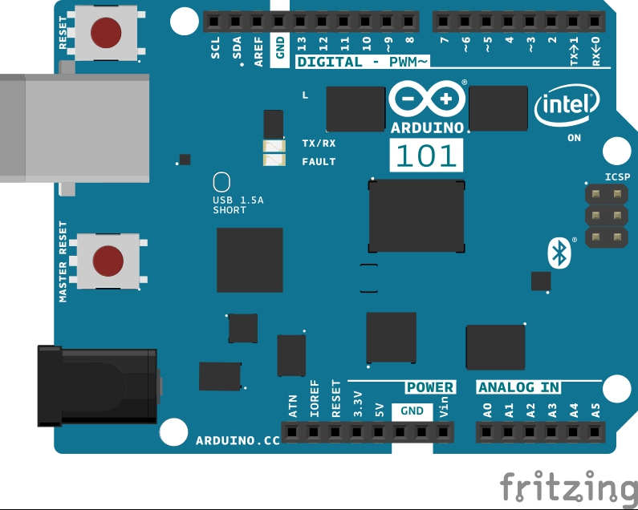

With this tutorial you learn how to detect double taps made on the board in a limited time interval and on any of the three axes. This tutorial sets the accelerometer range for stronger taps and sets a window of a quarter of second to consider two taps as a double tap event.

## Hardware Required

- [Arduino 101](https://www.arduino.cc/en/Main/ArduinoBoard101)

## The Circuit



image developed using [Fritzing](http://www.fritzing.org).
No additional hardware is needed to use this tutorial.

## Software Essentials

### Libraries

CurieIMU.h is the library that gives access to all the parameters, features and readings of the IMU chip of the 101 board. This unit contains a three axes accelerometer and a three axes gyroscope. This library is part of the 101 board core and it is loaded together with the core files for Arduino 101. In this tutorial we use the Tap detection feature of the IMU through the dedicated functions of this library.

### Functions

None

## Code

This sketch has the setup block that contains all the code necessary to set up the double tap detection event. The interrupt is enabled and when asserted is serviced by the callback function. This function reads all the possiple combinations of axes and direction to print on Serial port the axis and direction of the double tap. The main loop is empty.

```arduino
/*

 * Copyright (c) 2016 Intel Corporation.  All rights reserved.

 * See the bottom of this file for the license terms.

 */

/*

   This sketch example demonstrates how the BMI160 accelerometer on the

   Intel(R) Curie(TM) module can be used to detect tap events

*/

#include "CurieIMU.h"

void setup() {

  Serial.begin(9600); // initialize Serial communication

  while(!Serial) ;    // wait for serial port to connect.

  // Initialise the IMU

  CurieIMU.begin();

  CurieIMU.attachInterrupt(eventCallback);

  // Increase Accelerometer range to allow detection of stronger taps (< 4g)

  CurieIMU.setAccelerometerRange(4);

  // Reduce threshold to allow detection of weaker taps (>= 750mg)

  CurieIMU.setDetectionThreshold(CURIE_IMU_TAP, 750); // (750mg)

  // Enable Double-Tap detection

  CurieIMU.interrupts(CURIE_IMU_TAP);

  Serial.println("IMU initialization complete, waiting for events...");
}

void loop() {

  // nothing happens in the loop because all the action happens

  // in the callback function.
}

static void eventCallback()
{

  if (CurieIMU.getInterruptStatus(CURIE_IMU_TAP)) {

    if (CurieIMU.tapDetected(X_AXIS, NEGATIVE))

      Serial.println("Tap detected on negative X-axis");

    if (CurieIMU.tapDetected(X_AXIS, POSITIVE))

      Serial.println("Tap detected on positive X-axis");

    if (CurieIMU.tapDetected(Y_AXIS, NEGATIVE))

      Serial.println("Tap detected on negative Y-axis");

    if (CurieIMU.tapDetected(Y_AXIS, POSITIVE))

      Serial.println("Tap detected on positive Y-axis");

    if (CurieIMU.tapDetected(Z_AXIS, NEGATIVE))

      Serial.println("Tap detected on negative Z-axis");

    if (CurieIMU.tapDetected(Z_AXIS, POSITIVE))

      Serial.println("Tap detected on positive Z-axis");

  }
}

/*

   Copyright (c) 2016 Intel Corporation.  All rights reserved.

   This library is free software; you can redistribute it and/or

   modify it under the terms of the GNU Lesser General Public

   License as published by the Free Software Foundation; either

   version 2.1 of the License, or (at your option) any later version.

   This library is distributed in the hope that it will be useful,

   but WITHOUT ANY WARRANTY; without even the implied warranty of

   MERCHANTABILITY or FITNESS FOR A PARTICULAR PURPOSE.  See the GNU

   Lesser General Public License for more details.

   You should have received a copy of the GNU Lesser General Public

   License along with this library; if not, write to the Free Software

   Foundation, Inc., 51 Franklin Street, Fifth Floor, Boston, MA  02110-1301  USA

*/
```

