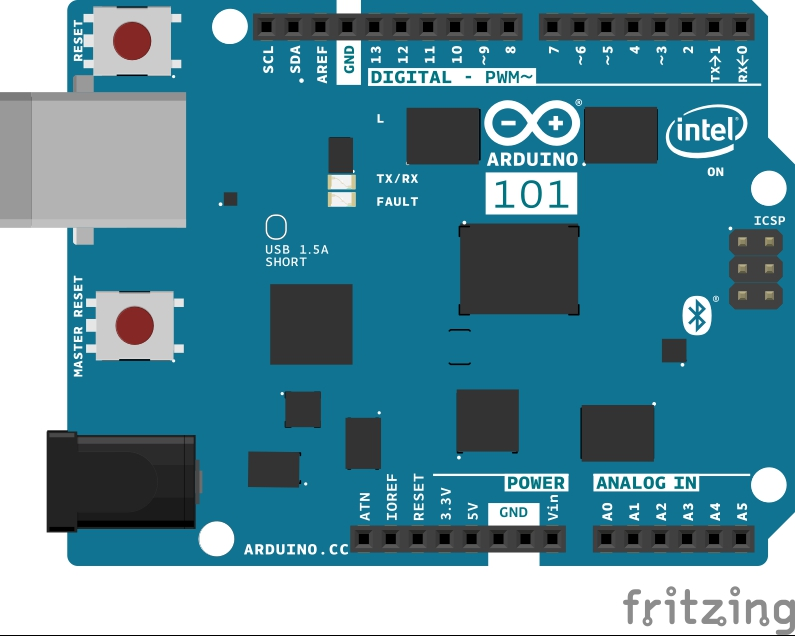

With this tutorial you learn to use one of the timers available in the microcontroller to generate a PWM signal. The Pin selected for the signal is Pin 13 and this will blink the on-board LED. The period of the signal is 1 second (1000000 microseconds) and the duty cycle is set at 25%. The waveform generation, once started, just goes on. In the loop() you can put your code and that won't interfere with PWM signal unless you use timer functions.

## Hardware Required

- [Arduino 101](https://www.arduino.cc/en/Main/ArduinoBoard101)

## The Circuit



image developed using [Fritzing](http://www.fritzing.org).
No additional hardware is needed to use this tutorial.

## Software Essentials

### Libraries

CurieTimerOne.h is the library that provides access to the Timer 1 of the microcontroller. This library allows to set up the number of microseconds that the timer counts before it asserts an interrupt. The interrupt can be configured to call a specific function - the callback function - and each interrupt increments a counter. The same library is used to generate a PWM signal with duty cycle and period length fully customizable.

### Functions

None

## Code

```arduino
#include "CurieTimerOne.h"

void setup() {

  // Setup a PWM signal on pin 13, onboard LED, with a 25% duty cycle

  // of a 1 second period (1000000 usec), as follow (please note the

  // decimal point to indicate double):

  CurieTimerOne.pwmStart(13, 25.0, 1000000);

  // Or, use discrete number range, 0-1023, to define the duty period,

  // 255 is 24.9%, as follow:

  // CurieTimerOne.pwmStart(13, 255, 1000000);
}

void loop() {

  // put your main code here, to run repeatedly:

  delay( 10000 );
}
```


*Last revision 2016/03/13 by SM*