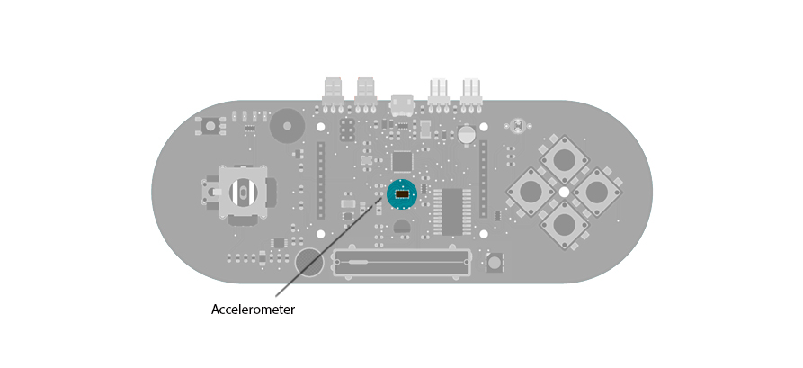

## Esplora Accelerometer

This sketch shows you how to read the values from the accelerometer. To see it in action, open the Arduino serial monitor on your computer and tilt the board. You'll see the accelerometer values for each axis change as you tilt the board.

## Hardware Required

- Arduino Esplora

## Circuit

Only your Arduino Esplora is needed for this example. Connect the Esplora to your computer with a USB cable and open the Arduino's Serial Monitor.




## Code

To send data to your computer, you need to open a serial connection. use [Serial.begin](https://arduino.cc/en/Serial/Begin)() to open a serial port at 9600 baud on the Esplora.

The [Esplora.readAccelerometer](https://www.arduino.cc/en/Reference/EsploraReadAccelerometer)() function gets the values from the accelerometer. It needs an argument telling it what axis you're reading from: X_AXIS, Y_AXIS, or Z_AXIS. Each axis will give you a value between 0 and 1023.

To send the values to the Serial Monitor, you call [Serial.print](https://arduino.cc/en/Serial/Print)(). When the Esplora is connected, and the Serial Monitor is open, you should start to see values reported like this twice a second :

```arduino
x: 6	y: -128	z: 27
x: 2	y: -138	z: 19
x: 9	y: -137	z: 20
```

```arduino

/*

  Esplora Accelerometer

 This  sketch shows you how to read the values from the accelerometer.

 To see it in action, open the serial monitor and tilt the board. You'll see

 the accelerometer values for each axis change when you tilt the board

 on that axis.

 Created on 22 Dec 2012

 by Tom Igoe

 This example is in the public domain.

 */

#include <Esplora.h>

void setup() {

  Serial.begin(9600);        // initialize serial communications with your computer
}

void loop() {

  int xAxis = Esplora.readAccelerometer(X_AXIS);    // read the X axis

  int yAxis = Esplora.readAccelerometer(Y_AXIS);    // read the Y axis

  int zAxis = Esplora.readAccelerometer(Z_AXIS);    // read the Z axis

  Serial.print("x: ");      // print the label for X

  Serial.print(xAxis);      // print the value for the X axis

  Serial.print("\ty: ");    // print a tab character, then the label for Y

  Serial.print(yAxis);      // print the value for the Y axis

  Serial.print("\tz: ");    // print a tab character, then the label for Z

  Serial.println(zAxis);    // print the value for the Z axis

  delay(500);              // wait half a second (500 milliseconds)
}
```
