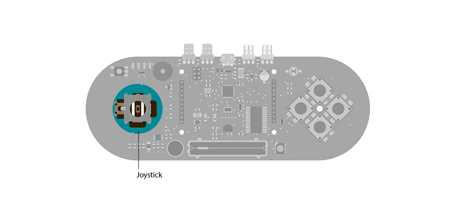

## Esplora Joystick Mouse

This sketch shows you how to read information from the Esplora's joystick and use it to control the movement of the cursor on your computer.  You're making your Esplora into a mouse!

**This sketch will take over the mouse movement of your computer. If you lose control of your cursor do the following :**

- unplug the Esplora

- open the EsploraBlink sketch in the Arduino software

- hold the Esplora's reset button down while plugging it back in to your computer

- while continuing to hold the reset button, click "Upload" in the Arduino software

- when you see the message "Done compiling" in the Arduino IDE, release the reset button

This will stop your Esplora from controlling your cursor while you upload a sketch that doesn't take control of the mouse.

## Hardware Required

- Arduino Esplora

## Circuit

Only your Arduino Esplora is needed for this example.  Connect the Esplora to your computer with a USB cable and open the Arduino's Serial Monitor.



 

## Code

To send data to your computer, you need to open a serial connection. Use [Serial.begin](https://arduino.cc/en/Serial/Begin)() to open a serial port at 9600 baud on the Esplora.

To start communication as a mouse, call [Mouse.begin](https://www.arduino.cc/en/Reference/MouseBegin)(). This makes the Esplora appear as a mouse to your computer.

To read the position of the joystick, call [Esplora.readJoystickX](https://www.arduino.cc/en/Reference/EsploraReadJoystickX)() and [Esplora.readJoystickY](https://www.arduino.cc/en/Reference/EsploraReadJoystickY)(), saving the values in variables. This gives you values between -512 and 512 for each axis. When the joystick is centered, the X and Y axes will report 0.

The joystick also acts as a switch when pressed. To read the button, call [Esplora.readJoystickSwitch](https://www.arduino.cc/en/Reference/EsploraReadJoystickSwitch)(). This will give you a value of 1 when pressed, and 0 when it is not.

To send the values to the Serial Monitor, you call [Serial.print](https://arduino.cc/en/Serial/Print)(). When the Esplora is connected, and the Serial Monitor is open, you should start to see values reported like this :
`Joystick X: 0   Joystick Y: 0   Button: 0`

To get numbers appropriate for moving the mouse, use the [map](https://www.arduino.cc/reference/en/language/functions/math/map/)() function to scale the joystick values, saving these numbers into new variables.

To actually move the cursor, call [Mouse.move](https://www.arduino.cc/en/Reference/MouseMove)(). It takes three arguments, the numbers represent the amount of movement on the x-axis, the y-axis, and the mouse wheel. This example only moves the mouse around on the x and y axes, use the new mapped numbers to move the cursor.

When you attach the Esplora, press Shift-Command-M in the Arduino software to open the serial monitor. As you move the joystick, you'll see the values in the serial monitor as the cursor moves around the screen.

```arduino

/*

  Esplora Joystick Mouse

 This  sketch shows you how to read the joystick and use it to control the movement

 of the cursor on your computer.  You're making your Esplora into a mouse!

 WARNING: this sketch will take over your mouse movement. If you lose control

 of your mouse do the following:

 1) unplug the Esplora.

 2) open the EsploraBlink sketch

 3) hold the reset button down while plugging your Esplora back in

 4) while holding reset, click "Upload"

 5) when you see the message "Done compiling", release the reset button.

 This will stop your Esplora from controlling your mouse while you upload a sketch

 that doesn't take control of the mouse.

 Created on 22 Dec 2012

 by Tom Igoe

 Updated 8 March 2014

 by Scott Fitzgerald

 http://www.arduino.cc/en/Reference/EsploraReadJoystickSwitch

 This example is in the public domain.

 */

#include <Esplora.h>

void setup() {

  Serial.begin(9600);       // initialize serial communication with your computer

  Mouse.begin();            // take control of the mouse
}

void loop() {

  int xValue = Esplora.readJoystickX();        // read the joystick's X position

  int yValue = Esplora.readJoystickY();        // read the joystick's Y position

  int button = Esplora.readJoystickSwitch();   // read the joystick pushbutton

  Serial.print("Joystick X: ");                // print a label for the X value

  Serial.print(xValue);                        // print the X value

  Serial.print("\tY: ");                       // print a tab character and a label for the Y value

  Serial.print(yValue);                        // print the Y value

  Serial.print("\tButton: ");                  // print a tab character and a label for the button

  Serial.print(button);                        // print the button value

  int mouseX = map(xValue, -512, 512, 10, -10);  // map the X value to a range of movement for the mouse X

  int mouseY = map(yValue, -512, 512, -10, 10);  // map the Y value to a range of movement for the mouse Y

  Mouse.move(mouseX, mouseY, 0);                 // move the mouse

  if (button == 0) {                           // if the joystick button is pressed

    Mouse.press();                             // send a mouse click

  } else {

    Mouse.release();                           // if it's not pressed, release the mouse button

  }

  delay(10);                                  // a short delay before moving again
}
```
